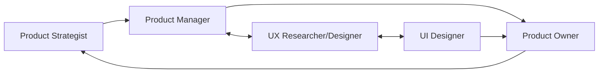

# Product Team Skills Suite Architecture

## Overview
A comprehensive suite of 5 interconnected skills designed for modern product teams, enabling data-driven decisions, user-centered design, and agile delivery.

## 1. product-strategist (Head of Product)

### Purpose
Strategic product leadership, vision setting, and organizational alignment

### Core Components

#### Scripts
- `market_analyzer.py` - Competitive analysis and market sizing
- `okr_generator.py` - OKR framework and cascade builder
- `roadmap_visualizer.py` - Strategic roadmap generation
- `metric_dashboard.py` - North star and KPI tracking
- `stakeholder_mapper.py` - Influence/interest matrix builder

#### References
- `strategy_frameworks.md` - SWOT, Porter's Five Forces, Blue Ocean
- `vision_templates.md` - Product vision and mission statements
- `metric_library.md` - Industry-standard KPIs by vertical
- `go_to_market_playbook.md` - GTM strategies and launch plans
- `team_scaling_guide.md` - Hiring, structure, and culture

#### Assets
- Product vision canvas templates
- Executive presentation templates
- Strategic planning worksheets
- Quarterly business review decks
- Board reporting templates

#### Key Workflows
1. **Vision to Execution**
   - Market opportunity assessment
   - Vision and strategy definition
   - OKR cascade creation
   - Roadmap development
   - Success metrics definition

2. **Stakeholder Management**
   - Executive alignment sessions
   - Board preparation and reporting
   - Cross-functional planning
   - Customer advisory boards

3. **Team Leadership**
   - Product org design
   - Talent development plans
   - Performance frameworks
   - Culture building

---

## 2. agile-product-owner (Senior Product Owner)

### Purpose
Backlog excellence, sprint execution, and delivery optimization

### Core Components

#### Scripts
- `user_story_generator.py` - INVEST-compliant story creation
- `acceptance_criteria_builder.py` - BDD/Gherkin syntax generator
- `sprint_velocity_tracker.py` - Velocity and capacity planning
- `dependency_mapper.py` - Cross-team dependency visualization
- `backlog_health_analyzer.py` - Backlog quality metrics

#### References
- `scrum_ceremonies.md` - Meeting templates and facilitation
- `story_patterns.md` - Common user story templates
- `estimation_techniques.md` - Story points, t-shirt sizing
- `definition_of_done.md` - DoD templates by product type
- `release_planning.md` - Release strategies and rollout plans

#### Assets
- Sprint planning templates
- Retrospective formats
- Story mapping boards
- Release notes templates
- Stakeholder update emails

#### Key Workflows
1. **Backlog Management**
   - Epic breakdown
   - Story writing and refinement
   - Prioritization frameworks (WSJF, RICE)
   - Dependency management
   - Technical debt tracking

2. **Sprint Execution**
   - Sprint planning facilitation
   - Daily standup optimization
   - Sprint review preparation
   - Retrospective facilitation
   - Impediment resolution

3. **Stakeholder Communication**
   - Sprint demos
   - Release communications
   - Progress reporting
   - Risk escalation

---

## 3. product-manager-toolkit (Senior Product Manager)

### Purpose
Feature development, market fit, and customer success

### Core Components

#### Scripts
- `feature_prioritization_matrix.py` - RICE, ICE, Value vs Effort
- `customer_interview_analyzer.py` - Interview synthesis and insights
- `competitor_feature_tracker.py` - Feature gap analysis
- `pricing_calculator.py` - Pricing models and sensitivity
- `launch_checklist_generator.py` - Go-to-market readiness

#### References
- `discovery_techniques.md` - Customer development methods
- `experimentation_framework.md` - A/B testing and MVPs
- `product_analytics.md` - Funnel, cohort, retention analysis
- `messaging_framework.md` - Positioning and value props
- `partnership_playbook.md` - Integration and partnership strategies

#### Assets
- PRD templates
- Business case templates
- Feature announcement templates
- Customer interview guides
- Competitive battlecards

#### Key Workflows
1. **Discovery & Validation**
   - Problem validation
   - Solution ideation
   - Prototype testing
   - Market sizing
   - Business case development

2. **Feature Development**
   - Requirements gathering
   - PRD creation
   - Design partnership
   - Engineering collaboration
   - QA planning

3. **Launch & Growth**
   - Beta program management
   - Launch planning
   - Feature adoption tracking
   - Customer feedback loops
   - Iteration planning

---

## 4. ux-researcher-designer (Senior UX Designer and Researcher)

### Purpose
User understanding, experience design, and usability optimization

### Core Components

#### Scripts
- `persona_generator.py` - Data-driven persona creation
- `journey_map_builder.py` - Customer journey visualization
- `usability_test_analyzer.py` - Test results and insights
- `survey_designer.py` - Research survey generation
- `heuristic_evaluator.py` - Nielsen heuristics assessment
- `accessibility_checker.py` - WCAG compliance validation

#### References
- `research_methods.md` - Qual and quant research techniques
- `interview_protocols.md` - User interview best practices
- `information_architecture.md` - IA principles and patterns
- `interaction_patterns.md` - Common UX patterns library
- `cognitive_biases.md` - Design psychology principles
- `accessibility_standards.md` - WCAG, ARIA guidelines

#### Assets
- Research plan templates
- Interview script templates
- Usability test protocols
- Journey map templates
- Persona templates
- Research repository structure

#### Key Workflows
1. **Research Planning**
   - Research question definition
   - Method selection
   - Participant recruitment
   - Study design
   - Ethics and consent

2. **Data Collection & Synthesis**
   - Interview conducting
   - Observation and note-taking
   - Affinity mapping
   - Insight generation
   - Recommendation development

3. **Design Process**
   - Information architecture
   - User flow creation
   - Wireframing
   - Prototyping
   - Usability testing
   - Iteration cycles

---

## 5. ui-design-system (Senior UI Designer)

### Purpose
Visual excellence, design systems, and developer handoff

### Core Components

#### Scripts
- `color_palette_generator.py` - Accessible color system creation
- `typography_scale_builder.py` - Type system generator
- `spacing_system_calculator.py` - 8pt grid system
- `component_documenter.py` - Component library documentation
- `design_token_exporter.py` - Design tokens for development
- `responsive_breakpoint_calculator.py` - Breakpoint optimization

#### References
- `design_principles.md` - Visual design fundamentals
- `design_system_architecture.md` - Atomic design methodology
- `animation_guidelines.md` - Motion design principles
- `brand_application.md` - Brand to UI translation
- `platform_guidelines.md` - iOS, Android, Web standards
- `handoff_checklist.md` - Developer collaboration

#### Assets
- Component library templates
- Icon libraries
- Illustration systems
- Design token templates
- Responsive grid systems
- Annotation templates

#### Key Workflows
1. **Design System Development**
   - Foundation definition (color, type, spacing)
   - Component design
   - Pattern documentation
   - Token management
   - Version control

2. **Visual Design Process**
   - Mood boards and style tiles
   - High-fidelity mockups
   - Responsive design
   - Interaction design
   - Micro-interactions
   - Asset production

3. **Collaboration & Handoff**
   - Design review facilitation
   - Developer pairing
   - QA collaboration
   - Design debt tracking
   - Documentation maintenance

---

## Integration Points Between Skills

### Cross-Functional Workflows

### Shared Resources

1. **Customer Insights Pool**
   - Shared between PM, UX, and Product Strategist
   - Centralized research repository
   - Unified persona definitions

2. **Design Language System**
   - Shared between UX and UI
   - Consistent component library
   - Unified interaction patterns

3. **Product Metrics Framework**
   - Shared across all roles
   - Consistent KPI definitions
   - Unified analytics approach

4. **Roadmap Alignment**
   - Cascades from Strategist → PM → PO
   - Feedback loops from PO → PM → Strategist
   - Design input from UX/UI → PM

### Handoff Points

1. **Strategy → Execution**
   - Vision (Strategist) → Requirements (PM)
   - Requirements (PM) → Stories (PO)
   - Stories (PO) → Designs (UX/UI)

2. **Research → Design**
   - User Research (UX) → Feature Definition (PM)
   - Wireframes (UX) → Visual Design (UI)
   - Prototypes (UI) → Development (via PO)

3. **Feedback Loops**
   - Analytics → All roles
   - Customer feedback → UX → PM → Strategist
   - Sprint outcomes → PO → PM → Strategist

## Implementation Approach

### Phase 1: Foundation (Week 1-2)
1. Deploy `product-manager-toolkit` (most central role)
2. Establish shared resources and templates
3. Create team charter and RACI matrix

### Phase 2: Design Integration (Week 3-4)
1. Deploy `ux-researcher-designer`
2. Deploy `ui-design-system`
3. Establish design-dev handoff process

### Phase 3: Execution Layer (Week 5-6)
1. Deploy `agile-product-owner`
2. Integrate with existing Jira/development tools
3. Optimize sprint ceremonies

### Phase 4: Strategic Layer (Week 7-8)
1. Deploy `product-strategist`
2. Align OKRs and roadmaps
3. Establish governance model

## Success Metrics

### Efficiency Metrics
- Requirements clarity: +40% improvement
- Design-dev handoff time: -50% reduction
- Sprint velocity: +25% increase
- Research-to-insight time: -60% reduction

### Quality Metrics
- User satisfaction (NPS): +20 points
- Feature adoption rate: +35%
- Design consistency score: 95%+
- Defect escape rate: -40%

### Business Metrics
- Time to market: -30%
- Feature success rate: +45%
- Customer retention: +15%
- Team productivity: +35%

## Tool Integration Requirements

### Essential Integrations
- **Product Management**: Jira, ProductBoard, Amplitude
- **Design**: Figma, Sketch, Adobe XD
- **Research**: Dovetail, Miro, UserTesting
- **Analytics**: Mixpanel, Google Analytics, Hotjar
- **Collaboration**: Slack, Confluence, Notion

### API Connections Needed
- Jira REST API for backlog management
- Figma API for design system sync
- Analytics APIs for metrics dashboards
- Slack webhooks for notifications

## Training & Adoption Plan

### Week 1: Kickoff
- All-hands skills overview
- Role-specific training sessions
- Skill champion assignment

### Week 2-4: Pilot
- One squad pilots all skills
- Daily check-ins and feedback
- Rapid iteration on scripts/templates

### Week 5-8: Rollout
- Gradual team-by-team adoption
- Weekly skill clinics
- Success story sharing

### Ongoing: Optimization
- Monthly skill retrospectives
- Quarterly skill updates
- Annual skill assessment

## ROI Projections

### Year 1 Impact
- **Time Savings**: 200 hours/month across team
- **Quality Improvement**: 40% fewer revisions
- **Speed to Market**: 6 weeks faster average
- **Revenue Impact**: $2M from improved features
- **Cost Avoidance**: $500K in prevented rework

### Investment Required
- **Setup Time**: 80 hours total
- **Training Time**: 40 hours total
- **Maintenance**: 10 hours/month
- **Tool Costs**: Existing stack sufficient

### Payback Period: 2 months

## Next Steps

1. **Prioritize First Skill**
   - Recommend starting with `product-manager-toolkit`
   - Most central to all workflows
   - Highest immediate impact

2. **Gather Existing Resources**
   - Current templates and processes
   - Tool access and credentials
   - Team feedback on pain points

3. **Customize for Your Context**
   - Industry-specific adjustments
   - Company culture alignment
   - Tool stack integration

4. **Create Pilot Program**
   - Select pilot team/squad
   - Define success criteria
   - Set 4-week trial period
