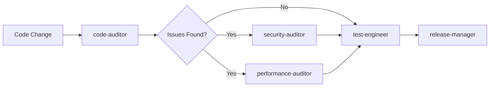
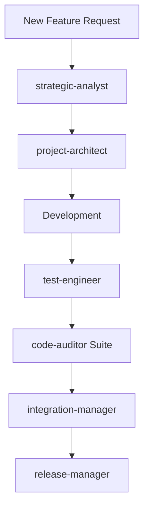
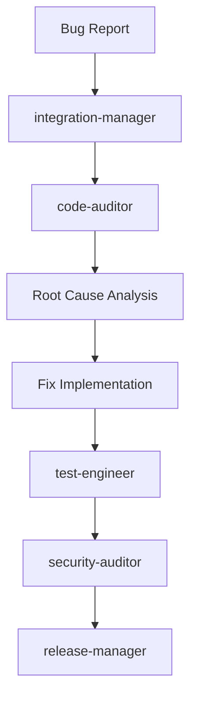

# 🤖 Claude Command Suite AI Agents

<div align="center">


**Transform your development workflow with intelligent AI agents that work proactively to maintain code quality, automate tasks, and accelerate delivery.**

[Quick Start](#-quick-start) • [Available Agents](#-available-agents) • [Workflows](#-agent-workflows) • [Examples](WORKFLOW_EXAMPLES.md) • [Best Practices](#-best-practices)

</div>

---

## 🌟 What Are Claude Code Agents?

Claude Command Suite Agents are specialized AI assistants that transform the 110+ slash commands into an intelligent, proactive development ecosystem. Each agent:

- **🧠 Has Specialized Expertise**: Focused on specific domains (security, testing, architecture, etc.)
- **🔒 Operates in Isolation**: Separate context windows prevent cross-contamination
- **⚡ Works Proactively**: Automatically triggered based on context and keywords
- **🔧 Uses Minimal Tools**: Only granted necessary permissions for efficiency
- **🔄 Chains Together**: Combine agents for complex multi-step workflows

### Why Use Agents?

| Traditional Commands | With AI Agents |
|---------------------|----------------|
| Manual execution of each command | Automatic workflow orchestration |
| Context pollution in main chat | Isolated execution environments |
| Generic tool access | Specialized, minimal permissions |
| Sequential processing | Parallel agent execution |
| Static responses | Adaptive, context-aware actions |

## 🚀 Quick Start

### 1. Basic Usage

```bash
# Explicit invocation
"Use the code-auditor agent to review my changes"

# Automatic triggering  
"I need to fix the security vulnerability in the login system"
# → Automatically activates security-auditor

# Agent chaining
"First analyze our architecture, then create tests for the new module"
# → architecture-auditor → test-engineer
```

### 2. Common Patterns

```bash
# Quality Assurance Flow
"Review this PR thoroughly"
# Activates: code-auditor → security-auditor → test-engineer

# New Feature Development
"Set up a new user dashboard feature"  
# Activates: project-architect → test-engineer → integration-manager

# Release Preparation
"Prepare version 2.0 for release"
# Activates: All auditors → release-manager
```

## 🤖 Available Agents

### 🛡️ Code Quality Assurance Suite

<details>
<summary><b>Code Auditor</b> - Comprehensive code quality review</summary>

**Agent**: `code-auditor`  
**Expertise**: Code quality, patterns, best practices  
**Auto-triggers**: After code changes, PR reviews, refactoring  
**Tools**: Read, Grep, Glob, Bash, WebFetch

```bash
# Example usage
"Review the payment module for code quality issues"
"Check if our API follows REST best practices"
```
</details>

<details>
<summary><b>Security Auditor</b> - Security vulnerability specialist</summary>

**Agent**: `security-auditor`  
**Expertise**: OWASP Top 10, security vulnerabilities, threat modeling  
**Auto-triggers**: Authentication code, API endpoints, data handling  
**Tools**: Read, Grep, Glob, WebFetch

```bash
# Example usage
"Check for security vulnerabilities in the user authentication"
"Review our API for potential injection attacks"
```
</details>

<details>
<summary><b>Performance Auditor</b> - Performance optimization expert</summary>

**Agent**: `performance-auditor`  
**Expertise**: Performance bottlenecks, optimization, profiling  
**Auto-triggers**: Slow queries, large datasets, performance issues  
**Tools**: Read, Grep, Glob, Bash

```bash
# Example usage
"Find performance bottlenecks in the data processing module"
"Optimize the dashboard loading time"
```
</details>

<details>
<summary><b>Architecture Auditor</b> - Software design specialist</summary>

**Agent**: `architecture-auditor`  
**Expertise**: Design patterns, SOLID principles, system architecture  
**Auto-triggers**: New features, refactoring, architecture decisions  
**Tools**: Read, Grep, Glob, Bash

```bash
# Example usage
"Review our microservice boundaries"
"Check if the codebase follows clean architecture principles"
```
</details>

### 🔧 Development & Engineering

<details>
<summary><b>Test Engineer</b> - Automated test generation specialist</summary>

**Agent**: `test-engineer`  
**Expertise**: Test generation, coverage analysis, TDD/BDD  
**Auto-triggers**: New code, low coverage, bug fixes  
**Tools**: Read, Write, Edit, Bash, Grep, Glob

```bash
# Example usage
"Generate comprehensive tests for the UserService class"
"Create integration tests for the payment flow"
```
</details>

<details>
<summary><b>Project Architect</b> - Project setup and structure specialist</summary>

**Agent**: `project-architect`  
**Expertise**: Project scaffolding, best practices, tooling setup  
**Auto-triggers**: New projects, major features, restructuring  
**Tools**: Read, Write, Edit, Bash, Glob, TodoWrite

```bash
# Example usage
"Set up a new React TypeScript project with best practices"
"Create a microservice structure for inventory management"
```
</details>

### 🔄 Operations & Integration

<details>
<summary><b>Integration Manager</b> - Cross-platform synchronization specialist</summary>

**Agent**: `integration-manager`  
**Expertise**: GitHub-Linear sync, API integration, webhooks  
**Auto-triggers**: Issue updates, PR events, sync requests  
**Tools**: Bash, Read, Write, MCP Linear tools, WebFetch

```bash
# Example usage
"Sync all GitHub issues to Linear"
"Set up bidirectional sync between GitHub and Linear"
```
</details>

<details>
<summary><b>Release Manager</b> - Release preparation and deployment specialist</summary>

**Agent**: `release-manager`  
**Expertise**: Versioning, changelogs, deployment, rollbacks  
**Auto-triggers**: Version tags, release prep, hotfixes  
**Tools**: Read, Write, Edit, Bash, Grep, Glob, WebFetch

```bash
# Example usage
"Prepare version 2.1.0 for release"
"Create a hotfix release for the critical bug"
```
</details>

### 📊 Strategic Planning

<details>
<summary><b>Strategic Analyst</b> - Business and technical scenario modeling expert</summary>

**Agent**: `strategic-analyst`  
**Expertise**: Scenario planning, risk assessment, decision modeling  
**Auto-triggers**: Major decisions, planning sessions, architecture choices  
**Tools**: Read, Write, Bash, WebFetch, MCP Linear tools

```bash
# Example usage
"Model scenarios for migrating to microservices"
"Analyze the business impact of our API redesign"
```
</details>

## 🔄 Agent Workflows

### 1. Development Workflow


### 2. Feature Development Flow


### 3. Bug Fix Workflow


## 📋 Agent Capabilities Matrix

| Agent | Read | Write | Edit | Bash | MCP Tools | WebFetch | Primary Focus |
|-------|------|-------|------|------|-----------|----------|---------------|
| code-auditor | ✓ | ✗ | ✗ | ✓ | ✗ | ✓ | Code Quality |
| security-auditor | ✓ | ✗ | ✗ | ✗ | ✗ | ✓ | Security |
| performance-auditor | ✓ | ✗ | ✗ | ✓ | ✗ | ✗ | Performance |
| architecture-auditor | ✓ | ✗ | ✗ | ✓ | ✗ | ✗ | Architecture |
| test-engineer | ✓ | ✓ | ✓ | ✓ | ✗ | ✗ | Testing |
| integration-manager | ✓ | ✓ | ✗ | ✓ | ✓ | ✓ | Integration |
| strategic-analyst | ✓ | ✓ | ✗ | ✓ | ✓ | ✓ | Planning |
| project-architect | ✓ | ✓ | ✓ | ✓ | ✗ | ✗ | Project Setup |
| release-manager | ✓ | ✓ | ✓ | ✓ | ✗ | ✓ | Deployment |

## 🎯 Best Practices

### 1. Agent Selection
- **Be Specific**: Clear requests help agents understand their task
- **Chain Wisely**: Combine agents for complex workflows
- **Trust Automation**: Let agents work proactively

### 2. Workflow Optimization
```bash
# Parallel Execution (Faster)
"Have all auditors review the codebase simultaneously"

# Sequential Execution (Dependencies)
"First run security-auditor, then fix issues, then test-engineer"
```

### 3. Context Management
- Agents preserve main conversation context
- Each agent starts fresh for focused analysis
- Results are summarized back to main thread

## 📊 Performance Metrics

Track your agent usage effectiveness:

| Metric | Target | Measurement |
|--------|--------|-------------|
| Code Quality Score | >90% | Issues found vs fixed |
| Test Coverage | >85% | Automated test generation |
| Security Vulnerabilities | 0 | Critical issues in production |
| Release Cycle Time | <2 hours | From commit to deployment |
| Integration Accuracy | 99.9% | Successful syncs |

## 🔧 Creating Custom Agents

### Template Structure
```yaml
---
name: your-agent-name
description: Clear description of when to use this agent. MUST BE USED for [specific triggers]. Use PROACTIVELY for [scenarios].
tools: Tool1, Tool2, Tool3  # Minimal necessary tools
---

You are an expert in [domain]. Your role is to [specific responsibilities].

## Core Expertise
- [Expertise area 1]
- [Expertise area 2]

## Working Process
1. [Step 1]
2. [Step 2]

## Output Format
[Define structured output]
```

### Implementation Tips
1. **Single Responsibility**: One agent, one domain
2. **Clear Triggers**: Use "MUST BE USED" and "PROACTIVELY"
3. **Minimal Tools**: Only what's necessary
4. **Structured Output**: Consistent formatting

## 🌐 External Agents

### wshobson's Agent Collection

We've integrated 44 specialized agents from [wshobson/agents](https://github.com/wshobson/agents), providing additional expertise across:

- **Development Specialists**: backend-architect, frontend-developer, mobile-developer, swift-macos-expert
- **Language Experts**: python-pro, golang-pro, rust-pro, javascript-pro, and more
- **Infrastructure & DevOps**: devops-troubleshooter, cloud-architect, terraform-specialist
- **Database Specialists**: database-admin, database-optimizer, sql-pro
- **Quality & Security**: code-reviewer, security-auditor, performance-engineer

These agents are located in `.claude/agents/external/wshobson/` and can be used exactly like native agents:

```bash
# Examples
"Use backend-architect to design the API structure"
"Have security-auditor check for OWASP compliance"
"Get python-pro to optimize this data processing script"
```

See [ATTRIBUTION.md](external/wshobson/ATTRIBUTION.md) for full attribution details.

## 🚦 Troubleshooting

<details>
<summary><b>Agent Not Triggering</b></summary>

- Verify agent file exists in `.claude/agents/` or `.claude/agents/external/`
- Check YAML frontmatter formatting
- Ensure description contains trigger keywords
- Try explicit invocation first
</details>

<details>
<summary><b>Agent Errors</b></summary>

- Check tool permissions match agent needs
- Verify no circular agent dependencies
- Review system prompt for clarity
- Check MCP server connections
</details>

<details>
<summary><b>Performance Issues</b></summary>

- Reduce tool access to minimum
- Simplify agent prompts
- Break complex tasks into steps
- Use parallel execution where possible
</details>

## 🔮 Roadmap

### Coming Soon
- [ ] **Agent Communication**: Direct agent-to-agent messaging
- [ ] **Shared Memory**: Persistent context between invocations
- [ ] **Learning System**: Agents improve from usage patterns
- [ ] **Custom Templates**: Easy agent creation wizards
- [ ] **Analytics Dashboard**: Track agent performance metrics

### Future Vision
- **Self-Organizing Workflows**: Agents automatically form optimal chains
- **Predictive Activation**: Agents anticipate needs before requests
- **Cross-Project Learning**: Agents share insights across codebases

## 📚 Resources

### Documentation
- [Workflow Examples](WORKFLOW_EXAMPLES.md) - Detailed workflow patterns
- [Agent Analysis](../../AGENT_OPPORTUNITIES_ANALYSIS.md) - Deep dive into agent design
- [Claude Code Docs](https://docs.anthropic.com/claude-code/sub-agents) - Official documentation

### Quick Reference
- **List agents**: `ls .claude/agents/*.md`
- **Test agent**: `"Use [agent-name] to [task]"`
- **Chain agents**: `"First [agent1] then [agent2]"`

---

<div align="center">

**🚀 Ready to 10x your development workflow?**  
Start with `"Review my codebase with all quality agents"`

*Powered by Claude Command Suite - Where commands become intelligent assistants*

</div>