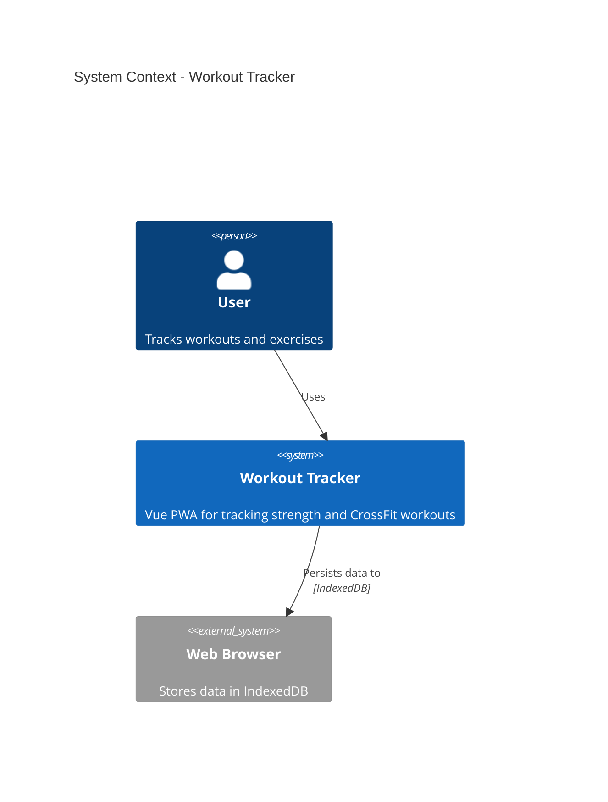
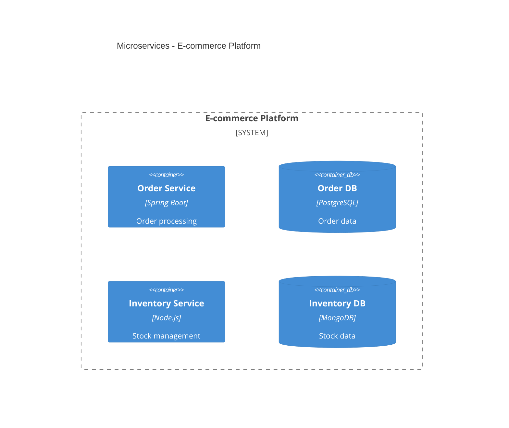
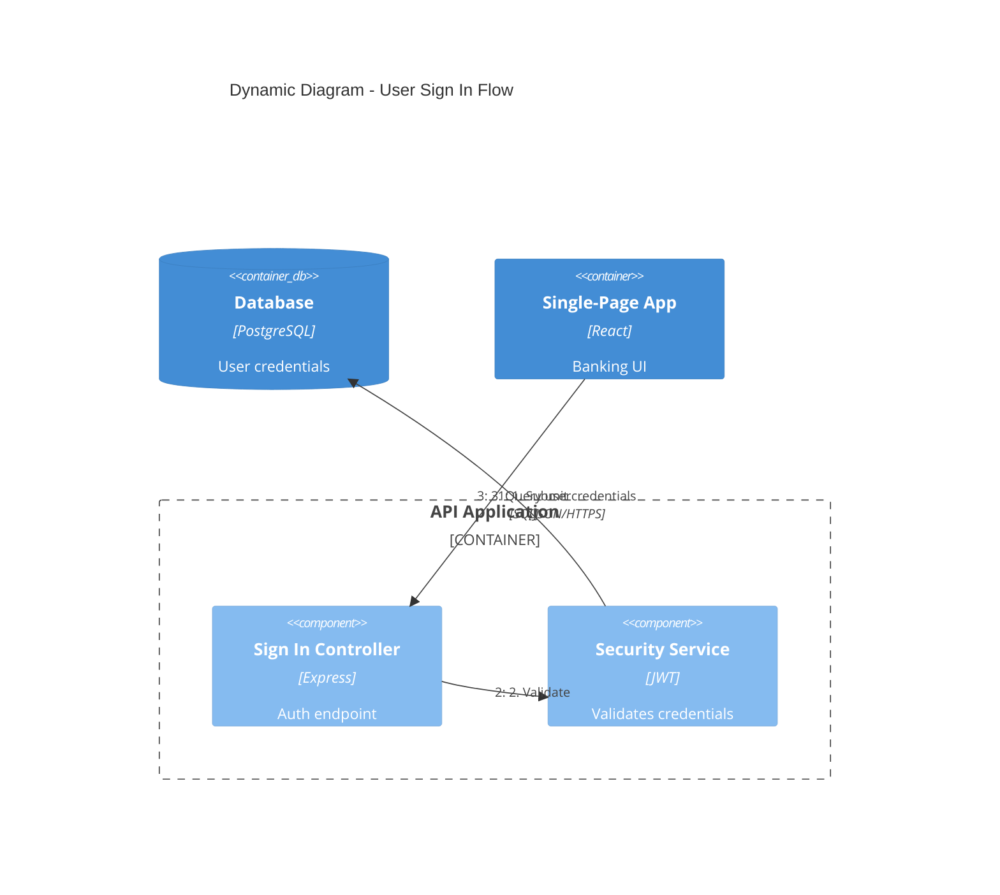

# C4 Architecture Skill

Generate software architecture documentation using C4 model diagrams in Mermaid syntax.

## Purpose

This skill helps you create professional architecture documentation using the C4 (Context, Container, Component, Code) model. It generates Mermaid diagrams that visualize your system's architecture at different abstraction levels, making it easy to communicate design decisions to different audiences.

## When to Use

Use this skill when you need to:

- Create architecture diagrams for documentation
- Visualize software structure and relationships
- Document system architecture for different audiences (executives, developers, DevOps)
- Generate C4 Context, Container, Component, or Deployment diagrams
- Create dynamic diagrams showing request flows
- Document microservices or event-driven architectures

**Trigger phrases**: "architecture diagram", "C4 diagram", "system context", "container diagram", "component diagram", "deployment diagram", "document architecture", "visualize architecture"

## How It Works

The skill follows a systematic workflow:

1. **Understand scope** - Determines which C4 level(s) are needed based on your audience
2. **Analyze codebase** - Explores the system to identify components, containers, and relationships
3. **Generate diagrams** - Creates Mermaid C4 diagrams at appropriate abstraction levels
4. **Document** - Writes diagrams to markdown files with explanatory context

### C4 Diagram Levels

| Level | Diagram Type | Audience | Shows | When to Create |
|-------|-------------|----------|-------|----------------|
| 1 | **C4Context** | Everyone | System + external actors | Always (required) |
| 2 | **C4Container** | Technical | Apps, databases, services | Always (required) |
| 3 | **C4Component** | Developers | Internal components | Only if adds value |
| 4 | **C4Deployment** | DevOps | Infrastructure nodes | For production systems |
| - | **C4Dynamic** | Technical | Request flows (numbered) | For complex workflows |

**Key Insight**: "Context + Container diagrams are sufficient for most software development teams." Only create Component/Code diagrams when they genuinely add value.

## Key Features

- **Multiple abstraction levels** - Generate Context, Container, Component, Deployment, and Dynamic diagrams
- **Audience-appropriate detail** - Automatically selects the right level of detail for your audience
- **Best practices built-in** - Follows C4 model conventions and anti-patterns to avoid
- **Microservices support** - Special handling for microservices and event-driven architectures
- **Mermaid syntax** - Uses widely-supported Mermaid diagram format
- **Comprehensive references** - Includes syntax guide, common mistakes, and advanced patterns

## Usage Examples

### Example 1: Document a Simple Web Application

**Request**: "Create architecture diagrams for my workout tracker app"

**Output**: Generates:
- System Context diagram showing users and external systems
- Container diagram showing the Vue.js SPA, state management (Pinia), and IndexedDB

### Example 2: Document a Microservices Architecture

**Request**: "Create a container diagram for our e-commerce microservices"

**Output**: Generates a Container diagram showing:
- Order Service with PostgreSQL
- Inventory Service with MongoDB
- Message queues for inter-service communication

### Example 3: Show a Request Flow

**Request**: "Diagram the user sign-in flow"

**Output**: Generates a Dynamic diagram with numbered steps:

### Example 4: Document Production Deployment

**Request**: "Create a deployment diagram for our AWS infrastructure"

**Output**: Generates a Deployment diagram showing:
- Browser deployment node
- AWS Cloud with ECS and RDS nodes
- Infrastructure relationships

## Output Location

Architecture documentation is written to `docs/architecture/` with this naming convention:

- `c4-context.md` - System context diagram
- `c4-containers.md` - Container diagram
- `c4-components-{feature}.md` - Component diagrams per feature
- `c4-deployment.md` - Deployment diagram
- `c4-dynamic-{flow}.md` - Dynamic diagrams for specific flows

## Best Practices

### Essential Rules

1. **Every element must have**: Name, Type, Technology (where applicable), and Description
2. **Use unidirectional arrows only** - Bidirectional arrows create ambiguity
3. **Label arrows with action verbs** - "Sends email using", "Reads from", not just "uses"
4. **Include technology labels** - "JSON/HTTPS", "JDBC", "gRPC"
5. **Stay under 20 elements per diagram** - Split complex systems into multiple diagrams

### Clarity Guidelines

1. **Start at Level 1** - Context diagrams help frame the system scope
2. **One diagram per file** - Keep diagrams focused on a single abstraction level
3. **Meaningful aliases** - Use descriptive aliases (e.g., `orderService` not `s1`)
4. **Concise descriptions** - Keep descriptions under 50 characters when possible
5. **Always include a title** - "System Context diagram for [System Name]"

## Audience-Appropriate Detail

| Audience | Recommended Diagrams |
|----------|---------------------|
| Executives | System Context only |
| Product Managers | Context + Container |
| Architects | Context + Container + key Components |
| Developers | All levels as needed |
| DevOps | Container + Deployment |

## References

The skill includes comprehensive reference documentation:

- **c4-syntax.md** - Complete Mermaid C4 syntax reference
- **common-mistakes.md** - Anti-patterns to avoid
- **advanced-patterns.md** - Microservices, event-driven, deployment patterns

## Additional Resources

- [C4 Model](https://c4model.com/) - Official C4 model documentation
- [Mermaid C4 Diagrams](https://mermaid.js.org/syntax/c4.html) - Mermaid C4 syntax documentation
