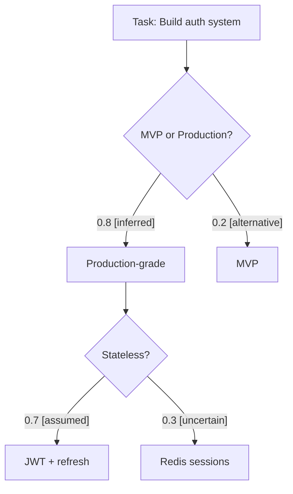

<p align="center">
  
</p>

<p align="center">
  <a href="https://github.com/jeffallan/claude-skills"></a>
  <a href="LICENSE"></a>
  <a href="https://github.com/jeffallan/claude-skills"></a>
  <a href="https://github.com/jeffallan/claude-skills/stargazers"></a>
</p>

<p align="center">
  
</p>

<p align="center">
  <strong>🎯 65 Skills</strong> • <strong>🚀 9 Workflows</strong> • <strong>🧠 Context Engineering</strong> • <strong>📖 Progressive Disclosure</strong>
</p>

<p align="center">
  <a href="https://github.com/Chat2AnyLLM/awesome-claude-skills/blob/main/FULL-SKILLS.md"></a>
  <a href="https://github.com/BehiSecc/awesome-claude-skills"></a>
</p>

---


## Quick Start

Get started in minutes with our **[Quick Start Guide](QUICKSTART.md)**.

**TL;DR:**
```bash
/plugin marketplace add jeffallan/claude-skills
```
then
```bash
/plugin install fullstack-dev-skills@jeffallan
```

> **New:** Use `/common-ground` to surface and validate Claude's assumptions about your project before starting work. Add `--graph` to visualize the reasoning structure as a mermaid diagram.

> **Note:** The [Project Workflow Commands](#project-workflow-commands) require an Atlassian MCP server for Jira and Confluence integration. See the **[Atlassian MCP Setup Guide](docs/ATLASSIAN_MCP_SETUP.md)** for configuration instructions.

## Architecture

### Progressive Disclosure Pattern

Each skill follows this structure:

```
skills/react-expert/
├── SKILL.md                    # Lean core (80 lines)
│   ├── Role definition
│   ├── When to use
│   ├── Core workflow
│   └── Routing table          # Points to references
└── references/                 # Loaded on-demand
    ├── server-components.md    # RSC patterns
    ├── react-19-features.md    # use() hook, actions
    ├── state-management.md     # Context, Zustand, Redux
    ├── hooks-patterns.md       # Custom hooks, optimization
    ├── performance.md          # memo, lazy, virtualization
    └── testing-react.md        # Testing Library patterns
```

**How It Works:**
1. Skill loads with minimal context (~80 lines)
2. Claude reads the routing table
3. Loads specific references only when context requires
4. 50% faster initial responses, surgical precision when needed

### Project Structure

```
claude-skills/
├── .claude-plugin/
│   ├── plugin.json           # Plugin metadata
│   └── marketplace.json      # Marketplace configuration
├── skills/                   # 65 specialized skills
│   ├── react-expert/
│   │   ├── SKILL.md
│   │   └── references/       # 6 reference files
│   ├── nestjs-expert/
│   │   ├── SKILL.md
│   │   └── references/       # 5 reference files
│   ├── python-pro/
│   │   ├── SKILL.md
│   │   └── references/       # Language-specific patterns
│   └── ... (62 more skills)
├── commands/
│   ├── common-ground/        # Context engineering command
│   │   ├── COMMAND.md
│   │   └── references/
│   └── project/              # 9 project workflow commands
│       ├── discovery/        # Research & validation
│       ├── planning/         # Epic & implementation planning
│       ├── execution/        # Ticket implementation
│       └── retrospectives/   # Reports & completion
├── docs/
│   ├── COMMON_GROUND.md      # Context engineering guide
│   ├── WORKFLOW_COMMANDS.md  # Workflow documentation
│   └── ATLASSIAN_MCP_SETUP.md # MCP server setup guide
├── README.md
├── SKILLS_GUIDE.md          # Quick reference guide
└── CONTRIBUTING.md          # Contribution guidelines
```

**Stats:**
- 65 skills
- 351 reference files
- ~50% token reduction
- Covers 30+ frameworks

## Skills Overview

**65 specialized skills** across 12 categories:

- **Languages (12)**: Python Pro, TypeScript Pro, JavaScript Pro, Go Pro, Rust Engineer, SQL Pro, C++ Pro, Swift Expert, Kotlin Specialist, C# Developer, PHP Pro, Java Architect
- **Backend Frameworks (7)**: NestJS Expert, Django Expert, FastAPI Expert, Spring Boot Engineer, Laravel Specialist, Rails Expert, .NET Core Expert
- **Frontend & Mobile (6)**: React Expert, Next.js Developer, Vue Expert, Angular Architect, React Native Expert, Flutter Expert
- **Infrastructure (5)**: Kubernetes Specialist, Terraform Engineer, Postgres Pro, Cloud Architect, Database Optimizer
- **API & Architecture (8)**: GraphQL Architect, API Designer, WebSocket Engineer, Microservices Architect, MCP Developer, Architecture Designer, Feature Forge, Spec Miner
- **Testing & Quality (4)**: Test Master, Playwright Expert, Code Reviewer, Code Documenter
- **DevOps & Operations (5)**: DevOps Engineer, Monitoring Expert, SRE Engineer, Chaos Engineer, CLI Developer
- **Security (2)**: Secure Code Guardian, Security Reviewer
- **Data & Machine Learning (6)**: Pandas Pro, Spark Engineer, ML Pipeline, Prompt Engineer, RAG Architect, Fine-Tuning Expert
- **Platform Specialists (4)**: Salesforce Developer, Shopify Expert, WordPress Pro, Atlassian MCP
- **Specialized (3)**: Legacy Modernizer, Embedded Systems, Game Developer
- **Workflow (2)**: Debugging Wizard, Fullstack Guardian

See **[SKILLS_GUIDE.md](SKILLS_GUIDE.md)** for when to use each skill, workflows, and examples.

## Usage Patterns

### Context-Aware Activation

Skills activate automatically based on your request:

```bash
# Backend Development
"Implement JWT authentication in my NestJS API"
→ Activates: NestJS Expert
→ Loads: references/authentication.md

# Frontend Development
"Build a React component with Server Components"
→ Activates: React Expert
→ Loads: references/server-components.md

# Performance Optimization
"My React app is slow, help me optimize"
→ Activates: React Expert + Debugging Wizard
→ Loads: references/performance.md, references/profiling.md

# Security Review
"Review this authentication code for security issues"
→ Activates: Security Reviewer + Secure Code Guardian
→ Loads: references/auth-patterns.md, references/owasp-top-10.md
```

### Multi-Skill Workflows

Complex tasks combine multiple skills:

**Full Feature Development:**
```
Feature Forge → Architecture Designer → Fullstack Guardian → Test Master → Security Reviewer → DevOps Engineer
```

**Bug Investigation:**
```
Debugging Wizard → Framework Expert → Test Master → Code Reviewer
```

**Security Hardening:**
```
Secure Code Guardian → Security Reviewer → Test Master
```

## Context Engineering

### `/common-ground` — Surface Claude's Hidden Assumptions

Claude operates on assumptions about your project—tech stack, coding standards, architecture decisions. This command makes them explicit before they cause misaligned work.

```bash
/common-ground              # Surface & validate assumptions interactively
/common-ground --list       # View all tracked assumptions
/common-ground --check      # Quick validation of existing assumptions
/common-ground --graph      # Visualize reasoning structure as mermaid diagram
```

**How it works:**

1. Claude analyzes your codebase (config files, code patterns, conversation context)
2. Surfaces assumptions with confidence tiers:
   - **ESTABLISHED** — High confidence, treat as premises
   - **WORKING** — Medium confidence, use but flag if contradicted
   - **OPEN** — Low confidence, ask before assuming
3. You validate, adjust weights, or reject assumptions
4. Claude remembers and respects your decisions across sessions

**Example output:**

```
ESTABLISHED: TypeScript strict mode enabled [inferred from tsconfig.json]
WORKING: Prefer functional components over classes [inferred from codebase patterns]
OPEN: Server-side rendering required? [uncertain - needs clarification]
```

### `--graph` — Visualize Reasoning Structure

The `--graph` flag generates a mermaid diagram showing the decision tree behind Claude's reasoning—not just what it assumes, but *why*.



Node colors indicate confidence: green (chosen), yellow (decision point), orange (uncertain), gray (alternative not taken).

## Project Workflow Commands

Manage your entire development lifecycle with **9 project workflow commands** organized into 4 phases:

| Phase | Commands | Purpose |
|-------|----------|---------|
| **Discovery** | `create-epic-discovery`, `synthesize-discovery`, `approve-synthesis` | Research, synthesize, and approve requirements |
| **Planning** | `create-epic-plan`, `create-implementation-plan` | Analyze codebase and create execution plans |
| **Execution** | `execute-ticket`, `complete-ticket` | Implement and complete individual tickets |
| **Retrospectives** | `complete-epic`, `complete-sprint` | Generate reports and close work items |

Commands integrate with **Jira** (ticket management) and **Confluence** (documentation publishing).

See **[docs/WORKFLOW_COMMANDS.md](docs/WORKFLOW_COMMANDS.md)** for detailed workflow diagrams, command reference, and integration guides.

## Tech Stack Coverage

### Languages
- TypeScript / JavaScript
- Python
- Go
- Rust
- C++
- Swift
- Kotlin
- C#
- PHP
- Ruby
- Java
- SQL
- Dart

### Backend
- NestJS (TypeScript)
- Django / Django REST Framework (Python)
- FastAPI (Python)
- Express (TypeScript)
- Spring Boot (Java)
- Laravel (PHP)
- Ruby on Rails (Ruby)
- .NET Core (C#)
- GraphQL APIs

### Frontend
- React 19 (Server Components, use() hook)
- Next.js (App Router, Server Actions)
- Vue 3 (Composition API, Pinia)
- Angular (Standalone Components, Signals)
- React Native (Expo, bare workflow)
- Flutter (Material Design, Cupertino)

### Testing
- Jest / Vitest
- Playwright
- React Testing Library
- Pytest

### Databases
- PostgreSQL (TypeORM, Prisma, SQLAlchemy)
- MongoDB (Mongoose, Motor)
- MySQL / MariaDB

### Infrastructure & DevOps
- Docker & Docker Compose
- Kubernetes (K8s, Helm)
- Terraform
- AWS / Azure / GCP
- PostgreSQL / MySQL / MongoDB
- CI/CD (GitHub Actions, GitLab CI)

### Monitoring
- Prometheus / Grafana
- ELK Stack
- DataDog
- Sentry

## Installation Options

### Option 1: Marketplace (Recommended)

```bash
/plugin marketplace add jeffallan/claude-skills
```
then
```bash
/plugin install fullstack-dev-skills@jeffallan
```
### Option 1a: Installing Skills via `npx add-skill`

You can install standard Claude skills using the `add-skill` CLI:

```bash
npx add-skill <skill-name>


### Option 2: Local Development

```bash
# Clone the repository
git clone https://github.com/jeffallan/claude-skills.git
cd claude-skills

# Add as local marketplace
/plugin marketplace add /absolute/path/to/claude-skills

# Install from local
/plugin install fullstack-dev-skills@local
```

### Option 3: Direct Installation

```bash
# Copy skills directly to Claude Code
cp -r ./skills/* ~/.claude/skills/
```

**Note:** Direct installation bypasses plugin management but works for quick testing.

## Documentation

- **[SKILLS_GUIDE.md](SKILLS_GUIDE.md)** - Quick reference for when to use each skill
- **[docs/COMMON_GROUND.md](docs/COMMON_GROUND.md)** - Context engineering with `/common-ground`
- **[docs/WORKFLOW_COMMANDS.md](docs/WORKFLOW_COMMANDS.md)** - Project workflow commands guide
- **[docs/ATLASSIAN_MCP_SETUP.md](docs/ATLASSIAN_MCP_SETUP.md)** - Atlassian MCP server setup
- **[CONTRIBUTING.md](CONTRIBUTING.md)** - Guidelines for contributing
- **skills/*/SKILL.md** - Individual skill documentation
- **skills/*/references/** - Deep-dive reference materials


## Contributing

We welcome contributions! See [CONTRIBUTING.md](CONTRIBUTING.md) for guidelines.

### Adding a New Skill

1. Create skill directory:
   ```bash
   mkdir -p skills/my-skill/references
   ```

2. Create lean SKILL.md with routing table:
   ```markdown
   ---
   name: My Skill
   description: Brief description with trigger keywords
   triggers:
     - keyword1
     - keyword2
   ---

   # My Skill

   ## Reference Guide
   | Topic | Reference | Load When |
   |-------|-----------|-----------|
   | Topic 1 | `references/topic1.md` | Context |
   ```

3. Create reference files (4-6 recommended)

4. Update plugin.json

5. Test locally and submit PR

### Adding Reference Files

Keep references focused (200-400 lines each):
- Single topic per file
- Code examples included
- Clear when-to-use guidance
- Cross-references where helpful

## Changelog

See [CHANGELOG.md](CHANGELOG.md) for full version history and release notes.

## License

MIT License - See [LICENSE](LICENSE) file for details.

## Support

- **Issues:** [GitHub Issues](https://github.com/jeffallan/claude-skills/issues)
- **Discussions:** [GitHub Discussions](https://github.com/jeffallan/claude-skills/discussions)
- **Repository:** [github.com/jeffallan/claude-skills](https://github.com/jeffallan/claude-skills)

## Author

Built by **[jeffallan](https://jeffallan.github.io)** [](https://www.linkedin.com/in/jeff-smolinski/)

**Principal Consultant** at **[Synergetic Solutions](https://synergetic.solutions)** [](https://www.linkedin.com/company/synergetic-holdings)

Fullstack engineering, security compliance, and technical due diligence for teams leveraging AI.

**Need help operationalizing AI workflows?** [Let's talk](https://synergetic.solutions/#contact)

## :clap: Thanks For Your support 

[](https://github.com/Jeffallan/claude-skills/stargazers)

---

**Built for Claude Code** | **9 Workflows** | **351 Reference Files** | **65 Skills** 
