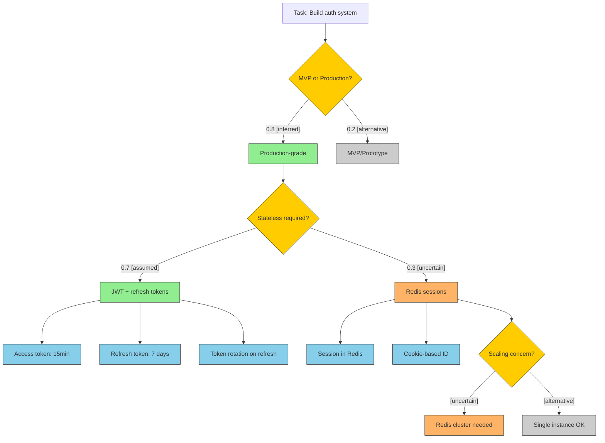
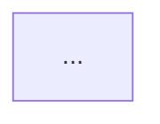

# Reasoning Graph Generation

> Reference for: Common Ground
> Load when: Using --graph flag, generating mermaid diagrams

---

## Purpose

The reasoning graph makes Claude's decision-making structure visible—not just the assumptions (premises), but the decision tree that led to the current approach.

**Two complementary artifacts:**
- `COMMON-GROUND.md` = the premises (what we're assuming)
- Reasoning graph = the structure (how decisions connect)

---

## Mermaid Diagram Structure

### Basic Template

```mermaid
flowchart TD
    %% Root node: the task/goal
    ROOT[Task: {task_description}]

    %% Decision points: diamond shape
    ROOT --> D1{Decision Question?}

    %% Branches with weights and source tags
    D1 -->|"weight: 0.8 [inferred]"| P1[Chosen Path]
    D1 -->|"weight: 0.2 [alternative]"| P2[Alternative Path]

    %% Downstream decisions
    P1 --> D2{Next Decision?}

    %% Leaf nodes: concrete implementations
    D2 --> I1[Implementation Detail]

    %% Styling
    style D1 fill:#ffcc00,stroke:#333
    style P1 fill:#90EE90,stroke:#333
    style P2 fill:#cccccc,stroke:#333
```

---

## Node Types

| Node Type | Shape | Color | Mermaid Syntax | Meaning |
|-----------|-------|-------|----------------|---------|
| Task/Goal | Rectangle | Default | `ROOT[Task: ...]` | Root of reasoning tree |
| Decision Point | Diamond | Yellow `#ffcc00` | `D1{Question?}` | Fork requiring choice |
| Chosen Path | Rectangle | Green `#90EE90` | `P1[Path Name]` | High confidence, taken |
| Alternative | Rectangle | Gray `#cccccc` | `P2[Alternative]` | Considered but not taken |
| Uncertain | Rectangle | Orange `#FFB366` | `U1[Uncertain]` | Low confidence, needs clarification |
| Implementation | Rectangle | Blue `#87CEEB` | `I1[Detail]` | Concrete decision/action |

---

## Styling Rules

Apply styles after all node definitions:

```mermaid
%% Decision points: yellow
style D1 fill:#ffcc00,stroke:#333
style D2 fill:#ffcc00,stroke:#333

%% Chosen paths: green
style P1 fill:#90EE90,stroke:#333

%% Alternatives: gray
style P2 fill:#cccccc,stroke:#333

%% Uncertain: orange
style U1 fill:#FFB366,stroke:#333

%% Implementations: blue
style I1 fill:#87CEEB,stroke:#333
style I2 fill:#87CEEB,stroke:#333
```

---

## Edge Labels

Include weight and source tag on edges where relevant:

```mermaid
D1 -->|"weight: 0.8 [stated]"| P1
D1 -->|"weight: 0.5 [inferred]"| P2
D1 -->|"[uncertain]"| U1
D1 -->|"[alternative]"| A1
```

### Source Tags

| Tag | Meaning | Typical Weight |
|-----|---------|----------------|
| `[stated]` | User explicitly said this | 0.8 - 1.0 |
| `[inferred]` | Derived from code/config | 0.6 - 0.8 |
| `[assumed]` | Best practice default | 0.5 - 0.7 |
| `[uncertain]` | Needs clarification | 0.2 - 0.5 |
| `[alternative]` | Considered but not taken | 0.1 - 0.3 |

---

## Node Naming Conventions

### IDs

Use consistent prefixes:

| Prefix | Meaning | Example |
|--------|---------|---------|
| `ROOT` | Root task | `ROOT[Task: Build auth]` |
| `D{n}` | Decision point | `D1{MVP or Production?}` |
| `P{n}` | Chosen path | `P1[Production-grade]` |
| `A{n}` | Alternative | `A1[MVP approach]` |
| `U{n}` | Uncertain node | `U1[Redis sessions?]` |
| `I{n}` | Implementation | `I1[15min token expiry]` |

### Labels

- Keep labels concise (< 30 chars)
- Use sentence case
- Decision points end with `?`
- Implementations are specific

---

## Graph Generation Process

### Step 1: Identify Root Task

Extract the main task/goal from conversation context:

```mermaid
ROOT[Task: Build authentication system]
```

### Step 2: Map Major Decisions

For each ESTABLISHED or WORKING assumption, trace back:
- What decision led to this assumption?
- What alternatives existed?

### Step 3: Build Decision Tree

Connect decisions hierarchically:

```mermaid
ROOT --> D1{Scope?}
D1 --> P1[Production] --> D2{Architecture?}
D1 --> A1[MVP]
D2 --> P2[Stateless] --> D3{Token Strategy?}
D2 --> A2[Stateful]
```

### Step 4: Add Leaf Implementations

For concrete decisions (ESTABLISHED assumptions):

```mermaid
D3 --> I1[JWT access tokens]
D3 --> I2[Refresh token rotation]
I1 --> I3[15min expiry]
I2 --> I4[7-day refresh window]
```

### Step 5: Mark Uncertainty

Flag OPEN assumptions and uncertain branches:

```mermaid
D2 -->|"[uncertain]"| U1[Redis sessions?]
style U1 fill:#FFB366,stroke:#333
```

### Step 6: Apply Styling

Add style rules for all nodes based on their type.

---

## Complete Example

### Context

User wants to build an authentication system. Through conversation:
- Production-grade confirmed (inferred from requirements)
- Stateless preferred (assumed, not confirmed)
- JWT chosen over sessions (working assumption)

### Generated Graph



---

## Embedding in COMMON-GROUND.md

Add the graph as a section in the ground file:

```markdown
---

## Reasoning Graph

Last generated: {timestamp}



### Graph Legend

| Color | Meaning |
|-------|---------|
| Yellow | Decision point (requires choice) |
| Green | Chosen path (high confidence) |
| Gray | Alternative (not taken) |
| Orange | Uncertain (needs clarification) |
| Blue | Implementation (concrete action) |

---
```

---

## File Output Options

### Option 1: Embedded (Default)

Add `## Reasoning Graph` section to `COMMON-GROUND.md`

**Pros:** Single file, travels with assumptions
**Cons:** Larger file

### Option 2: Standalone

Create `REASONING.mermaid` in project root

**Pros:** Can be viewed in mermaid-compatible editors
**Cons:** Two files to track

### Option 3: Both

Embed in `COMMON-GROUND.md` AND create standalone file

**When:** User explicitly requests standalone file

---

## Conversational Updates

### Expanding Branches

User: "Expand the MVP branch"

1. Find the `A1[MVP/Prototype]` node
2. Add downstream decisions for that path
3. Regenerate with expanded subtree

### Switching Paths

User: "I actually want Redis sessions"

1. Swap styling: `U1` becomes green, `P2` becomes orange
2. Update weights on edges
3. Expand `U1` subtree if needed
4. Regenerate graph

### Adding Detail

User: "What's downstream of token rotation?"

1. Find `I3[Token rotation on refresh]` node
2. Add child nodes for implementation details
3. Regenerate with expanded leaf

---

## Validation Rules

### Graph Must Have

- Exactly one ROOT node
- At least one decision point (D node)
- Styling for all nodes
- Edge labels with weights or tags

### Graph Must Not Have

- Orphan nodes (disconnected)
- Cycles (this is a tree, not a graph)
- Missing style definitions
- Unlabeled decision edges

---

## Regeneration Triggers

Regenerate the graph when:

| Trigger | Action |
|---------|--------|
| Assumption promoted | Change node color to green |
| Assumption demoted | Change node color to orange |
| New assumption added | Add branch or leaf node |
| Alternative explored | Expand grayed branch |
| User requests expansion | Add subtree detail |

Always preserve the full tree structure—never remove alternatives, just gray them out.
