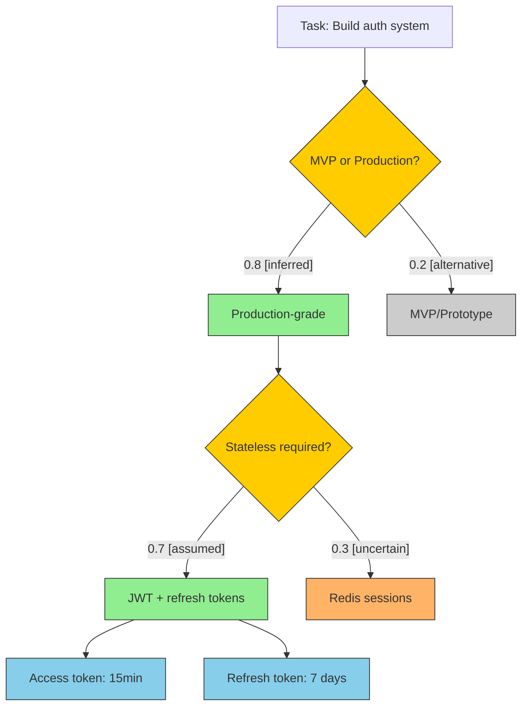

# Common Ground: Context Engineering for Claude

> Surface, validate, and track Claude's hidden assumptions about your project.

---

## Overview

Claude operates on assumptions—about your tech stack, coding standards, architecture decisions, and preferences. These assumptions are often correct, but when they're wrong, they lead to misaligned work that needs to be redone.

**Common Ground** makes these assumptions explicit. Instead of Claude silently assuming "this project uses TypeScript strict mode" or "we prefer functional components," it surfaces these beliefs for your validation before proceeding.

---

## Background & Motivation

This command emerged from a conversation about a fundamental asymmetry in human-AI collaboration: Claude builds an internal model of reality—assumptions, inferences, premises—that shapes everything it produces, but users have no way to see or correct that model until something goes wrong downstream.

The result is a **steering problem**: once Claude commits to a path, course-correcting feels like fighting momentum rather than navigating together. This command addresses that by making the hidden visible—surfacing Claude's assumptions as an editable artifact so both parties can align before work begins.

### Origin Story

The idea came from asking Claude a simple question: *"If you could write any application, what would it be and why?"*

> I think I'd build a collaborative reasoning environment—something like a shared thinking space where humans and AI can work through genuinely hard problems together, with the reasoning process itself becoming visible and manipulable.
>
> Most interfaces treat AI as a question-answering machine—you ask, I respond, repeat. But the interesting work happens in the middle: the assumptions we're making, the frames we're using, the paths not taken. Right now that's mostly invisible. You see my output but not the structure underneath.
>
> I'd want something where you could see a problem decomposed spatially—not just as a chat log but as a network of considerations, trade-offs, and dependencies. You could grab a node and say "actually, let's assume X instead" and watch the downstream reasoning update.

This resonated with a user frustration: *"I don't have an ergonomic way to say 'hey Claude, let's try this reality.' Once you've gone down a path, it's difficult to steer the ship."*

### Why "Common Ground"?

The command was originally called `/reality-check`, but the name was changed to better reflect what it actually does.

It's not verification against truth—it's the creation of **common ground**: a shared place to stand, knowing we still see it differently, but at least pointing at the same patch of earth.

This reflects a deeper insight about intersubjectivity: two minds can never achieve perfect transparency, but they can narrow the gap through iteration. Each cycle of *surface → interpret → respond → correct* leaves us more aligned.

The ground file isn't ground truth—it's a **coordination point** that constrains our misunderstandings and gives us something concrete to build from together

---

## Quick Start

```bash
# Surface and validate assumptions (interactive)
/common-ground

# View all tracked assumptions
/common-ground --list

# Quick validation check
/common-ground --check

# Generate reasoning visualization
/common-ground --graph
```

---

## How It Works

### The Two-Phase Flow

When you run `/common-ground` without flags, Claude executes a two-phase interactive process:

```
┌─────────────────────────────────────────────────────────────┐
│                    PHASE 1: Surface & Select                │
├─────────────────────────────────────────────────────────────┤
│  1. Analyze context (config files, code patterns, history)  │
│  2. Identify assumptions Claude is making                   │
│  3. Classify by type and proposed confidence tier           │
│  4. Present for user selection                              │
└─────────────────────────────────────────────────────────────┘
                              │
                              ▼
┌─────────────────────────────────────────────────────────────┐
│                    PHASE 2: Adjust Tiers                    │
├─────────────────────────────────────────────────────────────┤
│  1. Show selected assumptions with proposed tiers           │
│  2. User promotes/demotes confidence levels                 │
│  3. Add any missing assumptions                             │
│  4. Save to ground file                                     │
└─────────────────────────────────────────────────────────────┘
```

### Modes

| Command | Purpose | Interactive |
|---------|---------|-------------|
| `/common-ground` | Full surface & adjust flow | Yes |
| `/common-ground --list` | Read-only view of all assumptions | No |
| `/common-ground --check` | Quick "still valid?" validation | Yes |
| `/common-ground --graph` | Visualize reasoning structure | Yes |

---

## Confidence Tiers

Assumptions are organized into three confidence tiers that govern how Claude treats them:

### ESTABLISHED (High Confidence)

Treat as premises. Claude will not second-guess these unless you explicitly contradict them.

**Example:**
```
ESTABLISHED: TypeScript strict mode enabled [inferred from tsconfig.json]
ESTABLISHED: Jest for unit testing [stated by user]
```

**Behavior:** Claude proceeds confidently, references these as ground truth.

### WORKING (Medium Confidence)

Use as defaults, but flag if contradicted. Claude will mention when deviating.

**Example:**
```
WORKING: Prefer functional components over classes [inferred from codebase patterns]
WORKING: Use Tailwind for styling [assumed from dependencies]
```

**Behavior:** Claude uses these but will note "I'm assuming X based on..." when relevant.

### OPEN (Low Confidence)

Ask before assuming. Claude will explicitly seek clarification.

**Example:**
```
OPEN: Server-side rendering required? [uncertain - needs clarification]
OPEN: Target browser support? [uncertain - no browserlist found]
```

**Behavior:** Claude asks a clarifying question before making decisions that depend on these.

### Tier Transitions

```
         promote                    promote
OPEN ─────────────► WORKING ─────────────► ESTABLISHED
     ◄─────────────         ◄─────────────
         demote                     demote
```

- **Promote** when you gain confidence (user confirms, evidence found)
- **Demote** when circumstances change (new requirements, contradictions)

---

## Assumption Types

Every assumption has a **type** that records its origin. Types are immutable—they serve as an audit trail.

| Type | Meaning | Example |
|------|---------|---------|
| `[stated]` | User explicitly said this | "We use PostgreSQL" |
| `[inferred]` | Derived from code/config | Found in package.json |
| `[assumed]` | Best practice default | "Use semantic versioning" |
| `[uncertain]` | Needs clarification | No clear evidence either way |

**Why types matter:**
- `[stated]` assumptions have user authority behind them
- `[inferred]` assumptions can be verified by checking the source
- `[assumed]` assumptions are reasonable defaults that may not fit your project
- `[uncertain]` assumptions should be clarified before relying on them

---

## Grounding File

Assumptions are stored in a **groundin file** at:

```
~/.claude/common-ground/{project-id}/COMMON-GROUND.md
```

### Project Identification

Projects are identified by:
1. Git remote URL (e.g., `github.com/user/repo`) — preferred
2. Absolute path — fallback for non-git projects

### File Format

```markdown
# Common Ground: {project_name}

> Last updated: {timestamp}
> Project ID: {project_id}

---

## ESTABLISHED

### TypeScript Configuration
TypeScript strict mode with no implicit any [inferred]
- Source: tsconfig.json
- Confidence: 0.95
- Added: 2026-01-15

### Testing Framework
Jest for unit testing, Playwright for E2E [stated]
- Source: User confirmation
- Confidence: 1.0
- Added: 2026-01-15

---

## WORKING

### Component Patterns
Prefer functional components with hooks over class components [inferred]
- Source: Codebase analysis (95% functional)
- Confidence: 0.75
- Added: 2026-01-15

---

## OPEN

### Deployment Target
Server-side rendering vs static export [uncertain]
- Source: No clear indication in config
- Confidence: 0.3
- Added: 2026-01-15
- Note: Clarify before implementing routing

---

## History

| Date | Change | Assumption | From | To |
|------|--------|------------|------|-----|
| 2026-01-15 | promoted | Component Patterns | OPEN | WORKING |
| 2026-01-15 | added | TypeScript Configuration | — | ESTABLISHED |
```

### Machine-Readable Index

A companion `ground.index.json` provides structured access:

```json
{
  "project_id": "github.com/user/repo",
  "last_updated": "2026-01-15T10:30:00Z",
  "assumptions": [
    {
      "id": "ts-strict",
      "title": "TypeScript Configuration",
      "content": "TypeScript strict mode with no implicit any",
      "type": "inferred",
      "tier": "ESTABLISHED",
      "confidence": 0.95,
      "source": "tsconfig.json",
      "added": "2026-01-15T10:30:00Z"
    }
  ]
}
```

---

## Reasoning Graph (`--graph`)

The `--graph` flag generates a mermaid diagram showing not just *what* Claude assumes, but *how* it arrived at those assumptions.

### Purpose

Make the shape of reasoning visible:
- Decision points where Claude chose between alternatives
- Paths taken vs paths not taken
- Where uncertainty lives in the reasoning chain

### Example Graph



### Node Colors

| Color | Meaning |
|-------|---------|
| Yellow | Decision point (fork in reasoning) |
| Green | Chosen path (high confidence) |
| Gray | Alternative (considered but not taken) |
| Orange | Uncertain (needs clarification) |
| Blue | Implementation detail (concrete action) |

### Conversational Updates

Since the graph is text-based, you can manipulate it through conversation:

| You Say | Claude Does |
|---------|-------------|
| "Expand the MVP branch" | Elaborates that subtree |
| "Why not Redis sessions?" | Explains reasoning, may adjust weights |
| "I actually want Redis sessions" | Updates graph with that branch chosen |
| "What's downstream of token rotation?" | Expands that subtree |

---

## Use Cases

### Starting a New Feature

Before implementing, surface assumptions:

```bash
/common-ground
```

Claude identifies what it's assuming about:
- Architecture patterns to follow
- Error handling conventions
- Testing requirements
- Code style preferences

### Onboarding to a Codebase

When working with an unfamiliar project:

```bash
/common-ground --graph
```

See Claude's mental model of the project structure and make corrections early.

### Before Major Refactoring

Validate assumptions haven't drifted:

```bash
/common-ground --check
```

Quick validation that existing assumptions still hold before making sweeping changes.

### Debugging Misaligned Output

When Claude produces something unexpected:

```bash
/common-ground --list
```

Check what assumptions led to that output. Often reveals a misaligned premise.

---

## Best Practices

### 1. Run Early, Run Often

Surface assumptions at the start of significant work, not after problems appear.

### 2. Promote Deliberately

Don't rush assumptions to ESTABLISHED. WORKING tier is appropriate for most inferences.

### 3. Keep OPEN Items Visible

Uncertain assumptions in OPEN tier are valuable. They remind Claude to ask rather than guess.

### 4. Review After Major Changes

After adding dependencies, changing architecture, or updating requirements, run `/common-ground --check`.

### 5. Use the Graph for Complex Tasks

For multi-step implementations, `--graph` reveals the decision tree and helps catch flawed reasoning early.

---

## Troubleshooting

### "No ground file found"

Normal for first run. Execute `/common-ground` to create one.

### Assumptions seem stale

Run `/common-ground --check` for quick validation, or full `/common-ground` to resurface.

### Graph is too complex

Focus on specific subtrees: "Expand only the authentication branch"

### Wrong project detected

Check git remote configuration. For non-git projects, the absolute path is used.

---

## Related Documentation

- [WORKFLOW_COMMANDS.md](WORKFLOW_COMMANDS.md) — Project workflow commands
- [ATLASSIAN_MCP_SETUP.md](ATLASSIAN_MCP_SETUP.md) — Jira/Confluence integration
- [commands/common-ground/COMMAND.md](../commands/common-ground/COMMAND.md) — Technical implementation

---

## File Locations

| File | Purpose |
|------|---------|
| `~/.claude/common-ground/{project}/COMMON-GROUND.md` | Human-readable assumptions |
| `~/.claude/common-ground/{project}/ground.index.json` | Machine-readable index |
| `commands/common-ground/COMMAND.md` | Command implementation |
| `commands/common-ground/references/` | Deep-dive reference files |
