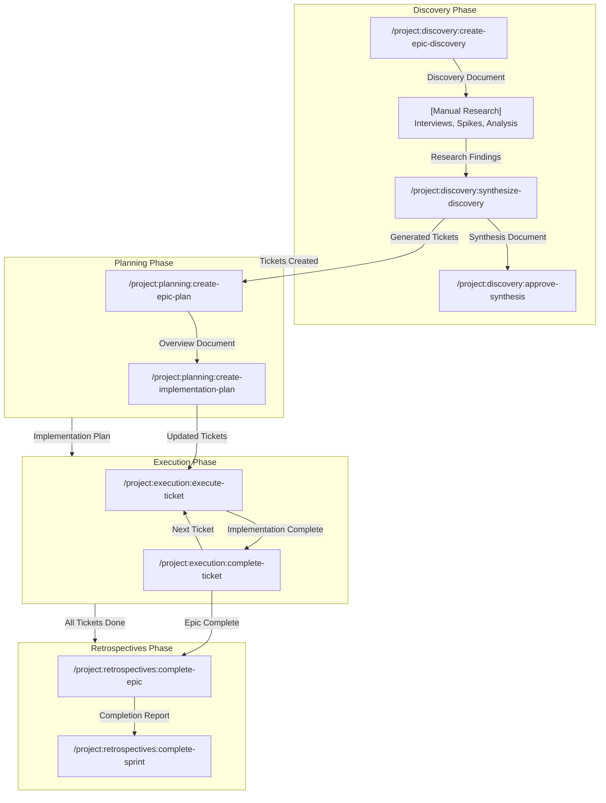
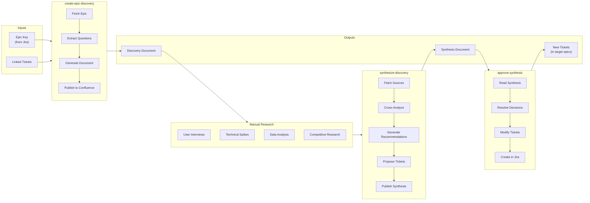
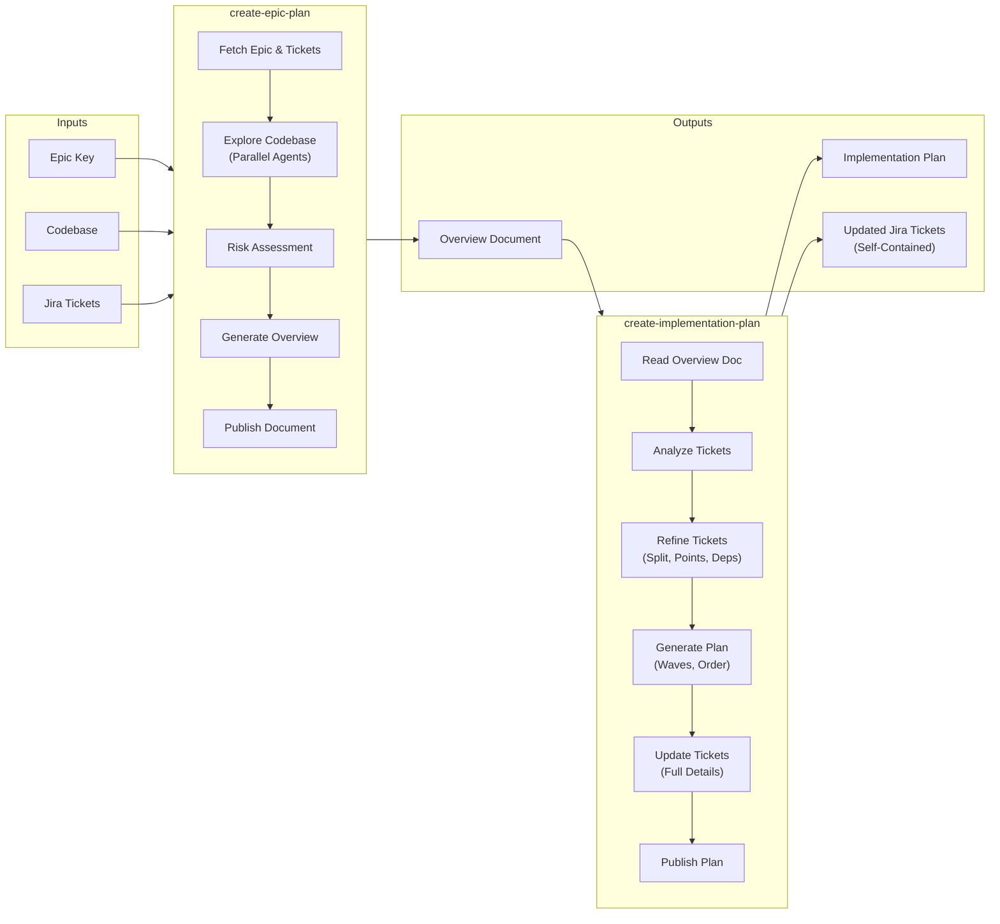
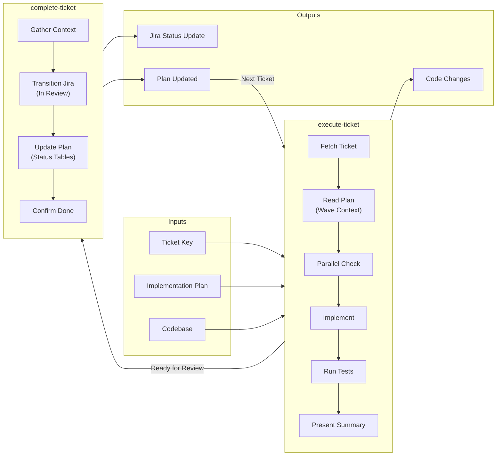
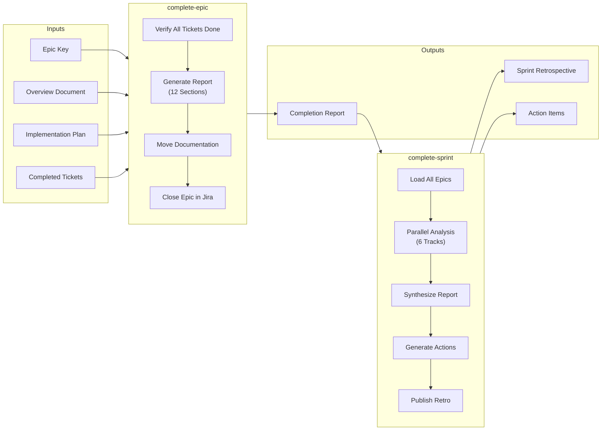

# Workflow Commands Reference

This document provides comprehensive documentation for the project workflow command system. These commands manage epics through a structured lifecycle from discovery through retrospectives, integrating with Jira for issue tracking and Confluence for documentation publishing.

---

## Table of Contents

- [Introduction](#introduction)
- [Full Lifecycle Overview](#full-lifecycle-overview)
- [Discovery Phase](#discovery-phase)
- [Planning Phase](#planning-phase)
- [Execution Phase](#execution-phase)
- [Retrospectives Phase](#retrospectives-phase)
- [Command Reference](#command-reference)
- [Integration Points](#integration-points)
- [Checkpoint System](#checkpoint-system)

---

## Introduction

The workflow command system provides a structured approach to managing software development epics from initial research through completion and retrospective analysis. Each command in the system produces outputs that feed into subsequent commands, creating a traceable chain of documentation and decisions.

**Key Benefits:**
- Consistent documentation across all epics
- Traceable decisions from discovery through implementation
- Automated status updates in Jira
- Centralized knowledge in Confluence
- Built-in quality gates through mandatory checkpoints

---

## Full Lifecycle Overview

The complete workflow spans four distinct phases, each with specialized commands that produce artifacts consumed by downstream phases.



### Document Flow Summary

| Phase | Input | Command | Output |
|-------|-------|---------|--------|
| Discovery | Epic Key | `create-epic-discovery` | Discovery Document |
| Discovery | Discovery Doc + Research | `synthesize-discovery` | Synthesis Doc + Proposed Tickets |
| Discovery | Synthesis Doc URL | `approve-synthesis` | Jira Tickets |
| Planning | Epic Key | `create-epic-plan` | Overview Document |
| Planning | Overview Doc URL | `create-implementation-plan` | Implementation Plan + Updated Tickets |
| Execution | Ticket Key | `execute-ticket` | Implemented Code |
| Execution | Ticket Key | `complete-ticket` | Jira Transition + Plan Update |
| Retrospectives | Epic Key | `complete-epic` | Completion Report |
| Retrospectives | Sprint Number | `complete-sprint` | Sprint Retrospective |

---

## Discovery Phase

The discovery phase focuses on research, customer discovery, and validation before implementation begins. Use this phase for epics with significant unknowns or when customer validation is required.



### create-epic-discovery

**Command:** `/project:discovery:create-epic-discovery <epic-key>`

**Purpose:** Creates a structured discovery document for research and customer discovery epics, extracting questions and unknowns from linked tickets.

**Process:**
1. Fetches epic and all linked tickets from Jira
2. Extracts explicit and implicit questions from requirements
3. Categorizes questions by theme (Customer, Technical, Business, Scope)
4. Generates hypothesis map with validation methods
5. Creates research plan with activities and owners
6. Publishes to Confluence

**Output Sections:**
- Discovery Overview
- Hypothesis Map
- Research Questions Matrix (by category)
- Dependencies and Blockers
- Research Plan
- Decision Framework
- Risk Register
- Target Implementation Epics
- Linked Tickets

**Publish Location:** `/Epics/Discovery/{Epic_Key}/`

---

### synthesize-discovery

**Command:** `/project:discovery:synthesize-discovery <source-url> [source-url...] [--target=<epic-key>]`

**Purpose:** Synthesizes findings from discovery documents and research into a synthesis document with proposed tickets.

**Arguments:**
- `<source-url>` - One or more Confluence document URLs (discovery docs, research findings, spike reports)
- `--target=<epic-key>` - Optional target epic for generated tickets (auto-detected if not specified)

**Process:**
1. Fetches all source documents
2. Consolidates and cross-analyzes findings
3. Validates/invalidates hypotheses
4. Generates feature recommendations
5. Identifies blocking decisions that must be resolved
6. Creates proposed tickets (not yet in Jira)
7. Publishes synthesis document with machine-readable ticket data

**Output Sections:**
- Synthesis Overview
- Executive Summary
- Consolidated Findings (Validated/Invalidated Hypotheses, Answered Questions)
- Remaining Unknowns
- Recommendations by Epic
- Blocking Decisions (decisions that block ticket creation)
- Decision Log
- Source Cross-Reference
- Proposed Tickets Data (JSON for `approve-synthesis`)

**Publish Location:** `/Epics/Discovery/{Discovery_Epic_Key}/Synthesis/`

**Next Step:** Run `/approve-synthesis <synthesis-url>` to resolve decisions and create tickets.

---

### approve-synthesis

**Command:** `/project:discovery:approve-synthesis <synthesis-url>`

**Purpose:** Reviews synthesis document, resolves blocking decisions, and creates approved tickets in Jira.

**Arguments:**
- `<synthesis-url>` - URL of the synthesis document from `synthesize-discovery`

**Process:**
1. Fetches synthesis document and extracts proposed tickets JSON
2. Checks for unresolved blocking decisions
3. Presents decisions for resolution (blocks until all resolved)
4. Allows add/remove/modify of proposed tickets
5. Creates approved tickets in Jira
6. Updates synthesis document status to "Approved"

**Blocking Decisions:**
- Decisions are identified during synthesis as issues that affect ticket scope
- All blocking decisions MUST be resolved before tickets can be created
- User selects resolution option (A, B, C, etc.) for each decision
- Resolutions are recorded in the synthesis document

**Ticket Operations:**
- **Add:** Create new tickets not in the original proposal
- **Remove:** Exclude tickets from Jira creation
- **Modify:** Update title, description, story points, priority

**Output:**
- Created Jira tickets linked to target epic(s)
- Updated synthesis document with approval status and ticket links

---

## Planning Phase

The planning phase creates comprehensive documentation for implementation. This is where codebase analysis, risk assessment, and detailed implementation planning occur.



### create-epic-plan

**Command:** `/project:planning:create-epic-plan <epic-key>`

**Purpose:** Creates a comprehensive planning document (Overview Document) by analyzing Jira tickets and exploring the codebase.

**Process:**
1. Fetches epic and all linked tickets
2. Launches parallel agents to explore codebase:
   - Affected modules discovery
   - API patterns analysis
   - Component patterns analysis
   - Test patterns discovery
   - Reference implementations search
3. Documents unknowns and technical decisions
4. Creates risk assessment for each change
5. Publishes Overview Document

**Output Sections:**
- Epic Overview (Purpose, User Value, Scope)
- Goals and Success Metrics
- Requirements Summary
- Technical Change Overview (with risk scores)
- Impact Analysis
- Testing Strategy
- User Behavior Testing (E2E scenarios)
- Implementation Notes
- Acceptance Criteria
- Open Questions and Risks
- Codebase Analysis (patterns, references, test locations)
- Linked Tickets

**Risk Assessment Dimensions:**
| Dimension | Low (1) | Medium (2) | High (3) |
|-----------|---------|------------|----------|
| Scope | 3 files or fewer | 4-10 files | 10+ files |
| Dependencies | All exist | Some foundation needed | Significant groundwork |
| Blocking Factor | Independent | Soft dependency | Hard blocker |
| Stability | Existing patterns | Some unknowns | Novel approach |
| UX Impact | Backend only | Secondary flows | Core journey |
| Testing Complexity | Simple assertions | New mocks needed | Complex E2E |
| Reversibility | Easy rollback | Moderate effort | One-way door |

**Risk Levels:**
- 7-11: Low - Standard implementation
- 12-16: Medium - Extra review, incremental delivery
- 17-21: High - Spike/POC first, architectural review

**Publish Location:** `/Epics/In Progress/{Epic_Key}/`

---

### create-implementation-plan

**Command:** `/project:planning:create-implementation-plan <overview-doc-url>`

**Purpose:** Generates a detailed implementation plan with parallel execution waves and updates all tickets with self-contained implementation details.

**Process:**
1. Reads Overview Document for context
2. Fetches all Jira tickets
3. Analyzes and refines tickets:
   - Creates new tickets for gaps
   - Splits large tickets (>8 points)
   - Adds story points
   - Links dependencies
4. Generates topologically sorted execution order
5. Creates parallel execution waves
6. Updates each ticket with full implementation details
7. Publishes Implementation Plan

**Implementation Plan Sections:**
- Summary (metrics, waves, dependencies)
- Completion Status (tracking table)
- Execution Order (topologically sorted)
- Parallel Execution Strategy (by wave)
- Agent Recommendations
- Document Links

**Ticket Update Template:**
Each ticket is updated to be self-contained with:
- Overview and Implementation Plan links
- Summary
- Implementation Steps (with code snippets)
- Files to Modify (table)
- Complete Test Code
- Acceptance Criteria

**Publish Location:** `/Epics/In Progress/{Epic_Key}/` (as subpage of Overview)

---

## Execution Phase

The execution phase handles the actual implementation of tickets and tracking of completion status.



### execute-ticket

**Command:** `/project:execution:execute-ticket <ticket-key>`

**Purpose:** Implements a Jira ticket following its self-contained implementation details.

**Process:**
1. Fetches ticket from Jira
2. Verifies ticket has implementation details (stops if missing)
3. Reads implementation plan for wave/dependency context
4. Checks for parallel execution opportunities
5. Updates Jira status to "In Progress"
6. Executes implementation steps
7. Writes required tests
8. Verifies acceptance criteria
9. Presents completion summary with commit message

**Parallel Execution:**
When implementation plan defines parallel waves:
- Identifies current wave (first with incomplete tickets)
- Offers to spawn specialized agents for parallel execution
- Coordinates completion before advancing waves

**Agent Types for Parallel Work:**
- `frontend-developer` - UI/component work
- `backend-developer` - API/backend services
- `database-optimizer` - Database changes
- `fullstack-developer` - Full-stack features
- `test-automator` - Test coverage

**Deviation Handling:**
If implementation plan must be deviated from:
1. Stop and report the deviation
2. Present options (proceed, modify, pause)
3. Wait for user approval
4. Document approved deviations

**Output:**
- Ticket Completion Summary
- Suggested Commit Message
- Changes Made
- Files Modified/Created
- Tests Added
- Deviations from Plan
- Follow-up Tickets Created

---

### complete-ticket

**Command:** `/project:execution:complete-ticket [ticket-key]`

**Purpose:** Transitions Jira ticket to "In Review" and updates the implementation plan with completion details.

**Arguments:**
- `[ticket-key]` - Optional if context available from recent `execute-ticket`

**Process:**
1. Identifies ticket and gathers context
2. Extracts completion details from conversation
3. Confirms before finalizing
4. Transitions Jira to "In Review"
5. Updates Implementation Plan:
   - Completion Status table
   - Execution Order table
   - Parallel Execution wave table
   - Adds Completion Details section

**Plan Updates:**
```markdown
## {Ticket_Key} Completion Details

**Completed:** [date]

### Changes Made
* [extracted from summary]

### Tests Added
* [extracted from summary]

### Deviations
[Any deviations, or "None"]

### Follow-up Tickets
[Any follow-up tickets, or "None"]
```

---

## Retrospectives Phase

The retrospectives phase generates completion reports and sprint retrospectives for knowledge capture and process improvement.



### complete-epic

**Command:** `/project:retrospectives:complete-epic <epic-key>`

**Purpose:** Generates a comprehensive completion report, closes the epic in Jira, and moves documentation to the complete folder.

**Process:**
1. Verifies all tickets are complete (stops if not)
2. Reviews implementation quality (PRs merged, test coverage)
3. Generates 12-section completion report
4. Updates Overview Document with completion report
5. Moves documentation from `/In Progress/` to `/Complete/Sprint [N]/`
6. Closes epic in Jira
7. Identifies reusable patterns for knowledge transfer

**Completion Report Sections:**
1. Epic Summary (duration, points, contributors)
2. Objectives and Outcomes
3. Ticket Breakdown
4. Technical Deliverables (files, LOC, coverage)
5. Architecture and Design Decisions
6. Quality Metrics (PRs, bugs, hooks)
7. Technical Debt and Follow-up
8. Testing and Quality Assurance
9. Documentation Delivered
10. Lessons Learned (What Went Well, Improvements, Process)
11. Risk Assessment Review
12. Recommendations for Future Epics

**Publish Location:**
- From: `/Epics/In Progress/{Epic_Key}/`
- To: `/Epics/Complete/Sprint [N]/{Epic_Key}/`

---

### complete-sprint

**Command:** `/project:retrospectives:complete-sprint <sprint-number-or-folder-path>`

**Purpose:** Generates a comprehensive sprint retrospective from all completed epics in a sprint.

**Arguments:**
- `<sprint-number>` - Sprint number (e.g., "1", "2")
- `<folder-path>` - Alternatively, direct Confluence folder path

**Process:**
1. Locates all epic documents in sprint folder
2. Reads all Overview Documents, Implementation Plans, and Completion Reports
3. Executes 6 parallel analysis tracks
4. Synthesizes findings into unified report
5. Generates prioritized action items
6. Publishes retrospective

**Parallel Analysis Tracks:**

| Track | Focus Areas |
|-------|-------------|
| Engineering Excellence | Code quality, technical debt, architecture, performance |
| Quality Assurance | Test coverage, bug patterns, regressions, automation |
| Security and Compliance | Vulnerabilities, auth/authz, data privacy, compliance |
| Product and UX | Feature completeness, acceptance criteria, accessibility |
| DevOps and Infrastructure | CI/CD, migrations, monitoring, performance |
| Process and Collaboration | Estimation accuracy, blockers, communication, documentation |

**Retrospective Sections:**
- Executive Summary (goals, metrics, top wins/challenges)
- Epic Breakdown
- What Went Well (by track)
- What Needs Improvement (by track with impact)
- Action Items (Critical, High, Medium, Deferred)
- Patterns and Insights
- Metrics Dashboard
- Knowledge Transfer
- Systemic Issues
- Meeting Discussion Topics

**Publish Location:** `/Retrospectives/Sprint [N]/`

---

## Command Reference

Quick reference table for all workflow commands:

| Command | Arguments | Description | Output |
|---------|-----------|-------------|--------|
| `create-epic-discovery` | `<epic-key>` | Creates discovery document for research epics | Discovery Document (Confluence) |
| `synthesize-discovery` | `<doc-urls> [--target=<epic>]` | Synthesizes findings into proposed tickets | Synthesis Doc + Proposed Tickets |
| `approve-synthesis` | `<synthesis-url>` | Resolves decisions, creates tickets in Jira | Jira Tickets |
| `create-epic-plan` | `<epic-key>` | Creates overview document with codebase analysis | Overview Document (Confluence) |
| `create-implementation-plan` | `<overview-doc-url>` | Creates execution plan with parallel waves | Implementation Plan + Updated Tickets |
| `execute-ticket` | `<ticket-key>` | Implements individual ticket | Code Changes + Tests |
| `complete-ticket` | `[ticket-key]` | Transitions Jira, updates plan | Jira Status + Plan Update |
| `complete-epic` | `<epic-key>` | Generates completion report, closes epic | Completion Report |
| `complete-sprint` | `<sprint-number>` | Comprehensive sprint retrospective | Sprint Retrospective |

---

## Integration Points

### Jira Integration

The workflow commands integrate with Jira for:

**Read Operations:**
- Fetch epic details and linked tickets
- Query ticket status and dependencies
- Read acceptance criteria and requirements

**Write Operations:**
- Create new tickets (from synthesis)
- Update ticket descriptions (implementation details)
- Add story points and link dependencies
- Transition ticket status (In Progress, In Review, Done)
- Close epics with resolution

**JQL Queries Used:**
- `Parent = {Epic_Key}` - Find all child tickets
- Status-based queries for completion verification

---

### Confluence Integration

All documentation is published to structured Confluence locations:

| Document Type | Confluence Location |
|---------------|---------------------|
| Discovery Documents | `/Epics/Discovery/{Epic_Key}/` |
| Synthesis Documents | `/Epics/Discovery/{Discovery_Epic_Key}/Synthesis/` |
| Overview Documents | `/Epics/In Progress/{Epic_Key}/` |
| Implementation Plans | `/Epics/In Progress/{Epic_Key}/` (subpage) |
| Completion Reports | `/Epics/Complete/Sprint [N]/{Epic_Key}/` |
| Sprint Retrospectives | `/Retrospectives/Sprint [N]/` |

**Document Lifecycle:**
1. Created in `/In Progress/` during planning
2. Updated throughout execution
3. Moved to `/Complete/Sprint [N]/` on epic completion
4. Referenced in sprint retrospectives

---

## Checkpoint System

Every command includes mandatory user approval gates to ensure human oversight at critical decision points.

### Checkpoint Philosophy

Checkpoints serve to:
- Prevent unintended changes to Jira or Confluence
- Ensure alignment on approach before work begins
- Provide opportunities to correct course
- Maintain audit trail of decisions

### Checkpoint Types

**Confirmation Checkpoints:**
Verify information before proceeding.
```
Please confirm before I proceed:

Epic Key: CC-123
Epic Title: User Authentication
Linked Tickets: 8 tickets found
Publish Location: /Epics/In Progress/CC-123/

Is this correct? (Yes / No / Correct)
```

**Approval Checkpoints:**
Require explicit approval before making changes.
```
Ready to publish this planning document to Confluence? (Yes / No / Modify)
```

**Decision Checkpoints:**
Present options when issues are encountered.
```
Epic CC-123 has incomplete tickets:

In Progress:
- CC-124: User login form - Status: In Progress

Options:
A) Complete remaining tickets first
B) Move incomplete tickets to backlog and close epic
C) Extend epic deadline and keep open

What would you like to do? [A/B/C]
```

### Checkpoints by Command

| Command | Checkpoints |
|---------|-------------|
| `create-epic-discovery` | Epic confirmation, Document review before publish |
| `synthesize-discovery` | Sources confirmation, Synthesis review before publish |
| `approve-synthesis` | Decision resolution, Ticket modifications, Ticket creation approval |
| `create-epic-plan` | Epic confirmation, Document review before publish |
| `create-implementation-plan` | Document confirmation, Ticket changes, Plan preview, Overview updates |
| `execute-ticket` | Ticket selection, Deviation approval, Completion review |
| `complete-ticket` | Finalization confirmation |
| `complete-epic` | Completion readiness, Documentation updates, Epic closure |
| `complete-sprint` | Document confirmation, Retrospective review before publish |

### Checkpoint Responses

| Response | Effect |
|----------|--------|
| **Yes** | Proceed with the proposed action |
| **No** | Stop and ask what changes are needed |
| **Modify** | User provides feedback, regenerate and re-confirm |
| **Correct** | User provides corrections, update and re-confirm |

**Critical Rule:** Commands must never modify Jira or Confluence without explicit user approval at the appropriate checkpoint.

---

## Workflow Variations

### Standard Implementation Flow

For epics with clear requirements:
```
create-epic-plan -> create-implementation-plan -> [execute-ticket + complete-ticket] x N -> complete-epic
```

### Discovery-First Flow

For epics requiring research:
```
create-epic-discovery -> [research] -> synthesize-discovery -> approve-synthesis -> create-epic-plan -> create-implementation-plan -> [execute-ticket + complete-ticket] x N -> complete-epic
```

### Sprint Completion Flow

At end of sprint:
```
[complete-epic] x N -> complete-sprint
```

---

## Best Practices

### Document Linking

Always capture and provide document URLs when outputting command results. Downstream commands depend on these URLs:

- `create-epic-discovery` outputs `{Discovery_Document}` for `synthesize-discovery`
- `synthesize-discovery` outputs `{Synthesis_Document}` for `approve-synthesis`
- `create-epic-plan` outputs `{Overview_Document}` for `create-implementation-plan`
- `create-implementation-plan` outputs `{Implementation_Plan}` referenced in tickets

### Ticket Self-Containment

After `create-implementation-plan`, each ticket should be fully self-contained with:
- All implementation steps
- Complete test code (copy-paste ready)
- File paths and modifications
- Acceptance criteria

This enables `execute-ticket` to work without fetching external documents.

### Parallel Execution

Leverage parallel execution waves for efficiency:
- Group independent tickets in the same wave
- Use specialized agents for different work types
- Coordinate completion before advancing to dependent waves

### Knowledge Capture

Use retrospective phases to capture learnings:
- Document patterns to replicate
- Record anti-patterns to avoid
- Generate actionable improvements
- Update team documentation with new standards
