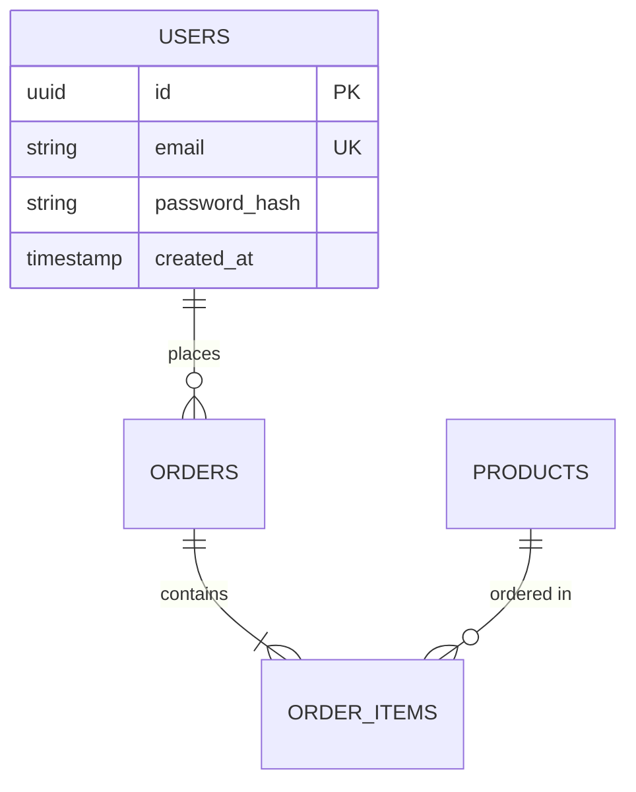

# Template Mappings Reference

<!-- SCOPE: Answer-to-template mappings ONLY. Contains source questions for each document section. -->
<!-- DO NOT add here: Template creation → templates/*.md, Phase logic → ln-110-project-docs-coordinator SKILL.md -->

This document details how collected answers from Phase 2 (Core Documents Generation) map to specific sections in the 7 generated documentation templates.

## Document 1: requirements.md

**Template File**: `references/templates/requirements_template.md`

**Structure**:
- Functional Requirements (FR) ONLY organized by feature groups
- NO Non-Functional Requirements (NFR removed per project policy)
- Each requirement includes: ID, Description, Priority (MoSCoW), Acceptance Criteria

**Key Mappings**:

| Template Section | Source Questions | Notes |
|-----------------|------------------|-------|
| Section 1.2 Scope | Q1 | High-level technical acceptance criteria |
| Section 2.1 Product Perspective | Q2 | MVP technical scope |
| Section 3 FR by feature groups | Q1, Q2, Q3 | Organize functional requirements by user-facing features |
| Section 5 Constraints | Q10 | Technical and regulatory constraints |

**Format Example**:
```markdown
### FR-AUTH-001: User Registration
**Priority**: MUST
**Description**: Users can register with email and password
**Acceptance Criteria**:
- Email validation (RFC 5322)
- Password strength requirements (min 12 chars, uppercase, lowercase, number, symbol)
- Confirmation email sent within 5 seconds
```

---

## Document 2: architecture.md

**Template File**: `references/templates/architecture_template.md`

**Structure**:
- 11 sections following arc42 (simplified) + C4 Model
- Includes Mermaid diagrams (C4 Context, Container, Component)
- NO Deployment diagrams (moved to runbook.md)

**Key Mappings**:

| Template Section | Source Questions | Notes |
|-----------------|------------------|-------|
| Section 1.1 Requirements Overview | Q1, Q2 | Brief summary linking to requirements.md |
| Section 1.2 Quality Goals | R1 | Top 3-5 quality attributes (performance, security, scalability) |
| Section 2 Constraints | Q10 | Technical, organizational, regulatory constraints |
| Section 3.1 Business Context | Q5, Q6 | External actors and business boundaries |
| Section 3.2 Technical Context | Q7, Q13 | External systems, integrations, interfaces |
| Section 4.1 Technology Decisions | Q9, Q11, Q12 | High-level tech choices with ADR links |
| Section 4.2 Top-Level Decomposition | Q11 | Architecture pattern (layered, microservices, etc.) |
| Section 8 ADRs | Q9, Q11, Q12 | List of all ADR links |
| Section 10 Risks | R2 | Known technical risks and mitigation |

**Diagram Mappings**:

| Diagram Type | Generated From | Purpose |
|-------------|---------------|---------|
| C4 Context | Q7 (boundaries), Q13 (integrations) | System + external actors/systems |
| C4 Container | Q11 (architecture), Q9 (database/cache) | Frontend, Backend, Database, Cache, Queue |
| C4 Component | Q11 (pattern), Q12 (frameworks) | API application breakdown (controllers, services, repositories) |

**Note**: Deployment diagrams removed (now in runbook.md). Quality Goals derived from R1 (risks), NOT from NFR questions.

---

## Document 3: tech_stack.md

**Template File**: `references/templates/tech_stack_template.md`

**Structure**:
- 4 sections: Overview, Technology Stack table, Docker configuration, Naming conventions
- NO API endpoints, NO database schema (those in separate docs)

**Key Mappings**:

| Template Section | Source Questions | Notes |
|-----------------|------------------|-------|
| Section 2.1 Stack Overview Table | Q9, Q11, Q12 | Detailed version table with rationale and ADR links |
| Section 3.1 Dockerfile | Q9, Q12 (auto-discovered) | Auto-generated multi-stage Dockerfile |
| Section 3.2 docker-compose.yml | Q9, Q12 (auto-discovered) | Auto-generated from package.json + researched versions |
| Section 3.3 docker-compose.test.yml | Q9, Q12 | Test environment configuration |
| Section 4 Naming Conventions | Q8 | File structure, naming patterns |

**Stack Table Format**:
```markdown
| Layer | Technology | Version | Rationale | ADR |
|-------|-----------|---------|-----------|-----|
| Frontend | Next.js | 14.0 | SSR for SEO, team expertise | ADR-001 |
| Backend | Node.js | 20 LTS | JavaScript fullstack, async I/O | ADR-002 |
| Database | PostgreSQL | 16 | ACID, JSON support, maturity | ADR-003 |
```

**Auto-Discovery**: Phase 1.3a extracts Q9 (runtime versions) and Q12 (frameworks) from package.json/Dockerfile before asking user.

---

## Document 4: api_spec.md *(conditional: API/Backend projects only)*

**Template File**: `references/templates/api_spec_template.md`

**Structure**:
- 6 sections: Overview, Authentication, API Endpoints, Request/Response schemas, Error Codes, Rate Limiting
- OpenAPI 3.0 compatible structure

**Key Mappings**:

| Template Section | Source Questions | Notes |
|-----------------|------------------|-------|
| Section 2 Authentication | Q11, Q12 | JWT/OAuth2/API keys implementation |
| Section 3 API Endpoints | Q1, Q3 (derived) | RESTful endpoints derived from functional requirements |
| Section 5 Error Codes | - | Standard error code taxonomy |
| Section 6 Rate Limiting | Q10 | API rate limits from constraints |

**Endpoint Table Format**:
```markdown
| Method | Endpoint | Description | Auth Required | Request Body | Response |
|--------|----------|-------------|---------------|--------------|----------|
| POST | /auth/register | Register new user | No | RegisterDTO | UserDTO |
| GET | /products | List products | No | - | ProductDTO[] |
| POST | /orders | Create order | Yes | OrderDTO | OrderDTO |
```

**Auto-Generation**: Endpoints derived from FR requirements in Q1, Q3 (e.g., "User Registration" → POST /auth/register).

---

## Document 5: database_schema.md *(conditional: projects with database)*

**Template File**: `references/templates/database_schema_template.md`

**Structure**:
- 8 sections: Overview, ER Diagram, Data Dictionary (tables), Indexes, Migrations, Relationships, Constraints, Seed Data
- Mermaid ER diagrams

**Key Mappings**:

| Template Section | Source Questions | Notes |
|-----------------|------------------|-------|
| Section 2 ER Diagram | Q3 (derived) | Entities + relationships from functional requirements |
| Section 3 Data Dictionary | Q3 (derived) | Table definitions with columns, types, constraints |
| Section 4 Indexes | Q3, Q9 | Performance optimization indexes |
| Section 5 Migrations | Q9 | Migration strategy (Prisma/TypeORM/Alembic) |
| Section 8 Seed Data | Q3 | Sample data for development |

**ER Diagram Example**:


**Auto-Generation**: Entities derived from Q3 analysis (e.g., "User Registration" → USERS table, "Product Catalog" → PRODUCTS table).

---

## Document 6: design_guidelines.md *(conditional: Frontend/Full-stack projects only)*

**Template File**: `references/templates/design_guidelines_template.md`

**Structure**:
- 6 sections: Overview, Core Design Elements (typography, colors, spacing, components), Accessibility, Responsive Design, Brand Assets, Design Tokens
- Based on WCAG 2.1 Level AA standards

**Key Mappings**:

| Template Section | Source Questions | Notes |
|-----------------|------------------|-------|
| Section 2.1 Typography | D1 | Font families, sizes, weights, line heights |
| Section 2.2 Color System | D1 | Primary/secondary/semantic colors with hex codes |
| Section 2.3 Spacing System | D1, D3 | 8px base grid, spacing scale (4, 8, 12, 16, 24, 32, 48, 64) |
| Section 2.4 Component Library | D2 | Buttons, Forms, Cards, Modals with Tailwind/MUI classes |
| Section 3 Accessibility | D4 | WCAG compliance, ARIA labels, keyboard navigation |
| Section 4 Responsive Design | D3 | Breakpoints (mobile, tablet, desktop) |
| Section 5 Brand Assets | D5 | Logo usage, imagery guidelines |
| Section 6 Design Tokens | D6 | CSS variables or design system reference |

**Component Example**:
```markdown
#### Buttons
| Variant | Classes | Usage |
|---------|---------|-------|
| Primary | bg-primary text-white hover:bg-primary-dark px-6 py-3 rounded-lg | Primary CTAs |
| Secondary | bg-secondary text-gray-800 hover:bg-secondary-dark px-6 py-3 rounded-lg | Secondary actions |
```

**Skipped for**: Backend-only projects (no frontend).

---

## Document 7: runbook.md *(conditional: Docker-based projects)*

**Template File**: `references/templates/runbook_template.md`

**Structure**:
- 9 sections covering ALL environments: local development, testing, production operations
- Includes Docker commands, troubleshooting, SSH access, deployment procedures

**Key Mappings**:

| Template Section | Source Questions | Notes |
|-----------------|------------------|-------|
| Section 2.1 Required Tools | O1 (auto-discovered) | Docker, Docker Compose, Node.js, Git versions |
| Section 3 Local Development | O1, Q9 (auto-discovered) | Docker commands extracted from docker-compose.yml |
| Section 4 Testing | O1 | Test commands (unit, integration, e2e) |
| Section 5 Build & Deployment | O2 | Production build and deployment procedures |
| Section 6 Production Operations | O2, O3 | SSH access, health checks, monitoring, logs |
| Section 7 Troubleshooting | O3 | Common issues and resolutions |
| Appendix A | O1 (auto-discovered) | Environment variables from .env.example |

**Docker Commands Example**:
```bash
# Start all services
docker compose up -d

# Rebuild after code changes
docker compose down
docker compose build --no-cache app
docker compose up -d

# View logs
docker compose logs -f app
```

**Auto-Discovery**: Docker commands, environment variables, and service names extracted from Dockerfile and docker-compose.yml in Phase 1.3a.

---

## Template Placeholder Format

All templates use explicit placeholder mapping with comments for traceability:

```markdown
**Technology Stack:** {{TECHNOLOGY_STACK}}
<!-- From Q9: What database technology will you use? (auto-discovered from package.json) -->

**Architecture Pattern:** {{ARCHITECTURE_PATTERN}}
<!-- From Q11: What architectural patterns will be used? (auto-researched via WebSearch) -->

**Color System:** {{COLOR_SYSTEM}}
<!-- From D1: What typography and color system should be used? -->

**Docker Commands:** {{DOCKER_COMMANDS}}
<!-- From O1: What is the development environment setup? (auto-discovered from docker-compose.yml) -->
```

This format allows clear traceability from questions to documentation sections. Auto-discovery annotations indicate when data is extracted automatically in Phase 1.3a.

---

## Appendix: ADRs (Auto-Generated)

**Note**: ADRs are still auto-generated as part of the documentation suite, but are NOT one of the 7 main documents.

**Template File**: `references/templates/adr_template.md`

**Generated ADRs** (3-5 per project):

| ADR | Title | Source Questions | When Generated |
|-----|-------|------------------|---------------|
| ADR-001 | Frontend Framework Choice | Q11, Q12 | If frontend framework specified |
| ADR-002 | Backend Framework Choice | Q11, Q12 | Always (every project has backend) |
| ADR-003 | Database Choice | Q9 | If database specified |
| ADR-004 | Additional Technology 1 | Q12 | If significant library chosen (ORM, cache, queue) |
| ADR-005 | Additional Technology 2 | Q12 | If multiple significant choices made |

**Format**: Michael Nygard's ADR format (Context, Decision, Rationale, Consequences, Alternatives Considered)

**Location**: `docs/reference/adrs/adr-NNN-*.md`

---

**Version:** 2.0.0 (BREAKING: Updated for 7-document structure. Added tech_stack, api_spec, database_schema, design_guidelines, runbook mappings. Removed NFR mappings. Updated question IDs: Q1-Q13, D1-D6, O1-O3, R1-R2.)
**Last Updated:** 2025-11-16
