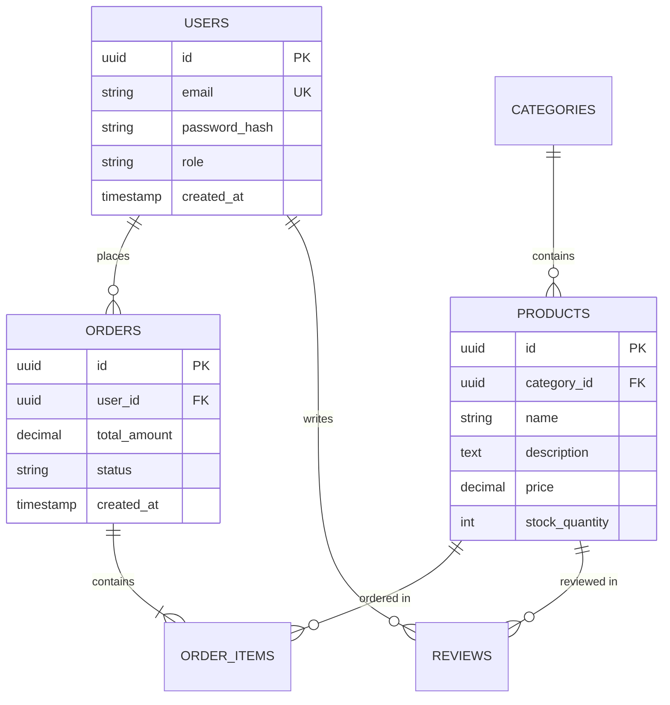

# Database Schema: {{PROJECT_NAME}}

**Document Version:** 1.0
**Date:** {{DATE}}
**Status:** {{STATUS}}

<!-- SCOPE: Database schema (ER diagrams, table definitions, data dictionary, indexes, constraints, migrations, normalization) ONLY. -->
<!-- DO NOT add here: API endpoints → api_spec.md, Tech stack versions → tech_stack.md, Architecture patterns → architecture.md, Requirements → requirements.md, Deployment → runbook.md -->

---

## 1. Introduction

### 1.1 Purpose
This document specifies the database schema, entity relationships, and data dictionary for {{PROJECT_NAME}}.

### 1.2 Database System
{{DATABASE_SYSTEM}}
<!-- Example: PostgreSQL 16.x, MySQL 8.x, MongoDB 7.x -->

### 1.3 Normalization Level
{{NORMALIZATION_LEVEL}}
<!-- Example: Third Normal Form (3NF) with selective denormalization for performance -->

---

## 2. Entity Relationship Diagram

### 2.1 High-Level ER Diagram

```mermaid
erDiagram
    {{ER_DIAGRAM_ENTITIES_RELATIONSHIPS}}
```

<!-- Example:

-->

---

## 3. Data Dictionary

### 3.1 {{TABLE_1}} Table

**Table Name:** `{{table_1}}`
**Description:** {{TABLE_1_DESCRIPTION}}
<!-- Example: users - Stores user account information including authentication credentials and profile data -->

| Column | Type | Null | Default | Constraints | Description |
|--------|------|------|---------|-------------|-------------|
| `id` | UUID | NO | gen_random_uuid() | PRIMARY KEY | Unique user identifier |
| `email` | VARCHAR(255) | NO | - | UNIQUE, CHECK (email ~* '^[A-Za-z0-9._%+-]+@[A-Za-z0-9.-]+\.[A-Z|a-z]{2,}$') | User email address |
| `password_hash` | VARCHAR(255) | NO | - | - | bcrypt hashed password |
| `first_name` | VARCHAR(100) | YES | NULL | - | User first name |
| `last_name` | VARCHAR(100) | YES | NULL | - | User last name |
| `role` | VARCHAR(20) | NO | 'viewer' | CHECK (role IN ('admin', 'editor', 'viewer')) | User role for RBAC |
| `is_active` | BOOLEAN | NO | TRUE | - | Account status |
| `created_at` | TIMESTAMP | NO | CURRENT_TIMESTAMP | - | Account creation timestamp |
| `updated_at` | TIMESTAMP | NO | CURRENT_TIMESTAMP | ON UPDATE CURRENT_TIMESTAMP | Last update timestamp |

**Indexes:**
```sql
CREATE UNIQUE INDEX idx_users_email ON users(email);
CREATE INDEX idx_users_role ON users(role);
CREATE INDEX idx_users_created_at ON users(created_at);
```

**Relationships:**
- `users.id` → `orders.user_id` (One-to-Many)
- `users.id` → `reviews.user_id` (One-to-Many)

---

### 3.2 {{TABLE_2}} Table

**Table Name:** `{{table_2}}`
**Description:** {{TABLE_2_DESCRIPTION}}
<!-- Example: products - Product catalog with pricing, inventory, and categorization -->

| Column | Type | Null | Default | Constraints | Description |
|--------|------|------|---------|-------------|-------------|
| `id` | UUID | NO | gen_random_uuid() | PRIMARY KEY | Product identifier |
| `category_id` | UUID | NO | - | FOREIGN KEY REFERENCES categories(id) ON DELETE RESTRICT | Product category |
| `name` | VARCHAR(200) | NO | - | - | Product name |
| `slug` | VARCHAR(220) | NO | - | UNIQUE | URL-friendly name |
| `description` | TEXT | YES | NULL | - | Product description |
| `price` | DECIMAL(10,2) | NO | - | CHECK (price >= 0) | Product price (USD) |
| `stock_quantity` | INTEGER | NO | 0 | CHECK (stock_quantity >= 0) | Available inventory |
| `is_published` | BOOLEAN | NO | FALSE | - | Publish status |
| `created_at` | TIMESTAMP | NO | CURRENT_TIMESTAMP | - | Creation timestamp |
| `updated_at` | TIMESTAMP | NO | CURRENT_TIMESTAMP | ON UPDATE CURRENT_TIMESTAMP | Last update timestamp |

**Indexes:**
```sql
CREATE UNIQUE INDEX idx_products_slug ON products(slug);
CREATE INDEX idx_products_category_id ON products(category_id);
CREATE INDEX idx_products_is_published ON products(is_published);
CREATE INDEX idx_products_price ON products(price);
```

**Relationships:**
- `categories.id` → `products.category_id` (One-to-Many)
- `products.id` → `order_items.product_id` (One-to-Many)
- `products.id` → `reviews.product_id` (One-to-Many)

---

### 3.3 {{TABLE_3}} Table

{{TABLE_3_DEFINITION}}
<!-- Repeat structure from 3.1/3.2 for additional tables: orders, order_items, categories, reviews, etc. -->

---

## 4. Database Constraints

### 4.1 Foreign Key Constraints

| FK Name | Child Table | Child Column | Parent Table | Parent Column | On Delete | On Update |
|---------|-------------|--------------|--------------|---------------|-----------|-----------|
| `fk_orders_user` | orders | user_id | users | id | CASCADE | CASCADE |
| `fk_products_category` | products | category_id | categories | id | RESTRICT | CASCADE |
| `fk_order_items_order` | order_items | order_id | orders | id | CASCADE | CASCADE |
| `fk_order_items_product` | order_items | product_id | products | id | RESTRICT | CASCADE |

<!-- Example explanations:
- CASCADE: If parent deleted, delete child rows
- RESTRICT: Prevent parent deletion if children exist
- SET NULL: Set child FK to NULL if parent deleted
-->

### 4.2 Check Constraints

| Constraint Name | Table | Expression | Description |
|-----------------|-------|------------|-------------|
| `chk_users_role` | users | `role IN ('admin', 'editor', 'viewer')` | Valid role values |
| `chk_products_price` | products | `price >= 0` | Non-negative price |
| `chk_products_stock` | products | `stock_quantity >= 0` | Non-negative stock |
| `chk_orders_status` | orders | `status IN ('pending', 'paid', 'shipped', 'delivered', 'canceled')` | Valid order statuses |

---

## 5. Indexes Strategy

### 5.1 Primary Indexes
{{PRIMARY_INDEXES}}
<!-- Example: All tables use UUID primary keys for distributed scalability and security (no sequential IDs) -->

### 5.2 Secondary Indexes
{{SECONDARY_INDEXES}}
<!-- Example:
- Email lookup: idx_users_email (UNIQUE) - fast authentication
- Category filtering: idx_products_category_id - product catalog queries
- Order history: idx_orders_user_id - user dashboard
- Price range queries: idx_products_price - product search/filter
-->

### 5.3 Composite Indexes
{{COMPOSITE_INDEXES}}
<!-- Example:
```sql
CREATE INDEX idx_products_category_published ON products(category_id, is_published);
CREATE INDEX idx_orders_user_created ON orders(user_id, created_at DESC);
```
Purpose: Optimize common query patterns (published products by category, recent orders by user)
-->

---

## 6. Database Migrations

### 6.1 Migration Tool
{{MIGRATION_TOOL}}
<!-- Example: Prisma Migrate, Flyway, Liquibase, Alembic (Python), TypeORM migrations -->

### 6.2 Migration Strategy
{{MIGRATION_STRATEGY}}

> ⚠️ **CRITICAL RULE:** Never create migrations manually! Always use ORM auto-generation feature.
> Manual migrations lead to schema drift and inconsistencies between code models and database.

<!-- Example:
- Versioned migrations (001_initial_schema.sql, 002_add_reviews.sql)
- Up/Down scripts for rollback capability
- Automated migration on deployment (CI/CD)
- Manual review for production migrations (peer review required)
-->

### 6.3 Migration Examples

**Migration 001: Initial Schema**
```sql
-- Up Migration
CREATE TABLE users (
    id UUID PRIMARY KEY DEFAULT gen_random_uuid(),
    email VARCHAR(255) UNIQUE NOT NULL,
    password_hash VARCHAR(255) NOT NULL,
    role VARCHAR(20) NOT NULL DEFAULT 'viewer',
    created_at TIMESTAMP NOT NULL DEFAULT CURRENT_TIMESTAMP
);

-- Down Migration
DROP TABLE IF EXISTS users;
```

**Migration 002: Add Soft Delete**
```sql
-- Up Migration
ALTER TABLE users ADD COLUMN deleted_at TIMESTAMP NULL;
CREATE INDEX idx_users_deleted_at ON users(deleted_at);

-- Down Migration
ALTER TABLE users DROP COLUMN deleted_at;
```

---

## 7. Data Types & Standards

### 7.1 Common Data Types

| Logical Type | PostgreSQL Type | MySQL Type | Description |
|--------------|----------------|------------|-------------|
| UUID | UUID | CHAR(36) | Unique identifiers |
| Money | DECIMAL(10,2) | DECIMAL(10,2) | Currency values (2 decimal places) |
| Timestamp | TIMESTAMP | DATETIME | Date and time (UTC) |
| Boolean | BOOLEAN | TINYINT(1) | True/false values |
| JSON | JSONB | JSON | Semi-structured data |

### 7.2 Naming Conventions
{{NAMING_CONVENTIONS}}
<!-- Example:
- Tables: snake_case plural (users, order_items)
- Columns: snake_case (first_name, created_at)
- Indexes: idx_table_column (idx_users_email)
- Foreign Keys: fk_child_parent (fk_orders_user)
- Primary Keys: Always named 'id'
-->

---

## 8. Maintenance

**Last Updated:** {{DATE}}

**Update Triggers:**
- New tables added
- Schema changes (columns, indexes, constraints)
- Migration scripts created
- Denormalization for performance
- Relationship changes

**Verification:**
- [ ] All tables documented with columns/types/constraints
- [ ] ER diagram matches actual schema
- [ ] Indexes match query patterns
- [ ] Foreign keys enforce referential integrity
- [ ] Migrations tested (up + down)

---

**Version:** 1.0.0
**Template Last Updated:** 2025-11-16
