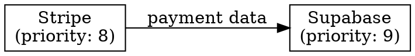

# Skill Graph Visualizer

Visualize skill dependencies, collaboration patterns, and orchestration relationships.

## Purpose

This debugging tool helps you understand:
- How skills are connected and can collaborate
- Which skills depend on or complement each other
- Data flow between skills (who provides/consumes what)
- Orchestration priorities and patterns
- Skills recommended together for common tasks

## Allowed Tools

- Read(templates/.claude/skills/*/skill.json)
- Glob(templates/.claude/skills/**/skill.json)
- Bash(dot)

## Model Preference

haiku

## Instructions

When this command is invoked:

### 1. Load All Skills

Read all skill.json files to extract:
- Skill ID and name
- Orchestration metadata (priority, cooperation level)
- Collaboration data (canProvideDataTo, canConsumeDataFrom, sharedContext)
- Dependencies (recommended, complements)
- Semantic tags and capabilities

### 2. Build Dependency Graph

Create a directed graph showing:
- **Nodes**: Skills (sized by priority, colored by domain)
- **Edges**: Relationships between skills
  - Solid arrows: "provides data to" relationships
  - Dashed arrows: "recommended with" relationships
  - Dotted arrows: "complements" relationships

### 3. Analyze Patterns

Identify:
- **Clusters**: Groups of skills that work together (e.g., full-stack clusters)
- **Hubs**: Central skills that many others depend on
- **Isolated Skills**: Skills with no collaboration metadata
- **Cycles**: Skills that have circular dependencies (potential issues)
- **Missing Links**: Skills that should collaborate but don't have metadata

### 4. Generate Visualization

Create output in three formats:

#### A. ASCII Tree (Quick View)
```
Skills by Domain:
└── fintech
    ├── stripe (priority: 8) [hub: 3 connections]
    │   ├── → supabase (provides: payment data)
    │   ├── → plaid (provides: customer data)
    │   └── ⟷ whop (complements)
    └── plaid (priority: 7)
        └── → supabase (provides: bank data)
```

#### B. DOT Format (Graphviz)


Save to `.claude/debug/skill-graph.dot` and offer to render:
```bash
dot -Tpng .claude/debug/skill-graph.dot -o .claude/debug/skill-graph.png
```

#### C. Interactive Report
```markdown
# Skill Collaboration Report

## Summary
- Total Skills: 40
- Skills with Orchestration: 5 (12.5%)
- Total Connections: 12
- Isolated Skills: 35

## Key Clusters

### Full-Stack SaaS Cluster
Skills that work together for SaaS applications:
- **stripe** (payment processing) → supabase (store transactions)
- **supabase** (database/auth) ← expo (mobile client)
- **expo** (mobile) ⟷ anthropic (AI features)

Shared Context: user_id, auth_token, api_keys

### Banking/Fintech Cluster
- **plaid** (banking data) → supabase (store transactions)
- **stripe** (payments) ⟷ plaid (account verification)

## Recommendations

### Skills to Enhance Next
Priority order for adding orchestration metadata:
1. **shopify** - Should complement stripe, whop (e-commerce)
2. **ios** - Should collaborate with expo (mobile)
3. **aptos/** skills - Form blockchain cluster

### Missing Collaborations
Suggested relationships to add:
- expo → stripe (in-app purchases)
- shopify → stripe (payment gateway)
- anthropic → all skills (AI enhancement layer)
```

### 5. Command-Line Options

Support options:
- `--format <ascii|dot|report>` - Output format (default: ascii)
- `--cluster <domain>` - Show only skills in domain (fintech, mobile, etc.)
- `--skill <id>` - Show connections for specific skill
- `--isolated` - Show only skills without orchestration metadata
- `--render` - Auto-render DOT to PNG (requires graphviz)

### 6. Examples

```bash
# Quick ASCII view
/skill-graph

# Full report with recommendations
/skill-graph --format report

# Visualize specific skill
/skill-graph --skill stripe

# Generate and render graph
/skill-graph --format dot --render

# Find skills needing orchestration metadata
/skill-graph --isolated
```

## Output Format

Present the visualization clearly with:
1. **Quick Stats** (total skills, connections, clusters)
2. **Main Visualization** (format based on option)
3. **Actionable Insights** (which skills to enhance, missing links)
4. **Next Steps** (suggest improvements to orchestration metadata)

## Error Handling

- If no skills have orchestration metadata, show warning and suggest enhancing pilot skills
- If graphviz not installed and --render used, show installation instructions
- If invalid skill ID provided, list available skills

## Notes

- Focus on actionable insights, not just visualization
- Highlight skills that would benefit most from orchestration metadata
- Suggest realistic collaboration patterns based on domain knowledge
- Keep ASCII output readable in terminal (max 120 chars wide)
