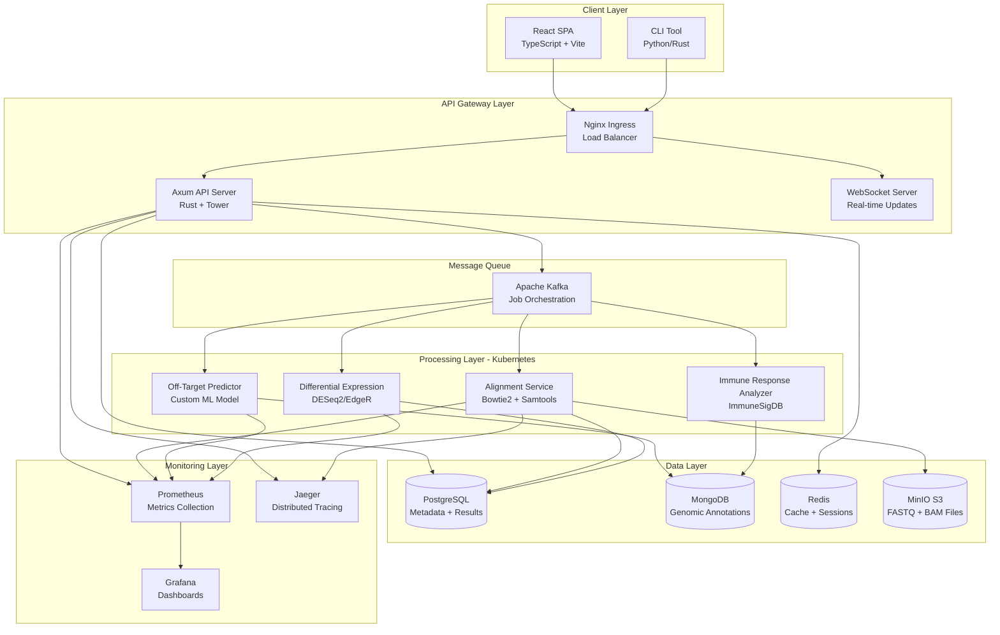

# CRISPR-Cas13 Pipeline - System Architecture

## Executive Summary

This document describes the complete microservices architecture for the CRISPR-Cas13 bioinformatics pipeline, designed to analyze off-target effects and immune responses from non-human primate gene editing experiments.

**Architecture Principles:**
- **Scalability**: Horizontal scaling with Kubernetes orchestration
- **Fault Tolerance**: Circuit breakers, retry policies, graceful degradation
- **Security**: Zero-trust architecture with OAuth2/JWT authentication
- **Maintainability**: Clean separation of concerns, comprehensive monitoring
- **Performance**: Distributed processing with Apache Kafka, Redis caching

## Table of Contents

1. [System Context](#1-system-context)
2. [Container Architecture](#2-container-architecture)
3. [Data Layer](#3-data-layer)
4. [Processing Layer](#4-processing-layer)
5. [API Layer](#5-api-layer)
6. [UI Layer](#6-ui-layer)
7. [Security & Authentication](#7-security--authentication)
8. [Monitoring & Observability](#8-monitoring--observability)
9. [Deployment Strategy](#9-deployment-strategy)
10. [Technology Stack](#10-technology-stack)
11. [Scalability & Performance](#11-scalability--performance)
12. [Trade-off Analysis](#12-trade-off-analysis)

---

## 1. System Context

### C4 Context Diagram

```
┌─────────────────────────────────────────────────────────────────────┐
│                         External Systems                             │
│  ┌──────────────┐  ┌──────────────┐  ┌──────────────┐             │
│  │   Research   │  │     NCBI     │  │   Ensembl    │             │
│  │     Team     │  │   Database   │  │   Genome     │             │
│  └──────┬───────┘  └──────┬───────┘  └──────┬───────┘             │
│         │                  │                  │                      │
└─────────┼──────────────────┼──────────────────┼──────────────────────┘
          │                  │                  │
          ▼                  ▼                  ▼
┌─────────────────────────────────────────────────────────────────────┐
│                 CRISPR-Cas13 Analysis Pipeline                       │
│                                                                       │
│  ┌─────────────────────────────────────────────────────────────┐   │
│  │                    Web Application                           │   │
│  │        (Experiment Setup, Monitoring, Visualization)         │   │
│  └─────────────────────────────────────────────────────────────┘   │
│                              │                                        │
│  ┌─────────────────────────────────────────────────────────────┐   │
│  │                    API Gateway (Axum)                        │   │
│  │           (Authentication, Rate Limiting, Routing)           │   │
│  └─────────────────────────────────────────────────────────────┘   │
│                              │                                        │
│  ┌───────────────────┬──────┴───────┬──────────────────────────┐   │
│  │                   │              │                          │   │
│  ▼                   ▼              ▼                          ▼   │
│ ┌────────┐     ┌──────────┐  ┌──────────┐            ┌─────────┐  │
│ │Alignment│     │Off-Target│  │  Diff    │            │  Data   │  │
│ │ Service │     │  Predict │  │  Expr    │            │ Storage │  │
│ │(Bowtie2)│     │  Service │  │ (DESeq2) │            │         │  │
│ └────────┘     └──────────┘  └──────────┘            └─────────┘  │
│                                                                       │
└───────────────────────────────────────────────────────────────────────┘
```

### System Users

1. **Research Scientists**: Design experiments, submit samples, analyze results
2. **Bioinformaticians**: Configure pipelines, validate results, export data
3. **System Administrators**: Monitor health, manage resources, configure deployments
4. **External Systems**: NCBI (reference genomes), Ensembl (annotations), institutional HPC clusters

### Key Requirements

- **Throughput**: Process 50-100 samples/day (200GB-1TB sequencing data)
- **Latency**: Real-time status updates (<1s), full pipeline completion (2-6 hours)
- **Availability**: 99.9% uptime during business hours
- **Security**: HIPAA-compliant data handling, role-based access control
- **Scalability**: Auto-scale processing nodes 1-50 based on queue depth

---

## 2. Container Architecture

### C4 Container Diagram



### Container Communication Patterns

| Source → Target | Protocol | Purpose | Security |
|----------------|----------|---------|----------|
| Web → API Gateway | HTTPS (TLS 1.3) | REST API calls | JWT Bearer Token |
| API Gateway → Services | HTTP/2 + gRPC | Service mesh | mTLS |
| Services → Kafka | TCP (SASL/SSL) | Job submission | API Key |
| Services → Databases | TCP (TLS) | Data persistence | Role-based credentials |
| Services → MinIO | HTTPS | Object storage | IAM access keys |
| Prometheus → Services | HTTP | Metrics scraping | Service account |

---

## 3. Data Layer

### 3.1 PostgreSQL - Relational Data

**Purpose**: Store structured metadata, experimental designs, analysis results, user accounts

**Schema Design**:

```sql
-- Database: crispr_cas13_pipeline

-- Users and Authentication
CREATE TABLE users (
    id UUID PRIMARY KEY DEFAULT gen_random_uuid(),
    email VARCHAR(255) UNIQUE NOT NULL,
    full_name VARCHAR(255) NOT NULL,
    password_hash VARCHAR(255) NOT NULL,
    role VARCHAR(50) NOT NULL DEFAULT 'researcher', -- researcher, bioinformatician, admin
    institution VARCHAR(255),
    created_at TIMESTAMPTZ DEFAULT NOW(),
    updated_at TIMESTAMPTZ DEFAULT NOW(),

    INDEX idx_email (email),
    INDEX idx_role (role)
);

-- Experiments
CREATE TABLE experiments (
    id UUID PRIMARY KEY DEFAULT gen_random_uuid(),
    user_id UUID NOT NULL REFERENCES users(id) ON DELETE CASCADE,
    name VARCHAR(255) NOT NULL,
    description TEXT,
    organism VARCHAR(100) DEFAULT 'Macaca mulatta', -- rhesus macaque
    target_gene VARCHAR(100),
    cas13_variant VARCHAR(50), -- Cas13a, Cas13b, Cas13d
    guide_rna_sequence TEXT NOT NULL,
    status VARCHAR(50) DEFAULT 'pending', -- pending, processing, completed, failed
    created_at TIMESTAMPTZ DEFAULT NOW(),
    completed_at TIMESTAMPTZ,

    INDEX idx_user_id (user_id),
    INDEX idx_status (status),
    INDEX idx_created_at (created_at)
);

-- Samples
CREATE TABLE samples (
    id UUID PRIMARY KEY DEFAULT gen_random_uuid(),
    experiment_id UUID NOT NULL REFERENCES experiments(id) ON DELETE CASCADE,
    sample_name VARCHAR(255) NOT NULL,
    sample_type VARCHAR(50), -- control, treatment, timepoint_0h, timepoint_24h
    fastq_r1_path TEXT NOT NULL,
    fastq_r2_path TEXT,
    sequencing_platform VARCHAR(100), -- Illumina NovaSeq 6000
    read_count BIGINT,
    quality_score FLOAT,
    created_at TIMESTAMPTZ DEFAULT NOW(),

    INDEX idx_experiment_id (experiment_id),
    INDEX idx_sample_type (sample_type),
    UNIQUE (experiment_id, sample_name)
);

-- Analysis Jobs
CREATE TABLE analysis_jobs (
    id UUID PRIMARY KEY DEFAULT gen_random_uuid(),
    experiment_id UUID NOT NULL REFERENCES experiments(id) ON DELETE CASCADE,
    job_type VARCHAR(50) NOT NULL, -- alignment, off_target, diff_expr, immune_response
    status VARCHAR(50) DEFAULT 'queued', -- queued, running, completed, failed
    priority INT DEFAULT 5, -- 1-10
    worker_pod VARCHAR(255), -- Kubernetes pod name
    started_at TIMESTAMPTZ,
    completed_at TIMESTAMPTZ,
    error_message TEXT,
    metrics JSONB, -- execution time, memory usage, etc.

    INDEX idx_experiment_id (experiment_id),
    INDEX idx_status (status),
    INDEX idx_priority (priority),
    INDEX idx_created_at (created_at)
);

-- Off-Target Predictions
CREATE TABLE off_targets (
    id UUID PRIMARY KEY DEFAULT gen_random_uuid(),
    job_id UUID NOT NULL REFERENCES analysis_jobs(id) ON DELETE CASCADE,
    chromosome VARCHAR(50) NOT NULL,
    position BIGINT NOT NULL,
    strand CHAR(1) CHECK (strand IN ('+', '-')),
    target_sequence TEXT NOT NULL,
    mismatch_count INT NOT NULL,
    cfd_score FLOAT, -- Cutting Frequency Determination score
    mit_score FLOAT, -- MIT specificity score
    gene_symbol VARCHAR(100),
    annotation TEXT,

    INDEX idx_job_id (job_id),
    INDEX idx_chromosome (chromosome),
    INDEX idx_mismatch_count (mismatch_count),
    INDEX idx_cfd_score (cfd_score)
);

-- Differential Expression Results
CREATE TABLE differential_expression (
    id UUID PRIMARY KEY DEFAULT gen_random_uuid(),
    job_id UUID NOT NULL REFERENCES analysis_jobs(id) ON DELETE CASCADE,
    gene_id VARCHAR(100) NOT NULL, -- Ensembl ID
    gene_symbol VARCHAR(100),
    base_mean FLOAT,
    log2_fold_change FLOAT NOT NULL,
    lfcse FLOAT, -- log2 fold change standard error
    pvalue FLOAT NOT NULL,
    padj FLOAT, -- adjusted p-value (Benjamini-Hochberg)
    significant BOOLEAN GENERATED ALWAYS AS (padj < 0.05) STORED,

    INDEX idx_job_id (job_id),
    INDEX idx_gene_symbol (gene_symbol),
    INDEX idx_padj (padj),
    INDEX idx_significant (significant)
);

-- Immune Response Signatures
CREATE TABLE immune_signatures (
    id UUID PRIMARY KEY DEFAULT gen_random_uuid(),
    job_id UUID NOT NULL REFERENCES analysis_jobs(id) ON DELETE CASCADE,
    signature_name VARCHAR(255) NOT NULL, -- e.g., "Interferon Response"
    signature_source VARCHAR(100), -- ImmuneSigDB, MSigDB
    enrichment_score FLOAT NOT NULL,
    normalized_enrichment_score FLOAT,
    pvalue FLOAT NOT NULL,
    fdr FLOAT, -- false discovery rate
    leading_edge_genes TEXT[], -- array of gene symbols

    INDEX idx_job_id (job_id),
    INDEX idx_signature_name (signature_name),
    INDEX idx_fdr (fdr)
);

-- Audit Log
CREATE TABLE audit_log (
    id BIGSERIAL PRIMARY KEY,
    user_id UUID REFERENCES users(id) ON DELETE SET NULL,
    action VARCHAR(100) NOT NULL, -- login, create_experiment, submit_job, download_results
    resource_type VARCHAR(100),
    resource_id UUID,
    ip_address INET,
    user_agent TEXT,
    metadata JSONB,
    created_at TIMESTAMPTZ DEFAULT NOW(),

    INDEX idx_user_id (user_id),
    INDEX idx_action (action),
    INDEX idx_created_at (created_at)
) PARTITION BY RANGE (created_at);

-- Create monthly partitions for audit log
CREATE TABLE audit_log_2025_01 PARTITION OF audit_log
    FOR VALUES FROM ('2025-01-01') TO ('2025-02-01');
```

**Connection Pooling** (via `sqlx` in Rust):
```toml
[database]
max_connections = 100
min_connections = 10
connection_timeout = 30s
idle_timeout = 10m
max_lifetime = 30m
```

**Migration Strategy**:
- Use `sqlx-cli` for schema migrations
- Versioned migrations in `migrations/` directory
- Blue-green deployment for zero-downtime updates
- Automated rollback on migration failure

---

### 3.2 MongoDB - Genomic Annotations

**Purpose**: Store flexible, document-based genomic annotations, gene ontology terms, and analysis metadata

**Collections**:

1. **genes** - Gene annotations from Ensembl
2. **transcripts** - Transcript variants
3. **immune_signatures** - ImmuneSigDB reference data
4. **go_terms** - Gene Ontology annotations
5. **analysis_cache** - Cached intermediate results

**Example Document** (genes collection):

```json
{
  "_id": ObjectId("..."),
  "ensembl_id": "ENSMMUG00000012345",
  "gene_symbol": "IFNB1",
  "description": "interferon beta 1",
  "chromosome": "chr9",
  "start": 21077035,
  "end": 21078018,
  "strand": "+",
  "biotype": "protein_coding",
  "species": "Macaca_mulatta",
  "transcripts": [
    {
      "transcript_id": "ENSMMUT00000012345",
      "biotype": "protein_coding",
      "length": 1783,
      "exons": [
        {"start": 21077035, "end": 21077248, "number": 1},
        {"start": 21077790, "end": 21078018, "number": 2}
      ]
    }
  ],
  "go_terms": [
    {"id": "GO:0051607", "term": "defense response to virus", "evidence": "IDA"},
    {"id": "GO:0045071", "term": "negative regulation of viral genome replication", "evidence": "IMP"}
  ],
  "orthologs": {
    "human": "ENSG00000171855",
    "mouse": "ENSMUSG00000048806"
  },
  "indexed_at": ISODate("2025-01-15T10:30:00Z")
}
```

**Sharding Strategy**:
- **Shard Key**: `chromosome` (distributes data evenly across 24 shards: chr1-chr22, chrX, chrY)
- **Config**: 3 replica sets × 3 shards = 9 nodes minimum
- **Indexes**:
  - `{gene_symbol: 1}` - Fast gene lookups
  - `{chromosome: 1, start: 1, end: 1}` - Range queries for genomic regions
  - `{go_terms.id: 1}` - Gene Ontology searches

---

### 3.3 Redis - Caching & Job Queues

**Purpose**: High-performance caching, session management, real-time job status

**Use Cases**:

1. **Session Storage** (TTL: 24 hours)
```redis
SET session:a1b2c3d4 "{\"user_id\": \"uuid\", \"role\": \"researcher\"}" EX 86400
```

2. **Job Status Cache** (TTL: 1 hour after completion)
```redis
HSET job:uuid status "running"
HSET job:uuid progress "45.2"
HSET job:uuid worker_pod "align-worker-7f8d9"
EXPIRE job:uuid 3600
```

3. **API Rate Limiting** (sliding window)
```redis
ZADD rate_limit:user:uuid timestamp1 timestamp2 timestamp3
ZREMRANGEBYSCORE rate_limit:user:uuid 0 (timestamp-3600)
ZCARD rate_limit:user:uuid  # count requests in last hour
```

4. **Cached Query Results** (TTL: 10 minutes)
```redis
SET cache:experiments:user:uuid "[{...}, {...}]" EX 600
```

**Cluster Configuration**:
- **Mode**: Redis Cluster (6 nodes: 3 masters + 3 replicas)
- **Persistence**: AOF (Append-Only File) + RDB snapshots every 5 minutes
- **Eviction Policy**: `allkeys-lru` (least recently used)
- **Max Memory**: 16GB per node

---

### 3.4 MinIO (S3-Compatible Object Storage)

**Purpose**: Store large sequencing files (FASTQ, BAM, VCF) and analysis artifacts

**Bucket Structure**:

```
crispr-cas13/
├── raw-data/
│   ├── {experiment_id}/
│   │   ├── {sample_id}_R1.fastq.gz
│   │   └── {sample_id}_R2.fastq.gz
├── aligned/
│   ├── {experiment_id}/
│   │   ├── {sample_id}.bam
│   │   └── {sample_id}.bam.bai
├── results/
│   ├── {job_id}/
│   │   ├── off_targets.csv
│   │   ├── diff_expr.csv
│   │   └── immune_signatures.json
└── reports/
    └── {experiment_id}/
        ├── qc_report.html
        └── final_report.pdf
```

**Lifecycle Policies**:
- **raw-data**: Retain for 180 days, then transition to Glacier
- **aligned**: Retain for 90 days, then delete (can regenerate)
- **results**: Retain indefinitely
- **reports**: Retain for 365 days

**Data Integrity**:
- MD5 checksums for all uploads
- Versioning enabled on all buckets
- Replication to secondary datacenter (disaster recovery)

**Access Control**:
- IAM policies per service (principle of least privilege)
- Pre-signed URLs for temporary file access (TTL: 1 hour)
- Server-side encryption (SSE-S3) for all objects

---

## 4. Processing Layer

### 4.1 Kubernetes Cluster Architecture

**Cluster Specifications**:
- **Nodes**: 10-50 worker nodes (auto-scaling)
  - **CPU-optimized**: 16 vCPU, 32GB RAM (alignment, off-target prediction)
  - **Memory-optimized**: 8 vCPU, 64GB RAM (differential expression, R/Bioconductor)
- **Namespaces**:
  - `crispr-production` - Production workloads
  - `crispr-staging` - Pre-production testing
  - `crispr-dev` - Development experiments
  - `monitoring` - Prometheus, Grafana, Jaeger
  - `kafka` - Message queue infrastructure

**Node Affinity Labels**:
```yaml
node-role: compute-intensive  # for alignment, off-target prediction
node-role: memory-intensive    # for DESeq2, R workloads
node-role: gpu-enabled         # future ML model inference
```

---

### 4.2 Microservice Containers

#### 4.2.1 Alignment Service (Bowtie2)

**Responsibilities**:
- Align FASTQ reads to reference genome
- Quality control (FastQC, MultiQC)
- BAM sorting and indexing (Samtools)

**Technology Stack**:
- **Base Image**: `ubuntu:22.04` with Bioconda
- **Tools**: Bowtie2 2.5.1, Samtools 1.17, FastQC 0.12.1
- **Language**: Python 3.11 (orchestration scripts)

**Resource Limits**:
```yaml
resources:
  requests:
    cpu: "4"
    memory: "16Gi"
  limits:
    cpu: "8"
    memory: "32Gi"
```

**Dockerfile** (see `docker/alignment-service/Dockerfile`):
```dockerfile
FROM ubuntu:22.04

# Install Bioconda and tools
RUN apt-get update && apt-get install -y \
    wget curl git build-essential python3.11 python3-pip

# Install Miniconda
RUN wget https://repo.anaconda.com/miniconda/Miniconda3-latest-Linux-x86_64.sh && \
    bash Miniconda3-latest-Linux-x86_64.sh -b -p /opt/conda && \
    rm Miniconda3-latest-Linux-x86_64.sh

ENV PATH="/opt/conda/bin:$PATH"

# Install bioinformatics tools
RUN conda install -c bioconda bowtie2=2.5.1 samtools=1.17 fastqc=0.12.1 -y

# Install Python dependencies
COPY requirements.txt /app/
RUN pip3 install -r /app/requirements.txt

COPY alignment_worker.py /app/
WORKDIR /app

CMD ["python3", "alignment_worker.py"]
```

**Python Worker** (alignment_worker.py):
```python
import os
import subprocess
from kafka import KafkaConsumer, KafkaProducer
import boto3
import logging

logging.basicConfig(level=logging.INFO)
logger = logging.getLogger(__name__)

def align_sample(sample_id, fastq_r1_s3, fastq_r2_s3, reference_genome):
    """
    Download FASTQ from MinIO, align with Bowtie2, upload BAM to MinIO
    """
    s3 = boto3.client('s3', endpoint_url=os.getenv('MINIO_ENDPOINT'))

    # Download FASTQ files
    logger.info(f"Downloading {fastq_r1_s3} and {fastq_r2_s3}")
    s3.download_file('crispr-cas13', fastq_r1_s3, f'/tmp/{sample_id}_R1.fastq.gz')
    s3.download_file('crispr-cas13', fastq_r2_s3, f'/tmp/{sample_id}_R2.fastq.gz')

    # Run Bowtie2 alignment
    logger.info(f"Aligning sample {sample_id}")
    cmd = [
        'bowtie2',
        '-x', reference_genome,
        '-1', f'/tmp/{sample_id}_R1.fastq.gz',
        '-2', f'/tmp/{sample_id}_R2.fastq.gz',
        '-p', '8',  # threads
        '--very-sensitive',
        '-S', f'/tmp/{sample_id}.sam'
    ]
    subprocess.run(cmd, check=True)

    # Convert SAM to BAM, sort, and index
    logger.info("Converting SAM to BAM")
    subprocess.run(['samtools', 'view', '-bS', f'/tmp/{sample_id}.sam', '-o', f'/tmp/{sample_id}.bam'], check=True)
    subprocess.run(['samtools', 'sort', f'/tmp/{sample_id}.bam', '-o', f'/tmp/{sample_id}.sorted.bam'], check=True)
    subprocess.run(['samtools', 'index', f'/tmp/{sample_id}.sorted.bam'], check=True)

    # Upload BAM to MinIO
    logger.info("Uploading BAM to MinIO")
    s3.upload_file(f'/tmp/{sample_id}.sorted.bam', 'crispr-cas13', f'aligned/{sample_id}/{sample_id}.bam')
    s3.upload_file(f'/tmp/{sample_id}.sorted.bam.bai', 'crispr-cas13', f'aligned/{sample_id}/{sample_id}.bam.bai')

    # Cleanup
    os.remove(f'/tmp/{sample_id}_R1.fastq.gz')
    os.remove(f'/tmp/{sample_id}_R2.fastq.gz')
    os.remove(f'/tmp/{sample_id}.sam')
    os.remove(f'/tmp/{sample_id}.bam')

    return f's3://crispr-cas13/aligned/{sample_id}/{sample_id}.bam'

def main():
    consumer = KafkaConsumer(
        'jobs.alignment',
        bootstrap_servers=os.getenv('KAFKA_BROKERS'),
        group_id='alignment-workers'
    )

    producer = KafkaProducer(bootstrap_servers=os.getenv('KAFKA_BROKERS'))

    for message in consumer:
        job = json.loads(message.value)
        logger.info(f"Processing alignment job {job['job_id']}")

        try:
            bam_path = align_sample(
                job['sample_id'],
                job['fastq_r1_s3'],
                job['fastq_r2_s3'],
                job['reference_genome']
            )

            # Send completion message
            producer.send('jobs.completed', json.dumps({
                'job_id': job['job_id'],
                'status': 'completed',
                'bam_path': bam_path
            }).encode())

        except Exception as e:
            logger.error(f"Alignment failed: {e}")
            producer.send('jobs.failed', json.dumps({
                'job_id': job['job_id'],
                'error': str(e)
            }).encode())

if __name__ == '__main__':
    main()
```

---

#### 4.2.2 Off-Target Prediction Service

**Responsibilities**:
- Extract guide RNA sequences from BAM files
- Predict off-target sites using custom ML model
- Score off-targets with CFD and MIT algorithms

**Technology Stack**:
- **Base Image**: `python:3.11-slim`
- **ML Framework**: PyTorch 2.1 (pre-trained transformer model)
- **Libraries**: Biopython, NumPy, Pandas

**Resource Limits**:
```yaml
resources:
  requests:
    cpu: "2"
    memory: "8Gi"
  limits:
    cpu: "4"
    memory: "16Gi"
```

**Dockerfile** (see `docker/off-target-service/Dockerfile`):
```dockerfile
FROM python:3.11-slim

RUN apt-get update && apt-get install -y \
    build-essential libssl-dev

COPY requirements.txt /app/
RUN pip install --no-cache-dir -r /app/requirements.txt

COPY off_target_worker.py /app/
COPY models/ /app/models/

WORKDIR /app
CMD ["python", "off_target_worker.py"]
```

**Python Worker** (off_target_worker.py):
```python
import torch
from transformers import AutoModelForSequenceClassification, AutoTokenizer
import pysam
from kafka import KafkaConsumer, KafkaProducer
import logging

logger = logging.getLogger(__name__)

class OffTargetPredictor:
    def __init__(self, model_path='/app/models/cas13_off_target.pt'):
        self.device = torch.device('cuda' if torch.cuda.is_available() else 'cpu')
        self.model = AutoModelForSequenceClassification.from_pretrained(model_path).to(self.device)
        self.tokenizer = AutoTokenizer.from_pretrained(model_path)

    def predict_off_targets(self, guide_rna, bam_path, genome_fasta):
        """
        Scan genome for potential off-target sites
        """
        off_targets = []

        # Open BAM file and extract aligned reads
        bamfile = pysam.AlignmentFile(bam_path, "rb")

        # Scan for sequences with mismatches to guide RNA
        for read in bamfile.fetch():
            if read.is_unmapped:
                continue

            seq = read.query_sequence
            mismatches = self.count_mismatches(guide_rna, seq)

            if 1 <= mismatches <= 4:  # Potential off-target (1-4 mismatches)
                # Score with ML model
                cfd_score = self.calculate_cfd_score(guide_rna, seq)
                mit_score = self.calculate_mit_score(guide_rna, seq)

                off_targets.append({
                    'chromosome': bamfile.get_reference_name(read.reference_id),
                    'position': read.reference_start,
                    'strand': '+' if not read.is_reverse else '-',
                    'target_sequence': seq,
                    'mismatch_count': mismatches,
                    'cfd_score': cfd_score,
                    'mit_score': mit_score
                })

        bamfile.close()
        return off_targets

    def count_mismatches(self, seq1, seq2):
        # Implementation details...
        pass

    def calculate_cfd_score(self, guide, target):
        # Cutting Frequency Determination score
        # Implementation based on Doench et al. 2016
        pass

    def calculate_mit_score(self, guide, target):
        # MIT specificity score
        # Implementation based on Hsu et al. 2013
        pass

def main():
    predictor = OffTargetPredictor()

    consumer = KafkaConsumer(
        'jobs.off_target',
        bootstrap_servers=os.getenv('KAFKA_BROKERS'),
        group_id='off-target-workers'
    )

    producer = KafkaProducer(bootstrap_servers=os.getenv('KAFKA_BROKERS'))

    for message in consumer:
        job = json.loads(message.value)
        logger.info(f"Processing off-target job {job['job_id']}")

        try:
            off_targets = predictor.predict_off_targets(
                job['guide_rna'],
                job['bam_path'],
                job['genome_fasta']
            )

            # Store in MongoDB and PostgreSQL
            # ... (implementation)

            producer.send('jobs.completed', json.dumps({
                'job_id': job['job_id'],
                'off_target_count': len(off_targets)
            }).encode())

        except Exception as e:
            logger.error(f"Off-target prediction failed: {e}")
            producer.send('jobs.failed', json.dumps({
                'job_id': job['job_id'],
                'error': str(e)
            }).encode())

if __name__ == '__main__':
    main()
```

---

#### 4.2.3 Differential Expression Service (DESeq2/EdgeR)

**Responsibilities**:
- Count gene expression from BAM files (featureCounts)
- Perform differential expression analysis (DESeq2 or EdgeR)
- Generate visualizations (MA plots, volcano plots, heatmaps)

**Technology Stack**:
- **Base Image**: `bioconductor/bioconductor_docker:RELEASE_3_18`
- **R Packages**: DESeq2 1.42, edgeR 3.44, ggplot2 3.4
- **Language**: R 4.3 with Rserve for API integration

**Resource Limits**:
```yaml
resources:
  requests:
    cpu: "4"
    memory: "32Gi"  # R requires significant memory
  limits:
    cpu: "8"
    memory: "64Gi"
```

**Dockerfile** (see `docker/diff-expr-service/Dockerfile`):
```dockerfile
FROM bioconductor/bioconductor_docker:RELEASE_3_18

RUN R -e "BiocManager::install(c('DESeq2', 'edgeR', 'Rsubread', 'ggplot2', 'pheatmap', 'EnhancedVolcano'))"

COPY diff_expr_worker.R /app/
WORKDIR /app

CMD ["Rscript", "diff_expr_worker.R"]
```

**R Worker** (diff_expr_worker.R):
```r
library(DESeq2)
library(edgeR)
library(Rsubread)
library(ggplot2)

# Kafka consumer setup (using rkafka package)
library(rkafka)

consumer <- rkafka.createConsumer(
  list("metadata.broker.list" = Sys.getenv("KAFKA_BROKERS"))
)

while (TRUE) {
  message <- rkafka.consume(consumer, "jobs.diff_expr")

  if (!is.null(message)) {
    job <- jsonlite::fromJSON(message$payload)

    tryCatch({
      # Step 1: Count reads with featureCounts
      bam_files <- job$bam_files
      gtf_file <- job$gtf_annotation

      counts <- featureCounts(
        files = bam_files,
        annot.ext = gtf_file,
        isGTFAnnotationFile = TRUE,
        GTF.featureType = "exon",
        GTF.attrType = "gene_id",
        nthreads = 8
      )

      # Step 2: Create DESeqDataSet
      col_data <- data.frame(
        condition = job$conditions,  # e.g., c("control", "control", "treatment", "treatment")
        row.names = job$sample_names
      )

      dds <- DESeqDataSetFromMatrix(
        countData = counts$counts,
        colData = col_data,
        design = ~ condition
      )

      # Step 3: Run differential expression analysis
      dds <- DESeq(dds)
      res <- results(dds, contrast = c("condition", "treatment", "control"))

      # Step 4: Extract significant genes
      res_df <- as.data.frame(res)
      res_df$gene_id <- rownames(res_df)
      sig_genes <- res_df[res_df$padj < 0.05 & !is.na(res_df$padj), ]

      # Step 5: Generate plots
      pdf(paste0("/tmp/", job$job_id, "_plots.pdf"))

      # MA plot
      plotMA(res, main = "MA Plot")

      # Volcano plot
      EnhancedVolcano::EnhancedVolcano(
        res_df,
        lab = res_df$gene_id,
        x = 'log2FoldChange',
        y = 'padj'
      )

      # Heatmap of top 50 genes
      top_genes <- head(sig_genes[order(sig_genes$padj), ], 50)
      pheatmap::pheatmap(
        assay(dds)[rownames(top_genes), ],
        cluster_rows = TRUE,
        cluster_cols = TRUE,
        show_rownames = TRUE
      )

      dev.off()

      # Step 6: Upload results to PostgreSQL and MinIO
      # ... (implementation)

      # Send completion message
      rkafka.produce(
        producer,
        "jobs.completed",
        jsonlite::toJSON(list(
          job_id = job$job_id,
          significant_genes = nrow(sig_genes)
        ))
      )

    }, error = function(e) {
      rkafka.produce(
        producer,
        "jobs.failed",
        jsonlite::toJSON(list(
          job_id = job$job_id,
          error = as.character(e)
        ))
      )
    })
  }

  Sys.sleep(5)  # Poll every 5 seconds
}
```

---

### 4.3 Apache Kafka - Message Queue

**Purpose**: Decouple API layer from processing layer, enable fault-tolerant job orchestration

**Topics**:

| Topic | Partitions | Replication | Purpose |
|-------|------------|-------------|---------|
| `jobs.submitted` | 10 | 3 | New analysis jobs from API |
| `jobs.alignment` | 10 | 3 | Alignment tasks |
| `jobs.off_target` | 10 | 3 | Off-target prediction tasks |
| `jobs.diff_expr` | 5 | 3 | Differential expression tasks |
| `jobs.immune` | 5 | 3 | Immune response analysis tasks |
| `jobs.completed` | 10 | 3 | Successfully completed jobs |
| `jobs.failed` | 5 | 3 | Failed jobs for retry/alerting |
| `jobs.progress` | 10 | 3 | Real-time progress updates |

**Producer Configuration** (Rust API):
```rust
use rdkafka::producer::{FutureProducer, FutureRecord};
use rdkafka::config::ClientConfig;

let producer: FutureProducer = ClientConfig::new()
    .set("bootstrap.servers", "kafka-broker-1:9092,kafka-broker-2:9092,kafka-broker-3:9092")
    .set("message.timeout.ms", "5000")
    .set("acks", "all")  // Wait for all in-sync replicas
    .set("retries", "3")
    .create()
    .expect("Producer creation error");

// Produce message
let payload = serde_json::to_string(&job)?;
producer
    .send(
        FutureRecord::to("jobs.alignment")
            .payload(&payload)
            .key(&job.job_id),
        Duration::from_secs(0),
    )
    .await?;
```

**Consumer Configuration** (Python workers):
```python
from kafka import KafkaConsumer

consumer = KafkaConsumer(
    'jobs.alignment',
    bootstrap_servers=['kafka-broker-1:9092', 'kafka-broker-2:9092', 'kafka-broker-3:9092'],
    group_id='alignment-workers',
    auto_offset_reset='earliest',
    enable_auto_commit=True,
    max_poll_records=10,
    session_timeout_ms=30000,
    heartbeat_interval_ms=10000
)
```

**Monitoring**:
- Consumer lag alerts (Prometheus + Grafana)
- Throughput metrics (messages/sec per topic)
- Partition rebalancing events

---

### 4.4 Horizontal Scaling Strategy

**Auto-Scaling Policies** (Kubernetes HPA):

```yaml
apiVersion: autoscaling/v2
kind: HorizontalPodAutoscaler
metadata:
  name: alignment-service-hpa
  namespace: crispr-production
spec:
  scaleTargetRef:
    apiVersion: apps/v1
    kind: Deployment
    name: alignment-service
  minReplicas: 2
  maxReplicas: 20
  metrics:
  - type: Resource
    resource:
      name: cpu
      target:
        type: Utilization
        averageUtilization: 70
  - type: Resource
    resource:
      name: memory
      target:
        type: Utilization
        averageUtilization: 80
  - type: External
    external:
      metric:
        name: kafka_consumer_lag
        selector:
          matchLabels:
            topic: jobs.alignment
      target:
        type: Value
        value: "100"  # Scale up if lag > 100 messages
  behavior:
    scaleUp:
      stabilizationWindowSeconds: 60
      policies:
      - type: Percent
        value: 100  # Double pods
        periodSeconds: 60
    scaleDown:
      stabilizationWindowSeconds: 300
      policies:
      - type: Percent
        value: 50  # Reduce by half
        periodSeconds: 60
```

---

## 5. API Layer

### 5.1 Axum (Rust) RESTful API

**Why Rust + Axum?**
- **Performance**: ~10x faster than Node.js for I/O-bound operations
- **Memory Safety**: No null pointers, data races, or buffer overflows
- **Concurrency**: Tokio async runtime for efficient request handling
- **Type Safety**: Compile-time guarantees for API contracts

**Project Structure**:
```
api/
├── src/
│   ├── main.rs              # Entry point, server setup
│   ├── routes/
│   │   ├── mod.rs
│   │   ├── auth.rs          # POST /api/v1/auth/login, /logout
│   │   ├── experiments.rs   # CRUD for experiments
│   │   ├── samples.rs       # Upload FASTQ files
│   │   ├── jobs.rs          # Submit and monitor jobs
│   │   └── results.rs       # Query analysis results
│   ├── models/
│   │   ├── mod.rs
│   │   ├── user.rs
│   │   ├── experiment.rs
│   │   ├── sample.rs
│   │   └── job.rs
│   ├── middleware/
│   │   ├── auth.rs          # JWT validation
│   │   ├── rate_limit.rs    # Redis-backed rate limiting
│   │   └── logging.rs       # Structured logging
│   ├── services/
│   │   ├── database.rs      # PostgreSQL connection pool
│   │   ├── kafka.rs         # Kafka producer
│   │   ├── storage.rs       # MinIO S3 client
│   │   └── cache.rs         # Redis client
│   └── error.rs             # Custom error types
├── Cargo.toml
└── Dockerfile
```

**Main Server** (src/main.rs):
```rust
use axum::{
    Router,
    routing::{get, post},
    middleware,
    Extension,
};
use tower::ServiceBuilder;
use tower_http::trace::TraceLayer;
use sqlx::PgPool;
use std::net::SocketAddr;

mod routes;
mod models;
mod middleware as mw;
mod services;
mod error;

#[tokio::main]
async fn main() {
    // Initialize tracing
    tracing_subscriber::fmt::init();

    // Database connection pool
    let db_pool = PgPool::connect(&std::env::var("DATABASE_URL").unwrap())
        .await
        .expect("Failed to connect to database");

    // Redis client
    let redis_client = redis::Client::open(std::env::var("REDIS_URL").unwrap())
        .expect("Failed to connect to Redis");

    // Kafka producer
    let kafka_producer = services::kafka::create_producer();

    // Build API router
    let app = Router::new()
        // Health check
        .route("/health", get(health_check))

        // API v1 routes
        .nest("/api/v1", api_v1_routes())

        // Middleware layers
        .layer(
            ServiceBuilder::new()
                .layer(TraceLayer::new_for_http())
                .layer(middleware::from_fn(mw::logging::log_requests))
                .layer(Extension(db_pool))
                .layer(Extension(redis_client))
                .layer(Extension(kafka_producer))
        );

    // Start server
    let addr = SocketAddr::from(([0, 0, 0, 0], 3000));
    tracing::info!("Listening on {}", addr);

    axum::Server::bind(&addr)
        .serve(app.into_make_service())
        .await
        .unwrap();
}

fn api_v1_routes() -> Router {
    Router::new()
        .nest("/auth", routes::auth::routes())
        .nest("/experiments", routes::experiments::routes())
        .nest("/samples", routes::samples::routes())
        .nest("/jobs", routes::jobs::routes())
        .nest("/results", routes::results::routes())
}

async fn health_check() -> &'static str {
    "OK"
}
```

**Authentication Route** (src/routes/auth.rs):
```rust
use axum::{Router, Json, routing::post, Extension};
use serde::{Deserialize, Serialize};
use sqlx::PgPool;
use jsonwebtoken::{encode, EncodingKey, Header};
use bcrypt::verify;

pub fn routes() -> Router {
    Router::new()
        .route("/login", post(login))
        .route("/refresh", post(refresh_token))
}

#[derive(Deserialize)]
struct LoginRequest {
    email: String,
    password: String,
}

#[derive(Serialize)]
struct LoginResponse {
    token: String,
    refresh_token: String,
    user: UserInfo,
}

#[derive(Serialize)]
struct UserInfo {
    id: String,
    email: String,
    full_name: String,
    role: String,
}

async fn login(
    Extension(pool): Extension<PgPool>,
    Json(payload): Json<LoginRequest>,
) -> Result<Json<LoginResponse>, error::ApiError> {
    // Query user from database
    let user = sqlx::query!(
        "SELECT id, email, full_name, password_hash, role FROM users WHERE email = $1",
        payload.email
    )
    .fetch_optional(&pool)
    .await?
    .ok_or(error::ApiError::Unauthorized("Invalid credentials".to_string()))?;

    // Verify password
    let password_valid = verify(&payload.password, &user.password_hash)?;
    if !password_valid {
        return Err(error::ApiError::Unauthorized("Invalid credentials".to_string()));
    }

    // Generate JWT token
    let claims = Claims {
        sub: user.id.to_string(),
        email: user.email.clone(),
        role: user.role.clone(),
        exp: (chrono::Utc::now() + chrono::Duration::hours(24)).timestamp() as usize,
    };

    let token = encode(
        &Header::default(),
        &claims,
        &EncodingKey::from_secret(std::env::var("JWT_SECRET").unwrap().as_bytes()),
    )?;

    // Generate refresh token (valid for 7 days)
    let refresh_claims = Claims {
        sub: user.id.to_string(),
        email: user.email.clone(),
        role: user.role.clone(),
        exp: (chrono::Utc::now() + chrono::Duration::days(7)).timestamp() as usize,
    };

    let refresh_token = encode(
        &Header::default(),
        &refresh_claims,
        &EncodingKey::from_secret(std::env::var("JWT_SECRET").unwrap().as_bytes()),
    )?;

    // Log audit event
    sqlx::query!(
        "INSERT INTO audit_log (user_id, action, ip_address) VALUES ($1, $2, $3)",
        user.id,
        "login",
        // Extract IP from request context
    )
    .execute(&pool)
    .await?;

    Ok(Json(LoginResponse {
        token,
        refresh_token,
        user: UserInfo {
            id: user.id.to_string(),
            email: user.email,
            full_name: user.full_name,
            role: user.role,
        },
    }))
}

#[derive(Serialize, Deserialize)]
struct Claims {
    sub: String,  // user ID
    email: String,
    role: String,
    exp: usize,   // expiration timestamp
}

async fn refresh_token(
    // Implementation for refreshing JWT tokens
) -> Result<Json<LoginResponse>, error::ApiError> {
    // ... (similar to login, but validates refresh token)
    todo!()
}
```

**Job Submission Route** (src/routes/jobs.rs):
```rust
use axum::{Router, Json, routing::{post, get}, Extension};
use serde::{Deserialize, Serialize};
use sqlx::PgPool;
use rdkafka::producer::FutureProducer;
use uuid::Uuid;

pub fn routes() -> Router {
    Router::new()
        .route("/", post(submit_job))
        .route("/:job_id", get(get_job_status))
}

#[derive(Deserialize)]
struct SubmitJobRequest {
    experiment_id: String,
    job_type: String,  // alignment, off_target, diff_expr
    parameters: serde_json::Value,
}

#[derive(Serialize)]
struct SubmitJobResponse {
    job_id: String,
    status: String,
    message: String,
}

async fn submit_job(
    Extension(pool): Extension<PgPool>,
    Extension(producer): Extension<FutureProducer>,
    // Extract authenticated user from middleware
    Json(payload): Json<SubmitJobRequest>,
) -> Result<Json<SubmitJobResponse>, error::ApiError> {
    let job_id = Uuid::new_v4();

    // Insert job record into database
    sqlx::query!(
        "INSERT INTO analysis_jobs (id, experiment_id, job_type, status) VALUES ($1, $2, $3, $4)",
        job_id,
        Uuid::parse_str(&payload.experiment_id)?,
        payload.job_type,
        "queued"
    )
    .execute(&pool)
    .await?;

    // Publish job to Kafka
    let topic = match payload.job_type.as_str() {
        "alignment" => "jobs.alignment",
        "off_target" => "jobs.off_target",
        "diff_expr" => "jobs.diff_expr",
        _ => return Err(error::ApiError::BadRequest("Invalid job type".to_string())),
    };

    let job_message = serde_json::json!({
        "job_id": job_id.to_string(),
        "experiment_id": payload.experiment_id,
        "parameters": payload.parameters,
    });

    producer
        .send(
            FutureRecord::to(topic)
                .payload(&serde_json::to_string(&job_message)?)
                .key(&job_id.to_string()),
            Duration::from_secs(5),
        )
        .await
        .map_err(|e| error::ApiError::Internal(format!("Kafka error: {:?}", e)))?;

    Ok(Json(SubmitJobResponse {
        job_id: job_id.to_string(),
        status: "queued".to_string(),
        message: format!("Job {} submitted successfully", job_id),
    }))
}

async fn get_job_status(
    Extension(pool): Extension<PgPool>,
    axum::extract::Path(job_id): axum::extract::Path<String>,
) -> Result<Json<JobStatus>, error::ApiError> {
    let job = sqlx::query_as!(
        JobStatus,
        "SELECT id, status, started_at, completed_at, error_message FROM analysis_jobs WHERE id = $1",
        Uuid::parse_str(&job_id)?
    )
    .fetch_optional(&pool)
    .await?
    .ok_or(error::ApiError::NotFound("Job not found".to_string()))?;

    Ok(Json(job))
}

#[derive(Serialize)]
struct JobStatus {
    id: Uuid,
    status: String,
    started_at: Option<chrono::DateTime<chrono::Utc>>,
    completed_at: Option<chrono::DateTime<chrono::Utc>>,
    error_message: Option<String>,
}
```

---

### 5.2 API Versioning Strategy

**Approach**: URL path versioning (`/api/v1`, `/api/v2`)

**Version Support Policy**:
- **v1**: Current stable version (launched 2025-Q1)
- **v2**: Next major version (planned 2025-Q3)
- **Deprecation**: v1 will be deprecated 12 months after v2 launch
- **Sunset**: v1 will be removed 6 months after deprecation notice

**Backward Compatibility**:
- Additive changes only (new fields, new endpoints)
- Breaking changes trigger new major version
- Clients specify version in `Accept` header: `application/vnd.crispr.v1+json`

---

### 5.3 Rate Limiting

**Implementation**: Redis sliding window algorithm

```rust
// src/middleware/rate_limit.rs
use axum::{middleware::Next, http::{Request, StatusCode}, response::Response};
use redis::AsyncCommands;

pub async fn rate_limit_middleware<B>(
    Extension(redis): Extension<redis::Client>,
    request: Request<B>,
    next: Next<B>,
) -> Result<Response, StatusCode> {
    let user_id = extract_user_id(&request)?;  // From JWT
    let key = format!("rate_limit:{}:{}", user_id, get_current_minute());

    let mut conn = redis.get_async_connection().await
        .map_err(|_| StatusCode::INTERNAL_SERVER_ERROR)?;

    // Increment request count
    let count: u32 = conn.incr(&key, 1).await
        .map_err(|_| StatusCode::INTERNAL_SERVER_ERROR)?;

    // Set expiry on first request
    if count == 1 {
        conn.expire(&key, 60).await
            .map_err(|_| StatusCode::INTERNAL_SERVER_ERROR)?;
    }

    // Check limit (100 requests per minute for standard users)
    let limit = get_user_rate_limit(&user_id);
    if count > limit {
        return Err(StatusCode::TOO_MANY_REQUESTS);
    }

    Ok(next.run(request).await)
}

fn get_user_rate_limit(user_id: &str) -> u32 {
    // Query user role from database/cache
    // admin: 1000, researcher: 100, guest: 10
    100
}
```

**Rate Limits**:
- **Admin**: 1000 requests/minute
- **Researcher**: 100 requests/minute
- **Guest**: 10 requests/minute

---

### 5.4 WebSocket Support (Real-Time Updates)

**Purpose**: Push job progress updates to UI in real-time

**Implementation** (using `axum::extract::ws`):

```rust
use axum::{
    extract::ws::{WebSocket, WebSocketUpgrade, Message},
    response::Response,
    Extension,
};
use tokio::sync::broadcast;

pub async fn websocket_handler(
    ws: WebSocketUpgrade,
    Extension(tx): Extension<broadcast::Sender<String>>,
) -> Response {
    ws.on_upgrade(|socket| handle_socket(socket, tx))
}

async fn handle_socket(mut socket: WebSocket, tx: broadcast::Sender<String>) {
    let mut rx = tx.subscribe();

    loop {
        tokio::select! {
            // Receive messages from client (e.g., subscribe to specific job)
            Some(msg) = socket.recv() => {
                if let Ok(Message::Text(text)) = msg {
                    // Handle subscription requests
                    tracing::info!("Received: {}", text);
                }
            }

            // Broadcast job updates to client
            Ok(update) = rx.recv() => {
                if socket.send(Message::Text(update)).await.is_err() {
                    break;  // Client disconnected
                }
            }
        }
    }
}
```

**Kafka Consumer** (publishes to WebSocket broadcast channel):
```rust
async fn consume_job_updates(tx: broadcast::Sender<String>) {
    let consumer: StreamConsumer = ClientConfig::new()
        .set("group.id", "websocket-broadcaster")
        .set("bootstrap.servers", "kafka:9092")
        .create()
        .expect("Consumer creation failed");

    consumer.subscribe(&["jobs.progress"]).unwrap();

    loop {
        match consumer.recv().await {
            Ok(message) => {
                if let Some(payload) = message.payload() {
                    let update = String::from_utf8_lossy(payload).to_string();
                    let _ = tx.send(update);  // Broadcast to all WebSocket clients
                }
            }
            Err(e) => tracing::error!("Kafka error: {:?}", e),
        }
    }
}
```

---

## 6. UI Layer

### 6.1 React TypeScript Frontend

**Technology Stack**:
- **Framework**: React 18 with TypeScript 5.3
- **Build Tool**: Vite 5.0 (fast HMR, optimized production builds)
- **State Management**: Zustand (lightweight, <1KB)
- **Routing**: React Router v6
- **UI Components**: Shadcn/ui (Radix UI + Tailwind CSS)
- **Data Fetching**: TanStack Query (React Query) for caching
- **Visualization**: D3.js, Plotly.js, IGV.js (genomic browser)
- **Testing**: Vitest, React Testing Library

**Project Structure**:
```
frontend/
├── src/
│   ├── App.tsx                     # Root component
│   ├── main.tsx                    # Entry point
│   ├── pages/
│   │   ├── Dashboard.tsx           # Overview, recent experiments
│   │   ├── ExperimentWizard.tsx    # Step-by-step experiment setup
│   │   ├── ExperimentDetail.tsx    # View experiment results
│   │   ├── JobMonitor.tsx          # Real-time job tracking
│   │   └── Visualizations.tsx      # Interactive plots
│   ├── components/
│   │   ├── Layout/
│   │   │   ├── Header.tsx
│   │   │   ├── Sidebar.tsx
│   │   │   └── Footer.tsx
│   │   ├── Experiments/
│   │   │   ├── ExperimentCard.tsx
│   │   │   ├── ExperimentForm.tsx
│   │   │   └── SampleUploader.tsx
│   │   ├── Jobs/
│   │   │   ├── JobCard.tsx
│   │   │   ├── JobProgressBar.tsx
│   │   │   └── JobTimeline.tsx
│   │   └── Visualizations/
│   │       ├── VolcanoPlot.tsx     # D3.js volcano plot
│   │       ├── MAPlot.tsx          # M-A plot for diff expr
│   │       ├── Heatmap.tsx         # Gene expression heatmap
│   │       └── GenomeBrowser.tsx   # IGV.js integration
│   ├── hooks/
│   │   ├── useExperiments.ts       # React Query hooks
│   │   ├── useJobs.ts
│   │   ├── useWebSocket.ts         # WebSocket connection
│   │   └── useAuth.ts              # Authentication state
│   ├── stores/
│   │   ├── authStore.ts            # Zustand auth store
│   │   └── uiStore.ts              # UI preferences
│   ├── api/
│   │   └── client.ts               # Axios API client
│   └── utils/
│       ├── formatters.ts
│       └── validators.ts
├── public/
├── index.html
├── package.json
├── vite.config.ts
└── tsconfig.json
```

---

### 6.2 Component Hierarchy

```
App
├── AuthProvider
│   ├── LoginPage
│   └── ProtectedRoutes
│       ├── Layout
│       │   ├── Header
│       │   ├── Sidebar
│       │   └── Main
│       │       ├── Dashboard
│       │       │   ├── ExperimentCard[]
│       │       │   ├── JobCard[]
│       │       │   └── QuickStats
│       │       ├── ExperimentWizard
│       │       │   ├── Step1_BasicInfo
│       │       │   ├── Step2_GuideRNA
│       │       │   ├── Step3_Samples
│       │       │   └── Step4_Analysis
│       │       ├── ExperimentDetail
│       │       │   ├── ExperimentHeader
│       │       │   ├── SampleTable
│       │       │   ├── JobTimeline
│       │       │   └── ResultsTabs
│       │       │       ├── OffTargetsTab
│       │       │       │   └── OffTargetTable
│       │       │       ├── DiffExprTab
│       │       │       │   ├── VolcanoPlot
│       │       │       │   ├── MAPlot
│       │       │       │   └── GeneTable
│       │       │       └── ImmuneResponseTab
│       │       │           ├── SignatureEnrichment
│       │       │           └── PathwayHeatmap
│       │       └── JobMonitor
│       │           ├── JobList
│       │           └── JobDetails
│       │               ├── JobProgressBar
│       │               ├── JobLogs
│       │               └── ResourceUsage
└── Footer
```

---

### 6.3 Key Components

#### 6.3.1 Experiment Wizard

**Multi-step form for creating new experiments**:

```tsx
// src/pages/ExperimentWizard.tsx
import { useState } from 'react';
import { useMutation } from '@tanstack/react-query';
import { api } from '@/api/client';

interface ExperimentForm {
  name: string;
  description: string;
  organism: string;
  targetGene: string;
  cas13Variant: 'Cas13a' | 'Cas13b' | 'Cas13d';
  guideRNASequence: string;
  samples: Sample[];
}

interface Sample {
  name: string;
  type: string;
  fastqR1: File;
  fastqR2?: File;
}

export function ExperimentWizard() {
  const [step, setStep] = useState(1);
  const [formData, setFormData] = useState<Partial<ExperimentForm>>({});

  const createExperiment = useMutation({
    mutationFn: async (data: ExperimentForm) => {
      // Upload FASTQ files to MinIO
      const uploadedSamples = await Promise.all(
        data.samples.map(async (sample) => {
          const formData = new FormData();
          formData.append('file', sample.fastqR1);
          if (sample.fastqR2) formData.append('file', sample.fastqR2);

          const response = await api.post('/api/v1/samples/upload', formData);
          return { ...sample, ...response.data };
        })
      );

      // Create experiment
      return api.post('/api/v1/experiments', {
        ...data,
        samples: uploadedSamples,
      });
    },
    onSuccess: (data) => {
      // Redirect to experiment detail page
      navigate(`/experiments/${data.data.id}`);
    },
  });

  const handleNext = () => {
    if (step < 4) setStep(step + 1);
    else createExperiment.mutate(formData as ExperimentForm);
  };

  return (
    <div className="max-w-4xl mx-auto p-6">
      <h1 className="text-3xl font-bold mb-8">Create New Experiment</h1>

      <div className="mb-8">
        <StepIndicator currentStep={step} />
      </div>

      {step === 1 && <BasicInfoStep data={formData} onChange={setFormData} />}
      {step === 2 && <GuideRNAStep data={formData} onChange={setFormData} />}
      {step === 3 && <SamplesStep data={formData} onChange={setFormData} />}
      {step === 4 && <AnalysisStep data={formData} onChange={setFormData} />}

      <div className="mt-8 flex justify-between">
        <button onClick={() => setStep(step - 1)} disabled={step === 1}>
          Previous
        </button>
        <button onClick={handleNext} disabled={!isStepValid(step, formData)}>
          {step === 4 ? 'Submit' : 'Next'}
        </button>
      </div>
    </div>
  );
}
```

---

#### 6.3.2 Real-Time Job Monitor

**WebSocket-powered live job tracking**:

```tsx
// src/hooks/useWebSocket.ts
import { useEffect, useState } from 'react';

export function useWebSocket(url: string) {
  const [messages, setMessages] = useState<string[]>([]);
  const [socket, setSocket] = useState<WebSocket | null>(null);

  useEffect(() => {
    const ws = new WebSocket(url);

    ws.onopen = () => {
      console.log('WebSocket connected');
    };

    ws.onmessage = (event) => {
      const update = JSON.parse(event.data);
      setMessages((prev) => [...prev, update]);
    };

    ws.onerror = (error) => {
      console.error('WebSocket error:', error);
    };

    ws.onclose = () => {
      console.log('WebSocket disconnected');
    };

    setSocket(ws);

    return () => {
      ws.close();
    };
  }, [url]);

  const sendMessage = (message: string) => {
    if (socket && socket.readyState === WebSocket.OPEN) {
      socket.send(message);
    }
  };

  return { messages, sendMessage };
}
```

```tsx
// src/pages/JobMonitor.tsx
import { useWebSocket } from '@/hooks/useWebSocket';
import { useQuery } from '@tanstack/react-query';

export function JobMonitor() {
  const { data: jobs } = useQuery({
    queryKey: ['jobs'],
    queryFn: () => api.get('/api/v1/jobs'),
    refetchInterval: 5000,  // Fallback polling
  });

  const { messages } = useWebSocket('wss://api.crispr.example.com/ws');

  // Merge WebSocket updates with initial job data
  const [liveJobs, setLiveJobs] = useState(jobs || []);

  useEffect(() => {
    messages.forEach((update) => {
      setLiveJobs((prev) =>
        prev.map((job) =>
          job.id === update.job_id ? { ...job, ...update } : job
        )
      );
    });
  }, [messages]);

  return (
    <div>
      <h1>Job Monitor</h1>
      <div className="grid grid-cols-1 md:grid-cols-2 lg:grid-cols-3 gap-4">
        {liveJobs.map((job) => (
          <JobCard key={job.id} job={job} />
        ))}
      </div>
    </div>
  );
}

function JobCard({ job }: { job: Job }) {
  const statusColor = {
    queued: 'bg-gray-500',
    running: 'bg-blue-500',
    completed: 'bg-green-500',
    failed: 'bg-red-500',
  }[job.status];

  return (
    <div className="border rounded-lg p-4">
      <div className="flex items-center justify-between mb-2">
        <h3 className="font-bold">{job.job_type}</h3>
        <span className={`px-2 py-1 rounded text-white text-sm ${statusColor}`}>
          {job.status}
        </span>
      </div>

      {job.status === 'running' && (
        <div className="w-full bg-gray-200 rounded-full h-2">
          <div
            className="bg-blue-600 h-2 rounded-full transition-all duration-300"
            style={{ width: `${job.progress || 0}%` }}
          />
        </div>
      )}

      <div className="text-sm text-gray-600 mt-2">
        Started: {new Date(job.started_at).toLocaleString()}
      </div>
    </div>
  );
}
```

---

#### 6.3.3 Interactive Visualizations

**Volcano Plot with D3.js**:

```tsx
// src/components/Visualizations/VolcanoPlot.tsx
import { useEffect, useRef } from 'react';
import * as d3 from 'd3';

interface Gene {
  gene_symbol: string;
  log2_fold_change: number;
  padj: number;
}

export function VolcanoPlot({ data }: { data: Gene[] }) {
  const svgRef = useRef<SVGSVGElement>(null);

  useEffect(() => {
    if (!svgRef.current || !data.length) return;

    const width = 800;
    const height = 600;
    const margin = { top: 20, right: 20, bottom: 50, left: 60 };

    // Clear previous plot
    d3.select(svgRef.current).selectAll('*').remove();

    const svg = d3.select(svgRef.current)
      .attr('width', width)
      .attr('height', height);

    // Transform data
    const plotData = data.map((gene) => ({
      ...gene,
      neg_log10_padj: -Math.log10(gene.padj),
      significant: gene.padj < 0.05 && Math.abs(gene.log2_fold_change) > 1,
    }));

    // Scales
    const xScale = d3.scaleLinear()
      .domain(d3.extent(plotData, (d) => d.log2_fold_change) as [number, number])
      .range([margin.left, width - margin.right]);

    const yScale = d3.scaleLinear()
      .domain([0, d3.max(plotData, (d) => d.neg_log10_padj) as number])
      .range([height - margin.bottom, margin.top]);

    // Axes
    svg.append('g')
      .attr('transform', `translate(0, ${height - margin.bottom})`)
      .call(d3.axisBottom(xScale));

    svg.append('g')
      .attr('transform', `translate(${margin.left}, 0)`)
      .call(d3.axisLeft(yScale));

    // Points
    svg.selectAll('circle')
      .data(plotData)
      .join('circle')
      .attr('cx', (d) => xScale(d.log2_fold_change))
      .attr('cy', (d) => yScale(d.neg_log10_padj))
      .attr('r', 3)
      .attr('fill', (d) => (d.significant ? '#e74c3c' : '#95a5a6'))
      .attr('opacity', 0.6)
      .on('mouseover', function (event, d) {
        d3.select(this).attr('r', 6).attr('opacity', 1);

        // Show tooltip
        tooltip
          .style('opacity', 1)
          .html(`<strong>${d.gene_symbol}</strong><br/>
                 Log2FC: ${d.log2_fold_change.toFixed(2)}<br/>
                 Adj. p-value: ${d.padj.toExponential(2)}`)
          .style('left', `${event.pageX + 10}px`)
          .style('top', `${event.pageY - 20}px`);
      })
      .on('mouseout', function () {
        d3.select(this).attr('r', 3).attr('opacity', 0.6);
        tooltip.style('opacity', 0);
      });

    // Tooltip
    const tooltip = d3.select('body')
      .append('div')
      .attr('class', 'tooltip')
      .style('position', 'absolute')
      .style('background', 'white')
      .style('border', '1px solid #ccc')
      .style('padding', '10px')
      .style('border-radius', '5px')
      .style('opacity', 0);

    // Threshold lines
    svg.append('line')
      .attr('x1', xScale(-1))
      .attr('x2', xScale(-1))
      .attr('y1', margin.top)
      .attr('y2', height - margin.bottom)
      .attr('stroke', 'gray')
      .attr('stroke-dasharray', '4');

    svg.append('line')
      .attr('x1', xScale(1))
      .attr('x2', xScale(1))
      .attr('y1', margin.top)
      .attr('y2', height - margin.bottom)
      .attr('stroke', 'gray')
      .attr('stroke-dasharray', '4');

    svg.append('line')
      .attr('x1', margin.left)
      .attr('x2', width - margin.right)
      .attr('y1', yScale(-Math.log10(0.05)))
      .attr('y2', yScale(-Math.log10(0.05)))
      .attr('stroke', 'gray')
      .attr('stroke-dasharray', '4');
  }, [data]);

  return <svg ref={svgRef} />;
}
```

**Genomic Browser with IGV.js**:

```tsx
// src/components/Visualizations/GenomeBrowser.tsx
import { useEffect, useRef } from 'react';
import igv from 'igv';

export function GenomeBrowser({ bam_url, region }: { bam_url: string; region: string }) {
  const containerRef = useRef<HTMLDivElement>(null);

  useEffect(() => {
    if (!containerRef.current) return;

    const options = {
      genome: 'macFas5',  // Rhesus macaque genome
      locus: region,      // e.g., "chr1:1000000-2000000"
      tracks: [
        {
          name: 'Genes',
          type: 'annotation',
          format: 'refGene',
          url: 'https://api.genome.ucsc.edu/getData/track?genome=macFas5&track=refGene',
        },
        {
          name: 'Aligned Reads',
          type: 'alignment',
          format: 'bam',
          url: bam_url,
          indexURL: `${bam_url}.bai`,
          height: 500,
        },
      ],
    };

    igv.createBrowser(containerRef.current, options);
  }, [bam_url, region]);

  return <div ref={containerRef} style={{ height: '800px' }} />;
}
```

---

## 7. Security & Authentication

### 7.1 OAuth2 Authentication Flow

**Architecture**:

```
┌────────────┐                                       ┌────────────┐
│   Client   │                                       │    API     │
│  (React)   │                                       │  Gateway   │
└─────┬──────┘                                       └─────┬──────┘
      │                                                      │
      │ 1. POST /api/v1/auth/login                         │
      │    { email, password }                             │
      ├────────────────────────────────────────────────────>│
      │                                                      │ 2. Validate credentials
      │                                                      │    (PostgreSQL)
      │                                                      │
      │ 3. Response                                         │
      │    { token, refresh_token, user }                  │
      │<────────────────────────────────────────────────────┤
      │                                                      │
      │ 4. Store tokens in localStorage                    │
      │                                                      │
      │ 5. API Request with Authorization header           │
      │    Authorization: Bearer <JWT>                     │
      ├────────────────────────────────────────────────────>│
      │                                                      │ 6. Validate JWT
      │                                                      │    (check signature, expiry)
      │                                                      │
      │                                                      │ 7. Check permissions
      │                                                      │    (RBAC from JWT claims)
      │                                                      │
      │ 8. Response                                         │
      │<────────────────────────────────────────────────────┤
      │                                                      │
      │ 9. Token expired (401)                             │
      │<────────────────────────────────────────────────────┤
      │                                                      │
      │ 10. POST /api/v1/auth/refresh                      │
      │     { refresh_token }                              │
      ├────────────────────────────────────────────────────>│
      │                                                      │ 11. Validate refresh token
      │                                                      │
      │ 12. New tokens                                      │
      │     { token, refresh_token }                       │
      │<────────────────────────────────────────────────────┤
      │                                                      │
```

**JWT Token Structure**:

```json
{
  "header": {
    "alg": "RS256",
    "typ": "JWT"
  },
  "payload": {
    "sub": "550e8400-e29b-41d4-a716-446655440000",  // user ID
    "email": "researcher@example.com",
    "role": "researcher",
    "permissions": [
      "experiments:read",
      "experiments:create",
      "jobs:submit",
      "results:read"
    ],
    "iat": 1705401600,  // issued at (Unix timestamp)
    "exp": 1705488000   // expires at (24 hours later)
  },
  "signature": "..."
}
```

**Token Storage** (Frontend):
- **Access Token**: `localStorage.setItem('access_token', token)`
- **Refresh Token**: `httpOnly` cookie (more secure, prevents XSS)
- **Auto-refresh**: Axios interceptor detects 401, refreshes token, retries request

---

### 7.2 Role-Based Access Control (RBAC)

**Roles**:

| Role | Permissions | Description |
|------|-------------|-------------|
| **Guest** | `experiments:read`, `results:read` | Read-only access to public experiments |
| **Researcher** | `experiments:*`, `jobs:submit`, `results:*` | Create experiments, submit jobs, view results |
| **Bioinformatician** | All researcher permissions + `pipelines:configure`, `data:export` | Configure analysis pipelines, export raw data |
| **Admin** | `*:*` | Full system access, user management |

**Permission Enforcement** (Middleware):

```rust
// src/middleware/auth.rs
use axum::{http::{Request, StatusCode}, middleware::Next, response::Response};
use jsonwebtoken::{decode, DecodingKey, Validation};

pub async fn auth_middleware<B>(
    request: Request<B>,
    next: Next<B>,
) -> Result<Response, StatusCode> {
    // Extract Authorization header
    let auth_header = request
        .headers()
        .get("Authorization")
        .and_then(|h| h.to_str().ok())
        .ok_or(StatusCode::UNAUTHORIZED)?;

    // Parse Bearer token
    let token = auth_header
        .strip_prefix("Bearer ")
        .ok_or(StatusCode::UNAUTHORIZED)?;

    // Decode and validate JWT
    let key = DecodingKey::from_secret(std::env::var("JWT_SECRET").unwrap().as_bytes());
    let validation = Validation::default();

    let token_data = decode::<Claims>(token, &key, &validation)
        .map_err(|_| StatusCode::UNAUTHORIZED)?;

    // Check required permission (extract from route metadata)
    let required_permission = extract_required_permission(&request);
    if !has_permission(&token_data.claims, required_permission) {
        return Err(StatusCode::FORBIDDEN);
    }

    // Inject user claims into request extensions
    request.extensions_mut().insert(token_data.claims);

    Ok(next.run(request).await)
}

fn has_permission(claims: &Claims, required: &str) -> bool {
    claims.permissions.iter().any(|p| p == required || p == "*:*")
}
```

**Route-Level Permissions** (declarative):

```rust
Router::new()
    .route("/api/v1/experiments", post(create_experiment))
    .layer(require_permission("experiments:create"))

    .route("/api/v1/admin/users", get(list_users))
    .layer(require_permission("admin:users:read"))
```

---

### 7.3 Data Encryption

**At Rest**:
- **PostgreSQL**: Transparent Data Encryption (TDE) with AES-256
- **MongoDB**: Encrypted storage engine with key rotation
- **MinIO**: Server-side encryption (SSE-S3) with AWS KMS

**In Transit**:
- **External**: TLS 1.3 with certificate pinning
- **Internal (service-to-service)**: Mutual TLS (mTLS) with Istio service mesh

**Secrets Management**:
- **Kubernetes Secrets**: Base64-encoded (encrypted at rest by etcd)
- **External Secrets Operator**: Sync from AWS Secrets Manager / HashiCorp Vault
- **Rotation Policy**: Database credentials rotated every 90 days

---

### 7.4 Security Best Practices

1. **Input Validation**: All user inputs sanitized to prevent SQL injection, XSS
2. **Rate Limiting**: Prevent brute-force attacks and API abuse
3. **Audit Logging**: All sensitive operations logged (login, data access, exports)
4. **Least Privilege**: Services run with minimal permissions
5. **Vulnerability Scanning**: Automated container scanning (Trivy, Snyk)
6. **Penetration Testing**: Annual third-party security audits
7. **HIPAA Compliance**: Encrypted data, access logs, BAAs with cloud providers

---

## 8. Monitoring & Observability

### 8.1 Prometheus Metrics Collection

**Metrics Exposed by Each Service**:

```rust
// Example: Axum API metrics
use prometheus::{Encoder, TextEncoder, Counter, Histogram, register_counter, register_histogram};

lazy_static! {
    static ref HTTP_REQUESTS_TOTAL: Counter = register_counter!(
        "http_requests_total",
        "Total HTTP requests"
    ).unwrap();

    static ref HTTP_REQUEST_DURATION: Histogram = register_histogram!(
        "http_request_duration_seconds",
        "HTTP request latency"
    ).unwrap();

    static ref JOBS_SUBMITTED_TOTAL: Counter = register_counter!(
        "jobs_submitted_total",
        "Total jobs submitted"
    ).unwrap();

    static ref JOBS_COMPLETED_TOTAL: Counter = register_counter!(
        "jobs_completed_total",
        "Total jobs completed"
    ).unwrap();
}

async fn metrics_handler() -> String {
    let encoder = TextEncoder::new();
    let metric_families = prometheus::gather();
    let mut buffer = vec![];
    encoder.encode(&metric_families, &mut buffer).unwrap();
    String::from_utf8(buffer).unwrap()
}
```

**Prometheus Scrape Configuration** (see `monitoring/prometheus.yml`):

```yaml
global:
  scrape_interval: 15s
  evaluation_interval: 15s

scrape_configs:
  - job_name: 'api-gateway'
    kubernetes_sd_configs:
      - role: pod
        namespaces:
          names:
            - crispr-production
    relabel_configs:
      - source_labels: [__meta_kubernetes_pod_label_app]
        regex: api-gateway
        action: keep
    metrics_path: /metrics

  - job_name: 'alignment-service'
    kubernetes_sd_configs:
      - role: pod
        namespaces:
          names:
            - crispr-production
    relabel_configs:
      - source_labels: [__meta_kubernetes_pod_label_app]
        regex: alignment-service
        action: keep
    metrics_path: /metrics

  - job_name: 'postgresql'
    static_configs:
      - targets: ['postgres-exporter:9187']

  - job_name: 'kafka'
    static_configs:
      - targets: ['kafka-exporter:9308']

  - job_name: 'kubernetes-nodes'
    kubernetes_sd_configs:
      - role: node
```

---

### 8.2 Grafana Dashboards

**Dashboard 1: System Overview**

- **Total Experiments**: Gauge (current count)
- **Jobs Submitted Today**: Counter
- **Jobs Completed/Failed**: Pie chart
- **API Request Rate**: Line graph (requests/sec)
- **API P95 Latency**: Line graph
- **Database Connection Pool Usage**: Gauge
- **Kafka Consumer Lag**: Line graph per topic

**Dashboard 2: Processing Pipeline**

- **Active Jobs by Type**: Bar chart (alignment, off-target, diff-expr)
- **Average Job Duration**: Line graph per job type
- **Worker CPU/Memory Usage**: Heatmap per pod
- **Queue Depth**: Line graph per Kafka topic
- **Success Rate**: Gauge (completed / total)

**Dashboard 3: Resource Utilization**

- **Kubernetes Cluster CPU/Memory**: Line graph
- **Node CPU/Memory per Node**: Heatmap
- **Storage Usage** (PostgreSQL, MongoDB, MinIO): Gauge
- **Network Throughput**: Line graph (ingress/egress)

**Grafana Configuration** (see `monitoring/grafana-dashboard.json`):

```json
{
  "dashboard": {
    "title": "CRISPR-Cas13 Pipeline - System Overview",
    "panels": [
      {
        "id": 1,
        "title": "API Request Rate",
        "targets": [
          {
            "expr": "rate(http_requests_total[5m])",
            "legendFormat": "{{method}} {{path}}"
          }
        ],
        "type": "graph"
      },
      {
        "id": 2,
        "title": "Jobs Submitted Today",
        "targets": [
          {
            "expr": "increase(jobs_submitted_total[1d])"
          }
        ],
        "type": "singlestat"
      }
    ]
  }
}
```

---

### 8.3 Distributed Tracing (Jaeger)

**Why Distributed Tracing?**
- Visualize request flow across microservices
- Identify performance bottlenecks
- Debug complex failures in distributed systems

**OpenTelemetry Integration** (Rust):

```rust
use opentelemetry::{global, sdk::trace::Tracer};
use opentelemetry_jaeger::JaegerPipeline;
use tracing_subscriber::layer::SubscriberExt;

fn init_tracing() {
    let tracer: Tracer = JaegerPipeline::default()
        .with_service_name("api-gateway")
        .with_agent_endpoint("jaeger-agent:6831")
        .install_batch(opentelemetry::runtime::Tokio)
        .expect("Failed to install Jaeger tracer");

    let telemetry = tracing_opentelemetry::layer().with_tracer(tracer);
    let subscriber = tracing_subscriber::Registry::default().with(telemetry);

    tracing::subscriber::set_global_default(subscriber)
        .expect("Failed to set subscriber");
}

#[tracing::instrument]
async fn submit_job(job: Job) -> Result<String, ApiError> {
    // This function will automatically create a span in Jaeger
    // with function name, arguments, and return value

    let span = tracing::info_span!("submit_job", job_id = %job.id);
    let _enter = span.enter();

    // ... implementation
}
```

**Trace Visualization** (example span hierarchy):
```
POST /api/v1/jobs (200ms)
├── validate_request (5ms)
├── query_database (50ms)
│   └── SELECT * FROM experiments (45ms)
├── publish_to_kafka (100ms)
│   ├── serialize_message (10ms)
│   └── kafka_send (90ms)
└── update_cache (45ms)
    └── redis_set (40ms)
```

---

### 8.4 Alerting Rules

**Prometheus Alerting Rules** (see `monitoring/alerts.yml`):

```yaml
groups:
  - name: crispr_pipeline_alerts
    interval: 30s
    rules:
      # High API error rate
      - alert: HighAPIErrorRate
        expr: rate(http_requests_total{status=~"5.."}[5m]) > 0.05
        for: 5m
        labels:
          severity: critical
        annotations:
          summary: "High API error rate detected"
          description: "API error rate is {{ $value | humanizePercentage }} (threshold: 5%)"

      # High Kafka consumer lag
      - alert: HighKafkaConsumerLag
        expr: kafka_consumer_lag > 1000
        for: 10m
        labels:
          severity: warning
        annotations:
          summary: "Kafka consumer lag is high"
          description: "Topic {{ $labels.topic }} has {{ $value }} messages in lag"

      # Database connection pool exhaustion
      - alert: DatabaseConnectionPoolExhausted
        expr: database_connection_pool_active / database_connection_pool_max > 0.9
        for: 5m
        labels:
          severity: critical
        annotations:
          summary: "Database connection pool nearly exhausted"
          description: "{{ $value | humanizePercentage }} of connections are in use"

      # Long-running jobs
      - alert: JobRunningTooLong
        expr: time() - job_started_timestamp > 3600 * 6  # 6 hours
        for: 0m
        labels:
          severity: warning
        annotations:
          summary: "Job {{ $labels.job_id }} has been running for over 6 hours"

      # Disk space low
      - alert: DiskSpaceLow
        expr: node_filesystem_avail_bytes / node_filesystem_size_bytes < 0.1
        for: 5m
        labels:
          severity: critical
        annotations:
          summary: "Disk space below 10% on {{ $labels.instance }}"
```

**Alert Routing** (Alertmanager):
- **Critical**: PagerDuty (24/7 on-call)
- **Warning**: Slack #crispr-alerts channel
- **Info**: Email to dev team

---

## 9. Deployment Strategy

### 9.1 Kubernetes Deployment Manifests

**Namespace** (deployment/namespace.yaml):
```yaml
apiVersion: v1
kind: Namespace
metadata:
  name: crispr-production
  labels:
    name: crispr-production
```

**API Gateway Deployment** (deployment/api-gateway.yaml):
```yaml
apiVersion: apps/v1
kind: Deployment
metadata:
  name: api-gateway
  namespace: crispr-production
spec:
  replicas: 3
  selector:
    matchLabels:
      app: api-gateway
  template:
    metadata:
      labels:
        app: api-gateway
    spec:
      containers:
      - name: api-gateway
        image: crispr-registry.io/api-gateway:v1.0.0
        ports:
        - containerPort: 3000
        env:
        - name: DATABASE_URL
          valueFrom:
            secretKeyRef:
              name: database-credentials
              key: url
        - name: REDIS_URL
          valueFrom:
            secretKeyRef:
              name: redis-credentials
              key: url
        - name: KAFKA_BROKERS
          value: "kafka-0.kafka:9092,kafka-1.kafka:9092,kafka-2.kafka:9092"
        - name: JWT_SECRET
          valueFrom:
            secretKeyRef:
              name: jwt-secret
              key: secret
        resources:
          requests:
            cpu: "500m"
            memory: "1Gi"
          limits:
            cpu: "2"
            memory: "4Gi"
        livenessProbe:
          httpGet:
            path: /health
            port: 3000
          initialDelaySeconds: 30
          periodSeconds: 10
        readinessProbe:
          httpGet:
            path: /ready
            port: 3000
          initialDelaySeconds: 5
          periodSeconds: 5
---
apiVersion: v1
kind: Service
metadata:
  name: api-gateway
  namespace: crispr-production
spec:
  selector:
    app: api-gateway
  ports:
  - protocol: TCP
    port: 80
    targetPort: 3000
  type: ClusterIP
---
apiVersion: networking.k8s.io/v1
kind: Ingress
metadata:
  name: api-gateway-ingress
  namespace: crispr-production
  annotations:
    cert-manager.io/cluster-issuer: letsencrypt-prod
    nginx.ingress.kubernetes.io/ssl-redirect: "true"
spec:
  ingressClassName: nginx
  tls:
  - hosts:
    - api.crispr.example.com
    secretName: api-gateway-tls
  rules:
  - host: api.crispr.example.com
    http:
      paths:
      - path: /
        pathType: Prefix
        backend:
          service:
            name: api-gateway
            port:
              number: 80
```

**Alignment Service Deployment** (deployment/alignment-service.yaml):
```yaml
apiVersion: apps/v1
kind: Deployment
metadata:
  name: alignment-service
  namespace: crispr-production
spec:
  replicas: 5
  selector:
    matchLabels:
      app: alignment-service
  template:
    metadata:
      labels:
        app: alignment-service
    spec:
      affinity:
        nodeAffinity:
          requiredDuringSchedulingIgnoredDuringExecution:
            nodeSelectorTerms:
            - matchExpressions:
              - key: node-role
                operator: In
                values:
                - compute-intensive
      containers:
      - name: alignment-worker
        image: crispr-registry.io/alignment-service:v1.0.0
        env:
        - name: KAFKA_BROKERS
          value: "kafka-0.kafka:9092,kafka-1.kafka:9092,kafka-2.kafka:9092"
        - name: MINIO_ENDPOINT
          value: "http://minio:9000"
        - name: MINIO_ACCESS_KEY
          valueFrom:
            secretKeyRef:
              name: minio-credentials
              key: access_key
        - name: MINIO_SECRET_KEY
          valueFrom:
            secretKeyRef:
              name: minio-credentials
              key: secret_key
        resources:
          requests:
            cpu: "4"
            memory: "16Gi"
          limits:
            cpu: "8"
            memory: "32Gi"
```

---

### 9.2 CI/CD Pipeline

**GitHub Actions Workflow** (.github/workflows/deploy.yml):

```yaml
name: Deploy to Production

on:
  push:
    branches:
      - main

jobs:
  test:
    runs-on: ubuntu-latest
    steps:
      - uses: actions/checkout@v3

      - name: Run tests
        run: |
          cd api && cargo test
          cd ../frontend && npm test

  build:
    needs: test
    runs-on: ubuntu-latest
    steps:
      - uses: actions/checkout@v3

      - name: Build Docker images
        run: |
          docker build -t crispr-registry.io/api-gateway:${{ github.sha }} api/
          docker build -t crispr-registry.io/alignment-service:${{ github.sha }} docker/alignment-service/
          docker build -t crispr-registry.io/off-target-service:${{ github.sha }} docker/off-target-service/
          docker build -t crispr-registry.io/diff-expr-service:${{ github.sha }} docker/diff-expr-service/

      - name: Push to registry
        run: |
          echo ${{ secrets.REGISTRY_PASSWORD }} | docker login -u ${{ secrets.REGISTRY_USERNAME }} --password-stdin crispr-registry.io
          docker push crispr-registry.io/api-gateway:${{ github.sha }}
          docker push crispr-registry.io/alignment-service:${{ github.sha }}
          docker push crispr-registry.io/off-target-service:${{ github.sha }}
          docker push crispr-registry.io/diff-expr-service:${{ github.sha }}

  deploy:
    needs: build
    runs-on: ubuntu-latest
    steps:
      - uses: actions/checkout@v3

      - name: Deploy to Kubernetes
        run: |
          kubectl set image deployment/api-gateway api-gateway=crispr-registry.io/api-gateway:${{ github.sha }} -n crispr-production
          kubectl set image deployment/alignment-service alignment-worker=crispr-registry.io/alignment-service:${{ github.sha }} -n crispr-production
          kubectl rollout status deployment/api-gateway -n crispr-production
          kubectl rollout status deployment/alignment-service -n crispr-production
```

---

### 9.3 Blue-Green Deployment

**Strategy**: Maintain two identical production environments (blue/green), switch traffic atomically

```yaml
# Blue deployment (current production)
apiVersion: apps/v1
kind: Deployment
metadata:
  name: api-gateway-blue
  namespace: crispr-production
spec:
  replicas: 3
  selector:
    matchLabels:
      app: api-gateway
      version: blue

# Green deployment (new version)
apiVersion: apps/v1
kind: Deployment
metadata:
  name: api-gateway-green
  namespace: crispr-production
spec:
  replicas: 3
  selector:
    matchLabels:
      app: api-gateway
      version: green

# Service (switch between blue/green by updating selector)
apiVersion: v1
kind: Service
metadata:
  name: api-gateway
  namespace: crispr-production
spec:
  selector:
    app: api-gateway
    version: blue  # Change to "green" to switch traffic
  ports:
  - port: 80
    targetPort: 3000
```

**Deployment Process**:
1. Deploy green version (new code)
2. Run smoke tests on green
3. Update Service selector to `version: green`
4. Monitor for 30 minutes (watch error rates, latencies)
5. If successful, delete blue deployment
6. If failed, rollback by switching Service selector back to `version: blue`

---

## 10. Technology Stack

### 10.1 Core Technologies

| Layer | Technology | Version | Justification |
|-------|-----------|---------|---------------|
| **API Layer** | Axum (Rust) | 0.7 | High performance, memory safety, strong typing |
| | Tower (middleware) | 0.4 | Composable HTTP middleware |
| | Tokio (async runtime) | 1.35 | Efficient async I/O |
| **Processing Layer** | Python | 3.11 | Rich bioinformatics ecosystem (Biopython, NumPy) |
| | R (Bioconductor) | 4.3 | Industry standard for genomics (DESeq2, edgeR) |
| | Bowtie2 | 2.5.1 | Fast, memory-efficient short read aligner |
| **Frontend** | React | 18 | Component-based UI, large ecosystem |
| | TypeScript | 5.3 | Type safety, better developer experience |
| | Vite | 5.0 | Fast builds, HMR |
| | D3.js | 7.8 | Flexible data visualizations |
| | IGV.js | 2.15 | Interactive genomic browser |
| **Databases** | PostgreSQL | 16 | ACID compliance, complex queries, JSON support |
| | MongoDB | 7.0 | Flexible schema for genomic annotations |
| | Redis | 7.2 | High-performance caching, session storage |
| | MinIO | RELEASE.2024-01 | S3-compatible object storage |
| **Message Queue** | Apache Kafka | 3.6 | Fault-tolerant, high-throughput message queue |
| **Orchestration** | Kubernetes | 1.28 | Container orchestration, auto-scaling |
| | Helm | 3.13 | Kubernetes package manager |
| **Monitoring** | Prometheus | 2.48 | Metrics collection, alerting |
| | Grafana | 10.2 | Visualization, dashboards |
| | Jaeger | 1.52 | Distributed tracing |
| **CI/CD** | GitHub Actions | N/A | Automated testing, building, deployment |
| | Docker | 24.0 | Container packaging |

---

### 10.2 Bioinformatics Tools

| Tool | Version | Purpose |
|------|---------|---------|
| Bowtie2 | 2.5.1 | Read alignment to reference genome |
| Samtools | 1.17 | BAM file manipulation |
| FastQC | 0.12.1 | Quality control of sequencing data |
| MultiQC | 1.16 | Aggregate QC reports |
| featureCounts | 2.0.3 | Count reads per gene (from Subread package) |
| DESeq2 | 1.42 | Differential gene expression analysis |
| edgeR | 3.44 | Alternative differential expression tool |
| Biopython | 1.81 | Python library for sequence analysis |
| PyTorch | 2.1 | Machine learning for off-target prediction |

---

## 11. Scalability & Performance

### 11.1 Performance Targets

| Metric | Target | Measurement |
|--------|--------|-------------|
| **API Latency** | P50 < 50ms, P95 < 200ms, P99 < 500ms | Prometheus histogram |
| **Throughput** | 50-100 samples/day (200GB-1TB) | Job completion rate |
| **Database Queries** | P95 < 100ms | PostgreSQL `pg_stat_statements` |
| **Job Queue Latency** | Kafka consumer lag < 100 messages | Kafka exporter |
| **Frontend Load Time** | First Contentful Paint < 1.5s | Lighthouse CI |
| **Uptime** | 99.9% (8.7 hours downtime/year) | Prometheus uptime probe |

---

### 11.2 Scalability Strategies

#### 11.2.1 Horizontal Scaling

- **API Gateway**: 2-20 replicas (CPU-based HPA)
- **Processing Workers**: 1-50 pods (queue-depth based HPA)
- **Database Read Replicas**: 3 PostgreSQL replicas for read-heavy queries
- **Kafka Partitions**: 10 partitions per topic (allows 10 parallel consumers)

#### 11.2.2 Caching Strategy

**Multi-layer caching**:

1. **CDN** (CloudFlare): Static assets (JS, CSS, images)
2. **Browser**: HTTP cache headers for API responses
3. **Redis**: Hot data (user sessions, recent experiments, job statuses)
4. **Database Query Cache**: PostgreSQL `pg_prewarm` for frequently accessed tables

**Cache Invalidation**:
- **TTL-based**: Most caches expire after 5-10 minutes
- **Event-driven**: Kafka events trigger cache invalidation (e.g., job completion → invalidate job status cache)

#### 11.2.3 Database Optimization

**PostgreSQL**:
- **Indexes**: Create indexes on frequently queried columns (user_id, experiment_id, status)
- **Partitioning**: Partition `audit_log` table by month (improves query performance)
- **Connection Pooling**: PgBouncer with 100 max connections
- **VACUUM**: Automated weekly VACUUM ANALYZE to reclaim space

**MongoDB**:
- **Sharding**: Shard `genes` collection by chromosome (24 shards)
- **Indexes**: Compound indexes on `{gene_symbol: 1, chromosome: 1}`
- **Aggregation Pipeline**: Use MongoDB aggregation for complex genomic queries

---

## 12. Trade-off Analysis

### 12.1 Architectural Decisions

| Decision | Alternatives Considered | Trade-offs | Rationale |
|----------|-------------------------|------------|-----------|
| **Rust for API** | Node.js, Go, Python | **Pro**: 10x performance, memory safety<br/>**Con**: Steeper learning curve, longer compile times | Performance critical for high-throughput API |
| **Microservices** | Monolith | **Pro**: Independent scaling, fault isolation<br/>**Con**: Operational complexity, network overhead | Flexibility to scale each component independently |
| **Kafka vs RabbitMQ** | RabbitMQ, AWS SQS | **Pro**: High throughput, log-based architecture<br/>**Con**: More complex setup | Kafka's replay capability useful for debugging |
| **PostgreSQL + MongoDB** | PostgreSQL only | **Pro**: Best tool for each data type<br/>**Con**: Two databases to maintain | Flexible schema needed for genomic annotations |
| **Kubernetes** | Docker Swarm, ECS | **Pro**: Industry standard, rich ecosystem<br/>**Con**: Steeper learning curve | Better auto-scaling, service mesh support |
| **React** | Vue, Svelte | **Pro**: Largest ecosystem, more developers<br/>**Con**: Slightly larger bundle size | Better component library availability |

---

### 12.2 Cost-Performance Trade-offs

**Scenario**: Processing 100 samples/day

| Component | Configuration | Monthly Cost | Performance | Scalability |
|-----------|---------------|--------------|-------------|-------------|
| **Kubernetes Cluster** | 20 nodes (c5.4xlarge) | $8,000 | High | Excellent |
| **PostgreSQL RDS** | db.r5.2xlarge (3 replicas) | $2,500 | High | Good |
| **MongoDB Atlas** | M30 (3 shards) | $1,800 | High | Excellent |
| **Redis ElastiCache** | cache.r5.xlarge (3 nodes) | $900 | High | Good |
| **MinIO (S3)** | 50TB storage + transfer | $1,200 | High | Excellent |
| **Kafka MSK** | kafka.m5.large (3 brokers) | $1,400 | High | Excellent |
| **Total** | | **$15,800/month** | | |

**Cost Optimization Opportunities**:
1. **Spot Instances**: Use spot instances for batch processing workers (50-70% cost savings)
2. **S3 Lifecycle Policies**: Archive old data to Glacier (90% storage cost reduction)
3. **Reserved Instances**: Commit to 1-year reserved instances for baseline capacity (30% discount)
4. **Right-sizing**: Monitor resource usage, downsize over-provisioned services

---

## Conclusion

This architecture provides a **scalable, fault-tolerant, and secure** foundation for the CRISPR-Cas13 bioinformatics pipeline. Key highlights:

✅ **Microservices Architecture**: Independent scaling, fault isolation
✅ **Multi-layer Data Strategy**: PostgreSQL (relational), MongoDB (genomic), Redis (cache), MinIO (objects)
✅ **Kafka-based Job Orchestration**: Decoupled, fault-tolerant processing
✅ **Rust API Layer**: High performance, memory safety
✅ **React Frontend**: Modern, interactive UI with real-time updates
✅ **Comprehensive Monitoring**: Prometheus, Grafana, Jaeger for observability
✅ **Security-first Design**: OAuth2, RBAC, encryption at rest and in transit
✅ **Cloud-native**: Kubernetes for orchestration, auto-scaling policies

**Next Steps** (SPARC Phase 4 - Refinement):
1. Implement Test-Driven Development (TDD) for each component
2. Create integration tests for end-to-end workflows
3. Conduct load testing (Apache JMeter, k6) to validate performance targets
4. Security audit and penetration testing
5. Documentation: API reference, deployment guide, operational runbook

---

**Document Version**: 1.0
**Last Updated**: 2025-10-12
**Author**: Architecture Agent (SPARC Phase 3)
**Review Status**: Ready for Technical Review
