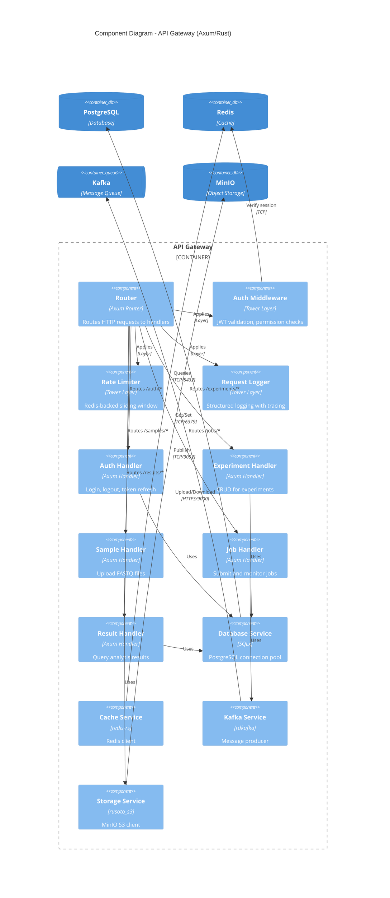
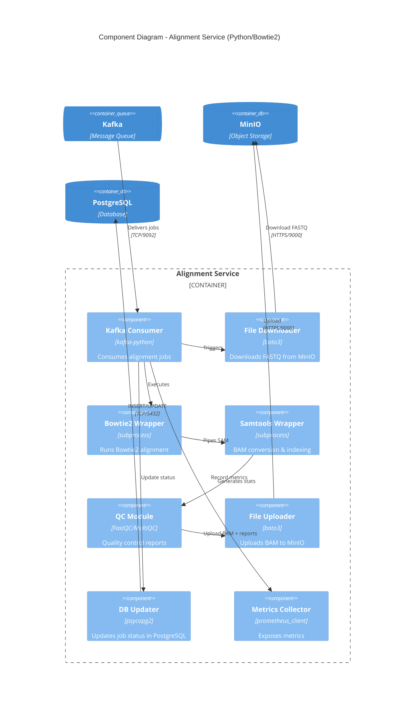

# C4 Component Diagram - API Gateway & Processing Services

## API Gateway Components

This diagram shows the internal structure of the API Gateway container.



## API Gateway Component Details

### 1. Middleware Stack

**Execution Order** (outermost to innermost):
1. **Request Logger**: Logs all incoming requests (method, path, headers)
2. **Rate Limiter**: Checks Redis for rate limit, returns 429 if exceeded
3. **Auth Middleware**: Validates JWT token, extracts user claims
4. **Router**: Routes request to appropriate handler

**Tower Middleware Example**:
```rust
let app = Router::new()
    .nest("/api/v1", api_routes)
    .layer(
        ServiceBuilder::new()
            .layer(TraceLayer::new_for_http())  // Request logger
            .layer(middleware::from_fn(rate_limit_middleware))
            .layer(middleware::from_fn(auth_middleware))
    );
```

### 2. Route Handlers

**Auth Handler** (`/api/v1/auth/*`)
- `POST /login`: Username/password → JWT token
- `POST /logout`: Invalidate session
- `POST /refresh`: Refresh token → New JWT
- `GET /verify`: Validate current token

**Experiment Handler** (`/api/v1/experiments/*`)
- `GET /`: List experiments (filtered by user)
- `POST /`: Create new experiment
- `GET /:id`: Get experiment details
- `PUT /:id`: Update experiment
- `DELETE /:id`: Delete experiment

**Sample Handler** (`/api/v1/samples/*`)
- `POST /upload`: Upload FASTQ files to MinIO
- `GET /:id`: Get sample metadata
- `DELETE /:id`: Delete sample

**Job Handler** (`/api/v1/jobs/*`)
- `POST /`: Submit analysis job to Kafka
- `GET /:id`: Get job status
- `GET /:id/logs`: Stream job logs
- `DELETE /:id`: Cancel running job

**Result Handler** (`/api/v1/results/*`)
- `GET /off-targets/:job_id`: Query off-target predictions
- `GET /diff-expr/:job_id`: Query differential expression results
- `GET /immune/:job_id`: Query immune response signatures
- `GET /export/:job_id`: Generate CSV/JSON export

### 3. Service Layer

**Database Service**
- **Connection Pool**: 100 max connections (SQLx)
- **Query Builder**: Type-safe queries with `sqlx::query!` macro
- **Transactions**: Automatic rollback on error
- **Migrations**: Versioned schema migrations

**Cache Service**
- **Client**: redis-rs with connection pooling
- **Patterns**:
  - Session storage (`session:{token}`)
  - Rate limiting (`rate_limit:{user}:{minute}`)
  - Job status (`job:{id}`)
- **TTL**: Configurable per key (default: 5 minutes)

**Kafka Service**
- **Producer**: rdkafka FutureProducer (async)
- **Serialization**: JSON with `serde_json`
- **Topics**: `jobs.alignment`, `jobs.off_target`, `jobs.diff_expr`, `jobs.immune`
- **Error Handling**: Retry 3 times with exponential backoff

**Storage Service**
- **Client**: rusoto_s3 (AWS SDK for Rust)
- **Buckets**: `crispr-cas13` (main), `crispr-cas13-backups`
- **Pre-signed URLs**: 1-hour TTL for downloads
- **Multipart Upload**: For files >5GB

---

## Processing Service Components (Alignment Service)



## Alignment Service Workflow

1. **Consume Job**: Kafka consumer receives alignment job message
2. **Download FASTQ**: Download R1/R2 FASTQ files from MinIO to `/tmp`
3. **Run Bowtie2**: Execute Bowtie2 alignment (8 threads)
   ```bash
   bowtie2 -x ref_genome -1 R1.fastq.gz -2 R2.fastq.gz -p 8 --very-sensitive
   ```
4. **Convert to BAM**: Pipe SAM output to samtools
   ```bash
   samtools view -bS - | samtools sort -o sorted.bam
   samtools index sorted.bam
   ```
5. **Quality Control**: Run FastQC on BAM file
6. **Upload Results**: Upload BAM, BAM index, QC report to MinIO
7. **Update Database**: Mark job as completed in PostgreSQL
8. **Publish Event**: Send completion message to Kafka (`jobs.completed`)
9. **Cleanup**: Delete temporary files from `/tmp`

## Error Handling Strategy

**Transient Errors** (network failures, timeouts):
- **Retry**: 3 attempts with exponential backoff (1s, 2s, 4s)
- **Dead Letter Queue**: After 3 failures, move to `jobs.failed` topic

**Permanent Errors** (invalid input, out of memory):
- **Immediate Failure**: Mark job as failed in database
- **Notification**: Send alert to user via email/WebSocket
- **Logging**: Store detailed error message in PostgreSQL

**Resource Exhaustion**:
- **Graceful Degradation**: If disk space <10%, pause processing
- **Auto-Recovery**: Resume when space is freed

---

## Component Communication Patterns

### Synchronous (Request-Response)
- **API Gateway → PostgreSQL**: Direct database queries (SELECT, INSERT, UPDATE)
- **API Gateway → Redis**: Cache lookups (GET, SET)
- **API Gateway → MinIO**: File operations (PUT, GET)

### Asynchronous (Event-Driven)
- **API Gateway → Kafka**: Job submission (fire-and-forget)
- **Kafka → Workers**: Job consumption (at-least-once delivery)
- **Workers → Kafka**: Status updates (completion/failure events)

### Streaming
- **WebSocket Server → Clients**: Real-time job status updates
- **Prometheus → Grafana**: Continuous metrics streaming

---

**Diagram Version**: 1.0
**Last Updated**: 2025-10-12
**See Also**: [Sequence Diagrams](./sequence-diagrams.md)
