# C4 Container Diagram - CRISPR-Cas13 Pipeline

## Container Architecture

This diagram shows the high-level technology choices and how containers communicate.

```mermaid
C4Container
    title Container Diagram - CRISPR-Cas13 Pipeline

    Person(user, "User", "Researcher or Bioinformatician")

    Container_Boundary(frontend, "Client Applications") {
        Container(web_app, "Web Application", "React/TypeScript", "Interactive UI for experiment management")
        Container(cli_tool, "CLI Tool", "Python/Rust", "Command-line interface for power users")
    }

    Container_Boundary(api_layer, "API Layer") {
        Container(nginx, "Nginx Ingress", "Reverse Proxy", "Load balancing, TLS termination")
        Container(api_gateway, "API Gateway", "Axum (Rust)", "RESTful API, authentication, rate limiting")
        Container(websocket_server, "WebSocket Server", "Axum (Rust)", "Real-time job status updates")
    }

    Container_Boundary(processing_layer, "Processing Layer") {
        Container(alignment_service, "Alignment Service", "Python/Bowtie2", "Read alignment to genome")
        Container(off_target_service, "Off-Target Predictor", "Python/PyTorch", "ML-based off-target prediction")
        Container(diff_expr_service, "Differential Expression", "R/DESeq2", "Gene expression analysis")
        Container(immune_service, "Immune Response Analyzer", "Python/R", "Signature enrichment analysis")
    }

    Container_Boundary(data_layer, "Data Layer") {
        ContainerDb(postgres, "PostgreSQL", "Relational DB", "Experiments, samples, results")
        ContainerDb(mongodb, "MongoDB", "Document DB", "Genomic annotations, gene ontology")
        ContainerDb(redis, "Redis", "Cache", "Sessions, job status, rate limiting")
        ContainerDb(minio, "MinIO", "Object Storage", "FASTQ, BAM, VCF files")
    }

    Container_Boundary(messaging, "Message Queue") {
        ContainerQueue(kafka, "Apache Kafka", "Message Broker", "Job orchestration, event streaming")
    }

    Container_Boundary(monitoring, "Monitoring") {
        Container(prometheus, "Prometheus", "Metrics", "Time-series metrics collection")
        Container(grafana, "Grafana", "Dashboards", "Visualization and alerting")
        Container(jaeger, "Jaeger", "Tracing", "Distributed request tracing")
    }

    Rel(user, web_app, "Uses", "HTTPS")
    Rel(user, cli_tool, "Uses", "HTTPS")

    Rel(web_app, nginx, "API requests", "HTTPS/443")
    Rel(cli_tool, nginx, "API requests", "HTTPS/443")
    Rel(nginx, api_gateway, "Routes", "HTTP/2")
    Rel(nginx, websocket_server, "WebSocket", "WSS")

    Rel(api_gateway, postgres, "Reads/Writes", "TCP/5432")
    Rel(api_gateway, redis, "Cache", "TCP/6379")
    Rel(api_gateway, kafka, "Publishes jobs", "TCP/9092")
    Rel(api_gateway, minio, "Upload/Download", "HTTPS/9000")

    Rel(websocket_server, kafka, "Subscribes to updates", "TCP/9092")
    Rel(websocket_server, redis, "Job status", "TCP/6379")

    Rel(kafka, alignment_service, "Consumes", "TCP/9092")
    Rel(kafka, off_target_service, "Consumes", "TCP/9092")
    Rel(kafka, diff_expr_service, "Consumes", "TCP/9092")
    Rel(kafka, immune_service, "Consumes", "TCP/9092")

    Rel(alignment_service, minio, "Read FASTQ, Write BAM", "HTTPS/9000")
    Rel(alignment_service, postgres, "Update job status", "TCP/5432")
    Rel(alignment_service, kafka, "Publish completion", "TCP/9092")

    Rel(off_target_service, minio, "Read BAM", "HTTPS/9000")
    Rel(off_target_service, postgres, "Write off-targets", "TCP/5432")
    Rel(off_target_service, mongodb, "Query genome", "TCP/27017")

    Rel(diff_expr_service, minio, "Read BAM", "HTTPS/9000")
    Rel(diff_expr_service, postgres, "Write results", "TCP/5432")

    Rel(immune_service, postgres, "Read diff expr", "TCP/5432")
    Rel(immune_service, mongodb, "Query signatures", "TCP/27017")

    Rel(api_gateway, prometheus, "Metrics", "HTTP/9090")
    Rel(alignment_service, prometheus, "Metrics", "HTTP/9090")
    Rel(prometheus, grafana, "Queries", "HTTP/3000")
    Rel(api_gateway, jaeger, "Traces", "UDP/6831")

    UpdateLayoutConfig($c4ShapeInRow="3", $c4BoundaryInRow="2")
```

## Container Communication Matrix

| Source Container | Target Container | Protocol | Port | Purpose | Security |
|------------------|------------------|----------|------|---------|----------|
| Web App → Nginx | API Gateway | HTTPS | 443 | REST API calls | TLS 1.3, JWT |
| API Gateway → PostgreSQL | Database | TCP | 5432 | CRUD operations | TLS, user/pass |
| API Gateway → Redis | Cache | TCP | 6379 | Session storage | TLS, password |
| API Gateway → Kafka | Message Queue | TCP | 9092 | Job submission | SASL/SSL |
| API Gateway → MinIO | Object Storage | HTTPS | 9000 | File upload/download | IAM keys |
| Kafka → Workers | Processing | TCP | 9092 | Job distribution | SASL/SSL |
| Workers → MinIO | Object Storage | HTTPS | 9000 | Read/Write files | IAM keys |
| Workers → PostgreSQL | Database | TCP | 5432 | Update results | TLS, user/pass |
| Workers → MongoDB | Document DB | TCP | 27017 | Query annotations | TLS, user/pass |
| All → Prometheus | Monitoring | HTTP | 9090 | Metrics scraping | Service account |

## Container Technologies

### Frontend Layer

**Web Application**
- **Framework**: React 18 + TypeScript 5.3
- **Build Tool**: Vite 5.0
- **State Management**: Zustand
- **Deployment**: Nginx static hosting
- **CDN**: CloudFlare

**CLI Tool**
- **Language**: Python 3.11 (alternative: Rust)
- **HTTP Client**: `requests` / `httpx`
- **Distribution**: PyPI package

### API Layer

**API Gateway**
- **Framework**: Axum 0.7 (Rust)
- **Async Runtime**: Tokio 1.35
- **Middleware**: Tower
- **Serialization**: Serde
- **Database Client**: SQLx (PostgreSQL)
- **Cache Client**: redis-rs
- **Message Queue**: rdkafka
- **Deployment**: Docker container on Kubernetes

**WebSocket Server**
- **Framework**: Axum WebSocket support
- **Broadcasting**: Tokio broadcast channels
- **Deployment**: Shared pods with API Gateway

### Processing Layer

**Alignment Service**
- **Language**: Python 3.11
- **Bioinformatics**: Bioconda (Bowtie2, Samtools)
- **Message Queue**: kafka-python
- **Deployment**: Docker container with Bioconda

**Off-Target Service**
- **Language**: Python 3.11
- **ML Framework**: PyTorch 2.1
- **Genomics**: Biopython
- **Deployment**: Docker container (GPU-enabled optional)

**Differential Expression Service**
- **Language**: R 4.3
- **Framework**: Bioconductor 3.18
- **Packages**: DESeq2, edgeR, ggplot2
- **Deployment**: Docker container with R/Bioconductor

**Immune Response Service**
- **Language**: Python 3.11 + R 4.3 (hybrid)
- **Packages**: GSEA, MSigDB, ImmuneSigDB
- **Deployment**: Docker container

### Data Layer

**PostgreSQL**
- **Version**: 16
- **Configuration**: Primary + 3 read replicas
- **Connection Pooling**: PgBouncer
- **Backup**: Automated daily snapshots

**MongoDB**
- **Version**: 7.0
- **Sharding**: 3 shards × 3 replicas
- **Indexes**: Compound indexes on chromosome + position

**Redis**
- **Version**: 7.2
- **Mode**: Cluster (3 masters + 3 replicas)
- **Persistence**: AOF + RDB snapshots

**MinIO**
- **Mode**: Distributed (4 nodes × 4 drives)
- **Erasure Coding**: EC:4 (4 data + 4 parity)
- **Replication**: Cross-region replication

### Message Queue

**Apache Kafka**
- **Version**: 3.6
- **Brokers**: 3 brokers (HA)
- **Replication**: Factor 3
- **Partitions**: 10 per topic

### Monitoring

**Prometheus**
- **Retention**: 30 days
- **Scrape Interval**: 15 seconds
- **Storage**: 500GB SSD

**Grafana**
- **Dashboards**: 5 pre-built dashboards
- **Alerting**: Prometheus Alertmanager

**Jaeger**
- **Backend**: Elasticsearch
- **Retention**: 7 days
- **Sampling**: 10% of requests

## Deployment Model

All containers run on **Kubernetes 1.28** with:
- **Namespace Isolation**: `crispr-production`, `crispr-staging`, `crispr-dev`
- **Resource Quotas**: Per-namespace CPU/memory limits
- **Network Policies**: Restrict inter-service communication
- **Ingress Controller**: Nginx Ingress with Let's Encrypt

---

**Diagram Version**: 1.0
**Last Updated**: 2025-10-12
**Next Level**: [C4 Component Diagram](./c4-component.md)
