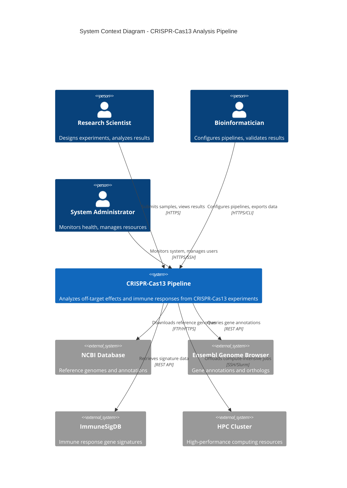

# C4 Context Diagram - CRISPR-Cas13 Pipeline

## System Context

This diagram shows the CRISPR-Cas13 Analysis Pipeline in the context of external users and systems.

## External Systems Integration

### 1. NCBI Database
- **Purpose**: Download reference genomes (e.g., Macaca mulatta rheMac10)
- **Protocol**: FTP, HTTPS
- **Frequency**: Monthly (genome updates)
- **Authentication**: Public access, API key for higher rate limits

### 2. Ensembl Genome Browser
- **Purpose**: Gene annotations, transcript variants, orthologs
- **Protocol**: REST API (`https://rest.ensembl.org/`)
- **Frequency**: Weekly updates
- **Rate Limit**: 15 requests/sec

### 3. ImmuneSigDB
- **Purpose**: Curated immune response gene signatures
- **Protocol**: REST API, bulk download
- **Frequency**: Quarterly updates
- **Data Format**: GMT, JSON

### 4. HPC Cluster (Optional)
- **Purpose**: Offload large-scale alignment jobs
- **Protocol**: SSH, Slurm job scheduler
- **Integration**: Job submission via `sbatch`, result retrieval via `scp`
- **Use Case**: Experiments with >50 samples

## User Roles & Responsibilities

| Role | Responsibilities | Access Level |
|------|-----------------|--------------|
| **Research Scientist** | - Design experiments - Submit samples - Interpret results | Read/Write own experiments |
| **Bioinformatician** | - Configure analysis pipelines - Validate results - Export raw data | Read all, Write pipelines |
| **System Administrator** | - Monitor system health - Manage users and permissions - Perform backups | Full system access |

## Security Boundaries

- **External Firewall**: All external traffic goes through firewall (HTTPS only)
- **API Gateway**: Authentication layer (OAuth2/JWT)
- **Internal Network**: Service-to-service communication uses mTLS
- **Data Encryption**: All data encrypted at rest (AES-256) and in transit (TLS 1.3)

## Data Flow Summary

1. **Ingress**: Users upload FASTQ files via web UI → API Gateway → MinIO S3
2. **Processing**: Jobs orchestrated via Kafka → Processing workers → Results stored in PostgreSQL/MongoDB
3. **Egress**: Users download results via pre-signed S3 URLs (time-limited)
4. **External**: Pipeline fetches reference data from NCBI/Ensembl on-demand (cached in MongoDB)

---

**Diagram Version**: 1.0
**Last Updated**: 2025-10-12
**Next Level**: [C4 Container Diagram](./c4-container.md)
