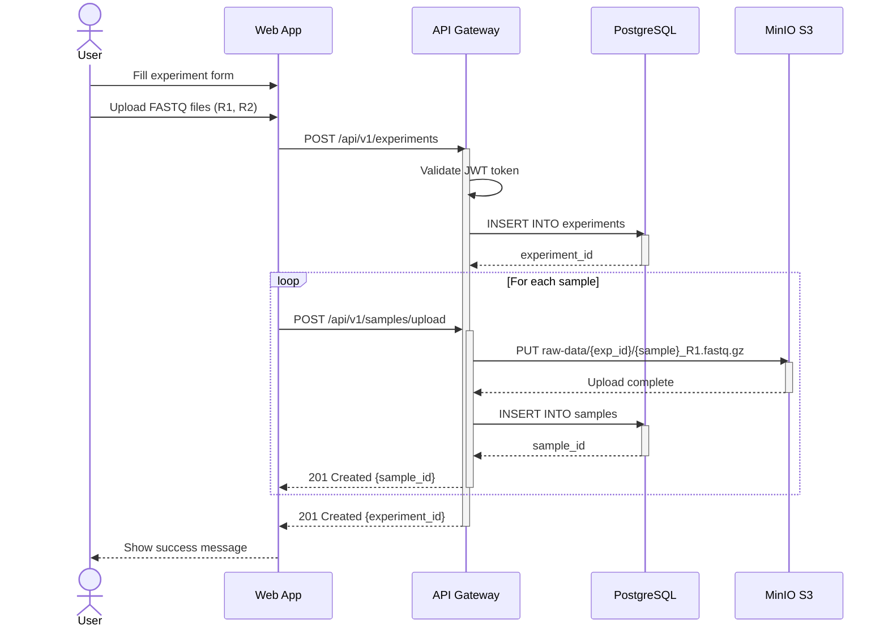
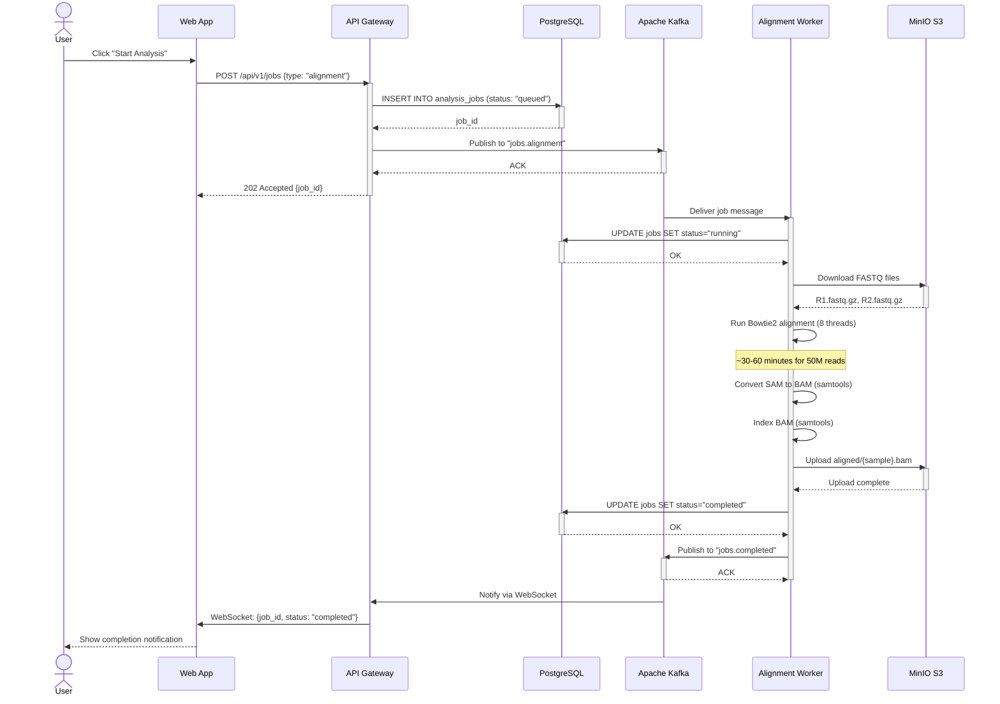
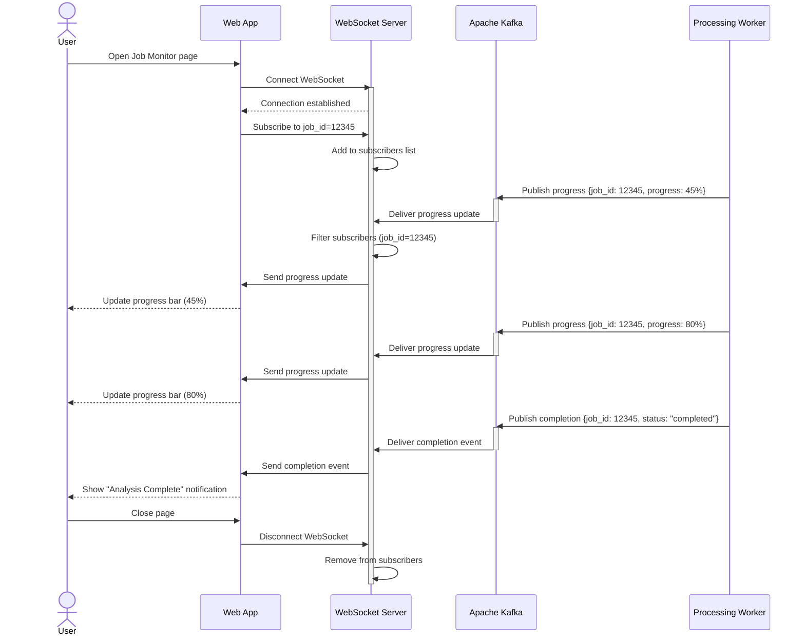
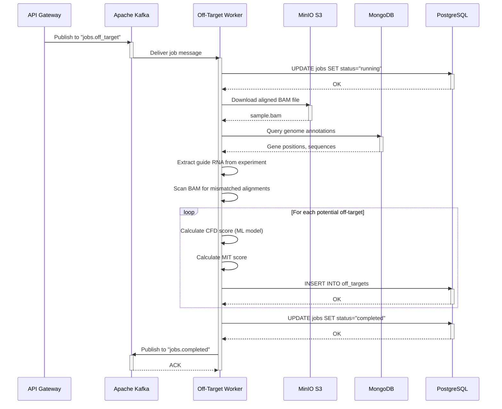
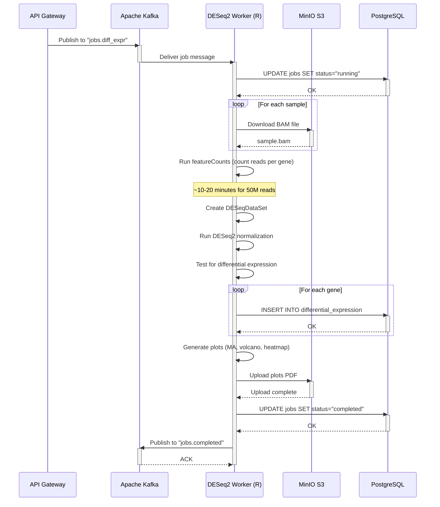
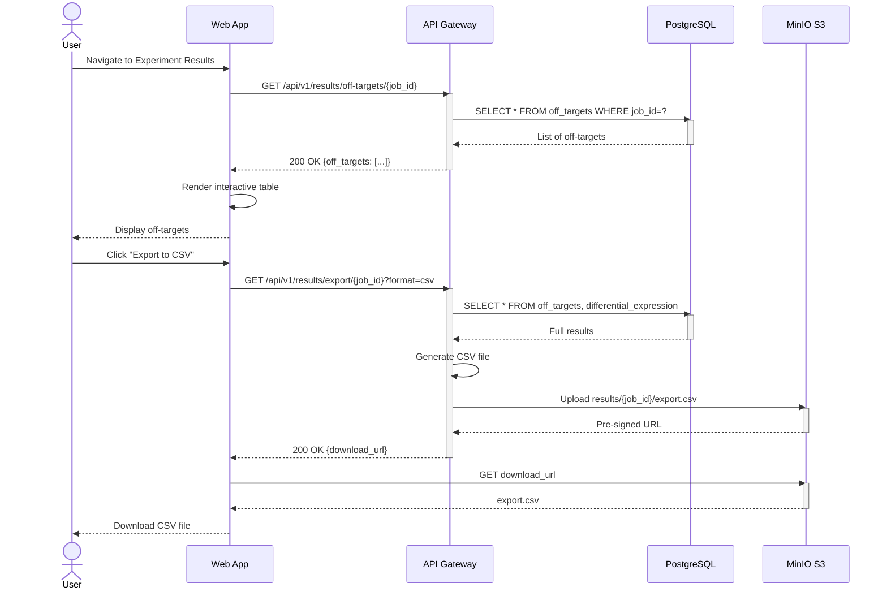
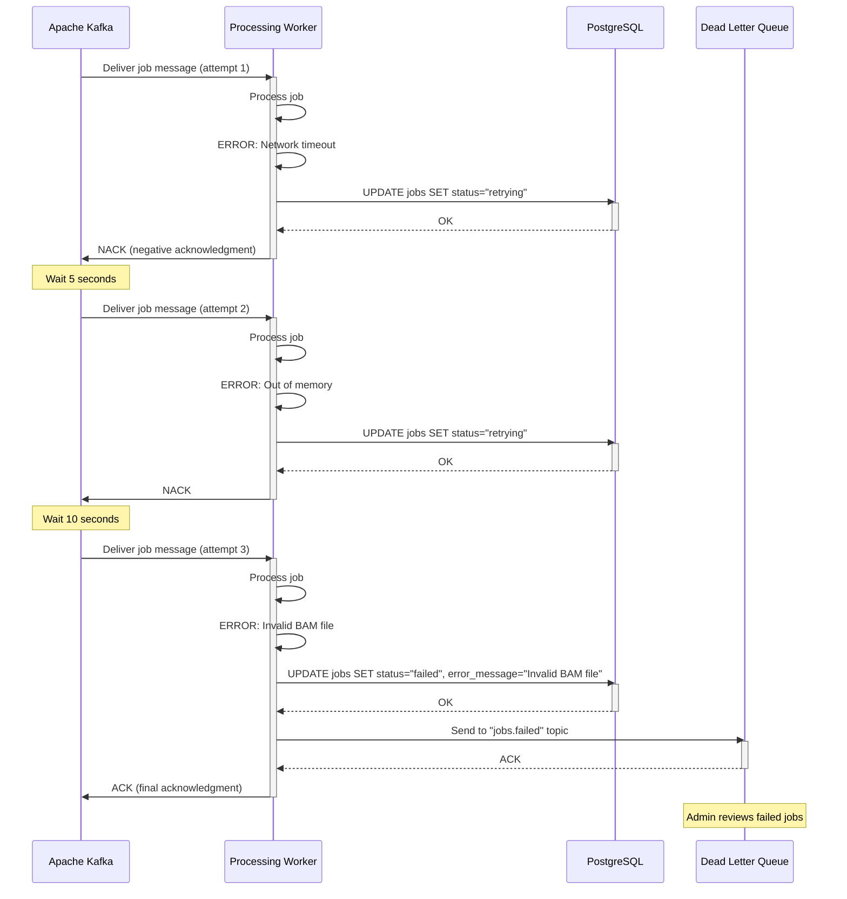
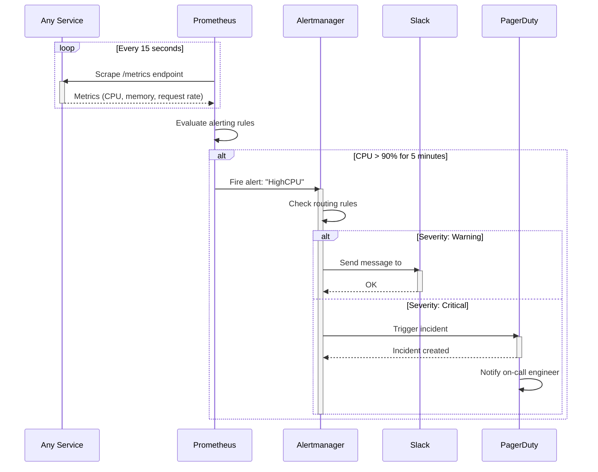

# Sequence Diagrams - Key Workflows

## 1. User Authentication Flow

```mermaid
sequenceDiagram
    actor User
    participant Web as Web App
    participant API as API Gateway
    participant Redis as Redis
    participant DB as PostgreSQL

    User->>Web: Enter email & password
    Web->>API: POST /api/v1/auth/login
    activate API

    API->>DB: SELECT user WHERE email = ?
    activate DB
    DB-->>API: User record
    deactivate DB

    API->>API: Verify password (bcrypt)

    alt Password Valid
        API->>API: Generate JWT token
        API->>Redis: SET session:{token}
        activate Redis
        Redis-->>API: OK
        deactivate Redis

        API->>DB: INSERT INTO audit_log (login)
        API-->>Web: 200 OK {token, user}
        deactivate API
        Web->>Web: Store token in localStorage
        Web-->>User: Redirect to dashboard
    else Password Invalid
        API-->>Web: 401 Unauthorized
        deactivate API
        Web-->>User: Show error message
    end
```

---

## 2. Experiment Creation & Sample Upload



---

## 3. Job Submission & Processing (Alignment)



---

## 4. Real-Time Status Updates (WebSocket)



---

## 5. Off-Target Prediction Workflow



---

## 6. Differential Expression Analysis



---

## 7. Result Visualization & Export



---

## 8. Error Handling & Retry



---

## 9. Monitoring & Alerting



---

**Document Version**: 1.0
**Last Updated**: 2025-10-12
**See Also**: [Architecture Overview](../ARCHITECTURE.md)
