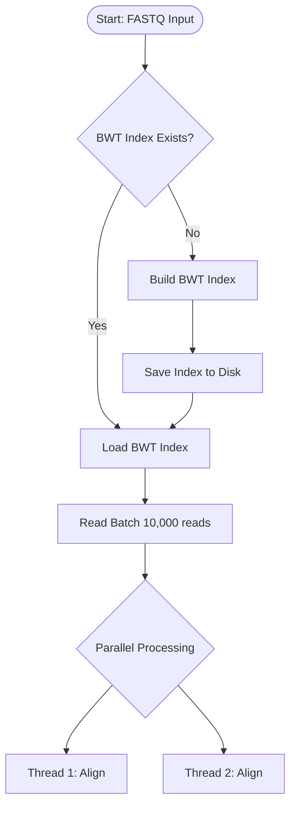

# Flowchart Documentation Index

This directory contains Mermaid flowcharts for all CRISPR-Cas13 pipeline modules.

## Files

### 1. [alignment-flowchart.md](alignment-flowchart.md)
**Read Alignment Module Flowcharts** - 221 lines

Visual flow diagrams for:
- Main Alignment Workflow
- Seed-and-Extend Algorithm Detail
- BWT Index Construction
- Smith-Waterman Dynamic Programming
- Error Handling Flow

**Diagrams**: 5 detailed Mermaid flowcharts

---

### 2. [offtarget-flowchart.md](offtarget-flowchart.md)
**Off-Target Prediction Module Flowcharts** - 317 lines

Visual flow diagrams for:
- Main Off-Target Prediction Workflow
- Feature Extraction Detail
- Gradient Boosting Training
- Off-Target Scoring & Ranking
- RNA Secondary Structure Prediction
- Error Handling & Resource Management

**Diagrams**: 6 detailed Mermaid flowcharts

---

### 3. [expression-flowchart.md](expression-flowchart.md)
**Differential Expression Analysis Module Flowcharts** - 426 lines

Visual flow diagrams for:
- Main Expression Analysis Workflow
- DESeq2 Normalization Detail
- Dispersion Estimation Workflow
- Negative Binomial GLM Fitting (IRLS)
- Differential Expression Testing
- Benjamini-Hochberg FDR Correction
- Pathway Enrichment Analysis
- Immune Score Calculation
- Log Fold Change Shrinkage
- Error Handling & Quality Control

**Diagrams**: 10 detailed Mermaid flowcharts

---

### 4. [reporting-flowchart.md](reporting-flowchart.md)
**Reporting Engine Flowcharts** - 502 lines

Visual flow diagrams for:
- Main Reporting Workflow
- Data Aggregation Detail
- Volcano Plot Generation
- Heatmap with Hierarchical Clustering
- Pathway Dot Plot Generation
- HTML Report Generation
- Executive Summary Card Generation
- Data Export (VCF, BED, CSV)
- PDF Generation Workflow
- Error Handling in Reporting

**Diagrams**: 10 detailed Mermaid flowcharts

---

## Flowchart Features

All flowcharts use Mermaid syntax with:

- **Color Coding**:
  - Green: Start nodes
  - Red: End nodes
  - Yellow: Decision points
  - Blue: Key processing steps

- **Node Types**:
  - `([Start])` - Rounded rectangles for entry points
  - `[Process]` - Rectangles for operations
  - `{Decision?}` - Diamonds for conditionals
  - `((Loop))` - Double circles for iterations

- **Complexity Tables**: Each flowchart includes algorithm complexity summary

## Viewing Flowcharts

### In Markdown Viewers
Most modern Markdown viewers (GitHub, GitLab, VS Code) support Mermaid rendering.

### In Browser
Copy the Mermaid code to [Mermaid Live Editor](https://mermaid.live/)

### In Documentation Site
Use a static site generator with Mermaid support:
- MkDocs with pymdown-extensions
- Docusaurus with mermaid plugin
- GitBook with mermaid plugin

## Example: Alignment Workflow

## Related Documentation

- [Algorithm Documentation](../algorithms/)
- [Main Pseudocode Overview](../PSEUDOCODE.md)
- [Architecture Diagrams](../architecture-diagrams/)

---

**Total Lines**: 1,466 lines of flowchart documentation
**Total Diagrams**: 31 detailed Mermaid flowcharts
