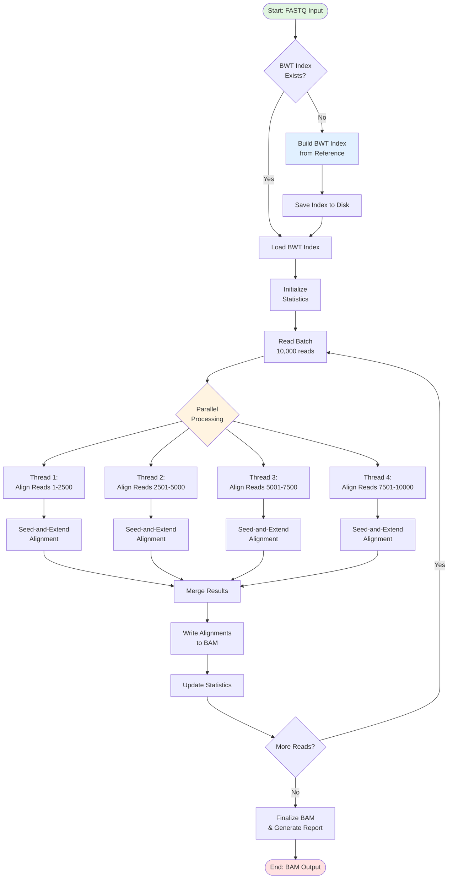
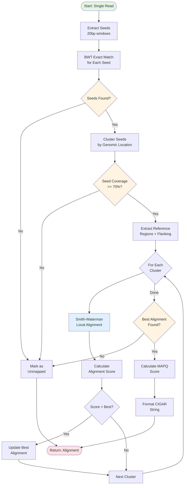
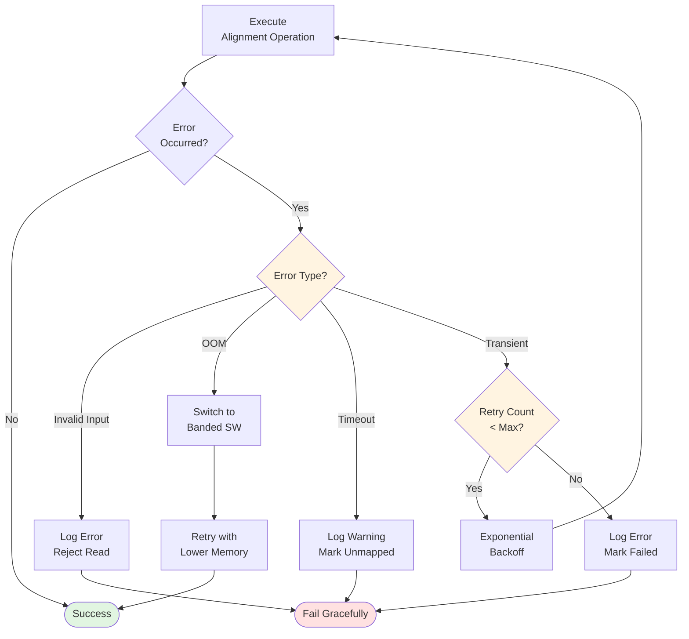

# Read Alignment Module - Flowchart

## Main Alignment Workflow



## Seed-and-Extend Algorithm Detail



## BWT Index Construction

```mermaid
flowchart TD
    StartBWT([Start: Reference<br/>Genome]) --> BuildSA[Construct Suffix Array<br/>DC3 Algorithm]

    BuildSA --> CreateBWT[Build BWT String<br/>from Suffix Array]

    CreateBWT --> BuildOcc[Build Occurrence<br/>Table O(m × Σ)]

    BuildOcc --> BuildCount[Build Count Table<br/>Cumulative Sums]

    BuildCount --> SampleSA[Sample Suffix Array<br/>Every 32 Positions]

    SampleSA --> Package[Package Index<br/>Structure]

    Package --> EndBWT([Return: BWT Index])

    style StartBWT fill:#e1f5e1
    style EndBWT fill:#ffe1e1
    style BuildSA fill:#e1f0ff
```

## Smith-Waterman Dynamic Programming

```mermaid
flowchart TD
    StartSW([Start: Query & Ref]) --> InitMatrices[Initialize DP Matrices<br/>H, E, F]

    InitMatrices --> LoopI{For i=1 to n<br/>query length}

    LoopI --> LoopJ{For j=1 to m<br/>ref length}

    LoopJ --> CalcE[Calculate E[i][j]<br/>Gap in Query]

    CalcE --> CalcF[Calculate F[i][j]<br/>Gap in Reference]

    CalcF --> CalcMatch{Query[i]<br/>== Ref[j]?}

    CalcMatch -->|Yes| AddMatch[matchScore =<br/>H[i-1][j-1] + 2]
    CalcMatch -->|No| AddMismatch[matchScore =<br/>H[i-1][j-1] - 3]

    AddMatch --> TakeMax
    AddMismatch --> TakeMax[H[i][j] = MAX(0,<br/>matchScore, E, F)]

    TakeMax --> CheckMax{H[i][j] ><br/>maxScore?}

    CheckMax -->|Yes| UpdateMax[Update maxScore<br/>& Position]
    CheckMax -->|No| NextJ

    UpdateMax --> NextJ[j++]
    NextJ --> LoopJ

    LoopJ -->|Done| NextI[i++]
    NextI --> LoopI

    LoopI -->|Done| Traceback[Traceback from<br/>maxScore Position]

    Traceback --> CompressCIGAR[Compress CIGAR<br/>String]

    CompressCIGAR --> EndSW([Return: Alignment<br/>with Score])

    style StartSW fill:#e1f5e1
    style EndSW fill:#ffe1e1
    style TakeMax fill:#e1f0ff
    style CalcMatch fill:#fff4e1
    style CheckMax fill:#fff4e1
```

## Error Handling Flow



---

## Complexity Summary

| Operation | Time Complexity | Space Complexity |
|-----------|----------------|------------------|
| BWT Index Construction | O(m) | O(m) |
| Backward Search | O(n) | O(1) |
| Seed-and-Extend | O(k × n × m) | O(m) |
| Smith-Waterman | O(n × m) | O(n × m) |
| Full Pipeline | O(N × n × m / p) | O(B × n) |

Where:
- m = reference genome size
- n = read length
- N = total reads
- k = seed clusters
- p = parallelism
- B = batch size
