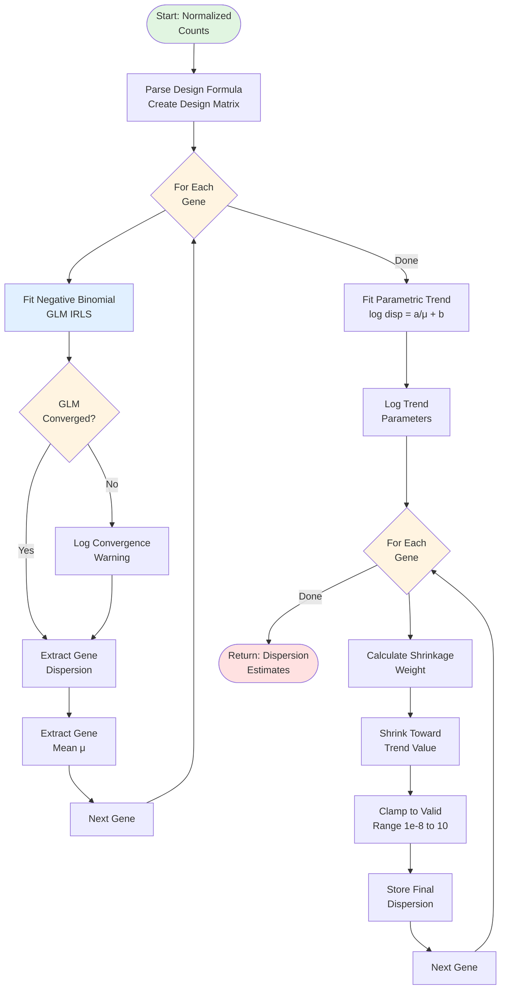
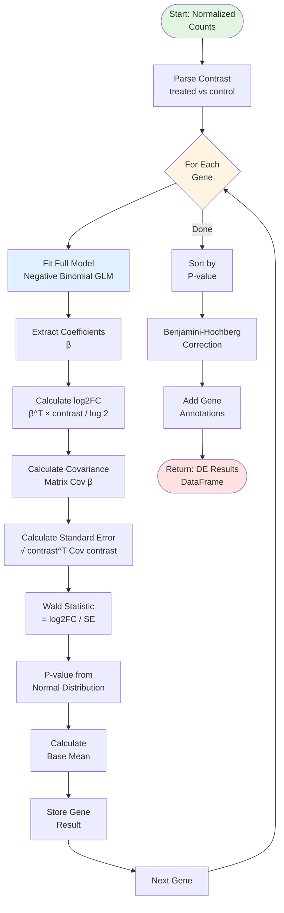
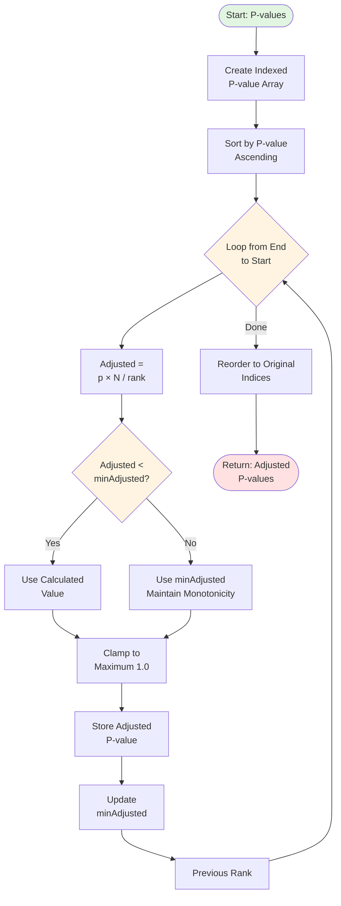
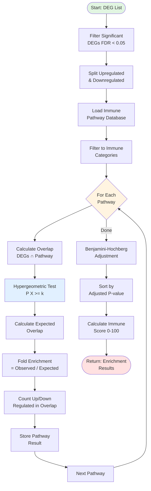
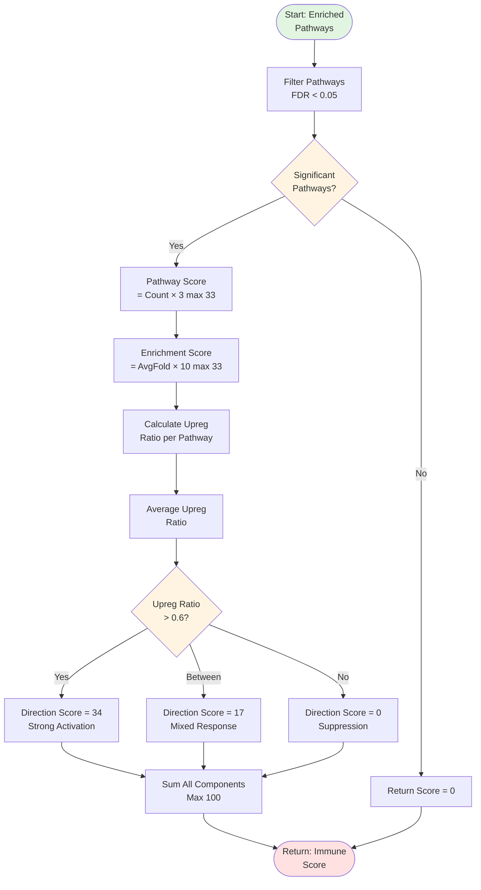
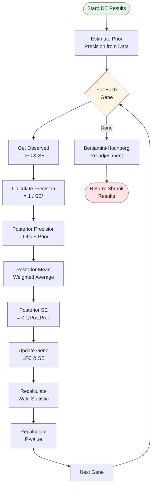
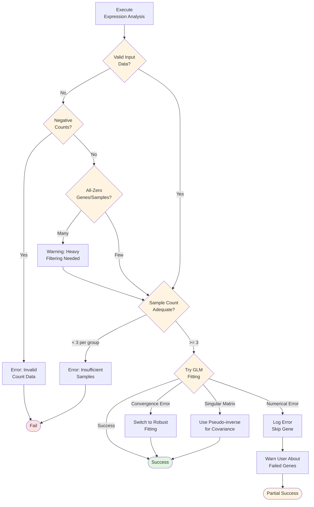

# Differential Expression Analysis Module - Flowchart

## Main Expression Analysis Workflow

```mermaid
flowchart TD
    Start([Start: Count Matrix]) --> LoadData[Load Count Matrix<br/>& Sample Metadata]

    LoadData --> ValidateMatch[Validate Sample<br/>Matching]

    ValidateMatch --> QCFilter[Quality Control<br/>Filter Low Counts]

    QCFilter --> LogFiltered[Log Filtered<br/>Gene Count]

    LogFiltered --> Normalize[DESeq2 Normalization<br/>Size Factor Estimation]

    Normalize --> EstimateDisp[Estimate Gene-wise<br/>Dispersions]

    EstimateDisp --> FitTrend[Fit Dispersion-Mean<br/>Trend]

    FitTrend --> ShrinkDisp[Shrink Dispersions<br/>Empirical Bayes]

    ShrinkDisp --> TestDE[Differential Expression<br/>Testing Wald Test]

    TestDE --> AdjustPValues[Multiple Testing<br/>Correction BH FDR]

    AdjustPValues --> ShrinkLFC[Shrink Log2 Fold<br/>Changes apeglm]

    ShrinkLFC --> ExtractSig[Extract Significant<br/>DEGs FDR < 0.05]

    ExtractSig --> PathwayEnrich[Immune Pathway<br/>Enrichment Analysis]

    PathwayEnrich --> CalcImmuneScore[Calculate Immune<br/>Activation Score]

    CalcImmuneScore --> GenStats[Generate Summary<br/>Statistics]

    GenStats --> End([End: DE Results])

    style Start fill:#e1f5e1
    style End fill:#ffe1e1
    style Normalize fill:#e1f0ff
    style EstimateDisp fill:#e1f0ff
    style TestDE fill:#e1f0ff
    style PathwayEnrich fill:#e1f0ff
```



## DESeq2 Normalization Detail

```mermaid
flowchart TD
    StartNorm([Start: Raw Counts]) --> CalcGeoMeans[Calculate Geometric<br/>Mean per Gene]

    CalcGeoMeans --> LoopSamples{For Each<br/>Sample}

    LoopSamples --> CalcRatios[Calculate Ratios<br/>Count / GeoMean]

    CalcRatios --> FilterZeros[Filter Out<br/>Zero GeoMeans]

    FilterZeros --> MedianRatio[Median of Ratios<br/>= Size Factor]

    MedianRatio --> StoreSF[Store Size<br/>Factor]

    StoreSF --> NextSample[Next Sample]
    NextSample --> LoopSamples

    LoopSamples -->|Done| DivideBy SF[Divide Counts by<br/>Size Factors]

    DivideBySF --> LogNormCounts[Log Normalized<br/>Counts]

    LogNormCounts --> EndNorm([Return: Normalized<br/>Counts & SFs])

    style StartNorm fill:#e1f5e1
    style EndNorm fill:#ffe1e1
    style LoopSamples fill:#fff4e1
```

## Dispersion Estimation Workflow



## Negative Binomial GLM Fitting (IRLS)

```mermaid
flowchart TD
    StartGLM([Start: Gene Counts]) --> InitBeta[Initialize Coefficients<br/>β = 0]

    InitBeta --> InitDisp[Initialize Dispersion<br/>α = 0.1]

    InitDisp --> IterLoop{Iteration < Max<br/>100?}

    IterLoop -->|Yes| CalcMu[Calculate μ<br/>= exp Xβ]

    CalcMu --> CalcVar[Calculate Variance<br/>= μ + α×μ²]

    CalcVar --> CalcWeights[Calculate Weights<br/>= μ² / variance]

    CalcWeights --> WeightedLS[Weighted Least Squares<br/>Update β]

    WeightedLS --> CheckDelta{|Δβ| <<br/>Threshold?}

    CheckDelta -->|Yes| EstimateAlpha[Estimate α<br/>Maximum Likelihood]
    CheckDelta -->|No| NextIter

    EstimateAlpha --> SetConverged[Set Converged<br/>= True]
    SetConverged --> EndGLM

    NextIter[Iteration++] --> IterLoop

    IterLoop -->|No| SetNotConverged[Set Converged<br/>= False]

    SetNotConverged --> EndGLM([Return: GLM Result<br/>β, μ, α])

    style StartGLM fill:#e1f5e1
    style EndGLM fill:#ffe1e1
    style IterLoop fill:#fff4e1
    style CheckDelta fill:#fff4e1
    style WeightedLS fill:#e1f0ff
```

## Differential Expression Testing



## Benjamini-Hochberg FDR Correction



## Pathway Enrichment Analysis



## Immune Score Calculation



## Log Fold Change Shrinkage



## Error Handling & Quality Control



---

## Complexity Summary

| Operation | Time Complexity | Space Complexity |
|-----------|----------------|------------------|
| Size Factor Estimation | O(G × S) | O(G × S) |
| Dispersion Estimation | O(G × S × I × C²) | O(G × S) |
| GLM Fitting per Gene | O(S × I × C²) | O(S × C) |
| Wald Testing | O(G × S × C²) | O(G × S) |
| BH Correction | O(G log G) | O(G) |
| Pathway Enrichment | O(P × G) | O(P × G) |
| Full Pipeline | O(G × S × I × C²) | O(G × S) |

Where:
- G = number of genes (20,000)
- S = number of samples (10-100)
- I = IRLS iterations (typically 5-20)
- C = number of coefficients (2-10)
- P = number of pathways (100-500)
