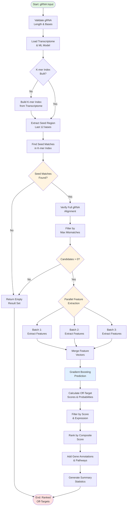
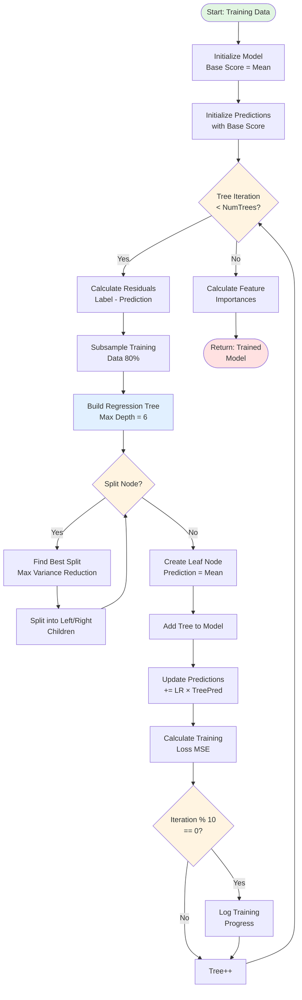
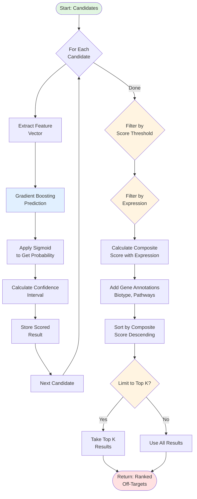
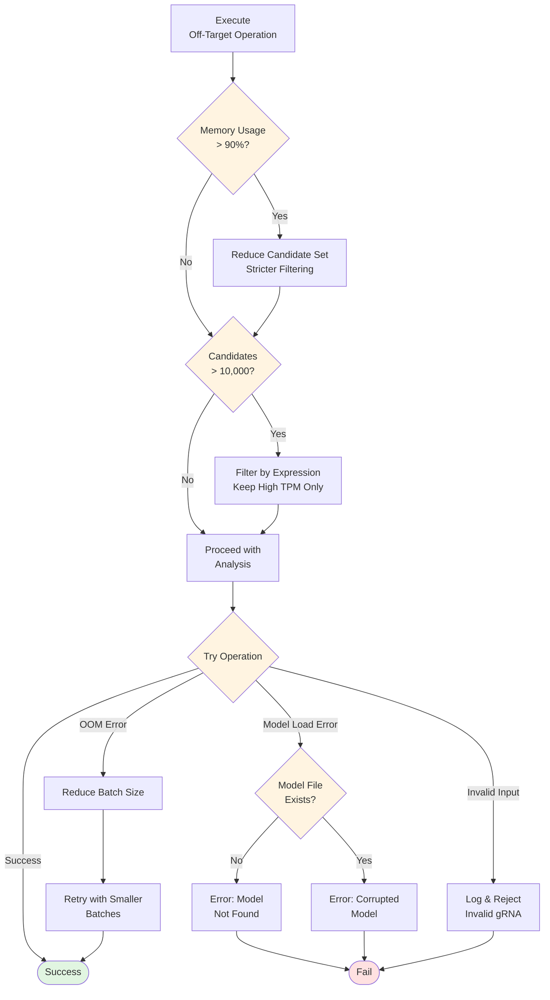

# Off-Target Prediction Module - Flowchart

## Main Off-Target Prediction Workflow



## Feature Extraction Detail

```mermaid
flowchart TD
    StartFeat([Start: Candidate Site]) --> SeqFeatures[Sequence Features]

    SeqFeatures --> CalcMM[Calculate Mismatch<br/>Distribution]
    CalcMM --> CalcGC[Calculate GC<br/>Content]
    CalcGC --> CalcHomopoly[Calculate Homopolymer<br/>Runs]

    CalcHomopoly --> StructFeatures[Structure Features]

    StructFeatures --> PredictStruct[Predict RNA<br/>Secondary Structure]
    PredictStruct --> CalcEnergy[Calculate Free<br/>Energy]
    CalcEnergy --> CalcAccess[Calculate<br/>Accessibility]

    CalcAccess --> ExprFeatures[Expression Features]

    ExprFeatures --> GetTPM[Get Transcript<br/>TPM Value]
    GetTPM --> GetCoverage[Get Local Read<br/>Coverage]

    GetCoverage --> ChromFeatures{Chromatin Data<br/>Available?}

    ChromFeatures -->|Yes| GetChromatin[Get Chromatin<br/>Accessibility]
    ChromFeatures -->|No| DefaultChrom[Use Default<br/>Value]

    GetChromatin --> EvoFeatures
    DefaultChrom --> EvoFeatures[Evolutionary Features]

    EvoFeatures --> GetConservation[Get PhyloP<br/>Conservation Score]

    GetConservation --> DistFeatures[Distance Features]

    DistFeatures --> CalcJunction[Calculate Distance to<br/>Exon Junction]

    CalcJunction --> ThermoFeatures[Thermodynamic Features]

    ThermoFeatures --> CalcAffinity[Calculate Binding<br/>Affinity]

    CalcAffinity --> PackageVector[Package Feature<br/>Vector 15-20 dims]

    PackageVector --> EndFeat([Return: Feature<br/>Vector])

    style StartFeat fill:#e1f5e1
    style EndFeat fill:#ffe1e1
    style PredictStruct fill:#e1f0ff
    style ChromFeatures fill:#fff4e1
```



## Gradient Boosting Training



## Off-Target Scoring & Ranking



## RNA Secondary Structure Prediction (Vienna RNA)

```mermaid
flowchart TD
    StartRNA([Start: RNA<br/>Sequence]) --> InitDP[Initialize DP Matrix<br/>n × n]

    InitDP --> LoopLength{For Length<br/>2 to n}

    LoopLength --> LoopI{For i = 0 to<br/>n - length}

    LoopI --> CalcJ[j = i + length]

    CalcJ --> CaseUnpaired[Case 1: i Unpaired<br/>dp[i][j] = dp[i+1][j]]

    CaseUnpaired --> LoopK{For k = i+1<br/>to j}

    LoopK --> CanPair{Can Pair<br/>seq[i], seq[k]?}

    CanPair -->|Yes| GetEnergy[Get Base Pair<br/>Energy]
    GetEnergy --> CalcPaired[Calculate Paired<br/>Energy]
    CalcPaired --> UpdateDP[Update dp[i][j]<br/>if Better]

    CanPair -->|No| NextK
    UpdateDP --> NextK[k++]

    NextK --> LoopK

    LoopK -->|Done| NextI[i++]
    NextI --> LoopI

    LoopI -->|Done| NextLength[length++]
    NextLength --> LoopLength

    LoopLength -->|Done| GetMFE[MFE = dp[0][n-1]]

    GetMFE --> Traceback[Traceback to Get<br/>Structure]

    Traceback --> EndRNA([Return: Structure<br/>& Free Energy])

    style StartRNA fill:#e1f5e1
    style EndRNA fill:#ffe1e1
    style LoopLength fill:#fff4e1
    style LoopI fill:#fff4e1
    style LoopK fill:#fff4e1
    style CanPair fill:#fff4e1
```

## Error Handling & Resource Management



---

## Complexity Summary

| Operation | Time Complexity | Space Complexity |
|-----------|----------------|------------------|
| K-mer Index Building | O(T × L) | O(T × L / K) |
| Candidate Discovery | O(K × log T) | O(K) |
| Feature Extraction | O(K × n²) | O(K × F) |
| Gradient Boosting Training | O(N × F × T × D) | O(T × D) |
| Prediction | O(K × T × D) | O(K × F) |
| Full Pipeline | O(T × L + K × n²) | O(T × L + K × F) |

Where:
- T = transcriptome size
- L = average transcript length
- K = number of candidates
- n = gRNA length
- F = feature dimensions
- N = training samples
- D = tree depth
