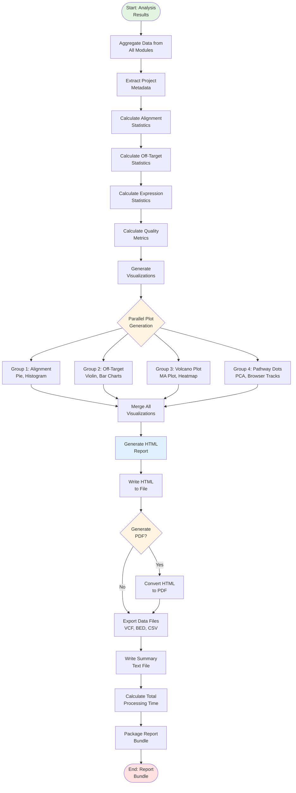
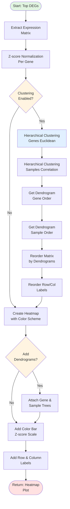
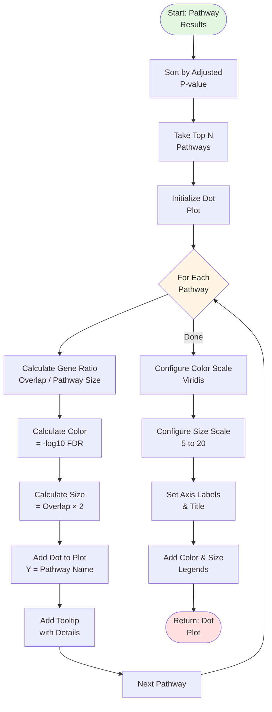
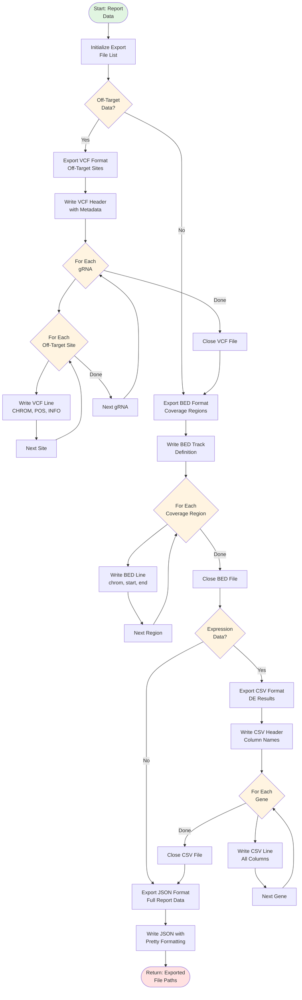
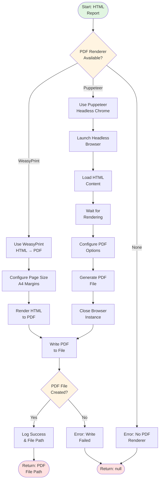
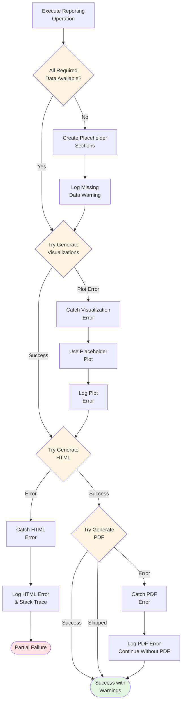

# Reporting Engine - Flowchart

## Main Reporting Workflow



## Data Aggregation Detail

```mermaid
flowchart TD
    StartAgg([Start: Module<br/>Results]) --> InitReport[Initialize Report<br/>Data Structure]

    InitReport --> AddMetadata[Add Project<br/>Metadata]

    AddMetadata --> ProcessAlignment[Process Alignment<br/>Results]

    ProcessAlignment --> ExtractReads[Extract Read<br/>Statistics]
    ExtractReads --> CalcCoverage[Calculate Coverage<br/>Statistics]
    CalcCoverage --> CalcMAPQ[Calculate Average<br/>MAPQ]

    CalcMAPQ --> CheckOffTarget{Off-Target<br/>Available?}

    CheckOffTarget -->|Yes| ProcessOffTarget[Process Off-Target<br/>Results]
    CheckOffTarget -->|No| CheckExpression

    ProcessOffTarget --> ExtractGRNAs[Extract gRNA<br/>Statistics]
    ExtractGRNAs --> ExtractCandidates[Extract Candidate<br/>Counts]
    ExtractCandidates --> ExtractTopGenes[Extract Top<br/>Off-Target Genes]

    ExtractTopGenes --> CheckExpression{Expression<br/>Available?}

    CheckExpression -->|Yes| ProcessExpression[Process Expression<br/>Results]
    CheckExpression -->|No| CalcQuality

    ProcessExpression --> ExtractDEGs[Extract DEG<br/>Statistics]
    ExtractDEGs --> ExtractPathways[Extract Pathway<br/>Enrichment]
    ExtractPathways --> ExtractImmuneScore[Extract Immune<br/>Score]

    ExtractImmuneScore --> CalcQuality[Calculate Quality<br/>Metrics]

    CalcQuality --> CalcCorrelations[Calculate Sample<br/>Correlations]
    CalcCorrelations --> DetectBatch[Detect Batch<br/>Effects]

    DetectBatch --> AddProcStats[Add Processing<br/>Statistics]

    AddProcStats --> EndAgg([Return: Aggregated<br/>Report Data])

    style StartAgg fill:#e1f5e1
    style EndAgg fill:#ffe1e1
    style CheckOffTarget fill:#fff4e1
    style CheckExpression fill:#fff4e1
```



## Volcano Plot Generation

```mermaid
flowchart TD
    StartVolcano([Start: Expression<br/>Data]) --> InitPlot[Initialize Plot<br/>Structure]

    InitPlot --> LoopGenes{For Each<br/>Gene}

    LoopGenes --> ExtractLFC[Extract log2<br/>Fold Change]

    ExtractLFC --> CalcY[Calculate Y<br/>= -log10 padj]

    CalcY --> CheckSig{|LFC| >= threshold<br/>AND padj < 0.05?}

    CheckSig -->|Yes, Up| SetRed[Color = Red<br/>Size = 8]
    CheckSig -->|Yes, Down| SetBlue[Color = Blue<br/>Size = 8]
    CheckSig -->|No| SetGray[Color = Gray<br/>Size = 4]

    SetRed --> AddPoint
    SetBlue --> AddPoint
    SetGray --> AddPoint[Add Point to<br/>Plot]

    AddPoint --> CheckRank{Gene Rank<br/><= 10?}

    CheckRank -->|Yes| AddLabel[Add Gene Symbol<br/>Annotation]
    CheckRank -->|No| NextGene

    AddLabel --> NextGene[Next Gene]
    NextGene --> LoopGenes

    LoopGenes -->|Done| AddThresholds[Add Threshold<br/>Lines]

    AddThresholds --> AddVLine[Add Vertical Lines<br/>at ±LFC threshold]

    AddVLine --> AddHLine[Add Horizontal Line<br/>at padj threshold]

    AddHLine --> SetLabels[Set Axis Labels<br/>& Title]

    SetLabels --> EndVolcano([Return: Volcano<br/>Plot])

    style StartVolcano fill:#e1f5e1
    style EndVolcano fill:#ffe1e1
    style LoopGenes fill:#fff4e1
    style CheckSig fill:#fff4e1
    style CheckRank fill:#fff4e1
```

## Heatmap with Hierarchical Clustering



## Pathway Dot Plot Generation



## HTML Report Generation

```mermaid
flowchart TD
    StartHTML([Start: Report Data<br/>& Plots]) --> WriteHeader[Write HTML Header<br/>& CSS Styles]

    WriteHeader --> WriteTitle[Write Title &<br/>Metadata Section]

    WriteTitle --> WriteExecSummary[Write Executive<br/>Summary Cards]

    WriteExecSummary --> WriteTOC[Write Table of<br/>Contents]

    WriteTOC --> WriteSection1[Write Section 1:<br/>Alignment Analysis]

    WriteSection1 --> EmbedAlignPlots[Embed Alignment<br/>Visualizations]

    EmbedAlignPlots --> CheckOffTarget{Off-Target<br/>Section?}

    CheckOffTarget -->|Yes| WriteSection2[Write Section 2:<br/>Off-Target Prediction]
    CheckOffTarget -->|No| CheckExpression

    WriteSection2 --> EmbedOffTargetPlots[Embed Off-Target<br/>Visualizations]

    EmbedOffTargetPlots --> CheckExpression{Expression<br/>Section?}

    CheckExpression -->|Yes| WriteSection3[Write Section 3:<br/>Differential Expression]
    CheckExpression -->|No| WriteQuality

    WriteSection3 --> EmbedExprPlots[Embed Expression<br/>Visualizations]

    EmbedExprPlots --> WriteSection4[Write Section 4:<br/>Pathway Enrichment]

    WriteSection4 --> EmbedPathwayPlots[Embed Pathway<br/>Visualizations]

    EmbedPathwayPlots --> WriteQuality[Write Section 5:<br/>Quality Metrics]

    WriteQuality --> WriteMethods[Write Section 6:<br/>Methods]

    WriteMethods --> WriteFooter[Write Footer<br/>& Closing Tags]

    WriteFooter --> EndHTML([Return: HTML<br/>String])

    style StartHTML fill:#e1f5e1
    style EndHTML fill:#ffe1e1
    style CheckOffTarget fill:#fff4e1
    style CheckExpression fill:#fff4e1
```



## Executive Summary Card Generation

```mermaid
flowchart TD
    StartCard([Start: Report<br/>Statistics]) --> InitGrid[Initialize Summary<br/>Grid Container]

    InitGrid --> CreateAlignCard[Create Alignment<br/>Metrics Card]

    CreateAlignCard --> AddAlignValue[Add Alignment Rate<br/>Large Value]
    AddAlignValue --> AddAlignLabel[Add Descriptive<br/>Label]
    AddAlignLabel --> AddAlignDetail[Add Read Count<br/>Details]

    AddAlignDetail --> CheckOffTarget{Off-Target<br/>Available?}

    CheckOffTarget -->|Yes| CreateOffTargetCard[Create Off-Target<br/>Metrics Card]
    CheckOffTarget -->|No| CheckExpression

    CreateOffTargetCard --> AddOffTargetValue[Add High-Confidence<br/>Count]
    AddOffTargetValue --> DetermineRisk[Determine Risk<br/>Class Color]
    DetermineRisk --> AddOffTargetDetail[Add gRNA Count<br/>Details]

    AddOffTargetDetail --> CheckExpression{Expression<br/>Available?}

    CheckExpression -->|Yes| CreateExprCard[Create Expression<br/>Metrics Card]
    CheckExpression -->|No| WrapGrid

    CreateExprCard --> AddDEGValue[Add Significant<br/>DEG Count]
    AddDEGValue --> AddUpDown[Add Up/Down<br/>Regulation Counts]

    AddUpDown --> CreateImmuneCard[Create Immune Score<br/>Card]

    CreateImmuneCard --> AddScoreValue[Add Immune Score<br/>0-100]
    AddScoreValue --> DetermineScoreClass[Determine Score<br/>Class Color]
    DetermineScoreClass --> AddInterpretation[Add Score<br/>Interpretation]

    AddInterpretation --> WrapGrid[Wrap Summary<br/>Grid]

    WrapGrid --> EndCard([Return: Summary<br/>HTML])

    style StartCard fill:#e1f5e1
    style EndCard fill:#ffe1e1
    style CheckOffTarget fill:#fff4e1
    style CheckExpression fill:#fff4e1
```



## Data Export (VCF, BED, CSV)



## PDF Generation Workflow



## Error Handling in Reporting



---

## Complexity Summary

| Operation | Time Complexity | Space Complexity |
|-----------|----------------|------------------|
| Data Aggregation | O(G + S) | O(G + S) |
| Volcano Plot | O(G) | O(G) |
| Heatmap (no clustering) | O(G × S) | O(G × S) |
| Heatmap (with clustering) | O(G² log G + S² log S) | O(G × S) |
| Dot Plot | O(P) | O(P) |
| HTML Generation | O(S × P) | O(H) |
| PDF Rendering | O(N × P) | O(H) |
| VCF Export | O(K) | O(K) |
| CSV Export | O(G) | O(G) |
| Full Pipeline | O(G × S + G² log G) | O(G × S + H) |

Where:
- G = number of genes
- S = number of samples
- P = number of plots/pathways
- K = number of off-target sites
- H = HTML size
- N = number of pages
