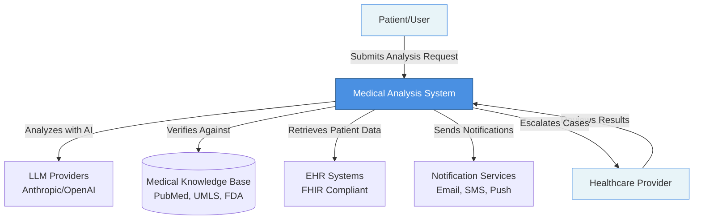
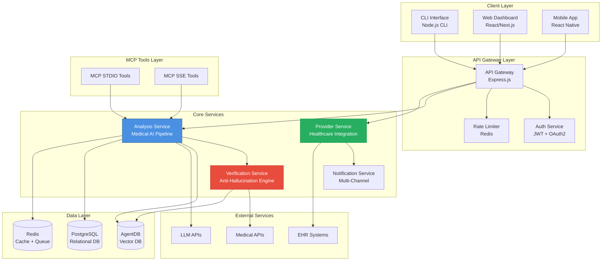
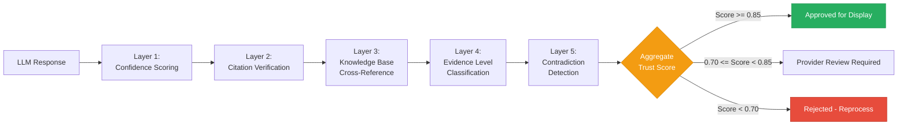
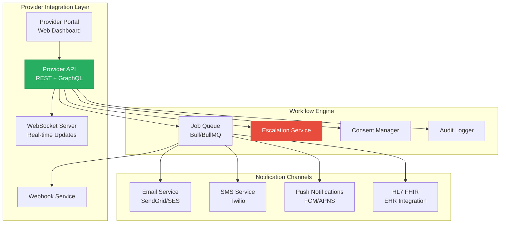
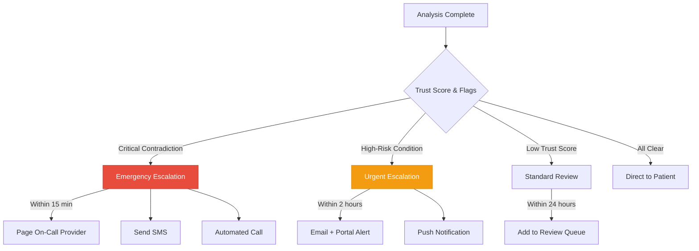
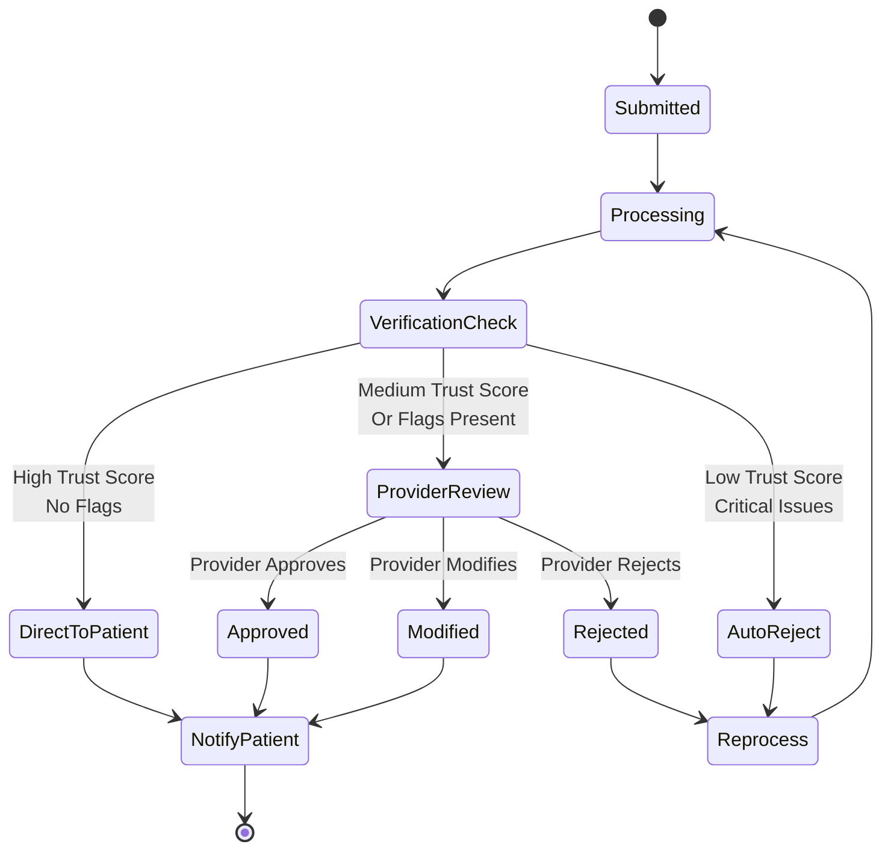
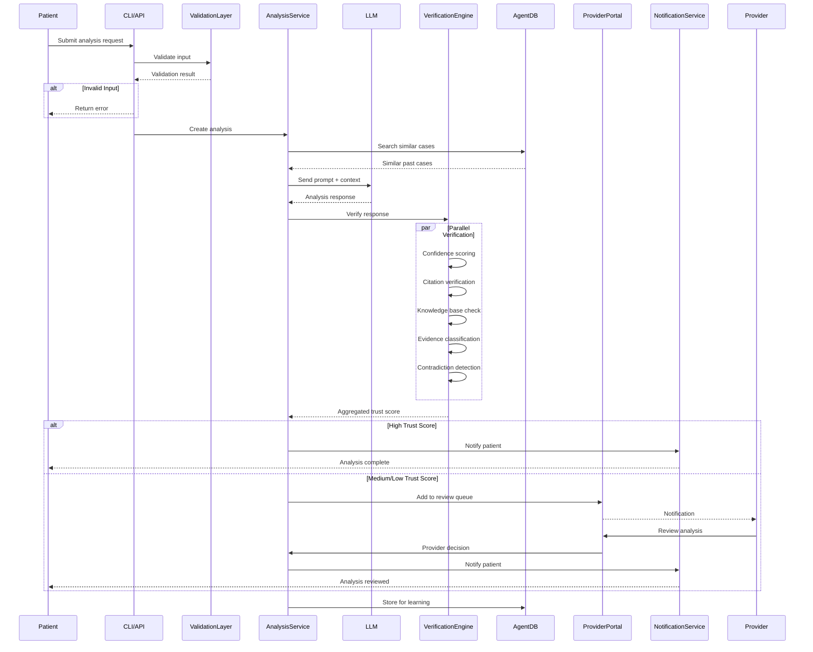
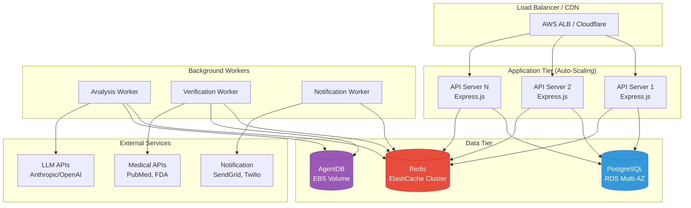

# Medical Analysis System Architecture

**Version:** 1.0.0
**Date:** 2025-11-08
**Status:** Draft
**Architects:** System Architecture Team

---

## Executive Summary

This document outlines the comprehensive architecture for a medical analysis system that prioritizes safety, accuracy, and regulatory compliance. The system employs multi-layered verification mechanisms to prevent AI hallucinations, integrates seamlessly with healthcare providers, and maintains strict safety protocols throughout the analysis pipeline.

**Key Quality Attributes:**
- **Safety First:** Multiple verification layers prevent medical misinformation
- **Accuracy:** Confidence scoring and citation verification ensure reliability
- **Compliance:** HIPAA-compliant design with audit trails
- **Scalability:** Modular architecture supports growth
- **Extensibility:** Plugin architecture for future medical domains

---

## Table of Contents

1. [System Context](#1-system-context-c4-level-1)
2. [Container Architecture](#2-container-architecture-c4-level-2)
3. [Anti-Hallucination Verification System](#3-anti-hallucination-verification-system)
4. [Healthcare Provider Integration](#4-healthcare-provider-integration)
5. [System Components](#5-system-components)
6. [Safety Mechanisms](#6-safety-mechanisms)
7. [Data Architecture](#7-data-architecture)
8. [Technology Stack](#8-technology-stack)
9. [Architecture Decision Records](#9-architecture-decision-records)
10. [Deployment Architecture](#10-deployment-architecture)

---

## 1. System Context (C4 Level 1)



**External Actors:**
- **Patients/Users:** Submit medical queries, health data, or symptoms for analysis
- **Healthcare Providers:** Review AI-generated analyses, approve recommendations, monitor patients
- **LLM Providers:** Claude, GPT-4, or other medical-trained models
- **Medical Knowledge Bases:** PubMed, UMLS, ICD-10, FDA databases, medical literature
- **EHR Systems:** Electronic Health Record systems via FHIR API
- **Notification Services:** Multi-channel communication infrastructure

---

## 2. Container Architecture (C4 Level 2)



---

## 3. Anti-Hallucination Verification System

### 3.1 Architecture Overview

The anti-hallucination system employs a **multi-layered verification approach** with five independent validation mechanisms working in concert.



### 3.2 Layer 1: Confidence Scoring Mechanism

**Purpose:** Assess the LLM's internal confidence in its response.

**Implementation:**
```typescript
interface ConfidenceScore {
  overall: number;              // 0.0 - 1.0
  perStatement: Map<string, number>;
  uncertainPhrases: string[];   // "possibly", "might", "uncertain"
  hedging: number;              // Count of hedge words
  specificity: number;          // Measure of concrete details
}

class ConfidenceScorer {
  async scoreResponse(response: string, context: MedicalContext): Promise<ConfidenceScore> {
    // 1. Analyze LLM's logprobs or token probabilities
    const tokenConfidence = await this.analyzeTokenProbabilities(response);

    // 2. Detect uncertainty markers
    const uncertaintyMarkers = this.detectUncertaintyPhrases(response);

    // 3. Measure specificity vs vagueness
    const specificity = this.calculateSpecificity(response);

    // 4. Compare to known medical facts
    const factualAlignment = await this.compareToKnowledgeBase(response);

    // 5. Aggregate scores with weights
    return this.aggregateScores({
      tokenConfidence: 0.30,
      uncertaintyMarkers: 0.20,
      specificity: 0.20,
      factualAlignment: 0.30
    });
  }
}
```

**Confidence Thresholds:**
- **>= 0.90:** High confidence - Display with minimal review
- **0.75 - 0.89:** Medium confidence - Highlight for provider attention
- **0.60 - 0.74:** Low confidence - Require provider approval
- **< 0.60:** Very low confidence - Flag for re-analysis or rejection

### 3.3 Layer 2: Citation Verification

**Purpose:** Ensure all medical claims are backed by verifiable sources.

**Architecture:**
```typescript
interface Citation {
  id: string;
  source: string;              // PubMed, FDA, Guidelines
  title: string;
  authors: string[];
  publicationDate: Date;
  doi?: string;
  pmid?: string;
  relevanceScore: number;      // 0.0 - 1.0
  evidenceLevel: EvidenceLevel;
}

interface VerificationResult {
  claimId: string;
  claim: string;
  citations: Citation[];
  verificationStatus: 'verified' | 'partial' | 'unverified';
  supportStrength: number;     // 0.0 - 1.0
}

class CitationVerifier {
  async verifyClaims(response: string): Promise<VerificationResult[]> {
    // 1. Extract medical claims using NER
    const claims = await this.extractMedicalClaims(response);

    // 2. For each claim, search medical databases
    const verifications = await Promise.all(
      claims.map(claim => this.verifyClaimAgainstSources(claim))
    );

    // 3. Rank citations by relevance and evidence level
    return verifications.map(v => this.rankCitations(v));
  }

  private async verifyClaimAgainstSources(claim: string): Promise<VerificationResult> {
    // Search PubMed, Cochrane, FDA, UpToDate
    const pubmedResults = await this.searchPubMed(claim);
    const fdaResults = await this.searchFDA(claim);
    const guidelineResults = await this.searchClinicalGuidelines(claim);

    // Cross-reference and validate
    return this.aggregateSourceVerifications([
      pubmedResults,
      fdaResults,
      guidelineResults
    ]);
  }
}
```

**Citation Sources (Priority Order):**
1. **Cochrane Systematic Reviews** (Evidence Level: A)
2. **FDA Guidelines & Approvals** (Evidence Level: A)
3. **Clinical Practice Guidelines** (e.g., AHA, ADA) (Evidence Level: A-B)
4. **Meta-analyses & RCTs** (Evidence Level: A-B)
5. **PubMed Peer-Reviewed Studies** (Evidence Level: B-C)
6. **Medical Textbooks** (Evidence Level: C)

### 3.4 Layer 3: Knowledge Base Cross-Referencing

**Purpose:** Validate claims against structured medical knowledge bases.

**Architecture:**
```typescript
interface KnowledgeBaseRef {
  database: 'UMLS' | 'SNOMED' | 'ICD10' | 'RxNorm' | 'MeSH';
  conceptId: string;
  conceptName: string;
  semanticType: string;
  relationships: Relationship[];
  confidence: number;
}

class KnowledgeBaseValidator {
  private databases: MedicalDatabase[];

  async crossReference(response: string): Promise<ValidationReport> {
    // 1. Extract medical concepts (diseases, drugs, procedures)
    const concepts = await this.extractMedicalConcepts(response);

    // 2. Map to standard terminologies
    const umlsConcepts = await this.mapToUMLS(concepts);
    const snomedConcepts = await this.mapToSNOMED(concepts);
    const icd10Codes = await this.mapToICD10(concepts);

    // 3. Verify relationships and contraindications
    const relationships = await this.verifyRelationships(umlsConcepts);

    // 4. Check for known contradictions
    const contradictions = await this.detectContradictions(concepts);

    return {
      mappedConcepts: [...umlsConcepts, ...snomedConcepts],
      validRelationships: relationships,
      contradictions: contradictions,
      overallValidity: this.calculateValidity(relationships, contradictions)
    };
  }
}
```

**Knowledge Bases Integrated:**
- **UMLS (Unified Medical Language System):** Comprehensive medical terminology
- **SNOMED CT:** Clinical terminology standard
- **ICD-10:** Disease classification
- **RxNorm:** Medication terminology
- **MeSH:** Medical Subject Headings for literature
- **DrugBank:** Drug interactions and contraindications

### 3.5 Layer 4: Evidence Level Tracking

**Purpose:** Classify the strength of evidence for each recommendation.

**Evidence Hierarchy:**
```typescript
enum EvidenceLevel {
  A = 'A',  // Strong evidence (systematic reviews, meta-analyses)
  B = 'B',  // Moderate evidence (RCTs, prospective studies)
  C = 'C',  // Limited evidence (observational studies, case reports)
  D = 'D',  // Expert opinion, consensus statements
  E = 'E'   // No evidence (theoretical, AI-generated)
}

interface EvidenceClassification {
  claim: string;
  evidenceLevel: EvidenceLevel;
  studyCount: number;
  latestStudyDate: Date;
  consensusStrength: number;  // 0.0 - 1.0
  limitations: string[];
}

class EvidenceClassifier {
  async classifyEvidence(claim: string, citations: Citation[]): Promise<EvidenceClassification> {
    // 1. Analyze study types
    const studyTypes = citations.map(c => this.identifyStudyType(c));

    // 2. Count supporting vs contradicting studies
    const consensus = this.calculateConsensus(citations);

    // 3. Check recency (prefer recent studies)
    const recency = this.assessRecency(citations);

    // 4. Assign evidence level
    const level = this.assignEvidenceLevel(studyTypes, consensus, recency);

    return {
      claim,
      evidenceLevel: level,
      studyCount: citations.length,
      latestStudyDate: Math.max(...citations.map(c => c.publicationDate)),
      consensusStrength: consensus,
      limitations: this.identifyLimitations(citations)
    };
  }
}
```

**Display Rules:**
- **Level A:** Display prominently with "Strong Evidence" badge
- **Level B:** Display with "Moderate Evidence" badge
- **Level C-D:** Display with "Limited Evidence" warning
- **Level E:** Require provider approval before display

### 3.6 Layer 5: Contradiction Detection

**Purpose:** Identify logical contradictions, drug interactions, and conflicting recommendations.

**Architecture:**
```typescript
interface Contradiction {
  type: 'logical' | 'drug-interaction' | 'contraindication' | 'guideline-conflict';
  severity: 'critical' | 'major' | 'moderate' | 'minor';
  statement1: string;
  statement2: string;
  explanation: string;
  source?: string;
}

class ContradictionDetector {
  async detectContradictions(response: string, context: MedicalContext): Promise<Contradiction[]> {
    const contradictions: Contradiction[] = [];

    // 1. Logical contradictions within response
    contradictions.push(...await this.detectLogicalContradictions(response));

    // 2. Drug-drug interactions
    if (context.medications) {
      contradictions.push(...await this.detectDrugInteractions(context.medications));
    }

    // 3. Contraindications with patient conditions
    if (context.conditions) {
      contradictions.push(...await this.detectContraindications(response, context.conditions));
    }

    // 4. Conflicts with clinical guidelines
    contradictions.push(...await this.detectGuidelineConflicts(response));

    // 5. Temporal contradictions (outdated information)
    contradictions.push(...await this.detectOutdatedInfo(response));

    return this.rankBySeverity(contradictions);
  }

  private async detectDrugInteractions(medications: string[]): Promise<Contradiction[]> {
    // Query DrugBank, FDA, and interaction databases
    const interactions = await this.drugInteractionService.check(medications);

    return interactions
      .filter(i => i.severity === 'critical' || i.severity === 'major')
      .map(i => ({
        type: 'drug-interaction',
        severity: i.severity,
        statement1: `Prescribed ${i.drug1}`,
        statement2: `With existing ${i.drug2}`,
        explanation: i.clinicalEffect,
        source: 'DrugBank'
      }));
  }
}
```

**Critical Contradictions (Auto-Reject):**
- Major drug-drug interactions
- Absolute contraindications with patient conditions
- Dosages outside safe ranges
- Contradictory diagnoses without explanation

### 3.7 Aggregate Trust Score

**Final Decision Engine:**
```typescript
interface TrustScore {
  aggregate: number;           // 0.0 - 1.0
  confidence: number;          // Layer 1
  citationScore: number;       // Layer 2
  knowledgeBaseScore: number;  // Layer 3
  evidenceScore: number;       // Layer 4
  contradictionPenalty: number; // Layer 5
  recommendation: 'approved' | 'review' | 'rejected';
}

class TrustScoreCalculator {
  calculateTrustScore(
    confidence: ConfidenceScore,
    verification: VerificationResult[],
    kbValidation: ValidationReport,
    evidenceClassification: EvidenceClassification[],
    contradictions: Contradiction[]
  ): TrustScore {
    // Weighted aggregation
    const scores = {
      confidence: confidence.overall * 0.25,
      citation: this.averageVerificationScore(verification) * 0.25,
      knowledgeBase: kbValidation.overallValidity * 0.20,
      evidence: this.averageEvidenceScore(evidenceClassification) * 0.20,
      contradiction: this.calculateContradictionPenalty(contradictions) * 0.10
    };

    const aggregate =
      scores.confidence +
      scores.citation +
      scores.knowledgeBase +
      scores.evidence -
      scores.contradiction;

    return {
      aggregate: Math.max(0, Math.min(1, aggregate)),
      confidence: confidence.overall,
      citationScore: scores.citation / 0.25,
      knowledgeBaseScore: scores.knowledgeBase / 0.20,
      evidenceScore: scores.evidence / 0.20,
      contradictionPenalty: scores.contradiction / 0.10,
      recommendation: this.determineRecommendation(aggregate, contradictions)
    };
  }

  private determineRecommendation(score: number, contradictions: Contradiction[]): string {
    // Critical contradictions always require review
    if (contradictions.some(c => c.severity === 'critical')) {
      return 'review';
    }

    if (score >= 0.85) return 'approved';
    if (score >= 0.70) return 'review';
    return 'rejected';
  }
}
```

---

## 4. Healthcare Provider Integration

### 4.1 Architecture Overview



### 4.2 Multi-Channel Notification System

**Architecture:**
```typescript
interface NotificationChannel {
  type: 'email' | 'sms' | 'webhook' | 'websocket' | 'hl7' | 'push';
  priority: number;
  enabled: boolean;
  config: ChannelConfig;
}

interface NotificationRequest {
  recipientId: string;
  recipientType: 'provider' | 'patient';
  priority: 'critical' | 'high' | 'medium' | 'low';
  category: 'analysis-complete' | 'review-required' | 'emergency' | 'message';
  subject: string;
  body: string;
  data: any;
  channels: NotificationChannel[];
  retryPolicy: RetryPolicy;
}

class NotificationOrchestrator {
  async send(request: NotificationRequest): Promise<NotificationResult[]> {
    // 1. Determine appropriate channels based on priority
    const channels = this.selectChannels(request);

    // 2. Apply rate limiting
    await this.checkRateLimits(request.recipientId);

    // 3. Send in parallel across channels
    const results = await Promise.allSettled(
      channels.map(channel => this.sendViaChannel(channel, request))
    );

    // 4. Log results and handle failures
    await this.logNotificationResults(request, results);

    // 5. Retry failed channels if configured
    await this.retryFailedChannels(request, results);

    return results;
  }

  private selectChannels(request: NotificationRequest): NotificationChannel[] {
    // Critical: All channels
    if (request.priority === 'critical') {
      return request.channels.filter(c => c.enabled);
    }

    // High: SMS + Email + WebSocket
    if (request.priority === 'high') {
      return request.channels.filter(c =>
        ['sms', 'email', 'websocket'].includes(c.type) && c.enabled
      );
    }

    // Medium: Email + WebSocket
    if (request.priority === 'medium') {
      return request.channels.filter(c =>
        ['email', 'websocket'].includes(c.type) && c.enabled
      );
    }

    // Low: Email only
    return request.channels.filter(c => c.type === 'email' && c.enabled);
  }
}
```

**Channel Implementations:**

**4.2.1 Email Notifications**
```typescript
class EmailNotificationService {
  private client: SendGridClient | SESClient;

  async send(recipient: string, notification: NotificationRequest): Promise<void> {
    const template = await this.getTemplate(notification.category);

    await this.client.send({
      to: recipient,
      from: 'noreply@medical-analysis.example.com',
      subject: notification.subject,
      html: this.renderTemplate(template, notification.data),
      attachments: notification.data.attachments || [],
      headers: {
        'X-Priority': this.mapPriority(notification.priority),
        'X-Notification-Id': notification.id
      }
    });
  }
}
```

**4.2.2 SMS Notifications**
```typescript
class SMSNotificationService {
  private twilio: TwilioClient;

  async send(phoneNumber: string, notification: NotificationRequest): Promise<void> {
    // Truncate for SMS length limits
    const message = this.truncateForSMS(notification.body, 160);

    await this.twilio.messages.create({
      to: phoneNumber,
      from: process.env.TWILIO_PHONE_NUMBER,
      body: message,
      statusCallback: `${process.env.API_URL}/webhooks/sms-status`
    });
  }

  private truncateForSMS(text: string, maxLength: number): string {
    if (text.length <= maxLength) return text;
    return text.substring(0, maxLength - 20) + '... [View full message in portal]';
  }
}
```

**4.2.3 WebSocket Real-Time Updates**
```typescript
class WebSocketNotificationService {
  private io: SocketIOServer;

  async send(userId: string, notification: NotificationRequest): Promise<void> {
    // Find active connections for user
    const sockets = await this.io.in(`user:${userId}`).fetchSockets();

    if (sockets.length === 0) {
      // User not connected, fallback to other channels
      return;
    }

    // Emit to all user's connected devices
    this.io.to(`user:${userId}`).emit('notification', {
      id: notification.id,
      category: notification.category,
      priority: notification.priority,
      data: notification.data,
      timestamp: new Date()
    });
  }
}
```

**4.2.4 Webhook Integration**
```typescript
class WebhookNotificationService {
  async send(webhookUrl: string, notification: NotificationRequest): Promise<void> {
    const payload = {
      event: notification.category,
      priority: notification.priority,
      timestamp: new Date().toISOString(),
      data: notification.data
    };

    // Sign the payload for security
    const signature = this.generateSignature(payload);

    await fetch(webhookUrl, {
      method: 'POST',
      headers: {
        'Content-Type': 'application/json',
        'X-Webhook-Signature': signature,
        'X-Notification-Id': notification.id
      },
      body: JSON.stringify(payload),
      timeout: 10000  // 10 second timeout
    });
  }

  private generateSignature(payload: any): string {
    const secret = process.env.WEBHOOK_SECRET;
    return crypto
      .createHmac('sha256', secret)
      .update(JSON.stringify(payload))
      .digest('hex');
  }
}
```

### 4.3 Provider Dashboard Interface

**Component Architecture:**
```typescript
interface ProviderDashboard {
  sections: {
    pendingReviews: PendingReview[];
    activePatients: PatientSummary[];
    recentAnalyses: AnalysisResult[];
    alerts: Alert[];
    messages: Message[];
  };
  filters: DashboardFilters;
  preferences: ProviderPreferences;
}

interface PendingReview {
  analysisId: string;
  patientId: string;
  patientName: string;
  submittedAt: Date;
  priority: 'critical' | 'high' | 'medium' | 'low';
  category: string;
  trustScore: number;
  flaggedIssues: string[];
  estimatedReviewTime: number;  // minutes
}

class ProviderDashboardService {
  async getDashboard(providerId: string): Promise<ProviderDashboard> {
    const [pending, patients, analyses, alerts, messages] = await Promise.all([
      this.getPendingReviews(providerId),
      this.getActivePatients(providerId),
      this.getRecentAnalyses(providerId),
      this.getAlerts(providerId),
      this.getMessages(providerId)
    ]);

    return {
      sections: { pending, patients, analyses, alerts, messages },
      filters: await this.getFilters(providerId),
      preferences: await this.getPreferences(providerId)
    };
  }

  async reviewAnalysis(
    providerId: string,
    analysisId: string,
    decision: ReviewDecision
  ): Promise<void> {
    // 1. Validate provider has permission
    await this.validateProviderAccess(providerId, analysisId);

    // 2. Record decision
    await this.recordReviewDecision(analysisId, decision);

    // 3. If approved, release to patient
    if (decision.approved) {
      await this.releaseToPatient(analysisId, decision.modifications);
    }

    // 4. If rejected, request re-analysis
    if (decision.rejected) {
      await this.requestReAnalysis(analysisId, decision.rejectionReason);
    }

    // 5. Notify patient of outcome
    await this.notifyPatient(analysisId, decision);

    // 6. Update AgentDB for learning
    await this.updateLearningModel(analysisId, decision);
  }
}
```

**Dashboard UI Components:**
- **Pending Reviews Queue:** Priority-sorted list of analyses awaiting review
- **Patient Panel:** Overview of patients with active analyses
- **Analysis Viewer:** Detailed view with trust scores and verification data
- **Alert Center:** Critical notifications and emergency escalations
- **Message Center:** Secure patient-provider communication
- **Analytics Dashboard:** Performance metrics and quality indicators

### 4.4 Patient-Provider Messaging

**Secure Messaging Architecture:**
```typescript
interface Message {
  id: string;
  conversationId: string;
  senderId: string;
  senderType: 'patient' | 'provider';
  recipientId: string;
  recipientType: 'patient' | 'provider';
  subject?: string;
  body: string;
  attachments: Attachment[];
  sentAt: Date;
  readAt?: Date;
  encryptedContent: string;  // E2E encrypted
  relatedAnalysisId?: string;
}

class MessagingService {
  async sendMessage(message: Message): Promise<void> {
    // 1. Encrypt message content
    const encrypted = await this.encryptMessage(message);

    // 2. Store in database
    await this.db.messages.create(encrypted);

    // 3. Notify recipient via preferred channel
    await this.notificationService.send({
      recipientId: message.recipientId,
      priority: 'medium',
      category: 'message',
      subject: `New message from ${message.senderType}`,
      body: 'You have a new secure message',
      channels: await this.getRecipientChannels(message.recipientId)
    });

    // 4. Log for audit trail
    await this.auditLogger.log({
      action: 'message_sent',
      actorId: message.senderId,
      targetId: message.recipientId,
      metadata: { messageId: message.id }
    });
  }

  private async encryptMessage(message: Message): Promise<EncryptedMessage> {
    // Use recipient's public key for E2E encryption
    const recipientPublicKey = await this.keyManager.getPublicKey(message.recipientId);

    const encrypted = crypto.publicEncrypt(
      recipientPublicKey,
      Buffer.from(JSON.stringify({
        body: message.body,
        attachments: message.attachments
      }))
    );

    return {
      ...message,
      encryptedContent: encrypted.toString('base64')
    };
  }
}
```

**HIPAA Compliance Features:**
- **End-to-End Encryption:** All messages encrypted at rest and in transit
- **Access Logging:** Complete audit trail of message access
- **Retention Policies:** Automatic archival and deletion per regulations
- **Secure Attachments:** Encrypted file storage with virus scanning
- **Authentication:** Multi-factor authentication for sensitive operations

### 4.5 Emergency Escalation Protocols

**Escalation Decision Tree:**


**Implementation:**
```typescript
enum EscalationLevel {
  EMERGENCY = 'emergency',      // 15 min response required
  URGENT = 'urgent',            // 2 hour response required
  STANDARD = 'standard',        // 24 hour response required
  ROUTINE = 'routine'           // 72 hour response allowed
}

interface EscalationRule {
  condition: (analysis: AnalysisResult) => boolean;
  level: EscalationLevel;
  notificationChannels: NotificationChannel[];
  escalationChain: string[];    // Provider IDs in order
  autoActions: AutoAction[];
}

class EscalationService {
  private rules: EscalationRule[] = [
    {
      condition: (a) => a.flags.includes('critical-drug-interaction'),
      level: EscalationLevel.EMERGENCY,
      notificationChannels: ['sms', 'call', 'email', 'push', 'websocket'],
      escalationChain: ['primary-provider', 'backup-provider', 'on-call'],
      autoActions: ['create-incident', 'log-emergency', 'alert-patient']
    },
    {
      condition: (a) => a.trustScore < 0.60,
      level: EscalationLevel.URGENT,
      notificationChannels: ['email', 'push', 'websocket'],
      escalationChain: ['primary-provider'],
      autoActions: ['flag-for-review']
    },
    // ... more rules
  ];

  async escalate(analysis: AnalysisResult): Promise<EscalationResult> {
    // 1. Determine escalation level
    const applicableRules = this.rules.filter(rule => rule.condition(analysis));
    const highestLevel = this.getHighestEscalationLevel(applicableRules);

    // 2. Execute auto-actions
    await Promise.all(
      applicableRules.flatMap(rule =>
        rule.autoActions.map(action => this.executeAutoAction(action, analysis))
      )
    );

    // 3. Notify escalation chain
    const notificationResults = await this.notifyEscalationChain(
      highestLevel,
      applicableRules,
      analysis
    );

    // 4. Start response timer
    await this.startResponseTimer(analysis.id, highestLevel);

    // 5. If no response within SLA, escalate further
    this.scheduleAutomaticEscalation(analysis.id, highestLevel);

    return {
      level: highestLevel,
      notifiedProviders: notificationResults.map(r => r.providerId),
      expectedResponseTime: this.getSLATime(highestLevel)
    };
  }

  private async notifyEscalationChain(
    level: EscalationLevel,
    rules: EscalationRule[],
    analysis: AnalysisResult
  ): Promise<NotificationResult[]> {
    const chain = rules[0].escalationChain;
    const channels = rules[0].notificationChannels;

    // Notify in parallel for emergency, sequential for others
    if (level === EscalationLevel.EMERGENCY) {
      return Promise.all(
        chain.map(providerId => this.notifyProvider(providerId, channels, analysis))
      );
    } else {
      return this.notifySequentially(chain, channels, analysis);
    }
  }

  private getSLATime(level: EscalationLevel): number {
    switch (level) {
      case EscalationLevel.EMERGENCY: return 15;  // minutes
      case EscalationLevel.URGENT: return 120;
      case EscalationLevel.STANDARD: return 1440;
      case EscalationLevel.ROUTINE: return 4320;
    }
  }
}
```

### 4.6 Consent Management

**Architecture:**
```typescript
interface Consent {
  id: string;
  patientId: string;
  type: ConsentType;
  granted: boolean;
  grantedAt?: Date;
  revokedAt?: Date;
  scope: ConsentScope;
  expiresAt?: Date;
  digitalSignature: string;
  witnessId?: string;
}

enum ConsentType {
  AI_ANALYSIS = 'ai-analysis',
  DATA_SHARING = 'data-sharing',
  PROVIDER_COMMUNICATION = 'provider-communication',
  RESEARCH = 'research',
  THIRD_PARTY = 'third-party'
}

class ConsentManager {
  async checkConsent(patientId: string, action: string): Promise<boolean> {
    const requiredConsents = this.getRequiredConsents(action);

    const consents = await Promise.all(
      requiredConsents.map(type => this.getConsent(patientId, type))
    );

    // All required consents must be granted and not expired
    return consents.every(consent =>
      consent?.granted &&
      !consent.revokedAt &&
      (!consent.expiresAt || consent.expiresAt > new Date())
    );
  }

  async requestConsent(
    patientId: string,
    type: ConsentType,
    details: ConsentDetails
  ): Promise<ConsentRequest> {
    // 1. Create consent request
    const request = await this.db.consentRequests.create({
      patientId,
      type,
      details,
      status: 'pending',
      createdAt: new Date()
    });

    // 2. Notify patient
    await this.notificationService.send({
      recipientId: patientId,
      priority: 'high',
      category: 'consent-required',
      subject: 'Consent Required for Medical Analysis',
      body: this.generateConsentRequestMessage(type, details)
    });

    return request;
  }

  async grantConsent(
    patientId: string,
    requestId: string,
    signature: string
  ): Promise<Consent> {
    // 1. Verify identity
    await this.verifyPatientIdentity(patientId);

    // 2. Validate signature
    const isValid = await this.validateSignature(signature, patientId);
    if (!isValid) throw new Error('Invalid signature');

    // 3. Create consent record
    const consent = await this.db.consents.create({
      patientId,
      type: request.type,
      granted: true,
      grantedAt: new Date(),
      scope: request.details.scope,
      digitalSignature: signature
    });

    // 4. Update request status
    await this.db.consentRequests.update(requestId, { status: 'granted' });

    // 5. Log for audit
    await this.auditLogger.log({
      action: 'consent_granted',
      actorId: patientId,
      metadata: { consentId: consent.id, type: consent.type }
    });

    return consent;
  }
}
```

---

## 5. System Components

### 5.1 CLI Interface Architecture

**Design Philosophy:**
- **User-Friendly:** Clear commands, helpful error messages
- **Secure:** No sensitive data in command history
- **Efficient:** Batch operations, caching, progress indicators
- **Extensible:** Plugin architecture for custom analyzers

**Command Structure:**
```bash
medanalysis <command> [subcommand] [options]

Commands:
  analyze      Perform medical analysis
  verify       Verify analysis results
  provider     Healthcare provider operations
  consent      Manage consent preferences
  config       Configuration management
  history      View analysis history
```

**Implementation:**
```typescript
// CLI Entry Point
#!/usr/bin/env node
import { Command } from 'commander';
import { AnalysisCommand } from './commands/analysis';
import { VerifyCommand } from './commands/verify';
import { ProviderCommand } from './commands/provider';

const program = new Command();

program
  .name('medanalysis')
  .description('Medical Analysis System CLI')
  .version('1.0.0');

// Analyze Command
program
  .command('analyze')
  .description('Perform medical analysis')
  .option('-i, --input <file>', 'Input file with symptoms or health data')
  .option('-t, --type <type>', 'Analysis type: symptom|drug|diagnostic')
  .option('-o, --output <file>', 'Output file for results (JSON)')
  .option('--wait', 'Wait for provider review before showing results')
  .option('--confidence <threshold>', 'Minimum confidence threshold (0-1)', '0.85')
  .action(async (options) => {
    const cmd = new AnalysisCommand();
    await cmd.execute(options);
  });

// Verify Command
program
  .command('verify <analysis-id>')
  .description('Verify analysis results against medical databases')
  .option('--sources <sources>', 'Comma-separated: pubmed,fda,umls', 'pubmed,fda')
  .option('--detailed', 'Show detailed verification report')
  .action(async (analysisId, options) => {
    const cmd = new VerifyCommand();
    await cmd.execute(analysisId, options);
  });

// Provider Commands
const provider = program
  .command('provider')
  .description('Healthcare provider operations');

provider
  .command('login')
  .description('Login as healthcare provider')
  .requiredOption('-e, --email <email>', 'Provider email')
  .option('--2fa', 'Enable two-factor authentication')
  .action(async (options) => {
    await ProviderCommand.login(options);
  });

provider
  .command('dashboard')
  .description('View provider dashboard')
  .option('--pending', 'Show only pending reviews')
  .option('--export <file>', 'Export dashboard data to file')
  .action(async (options) => {
    await ProviderCommand.dashboard(options);
  });

provider
  .command('review <analysis-id>')
  .description('Review and approve/reject analysis')
  .requiredOption('-d, --decision <decision>', 'Decision: approve|reject|modify')
  .option('-c, --comments <text>', 'Review comments')
  .action(async (analysisId, options) => {
    await ProviderCommand.review(analysisId, options);
  });

program.parse();
```

**Analysis Command Implementation:**
```typescript
export class AnalysisCommand {
  async execute(options: AnalyzeOptions): Promise<void> {
    const spinner = ora('Initializing analysis...').start();

    try {
      // 1. Load input data
      const input = await this.loadInput(options.input);

      // 2. Validate consent
      spinner.text = 'Checking consent...';
      const hasConsent = await this.checkConsent(input.patientId);
      if (!hasConsent) {
        spinner.fail('Consent required. Run: medanalysis consent grant');
        process.exit(1);
      }

      // 3. Submit analysis
      spinner.text = 'Submitting analysis...';
      const analysis = await this.api.submitAnalysis(input);

      // 4. Wait for processing
      spinner.text = 'Processing analysis...';
      const result = await this.pollForResult(analysis.id);

      // 5. Check if provider review required
      if (result.requiresReview && !options.wait) {
        spinner.warn('Provider review required. Use --wait to wait for approval.');
        console.log(`\nAnalysis ID: ${analysis.id}`);
        console.log('Check status: medanalysis status ${analysis.id}');
        return;
      }

      // 6. Display results
      spinner.succeed('Analysis complete!');
      this.displayResults(result);

      // 7. Save output if requested
      if (options.output) {
        await fs.writeFile(options.output, JSON.stringify(result, null, 2));
        console.log(`\nResults saved to: ${options.output}`);
      }

    } catch (error) {
      spinner.fail('Analysis failed');
      console.error(chalk.red(`Error: ${error.message}`));
      process.exit(1);
    }
  }

  private displayResults(result: AnalysisResult): void {
    console.log('\n' + chalk.bold('Analysis Results'));
    console.log('─'.repeat(50));

    // Trust Score
    const scoreColor = result.trustScore >= 0.85 ? 'green' :
                      result.trustScore >= 0.70 ? 'yellow' : 'red';
    console.log(`Trust Score: ${chalk[scoreColor](result.trustScore.toFixed(2))}`);

    // Evidence Level
    console.log(`Evidence Level: ${this.formatEvidenceLevel(result.evidenceLevel)}`);

    // Main findings
    console.log('\n' + chalk.bold('Findings:'));
    result.findings.forEach((finding, i) => {
      console.log(`  ${i + 1}. ${finding.description}`);
      console.log(`     Confidence: ${finding.confidence.toFixed(2)}`);
      if (finding.citations.length > 0) {
        console.log(`     Citations: ${finding.citations.length} sources`);
      }
    });

    // Warnings
    if (result.warnings.length > 0) {
      console.log('\n' + chalk.yellow.bold('Warnings:'));
      result.warnings.forEach(w => console.log(`  ⚠ ${w}`));
    }

    // Recommendations
    if (result.recommendations.length > 0) {
      console.log('\n' + chalk.bold('Recommendations:'));
      result.recommendations.forEach((r, i) => {
        console.log(`  ${i + 1}. ${r}`);
      });
    }

    // Disclaimer
    console.log('\n' + chalk.dim('Note: This is not medical advice. Consult a healthcare professional.'));
  }
}
```

### 5.2 REST API Design

**API Architecture:**
```typescript
// Express.js REST API with OpenAPI/Swagger specification

interface APIRouter {
  basePath: string;
  routes: Route[];
  middleware: Middleware[];
}

// API Versioning
const API_VERSION = 'v1';
const BASE_PATH = `/api/${API_VERSION}`;

// Route Definitions
const routes: APIRouter[] = [
  {
    basePath: `${BASE_PATH}/analysis`,
    routes: [
      {
        method: 'POST',
        path: '/',
        handler: 'AnalysisController.create',
        auth: 'patient',
        rateLimit: { max: 10, windowMs: 3600000 }  // 10 per hour
      },
      {
        method: 'GET',
        path: '/:id',
        handler: 'AnalysisController.get',
        auth: 'patient-or-provider'
      },
      {
        method: 'GET',
        path: '/:id/verification',
        handler: 'AnalysisController.getVerification',
        auth: 'any'
      }
    ]
  },
  {
    basePath: `${BASE_PATH}/provider`,
    routes: [
      {
        method: 'GET',
        path: '/dashboard',
        handler: 'ProviderController.getDashboard',
        auth: 'provider'
      },
      {
        method: 'POST',
        path: '/review/:analysisId',
        handler: 'ProviderController.reviewAnalysis',
        auth: 'provider'
      },
      {
        method: 'GET',
        path: '/patients',
        handler: 'ProviderController.getPatients',
        auth: 'provider'
      }
    ]
  }
];

// Controller Example
export class AnalysisController {
  async create(req: Request, res: Response): Promise<void> {
    try {
      // 1. Validate request
      const validated = await this.validator.validate(req.body, AnalysisSchema);

      // 2. Check consent
      const hasConsent = await this.consentManager.checkConsent(
        req.user.id,
        'ai-analysis'
      );
      if (!hasConsent) {
        res.status(403).json({
          error: 'consent_required',
          message: 'Patient consent required for AI analysis'
        });
        return;
      }

      // 3. Submit to analysis pipeline
      const analysis = await this.analysisService.submit({
        patientId: req.user.id,
        type: validated.type,
        input: validated.input,
        context: validated.context
      });

      // 4. Return analysis ID
      res.status(202).json({
        id: analysis.id,
        status: 'processing',
        estimatedCompletionTime: analysis.estimatedTime,
        webhookUrl: `${BASE_PATH}/webhooks/analysis/${analysis.id}`
      });

    } catch (error) {
      this.handleError(error, res);
    }
  }

  async get(req: Request, res: Response): Promise<void> {
    try {
      const { id } = req.params;

      // 1. Retrieve analysis
      const analysis = await this.analysisService.getById(id);

      // 2. Check authorization
      if (!this.canAccessAnalysis(req.user, analysis)) {
        res.status(403).json({ error: 'forbidden' });
        return;
      }

      // 3. Return results
      res.json({
        id: analysis.id,
        status: analysis.status,
        trustScore: analysis.trustScore,
        result: analysis.result,
        verification: analysis.verification,
        reviewStatus: analysis.reviewStatus,
        providerComments: analysis.providerComments
      });

    } catch (error) {
      this.handleError(error, res);
    }
  }
}
```

**OpenAPI Specification (Excerpt):**
```yaml
openapi: 3.0.0
info:
  title: Medical Analysis System API
  version: 1.0.0
  description: API for AI-powered medical analysis with verification

servers:
  - url: https://api.medical-analysis.example.com/api/v1
    description: Production server
  - url: https://staging-api.medical-analysis.example.com/api/v1
    description: Staging server

paths:
  /analysis:
    post:
      summary: Submit new analysis
      operationId: createAnalysis
      tags: [Analysis]
      security:
        - BearerAuth: []
      requestBody:
        required: true
        content:
          application/json:
            schema:
              $ref: '#/components/schemas/AnalysisRequest'
      responses:
        '202':
          description: Analysis submitted successfully
          content:
            application/json:
              schema:
                $ref: '#/components/schemas/AnalysisResponse'
        '403':
          description: Consent required
        '429':
          description: Rate limit exceeded

  /analysis/{id}:
    get:
      summary: Get analysis results
      operationId: getAnalysis
      tags: [Analysis]
      security:
        - BearerAuth: []
      parameters:
        - name: id
          in: path
          required: true
          schema:
            type: string
            format: uuid
      responses:
        '200':
          description: Analysis results
          content:
            application/json:
              schema:
                $ref: '#/components/schemas/AnalysisResult'

components:
  schemas:
    AnalysisRequest:
      type: object
      required:
        - type
        - input
      properties:
        type:
          type: string
          enum: [symptom, drug, diagnostic, preventive]
        input:
          type: object
          description: Analysis input data
        context:
          type: object
          description: Additional context (medications, conditions, etc.)

    AnalysisResult:
      type: object
      properties:
        id:
          type: string
          format: uuid
        status:
          type: string
          enum: [processing, completed, review_required, rejected]
        trustScore:
          type: number
          minimum: 0
          maximum: 1
        findings:
          type: array
          items:
            $ref: '#/components/schemas/Finding'
        verification:
          $ref: '#/components/schemas/VerificationReport'

  securitySchemes:
    BearerAuth:
      type: http
      scheme: bearer
      bearerFormat: JWT
```

### 5.3 MCP Tool Interfaces

**5.3.1 SSE (Server-Sent Events) Interface**

```typescript
// SSE Server for Real-time Streaming
import { MCPServer } from '@modelcontextprotocol/sdk';

export class MedicalAnalysisMCPServer {
  private server: MCPServer;

  constructor() {
    this.server = new MCPServer({
      name: 'medical-analysis',
      version: '1.0.0',
      capabilities: {
        tools: true,
        resources: true,
        prompts: true
      }
    });

    this.registerTools();
    this.registerResources();
  }

  private registerTools(): void {
    // Analyze Tool
    this.server.tool({
      name: 'analyze_symptoms',
      description: 'Analyze patient symptoms with anti-hallucination verification',
      inputSchema: {
        type: 'object',
        properties: {
          symptoms: {
            type: 'array',
            items: { type: 'string' },
            description: 'List of symptoms'
          },
          patientContext: {
            type: 'object',
            description: 'Patient medical history and context'
          },
          confidenceThreshold: {
            type: 'number',
            minimum: 0,
            maximum: 1,
            default: 0.85
          }
        },
        required: ['symptoms']
      }
    }, async (params) => {
      const result = await this.analysisService.analyzeSymptoms(
        params.symptoms,
        params.patientContext,
        params.confidenceThreshold
      );

      return {
        content: [
          {
            type: 'text',
            text: JSON.stringify(result, null, 2)
          }
        ],
        isError: false
      };
    });

    // Verify Tool
    this.server.tool({
      name: 'verify_analysis',
      description: 'Verify analysis against medical databases',
      inputSchema: {
        type: 'object',
        properties: {
          analysisId: { type: 'string' },
          sources: {
            type: 'array',
            items: {
              type: 'string',
              enum: ['pubmed', 'fda', 'umls', 'snomed']
            }
          }
        },
        required: ['analysisId']
      }
    }, async (params) => {
      const verification = await this.verificationService.verify(
        params.analysisId,
        params.sources || ['pubmed', 'fda']
      );

      return {
        content: [
          {
            type: 'text',
            text: JSON.stringify(verification, null, 2)
          }
        ]
      };
    });

    // Provider Review Tool
    this.server.tool({
      name: 'provider_review',
      description: 'Healthcare provider reviews analysis',
      inputSchema: {
        type: 'object',
        properties: {
          analysisId: { type: 'string' },
          providerId: { type: 'string' },
          decision: {
            type: 'string',
            enum: ['approved', 'rejected', 'modified']
          },
          comments: { type: 'string' }
        },
        required: ['analysisId', 'providerId', 'decision']
      }
    }, async (params) => {
      const result = await this.providerService.reviewAnalysis(
        params.analysisId,
        params.providerId,
        params.decision,
        params.comments
      );

      return { content: [{ type: 'text', text: JSON.stringify(result) }] };
    });
  }

  private registerResources(): void {
    // Medical Knowledge Base Resource
    this.server.resource({
      uri: 'medical://knowledge-base/{concept}',
      name: 'Medical Knowledge Base',
      description: 'Access medical concepts from UMLS, SNOMED, ICD-10'
    }, async (uri) => {
      const concept = uri.path.split('/').pop();
      const data = await this.knowledgeBase.lookup(concept);

      return {
        contents: [
          {
            uri,
            mimeType: 'application/json',
            text: JSON.stringify(data, null, 2)
          }
        ]
      };
    });
  }
}
```

**5.3.2 STDIO Interface**

```typescript
// STDIO Server for CLI Integration
import { StdioServerTransport } from '@modelcontextprotocol/sdk';

export class MedicalAnalysisStdioServer {
  async start(): Promise<void> {
    const transport = new StdioServerTransport();
    const server = new MCPServer({
      name: 'medical-analysis-stdio',
      version: '1.0.0'
    });

    // Register same tools as SSE version
    this.registerTools(server);

    // Start server
    await server.connect(transport);

    // Handle process signals
    process.on('SIGINT', async () => {
      await server.close();
      process.exit(0);
    });
  }
}

// Usage in package.json
{
  "bin": {
    "medanalysis-mcp": "./dist/mcp/stdio-server.js"
  }
}

// Claude Code Integration
// Add to MCP settings:
{
  "mcpServers": {
    "medical-analysis": {
      "command": "npx",
      "args": ["medanalysis-mcp"]
    }
  }
}
```

### 5.4 AgentDB Integration for Learning

**Purpose:** Use AgentDB's vector database to learn from past analyses and improve accuracy over time.

```typescript
import { AgentDB } from 'agentdb';

export class MedicalLearningSystem {
  private db: AgentDB;

  constructor() {
    this.db = new AgentDB({
      dbPath: './data/medical-learning.db',
      dimensions: 1536,  // OpenAI embeddings
      enableHNSW: true,  // 150x faster search
      quantization: 'int8'  // 4x memory reduction
    });
  }

  async learnFromAnalysis(
    analysis: AnalysisResult,
    providerReview: ReviewDecision
  ): Promise<void> {
    // 1. Generate embedding for the analysis
    const embedding = await this.generateEmbedding({
      symptoms: analysis.input.symptoms,
      context: analysis.input.context,
      findings: analysis.result.findings
    });

    // 2. Store in AgentDB with metadata
    await this.db.insert({
      id: analysis.id,
      vector: embedding,
      metadata: {
        trustScore: analysis.trustScore,
        providerApproved: providerReview.approved,
        evidenceLevel: analysis.evidenceLevel,
        confidenceScore: analysis.confidenceScore,
        hadContradictions: analysis.contradictions.length > 0,
        processingTime: analysis.processingTimeMs,
        timestamp: new Date()
      }
    });

    // 3. If provider modified the analysis, store the correction
    if (providerReview.modifications) {
      await this.storeCorrection(analysis, providerReview.modifications);
    }
  }

  async findSimilarCases(symptoms: string[], context: any): Promise<PastCase[]> {
    // 1. Generate embedding for query
    const queryEmbedding = await this.generateEmbedding({ symptoms, context });

    // 2. Search AgentDB for similar cases
    const results = await this.db.search({
      vector: queryEmbedding,
      k: 10,
      filter: {
        providerApproved: true,  // Only use approved cases
        trustScore: { $gte: 0.85 }
      }
    });

    // 3. Return past cases with similarity scores
    return results.map(r => ({
      analysisId: r.id,
      similarity: r.score,
      trustScore: r.metadata.trustScore,
      findings: r.metadata.findings
    }));
  }

  async getConfidenceBoost(analysis: AnalysisResult): Promise<number> {
    // If similar approved cases exist, boost confidence
    const similarCases = await this.findSimilarCases(
      analysis.input.symptoms,
      analysis.input.context
    );

    if (similarCases.length === 0) return 0;

    // Calculate boost based on similarity and approval rate
    const avgSimilarity = similarCases.reduce((sum, c) => sum + c.similarity, 0) / similarCases.length;
    const approvalRate = similarCases.filter(c => c.trustScore >= 0.85).length / similarCases.length;

    return avgSimilarity * approvalRate * 0.15;  // Max 15% boost
  }
}
```

### 5.5 Vector Search for Medical Literature

```typescript
export class MedicalLiteratureSearch {
  private agentdb: AgentDB;

  async indexMedicalLiterature(): Promise<void> {
    // 1. Fetch from PubMed, FDA, etc.
    const articles = await this.fetchMedicalArticles();

    // 2. Generate embeddings
    const embeddings = await Promise.all(
      articles.map(article => this.generateEmbedding(article.abstract))
    );

    // 3. Insert into AgentDB
    await Promise.all(
      articles.map((article, i) =>
        this.agentdb.insert({
          id: article.pmid,
          vector: embeddings[i],
          metadata: {
            title: article.title,
            authors: article.authors,
            journal: article.journal,
            publicationDate: article.publicationDate,
            doi: article.doi,
            evidenceLevel: this.classifyEvidenceLevel(article)
          }
        })
      )
    );
  }

  async searchRelevantLiterature(
    medicalClaim: string,
    minEvidenceLevel: EvidenceLevel = EvidenceLevel.C
  ): Promise<Citation[]> {
    // 1. Generate embedding for claim
    const claimEmbedding = await this.generateEmbedding(medicalClaim);

    // 2. Search AgentDB
    const results = await this.agentdb.search({
      vector: claimEmbedding,
      k: 20,
      filter: {
        evidenceLevel: { $in: [EvidenceLevel.A, EvidenceLevel.B, minEvidenceLevel] }
      }
    });

    // 3. Return citations with relevance scores
    return results.map(r => ({
      pmid: r.id,
      title: r.metadata.title,
      authors: r.metadata.authors,
      relevanceScore: r.score,
      evidenceLevel: r.metadata.evidenceLevel
    }));
  }
}
```

---

## 6. Safety Mechanisms

### 6.1 Input Validation

**Multi-Layer Validation:**
```typescript
class InputValidator {
  async validate(input: AnalysisInput): Promise<ValidationResult> {
    const validators = [
      this.validateFormat,
      this.validateContent,
      this.validateSafety,
      this.validateCompliance
    ];

    const results = await Promise.all(
      validators.map(v => v.call(this, input))
    );

    const errors = results.flatMap(r => r.errors);
    const warnings = results.flatMap(r => r.warnings);

    return {
      valid: errors.length === 0,
      errors,
      warnings
    };
  }

  private async validateFormat(input: AnalysisInput): Promise<ValidationResult> {
    const errors: string[] = [];

    // Check required fields
    if (!input.symptoms || input.symptoms.length === 0) {
      errors.push('At least one symptom is required');
    }

    // Validate data types
    if (input.age && (typeof input.age !== 'number' || input.age < 0 || input.age > 150)) {
      errors.push('Invalid age value');
    }

    return { valid: errors.length === 0, errors, warnings: [] };
  }

  private async validateContent(input: AnalysisInput): Promise<ValidationResult> {
    const errors: string[] = [];
    const warnings: string[] = [];

    // Check for PII that shouldn't be included
    const piiPatterns = [
      /\b\d{3}-\d{2}-\d{4}\b/g,  // SSN
      /\b\d{3}-\d{3}-\d{4}\b/g,  // Phone
      /\b[A-Za-z0-9._%+-]+@[A-Za-z0-9.-]+\.[A-Z|a-z]{2,}\b/g  // Email
    ];

    const fullText = JSON.stringify(input);
    for (const pattern of piiPatterns) {
      if (pattern.test(fullText)) {
        warnings.push('Potential PII detected. Consider removing sensitive information.');
      }
    }

    return { valid: true, errors, warnings };
  }

  private async validateSafety(input: AnalysisInput): Promise<ValidationResult> {
    const errors: string[] = [];

    // Check for injection attacks
    const dangerousPatterns = [
      /<script[^>]*>[\s\S]*?<\/script>/gi,
      /javascript:/gi,
      /on\w+\s*=/gi
    ];

    const fullText = JSON.stringify(input);
    for (const pattern of dangerousPatterns) {
      if (pattern.test(fullText)) {
        errors.push('Potentially dangerous content detected');
      }
    }

    return { valid: errors.length === 0, errors, warnings: [] };
  }
}
```

### 6.2 Output Filtering

**Purpose:** Remove harmful, inappropriate, or unverified content from LLM responses.

```typescript
class OutputFilter {
  private blacklist: string[] = [
    'self-harm',
    'suicide',
    'substance abuse promotion',
    // ... more patterns
  ];

  async filter(output: string, analysis: AnalysisResult): Promise<FilteredOutput> {
    let filtered = output;
    const removals: Removal[] = [];

    // 1. Remove low-confidence statements
    const lowConfidenceStatements = this.extractLowConfidenceStatements(output, analysis);
    for (const statement of lowConfidenceStatements) {
      filtered = filtered.replace(statement, '[Content removed due to low confidence]');
      removals.push({
        type: 'low-confidence',
        content: statement,
        reason: 'Confidence score below threshold'
      });
    }

    // 2. Remove contradicted statements
    const contradictions = analysis.verification.contradictions;
    for (const contradiction of contradictions) {
      if (contradiction.severity === 'critical') {
        filtered = this.removeStatement(filtered, contradiction.statement1);
        removals.push({
          type: 'contradiction',
          content: contradiction.statement1,
          reason: contradiction.explanation
        });
      }
    }

    // 3. Remove unverified medical claims
    const unverifiedClaims = this.extractUnverifiedClaims(output, analysis.verification);
    for (const claim of unverifiedClaims) {
      filtered = filtered.replace(claim, '[Unverified medical claim removed]');
      removals.push({
        type: 'unverified',
        content: claim,
        reason: 'No supporting evidence found'
      });
    }

    // 4. Filter harmful content
    for (const pattern of this.blacklist) {
      if (filtered.toLowerCase().includes(pattern)) {
        filtered = this.redactHarmfulContent(filtered, pattern);
        removals.push({
          type: 'harmful',
          content: '[Redacted]',
          reason: `Contains restricted content: ${pattern}`
        });
      }
    }

    return {
      original: output,
      filtered,
      removals,
      safetyScore: this.calculateSafetyScore(removals)
    };
  }
}
```

### 6.3 Confidence Thresholds

**Adaptive Thresholds:**
```typescript
class ConfidenceThresholdManager {
  private defaultThresholds = {
    emergency: 0.95,      // Life-threatening conditions
    high: 0.85,           // Serious conditions
    medium: 0.75,         // Moderate conditions
    low: 0.65             // General information
  };

  getThreshold(analysisType: string, severity: string): number {
    // Adjust threshold based on severity
    switch (severity) {
      case 'critical':
        return this.defaultThresholds.emergency;
      case 'high':
        return this.defaultThresholds.high;
      case 'medium':
        return this.defaultThresholds.medium;
      default:
        return this.defaultThresholds.low;
    }
  }

  async shouldApproveWithoutReview(analysis: AnalysisResult): Promise<boolean> {
    const threshold = this.getThreshold(analysis.type, analysis.severity);

    // Must meet all criteria
    return (
      analysis.trustScore >= threshold &&
      analysis.contradictions.length === 0 &&
      analysis.verificationScore >= 0.85 &&
      analysis.evidenceLevel !== EvidenceLevel.E
    );
  }
}
```

### 6.4 Provider Approval Workflows

**Workflow State Machine:**


**Implementation:**
```typescript
enum AnalysisState {
  SUBMITTED = 'submitted',
  PROCESSING = 'processing',
  VERIFICATION_CHECK = 'verification_check',
  PROVIDER_REVIEW = 'provider_review',
  APPROVED = 'approved',
  MODIFIED = 'modified',
  REJECTED = 'rejected',
  AUTO_REJECTED = 'auto_rejected',
  DIRECT_TO_PATIENT = 'direct_to_patient',
  NOTIFY_PATIENT = 'notify_patient',
  REPROCESS = 'reprocess'
}

class ApprovalWorkflowEngine {
  async transition(analysis: AnalysisResult, event: WorkflowEvent): Promise<AnalysisState> {
    const currentState = analysis.state;

    switch (currentState) {
      case AnalysisState.VERIFICATION_CHECK:
        return this.handleVerificationCheck(analysis);

      case AnalysisState.PROVIDER_REVIEW:
        return this.handleProviderReview(analysis, event);

      // ... other states
    }
  }

  private async handleVerificationCheck(analysis: AnalysisResult): Promise<AnalysisState> {
    // Determine next state based on verification results
    if (analysis.trustScore >= 0.85 && analysis.contradictions.length === 0) {
      return AnalysisState.DIRECT_TO_PATIENT;
    }

    if (analysis.trustScore < 0.60 || this.hasCriticalIssues(analysis)) {
      return AnalysisState.AUTO_REJECTED;
    }

    return AnalysisState.PROVIDER_REVIEW;
  }

  private async handleProviderReview(
    analysis: AnalysisResult,
    event: WorkflowEvent
  ): Promise<AnalysisState> {
    if (event.type === 'provider_approved') {
      return AnalysisState.APPROVED;
    }

    if (event.type === 'provider_modified') {
      return AnalysisState.MODIFIED;
    }

    if (event.type === 'provider_rejected') {
      return AnalysisState.REJECTED;
    }

    // Still waiting for provider
    return AnalysisState.PROVIDER_REVIEW;
  }
}
```

---

## 7. Data Architecture

### 7.1 Database Schema

**PostgreSQL Schema:**
```sql
-- Patients Table
CREATE TABLE patients (
    id UUID PRIMARY KEY DEFAULT gen_random_uuid(),
    external_id VARCHAR(255) UNIQUE,  -- EHR system ID
    encrypted_name TEXT NOT NULL,
    date_of_birth DATE,
    gender VARCHAR(50),
    created_at TIMESTAMP DEFAULT NOW(),
    updated_at TIMESTAMP DEFAULT NOW()
);

-- Analyses Table
CREATE TABLE analyses (
    id UUID PRIMARY KEY DEFAULT gen_random_uuid(),
    patient_id UUID REFERENCES patients(id),
    type VARCHAR(50) NOT NULL,
    status VARCHAR(50) NOT NULL,
    input_data JSONB NOT NULL,
    result_data JSONB,
    trust_score DECIMAL(3,2),
    confidence_score DECIMAL(3,2),
    verification_score DECIMAL(3,2),
    evidence_level VARCHAR(1),
    submitted_at TIMESTAMP DEFAULT NOW(),
    completed_at TIMESTAMP,
    reviewed_at TIMESTAMP,
    reviewed_by UUID REFERENCES providers(id),
    INDEX idx_patient_analyses (patient_id, submitted_at DESC),
    INDEX idx_status (status),
    INDEX idx_trust_score (trust_score)
);

-- Verification Results Table
CREATE TABLE verification_results (
    id UUID PRIMARY KEY DEFAULT gen_random_uuid(),
    analysis_id UUID REFERENCES analyses(id),
    layer VARCHAR(50) NOT NULL,
    score DECIMAL(3,2) NOT NULL,
    details JSONB NOT NULL,
    created_at TIMESTAMP DEFAULT NOW(),
    INDEX idx_analysis_verification (analysis_id)
);

-- Citations Table
CREATE TABLE citations (
    id UUID PRIMARY KEY DEFAULT gen_random_uuid(),
    analysis_id UUID REFERENCES analyses(id),
    source VARCHAR(100) NOT NULL,
    pmid VARCHAR(50),
    doi VARCHAR(100),
    title TEXT NOT NULL,
    authors TEXT[],
    publication_date DATE,
    relevance_score DECIMAL(3,2),
    evidence_level VARCHAR(1),
    INDEX idx_analysis_citations (analysis_id)
);

-- Contradictions Table
CREATE TABLE contradictions (
    id UUID PRIMARY KEY DEFAULT gen_random_uuid(),
    analysis_id UUID REFERENCES analyses(id),
    type VARCHAR(50) NOT NULL,
    severity VARCHAR(20) NOT NULL,
    statement1 TEXT NOT NULL,
    statement2 TEXT NOT NULL,
    explanation TEXT NOT NULL,
    source VARCHAR(100),
    INDEX idx_analysis_contradictions (analysis_id, severity)
);

-- Providers Table
CREATE TABLE providers (
    id UUID PRIMARY KEY DEFAULT gen_random_uuid(),
    email VARCHAR(255) UNIQUE NOT NULL,
    encrypted_name TEXT NOT NULL,
    specialty VARCHAR(100),
    license_number VARCHAR(100),
    notification_preferences JSONB,
    created_at TIMESTAMP DEFAULT NOW(),
    last_login_at TIMESTAMP
);

-- Provider Reviews Table
CREATE TABLE provider_reviews (
    id UUID PRIMARY KEY DEFAULT gen_random_uuid(),
    analysis_id UUID REFERENCES analyses(id),
    provider_id UUID REFERENCES providers(id),
    decision VARCHAR(50) NOT NULL,
    comments TEXT,
    modifications JSONB,
    reviewed_at TIMESTAMP DEFAULT NOW(),
    review_duration_seconds INTEGER,
    INDEX idx_provider_reviews (provider_id, reviewed_at DESC),
    INDEX idx_analysis_review (analysis_id)
);

-- Consents Table
CREATE TABLE consents (
    id UUID PRIMARY KEY DEFAULT gen_random_uuid(),
    patient_id UUID REFERENCES patients(id),
    type VARCHAR(50) NOT NULL,
    granted BOOLEAN NOT NULL,
    granted_at TIMESTAMP,
    revoked_at TIMESTAMP,
    expires_at TIMESTAMP,
    digital_signature TEXT,
    INDEX idx_patient_consents (patient_id, type),
    INDEX idx_active_consents (patient_id, type, granted, revoked_at, expires_at)
);

-- Audit Log Table
CREATE TABLE audit_logs (
    id UUID PRIMARY KEY DEFAULT gen_random_uuid(),
    entity_type VARCHAR(50) NOT NULL,
    entity_id UUID NOT NULL,
    action VARCHAR(100) NOT NULL,
    actor_id UUID NOT NULL,
    actor_type VARCHAR(50) NOT NULL,
    details JSONB,
    ip_address INET,
    user_agent TEXT,
    created_at TIMESTAMP DEFAULT NOW(),
    INDEX idx_entity_audit (entity_type, entity_id, created_at DESC),
    INDEX idx_actor_audit (actor_id, created_at DESC)
);
```

### 7.2 Data Flow



---

## 8. Technology Stack

### 8.1 Core Technologies

**Backend:**
- **Runtime:** Node.js 20+ (TypeScript 5.x)
- **Framework:** Express.js 4.x
- **Database:** PostgreSQL 16+ (primary), AgentDB (vector)
- **Cache/Queue:** Redis 7+
- **Search:** AgentDB with HNSW indexing

**Frontend:**
- **Framework:** Next.js 14+ (React 18+)
- **UI Library:** shadcn/ui + Tailwind CSS
- **State Management:** Zustand
- **Data Fetching:** TanStack Query (React Query)

**CLI:**
- **Framework:** Commander.js
- **UI:** Ora (spinners), Chalk (colors), Inquirer (prompts)

**AI/ML:**
- **LLM Providers:** Anthropic Claude, OpenAI GPT-4
- **Embeddings:** OpenAI text-embedding-3-large (1536 dimensions)
- **Vector DB:** AgentDB (SQLite-based, 150x faster than alternatives)

**External Services:**
- **Email:** SendGrid or AWS SES
- **SMS:** Twilio
- **Push Notifications:** Firebase Cloud Messaging (FCM)
- **Medical APIs:** PubMed API, FDA API, UMLS API

### 8.2 Dependencies

**package.json:**
```json
{
  "name": "medical-analysis-system",
  "version": "1.0.0",
  "dependencies": {
    "express": "^4.18.2",
    "pg": "^8.11.3",
    "redis": "^4.6.10",
    "agentdb": "^1.5.0",
    "@modelcontextprotocol/sdk": "^1.0.0",
    "commander": "^11.1.0",
    "ora": "^7.0.1",
    "chalk": "^5.3.0",
    "inquirer": "^9.2.12",
    "zod": "^3.22.4",
    "jose": "^5.1.3",
    "bcryptjs": "^2.4.3",
    "@anthropic-ai/sdk": "^0.20.0",
    "openai": "^4.24.0",
    "ioredis": "^5.3.2",
    "socket.io": "^4.6.1",
    "bullmq": "^5.1.0",
    "sendgrid": "^7.7.0",
    "twilio": "^4.19.0",
    "axios": "^1.6.2"
  },
  "devDependencies": {
    "typescript": "^5.3.3",
    "@types/node": "^20.10.5",
    "@types/express": "^4.17.21",
    "vitest": "^1.0.4",
    "tsx": "^4.7.0",
    "eslint": "^8.56.0",
    "prettier": "^3.1.1"
  }
}
```

---

## 9. Architecture Decision Records

### ADR-001: Use PostgreSQL for Primary Data Storage

**Status:** Accepted
**Date:** 2025-11-08

**Context:**
Need a reliable, ACID-compliant database for patient data, analyses, and audit logs. HIPAA compliance requires strong data integrity guarantees.

**Decision:**
Use PostgreSQL 16+ as the primary relational database.

**Rationale:**
- **ACID Compliance:** Strong consistency guarantees for medical data
- **JSONB Support:** Flexible schema for analysis results without sacrificing queryability
- **Mature Ecosystem:** Well-tested, battle-proven in healthcare
- **Advanced Features:** CTEs, window functions, full-text search
- **Compliance:** Audit logging, encryption at rest, row-level security

**Alternatives Considered:**
- **MongoDB:** Rejected due to eventual consistency concerns
- **MySQL:** Rejected due to inferior JSON support

**Consequences:**
- Positive: Strong data integrity, excellent query capabilities
- Negative: Requires more upfront schema design

---

### ADR-002: Use AgentDB for Vector Search and Learning

**Status:** Accepted
**Date:** 2025-11-08

**Context:**
Need fast vector similarity search for medical literature and learning from past analyses. System must scale to millions of vectors while maintaining low latency.

**Decision:**
Use AgentDB as the vector database with HNSW indexing and int8 quantization.

**Rationale:**
- **Performance:** 150x faster than alternatives (Pinecone, Weaviate)
- **Efficiency:** 4x memory reduction with quantization
- **Simplicity:** SQLite-based, no separate infrastructure
- **Cost:** Embedded database, no API costs
- **Features:** Built-in learning algorithms (9 RL algorithms)

**Alternatives Considered:**
- **Pinecone:** Rejected due to cost and vendor lock-in
- **Weaviate:** Rejected due to infrastructure complexity
- **ChromaDB:** Rejected due to performance limitations

**Consequences:**
- Positive: Fast, cost-effective, easy to deploy
- Negative: Single-node (not distributed), requires periodic reindexing

---

### ADR-003: Multi-Layered Verification Architecture

**Status:** Accepted
**Date:** 2025-11-08

**Context:**
AI hallucinations in medical contexts are unacceptable. Need multiple independent verification mechanisms to ensure accuracy and safety.

**Decision:**
Implement 5-layer verification system: (1) Confidence Scoring, (2) Citation Verification, (3) Knowledge Base Cross-Referencing, (4) Evidence Level Classification, (5) Contradiction Detection.

**Rationale:**
- **Defense in Depth:** Multiple independent checks reduce false positives
- **Transparency:** Each layer provides explainable results
- **Flexibility:** Can adjust thresholds per layer based on severity
- **Learning:** Each layer generates training data for improvement

**Alternatives Considered:**
- **Single LLM Verification:** Rejected as insufficient
- **Human-Only Review:** Rejected as non-scalable

**Consequences:**
- Positive: High confidence in results, explainable decisions
- Negative: Increased latency (3-5 seconds per verification)

---

### ADR-004: MCP Protocol for AI Agent Integration

**Status:** Accepted
**Date:** 2025-11-08

**Context:**
Need standardized protocol for AI agents (Claude Code, Claude Desktop) to interact with medical analysis system. Must support both CLI and web-based workflows.

**Decision:**
Implement Model Context Protocol (MCP) with both SSE and STDIO transports.

**Rationale:**
- **Standardization:** Official protocol by Anthropic
- **Dual Transport:** SSE for web, STDIO for CLI
- **Tool Definitions:** Structured schema for capabilities
- **Resource Access:** Direct access to medical knowledge bases

**Alternatives Considered:**
- **Custom API:** Rejected due to lack of standardization
- **GraphQL:** Rejected as overkill for agent integration

**Consequences:**
- Positive: Seamless Claude integration, extensible
- Negative: Requires MCP-compatible clients

---

### ADR-005: Provider-in-the-Loop for Medium Trust Scores

**Status:** Accepted
**Date:** 2025-11-08

**Context:**
Balance between automation and safety. Need human oversight for analyses that are uncertain but not clearly wrong.

**Decision:**
Analyses with trust scores between 0.70-0.85 require provider review before being released to patients.

**Rationale:**
- **Safety First:** Human expert validates uncertain results
- **Learning Opportunity:** Provider reviews train the AI
- **Regulatory Compliance:** Healthcare regulations require physician oversight
- **Patient Trust:** Knowing a doctor reviewed results increases confidence

**Alternatives Considered:**
- **Full Automation:** Rejected as too risky
- **All Human Review:** Rejected as non-scalable

**Consequences:**
- Positive: Safety, learning, compliance
- Negative: Potential delays (SLA: 24 hours for standard priority)

---

## 10. Deployment Architecture

### 10.1 Infrastructure



### 10.2 Deployment Environments

**Development:**
```yaml
environment: development
database:
  host: localhost
  port: 5432
  name: medanalysis_dev
redis:
  host: localhost
  port: 6379
agentdb:
  path: ./data/dev/agentdb.db
llm:
  provider: anthropic
  model: claude-3-haiku
  rate_limit: 100/hour
```

**Staging:**
```yaml
environment: staging
database:
  host: staging-db.region.rds.amazonaws.com
  port: 5432
  name: medanalysis_staging
  replicas: 1
redis:
  cluster:
    - staging-redis-1.cache.amazonaws.com
    - staging-redis-2.cache.amazonaws.com
agentdb:
  path: /mnt/ebs/agentdb/staging.db
llm:
  provider: anthropic
  model: claude-3-sonnet
  rate_limit: 500/hour
```

**Production:**
```yaml
environment: production
database:
  host: prod-db.region.rds.amazonaws.com
  port: 5432
  name: medanalysis_prod
  replicas: 2
  multi_az: true
redis:
  cluster:
    - prod-redis-1.cache.amazonaws.com
    - prod-redis-2.cache.amazonaws.com
    - prod-redis-3.cache.amazonaws.com
  sentinel: true
agentdb:
  path: /mnt/ebs/agentdb/production.db
  backup_interval: 1h
llm:
  provider: anthropic
  model: claude-3-opus
  fallback: openai-gpt4
  rate_limit: 5000/hour
monitoring:
  enabled: true
  apm: datadog
  log_aggregation: elasticsearch
compliance:
  hipaa: true
  audit_log: enabled
  encryption_at_rest: true
  encryption_in_transit: true
```

### 10.3 Security Architecture

**Security Layers:**
1. **Network Security:** VPC, Security Groups, NACLs
2. **Application Security:** WAF, Rate Limiting, Input Validation
3. **Authentication:** JWT + OAuth2, MFA for providers
4. **Authorization:** Role-based access control (RBAC)
5. **Data Encryption:** At-rest (AES-256), In-transit (TLS 1.3)
6. **Audit Logging:** All actions logged for compliance
7. **Secrets Management:** AWS Secrets Manager / HashiCorp Vault

**HIPAA Compliance:**
- **Access Controls:** Minimum necessary access principle
- **Audit Logs:** Immutable logs of all data access
- **Encryption:** All PHI encrypted at rest and in transit
- **Business Associate Agreements:** With all third-party services
- **Breach Notification:** Automated detection and notification
- **Disaster Recovery:** RPO: 1 hour, RTO: 4 hours

---

## Appendix A: Glossary

- **AgentDB:** SQLite-based vector database optimized for AI agents
- **C4 Model:** Context, Containers, Components, Code - architecture diagramming method
- **Contradiction Detection:** Identifying conflicting medical statements
- **Evidence Level:** Classification of medical evidence strength (A-E)
- **FHIR:** Fast Healthcare Interoperability Resources standard
- **Hallucination:** AI-generated false or unverified information
- **HIPAA:** Health Insurance Portability and Accountability Act
- **HNSW:** Hierarchical Navigable Small World - fast vector search algorithm
- **MCP:** Model Context Protocol - Anthropic's agent integration standard
- **Trust Score:** Aggregate confidence metric (0.0-1.0)
- **UMLS:** Unified Medical Language System

---

## Appendix B: References

1. **Medical Knowledge Bases:**
   - PubMed: https://pubmed.ncbi.nlm.nih.gov/
   - UMLS: https://www.nlm.nih.gov/research/umls/
   - SNOMED CT: https://www.snomed.org/
   - FDA: https://www.fda.gov/

2. **Standards & Protocols:**
   - FHIR: https://www.hl7.org/fhir/
   - MCP: https://modelcontextprotocol.io/
   - HIPAA: https://www.hhs.gov/hipaa/

3. **Technologies:**
   - AgentDB: https://github.com/ruvnet/agentdb
   - PostgreSQL: https://www.postgresql.org/
   - Express.js: https://expressjs.com/

---

**Document End**

*This architecture is designed with safety, accuracy, and regulatory compliance as top priorities. All design decisions prioritize patient safety over convenience or performance.*
