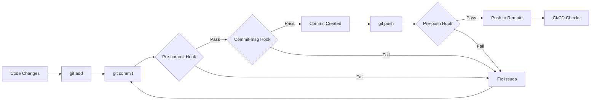

# Code Quality Configuration

This directory contains all code quality and development tooling configurations for Agentic-Flow v2.0.0-alpha.

## Directory Contents

### Linting & Formatting

- **`.eslintrc.strict.js`** - Strict ESLint rules for TypeScript
  - Enforces explicit types
  - No `any` type allowed
  - Complexity and size limits
  - Security best practices

- **`.prettierrc.js`** - Prettier code formatting rules
  - 2 space indentation
  - Single quotes
  - 100 character line width

- **`.prettierignore`** - Files excluded from Prettier formatting
  - node_modules, dist, coverage, etc.

### Type Checking

- **`../agentic-flow/config/tsconfig.strict.json`** - TypeScript strict mode configuration
  - Extends base tsconfig.json
  - Enables all strict checks
  - Additional type safety rules

### Testing

- **`jest.config.js`** - Jest test configuration
  - Coverage thresholds (80% minimum)
  - TypeScript support via ts-jest
  - Coverage reporting

### Git Hooks

- **`lint-staged.config.js`** - Pre-commit file processing
  - Runs ESLint and Prettier on staged files
  - TypeScript type checking
  - File-type specific rules

### Editor Settings

- **`.editorconfig`** - Editor configuration for consistent formatting
  - Character encoding
  - Line endings
  - Indentation settings

### CI/CD

- **`.github/workflows/code-quality.yml`** - GitHub Actions workflow
  - Automated quality checks on push/PR
  - Multiple quality gates
  - Coverage reporting

## Quick Reference

### Running Quality Checks

```bash
# All checks
npm run quality:check

# Individual checks
npm run lint
npm run format:check
npm run typecheck:strict
npm run test:coverage

# Auto-fix issues
npm run quality:fix
```

### Installation

```bash
# Install dependencies
npm install

# Setup Git hooks
npm run prepare
```

### File Locations

Copy these files to project root if needed:

```bash
# EditorConfig (for IDE integration)
cp config/.editorconfig .editorconfig

# GitHub Actions workflow
mkdir -p .github/workflows
cp config/.github/workflows/code-quality.yml .github/workflows/
```

## Configuration Overview

### Quality Standards

| Tool | Standard | Enforcement |
|------|----------|-------------|
| ESLint | Strict TypeScript | Error |
| Prettier | Consistent formatting | Error |
| TypeScript | Strict mode | Error |
| Jest | 80% coverage | Error |
| Complexity | Max 15 | Error |
| Function Length | Max 150 lines | Error |

### Git Hooks

- **Pre-commit**: Lint + Format + Type check staged files
- **Commit-msg**: Validate commit message format
- **Pre-push**: Run tests + Type check entire codebase

### Workflow



## Documentation

Full documentation available in `/docs`:

- **Quick Start**: `docs/QUICK_START_CODE_QUALITY.md`
- **Setup Guide**: `docs/CODE_QUALITY_SETUP.md`
- **Contributing**: `docs/CONTRIBUTING.md`
- **Review Checklist**: `docs/CODE_REVIEW_CHECKLIST.md`

## Troubleshooting

### Hooks Not Running

```bash
# Reinstall hooks
rm -rf .husky
npm run prepare
```

### Linting Errors

```bash
# Auto-fix
npm run lint:fix

# Check what would be fixed
npm run lint
```

### Type Errors

```bash
# Check errors
npm run typecheck:strict

# Common fixes:
# - Add explicit return types
# - Handle null/undefined
# - Remove 'any' types
```

## Customization

### Adjusting Rules

Edit the configuration files:
- ESLint rules: `.eslintrc.strict.js`
- Prettier options: `.prettierrc.js`
- TypeScript settings: `../agentic-flow/config/tsconfig.strict.json`

### Disabling Rules

Use inline comments sparingly:

```typescript
// eslint-disable-next-line @typescript-eslint/no-explicit-any
const data: any = externalLibrary.getData();
```

### Adding Exceptions

Update ignore patterns:
- ESLint: `ignorePatterns` in `.eslintrc.strict.js`
- Prettier: Add to `.prettierignore`
- TypeScript: `exclude` in `tsconfig.strict.json`

## Maintenance

### Weekly
- Review ESLint warnings
- Check coverage trends

### Monthly
- Update dependencies
- Review complexity reports

### Quarterly
- Audit quality metrics
- Update standards

## Support

For issues or questions:
1. Check documentation in `/docs`
2. Review error messages
3. Create issue with `code-quality` tag

---

**Version**: 2.0.0-alpha
**Last Updated**: 2025-12-02
**Maintainer**: Code Quality Reviewer Agent
