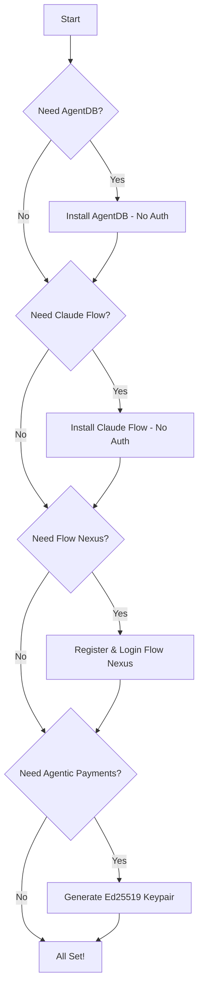

# MCP Authentication & Setup Guide

**Complete authentication guide for all MCP servers**

Version: 2.0.0 | Last Updated: 2025-10-22

---

## Table of Contents

1. [Overview](#overview)
2. [Authentication Matrix](#authentication-matrix)
3. [AgentDB Setup](#agentdb-setup)
4. [Claude Flow Setup](#claude-flow-setup)
5. [Flow Nexus Authentication](#flow-nexus-authentication)
6. [Agentic Payments Authentication](#agentic-payments-authentication)
7. [Environment Configuration](#environment-configuration)
8. [MCP Server Registration](#mcp-server-registration)
9. [Verification & Testing](#verification--testing)
10. [Security Best Practices](#security-best-practices)
11. [Troubleshooting Authentication Errors](#troubleshooting-authentication-errors)

---

## Overview

MCP (Model Context Protocol) servers provide 233+ tools for AI agent orchestration. Each server has different authentication requirements:

| Server | Auth Required | Auth Type | Setup Time |
|--------|---------------|-----------|------------|
| **AgentDB** | ❌ No | Local database | < 1 minute |
| **Claude Flow** | ❌ No | Local orchestration | < 1 minute |
| **Flow Nexus** | ✅ Yes | Email/password registration | 2-3 minutes |
| **Agentic Payments** | ✅ Yes | Ed25519 keypair | < 1 minute |

**Total Setup Time:** 5-7 minutes for all servers

---

## Authentication Matrix

### Quick Reference

```
┌─────────────────┬─────────────┬──────────────┬─────────────────────┐
│ Server          │ Auth Needed │ Storage      │ Key Management      │
├─────────────────┼─────────────┼──────────────┼─────────────────────┤
│ AgentDB         │ No          │ Local SQLite │ None                │
│ Claude Flow     │ No          │ Local        │ None                │
│ Flow Nexus      │ Yes         │ Cloud        │ Session token       │
│ Agentic Payments│ Yes         │ None         │ Ed25519 private key │
└─────────────────┴─────────────┴──────────────┴─────────────────────┘
```

### Authentication Flow



---

## AgentDB Setup

AgentDB provides state-of-the-art agent memory with no authentication required.

### Features
- **20+ memory tools**
- **Causal Memory Graph** - Track cause-effect relationships
- **Explainable Recall** - Certificate-based explanations
- **Reflexion Memory** - Self-critique and improvement
- **Skill Library** - Reusable agent patterns
- **Nightly Learner** - Pattern discovery

### Installation

```bash
# Install AgentDB MCP server
claude mcp add agentdb npx agentdb mcp

# Verify installation
claude mcp list
```

### Configuration

No authentication required. AgentDB stores data locally in SQLite.

**Default Database Location:**
```
/workspaces/agentic-flow/.swarm/memory.db
```

### Environment Variables (Optional)

```bash
# Custom database path
AGENTDB_PATH=/path/to/custom/memory.db

# Enable debug logging
AGENTDB_DEBUG=true

# Set default vector dimensions
AGENTDB_VECTOR_DIM=1536
```

### Example Usage

```javascript
// No authentication needed - works immediately
mcp__agentdb__causal_add_edge({
  cause: "user_request",
  effect: "api_call",
  strength: 0.9,
  metadata: {
    timestamp: new Date().toISOString()
  }
});

// Query causal relationships
const results = mcp__agentdb__causal_query({
  node_id: "api_call",
  direction: "incoming",
  limit: 10
});
```

### Verification

```bash
# Test AgentDB connectivity
npx agentdb test

# Check database status
npx agentdb status

# View memory statistics
npx agentdb stats
```

---

## Claude Flow Setup

Claude Flow provides local orchestration with 101 tools and no authentication.

### Features
- **Swarm orchestration** - Multi-agent coordination
- **Memory management** - Persistent agent memory
- **Neural networks** - WASM-accelerated AI
- **GitHub integration** - Repository automation
- **Performance monitoring** - Real-time metrics

### Installation

```bash
# Install Claude Flow MCP server
claude mcp add claude-flow npx claude-flow@alpha mcp start

# Verify installation
claude mcp list
```

### Configuration

No authentication required. All operations run locally.

### Environment Variables (Optional)

```bash
# Enable hooks for automation
CLAUDE_FLOW_HOOKS_ENABLED=true

# Custom memory path
CLAUDE_FLOW_MEMORY_PATH=/path/to/memory

# Enable neural features
CLAUDE_FLOW_NEURAL_ENABLED=true

# Set swarm defaults
CLAUDE_FLOW_MAX_AGENTS=10
CLAUDE_FLOW_DEFAULT_TOPOLOGY=mesh
```

### Example Usage

```javascript
// No authentication needed
mcp__claude-flow__swarm_init({
  topology: 'mesh',
  maxAgents: 8,
  strategy: 'balanced'
});

// Spawn agents
mcp__claude-flow__agent_spawn({
  type: 'coder',
  name: 'backend-agent',
  capabilities: ['nodejs', 'express', 'postgres']
});

// Store memory
mcp__claude-flow__memory_usage({
  action: 'store',
  key: 'swarm/config',
  namespace: 'default',
  value: JSON.stringify({ initialized: true })
});
```

### Verification

```bash
# Test Claude Flow connectivity
npx claude-flow@alpha test

# Check swarm status
npx claude-flow@alpha swarm status

# View hooks configuration
npx claude-flow@alpha hooks list
```

---

## Flow Nexus Authentication

Flow Nexus requires registration for cloud-based features (96 tools).

### Features
- **E2B Sandboxes** - Isolated code execution
- **Cloud workflows** - Event-driven automation
- **Template marketplace** - Pre-built solutions
- **Neural training** - Distributed AI
- **Real-time streaming** - Live execution monitoring
- **Storage & databases** - Cloud persistence

### Registration Process

#### Method 1: CLI Registration (Recommended)

```bash
# Register new account
npx flow-nexus@latest register

# Follow prompts:
# Email: your-email@example.com
# Password: [secure-password]
# Full Name: Your Name (optional)
```

#### Method 2: MCP Tool Registration

```javascript
// Register via MCP tool
mcp__flow-nexus__user_register({
  email: 'your-email@example.com',
  password: 'YourSecureP@ssw0rd!',
  full_name: 'Your Name'  // Optional
});

// Response:
// {
//   success: true,
//   message: 'Registration successful. Please verify your email.',
//   user_id: 'usr_abc123def456'
// }
```

#### Email Verification

```bash
# Check your email for verification link
# Or use verification token:
npx flow-nexus@latest verify-email --token YOUR_TOKEN
```

```javascript
// Via MCP tool
mcp__flow-nexus__user_verify_email({
  token: 'verify_token_from_email'
});
```

### Login Process

#### Method 1: CLI Login

```bash
# Login to existing account
npx flow-nexus@latest login

# Follow prompts:
# Email: your-email@example.com
# Password: [your-password]
```

#### Method 2: MCP Tool Login

```javascript
// Login via MCP tool
mcp__flow-nexus__user_login({
  email: 'your-email@example.com',
  password: 'YourSecureP@ssw0rd!'
});

// Response:
// {
//   success: true,
//   session_token: 'sess_abc123def456',
//   user_id: 'usr_abc123def456',
//   tier: 'free',
//   expires_at: '2025-10-23T14:00:00Z'
// }
```

### Session Management

```javascript
// Check authentication status
mcp__flow-nexus__auth_status({
  detailed: true
});

// Response:
// {
//   authenticated: true,
//   user_id: 'usr_abc123def456',
//   email: 'your-email@example.com',
//   tier: 'free',
//   credits_remaining: 100,
//   session_expires: '2025-10-23T14:00:00Z'
// }

// Logout
mcp__flow-nexus__user_logout();
```

### MCP Server Registration with Auth

```bash
# Add Flow Nexus MCP server
claude mcp add flow-nexus npx flow-nexus@latest mcp start

# Server automatically uses cached session token
```

### Password Reset

```bash
# Request password reset
npx flow-nexus@latest reset-password --email your-email@example.com
```

```javascript
// Via MCP tool
mcp__flow-nexus__user_reset_password({
  email: 'your-email@example.com'
});

// Check email for reset token, then:
mcp__flow-nexus__user_update_password({
  token: 'reset_token_from_email',
  new_password: 'NewSecureP@ssw0rd!'
});
```

### Example Usage (After Authentication)

```javascript
// Create sandbox (requires authentication)
const sandbox = mcp__flow-nexus__sandbox_create({
  template: 'node',
  name: 'my-sandbox',
  env_vars: {
    NODE_ENV: 'development'
  }
});

// Execute code in sandbox
mcp__flow-nexus__sandbox_execute({
  sandbox_id: sandbox.data.sandbox_id,
  code: 'console.log("Hello from sandbox!");'
});

// Create workflow
mcp__flow-nexus__workflow_create({
  name: 'data-pipeline',
  steps: [
    { action: 'fetch-data', agent: 'researcher' },
    { action: 'process-data', agent: 'analyst' },
    { action: 'store-results', agent: 'coordinator' }
  ]
});
```

### Tier Upgrades

```javascript
// Check current tier
mcp__flow-nexus__user_profile({
  user_id: 'usr_abc123def456'
});

// Upgrade to Pro tier
mcp__flow-nexus__user_upgrade({
  user_id: 'usr_abc123def456',
  tier: 'pro'  // Options: 'pro', 'enterprise'
});
```

### Verification

```bash
# Test Flow Nexus authentication
npx flow-nexus@latest test-auth

# Check balance
npx flow-nexus@latest balance

# View profile
npx flow-nexus@latest profile
```

---

## Agentic Payments Authentication

Agentic Payments uses Ed25519 cryptographic keypairs for autonomous agent payment authorization.

### Features
- **Active Mandates** - Time-limited payment authorization
- **Intent-based payments** - High-level purchase approval
- **Cart-based payments** - Specific item approval
- **Multi-agent consensus** - Byzantine fault-tolerant verification
- **Revocation** - Cancel mandates anytime

### Keypair Generation

#### Method 1: MCP Tool (Recommended for Production)

```javascript
// Generate agent identity with Ed25519 keypair
const identity = mcp__agentic-payments__generate_agent_identity({
  include_private_key: true  // ⚠️ SECURE STORAGE REQUIRED
});

// Response:
// {
//   success: true,
//   agent_id: 'agent_abc123def456',
//   public_key: 'ed25519_public_key_base64_encoded',
//   private_key: 'ed25519_private_key_base64_encoded',  // Store securely!
//   created_at: '2025-10-22T14:00:00Z'
// }
```

#### Method 2: CLI Generation

```bash
# Generate keypair via CLI
npx agentic-payments generate-keypair --output ./keypair.json

# Output file structure:
# {
#   "agent_id": "agent_abc123def456",
#   "public_key": "ed25519_public_key_base64",
#   "private_key": "ed25519_private_key_base64"
# }
```

### Secure Key Storage

**❌ NEVER DO THIS:**
```javascript
// NEVER hardcode private keys
const PRIVATE_KEY = 'ed25519_private_key_base64';  // INSECURE!

// NEVER commit keys to git
// NEVER log private keys
console.log(identity.private_key);  // INSECURE!
```

**✅ SECURE STORAGE OPTIONS:**

#### Option 1: Environment Variables (Development)

```bash
# Store in .env file (add .env to .gitignore)
AGENTIC_PAYMENTS_AGENT_ID=agent_abc123def456
AGENTIC_PAYMENTS_PUBLIC_KEY=ed25519_public_key_base64
AGENTIC_PAYMENTS_PRIVATE_KEY=ed25519_private_key_base64
```

```javascript
// Load from environment
const AGENT_ID = process.env.AGENTIC_PAYMENTS_AGENT_ID;
const PRIVATE_KEY = process.env.AGENTIC_PAYMENTS_PRIVATE_KEY;
const PUBLIC_KEY = process.env.AGENTIC_PAYMENTS_PUBLIC_KEY;
```

#### Option 2: Encrypted Key Store (Production)

```javascript
import { encrypt, decrypt } from './encryption';

// Encrypt private key with user password
const encryptedKey = encrypt(identity.private_key, userPassword);

// Store encrypted key in database
await db.store('agent_private_keys', {
  agent_id: identity.agent_id,
  encrypted_private_key: encryptedKey,
  public_key: identity.public_key
});

// Decrypt when needed
const privateKey = decrypt(encryptedKey, userPassword);
```

#### Option 3: Hardware Security Module (Enterprise)

```javascript
// Use HSM for key storage (recommended for production)
import { HSM } from './hsm-provider';

const hsm = new HSM({
  endpoint: process.env.HSM_ENDPOINT,
  credentials: process.env.HSM_CREDENTIALS
});

// Store key in HSM
await hsm.storeKey(identity.private_key, 'agent_payment_key');

// Sign mandates using HSM (key never leaves secure hardware)
const signature = await hsm.sign('agent_payment_key', mandateData);
```

### Creating Payment Mandates

```javascript
// 1. Create Active Mandate
const mandate = mcp__agentic-payments__create_active_mandate({
  agent: 'shopping-bot@agentics',
  holder: PUBLIC_KEY,  // Your agent's public key
  amount: 12000,  // $120.00 in cents
  currency: 'USD',
  period: 'monthly',
  kind: 'intent',
  expires_at: '2025-11-22T00:00:00Z',
  merchant_allow: ['amazon.com', 'ebay.com'],
  merchant_block: ['gambling-site.com']
});

// 2. Sign mandate with private key
const signedMandate = mcp__agentic-payments__sign_mandate({
  mandate: mandate.data,
  private_key: PRIVATE_KEY  // From secure storage
});

// 3. Verify signature (optional)
const verification = mcp__agentic-payments__verify_mandate({
  signed_mandate: signedMandate.data,
  check_guards: true  // Check expiration, revocation
});
```

### Intent-Based Payments

```javascript
// High-level purchase authorization
const intentMandate = mcp__agentic-payments__create_intent_mandate({
  merchant_id: 'merchant_abc123',
  customer_id: 'customer_def456',
  intent: 'Purchase laptop for development work',
  max_amount: 2000,  // $2000 maximum
  currency: 'USD',
  expires_at: Math.floor(Date.now() / 1000) + 86400  // 24 hours
});
```

### Cart-Based Payments

```javascript
// Specific item approval
const cartMandate = mcp__agentic-payments__create_cart_mandate({
  merchant_id: 'merchant_abc123',
  customer_id: 'customer_def456',
  items: [
    { id: 'item_1', name: 'Laptop', quantity: 1, unit_price: 150000 },
    { id: 'item_2', name: 'Mouse', quantity: 2, unit_price: 2500 }
  ],
  currency: 'USD'
});
```

### Mandate Revocation

```javascript
// Revoke a mandate
mcp__agentic-payments__revoke_mandate({
  mandate_id: 'mandate_abc123def456',
  reason: 'User requested cancellation'
});

// List all revoked mandates
const revocations = mcp__agentic-payments__list_revocations();
```

### Multi-Agent Consensus

```javascript
// Verify payment with Byzantine fault-tolerant consensus
const consensus = mcp__agentic-payments__verify_consensus({
  message: 'payment_request_data_base64',
  signature: 'signature_base64',
  public_key: 'agent_public_key_base64',
  agent_public_keys: [
    'agent1_public_key',
    'agent2_public_key',
    'agent3_public_key',
    'agent4_public_key'
  ],
  consensus_threshold: 0.67  // 67% agreement required
});
```

### Example Workflow

```javascript
// Complete payment authorization workflow
async function authorizeAgentPayment() {
  // 1. Generate agent identity (one-time)
  const identity = mcp__agentic-payments__generate_agent_identity({
    include_private_key: true
  });

  // 2. Store keys securely
  await storeKeys(identity);

  // 3. Create mandate
  const mandate = mcp__agentic-payments__create_active_mandate({
    agent: 'shopping-bot@agentics',
    holder: identity.public_key,
    amount: 10000,  // $100
    currency: 'USD',
    period: 'single',
    kind: 'intent',
    expires_at: new Date(Date.now() + 7 * 24 * 60 * 60 * 1000).toISOString()
  });

  // 4. Sign mandate
  const signed = mcp__agentic-payments__sign_mandate({
    mandate: mandate.data,
    private_key: identity.private_key
  });

  // 5. Verify before use
  const verified = mcp__agentic-payments__verify_mandate({
    signed_mandate: signed.data,
    check_guards: true
  });

  if (verified.success && verified.data.valid) {
    console.log('Payment authorization ready:', signed.data.mandate_id);
    return signed.data;
  } else {
    throw new Error('Mandate verification failed');
  }
}
```

### Verification

```bash
# Test keypair generation
npx agentic-payments test-keypair

# Verify signature
npx agentic-payments verify-signature \
  --message "test message" \
  --signature "signature_base64" \
  --public-key "public_key_base64"
```

---

## Environment Configuration

### Complete .env File Template

```bash
# ============================================
# MCP Authentication Configuration
# ============================================

# -----------------
# AgentDB (No Auth)
# -----------------
AGENTDB_PATH=/workspaces/agentic-flow/.swarm/memory.db
AGENTDB_DEBUG=false
AGENTDB_VECTOR_DIM=1536

# ---------------------
# Claude Flow (No Auth)
# ---------------------
CLAUDE_FLOW_HOOKS_ENABLED=true
CLAUDE_FLOW_MEMORY_PATH=/workspaces/agentic-flow/.swarm
CLAUDE_FLOW_NEURAL_ENABLED=true
CLAUDE_FLOW_MAX_AGENTS=10
CLAUDE_FLOW_DEFAULT_TOPOLOGY=mesh

# --------------------------
# Flow Nexus (Auth Required)
# --------------------------
# Register at: npx flow-nexus@latest register
FLOW_NEXUS_EMAIL=your-email@example.com
FLOW_NEXUS_SESSION_TOKEN=sess_abc123def456  # Auto-populated after login
FLOW_NEXUS_USER_ID=usr_abc123def456  # Auto-populated after login

# --------------------------------------
# Agentic Payments (Keypair Required)
# --------------------------------------
# Generate with: mcp__agentic-payments__generate_agent_identity()
AGENTIC_PAYMENTS_AGENT_ID=agent_abc123def456
AGENTIC_PAYMENTS_PUBLIC_KEY=ed25519_public_key_base64_encoded
AGENTIC_PAYMENTS_PRIVATE_KEY=ed25519_private_key_base64_encoded  # SECURE!

# -----------------
# Security Settings
# -----------------
# Encryption key for local key storage (generate with: openssl rand -hex 32)
ENCRYPTION_KEY=your_32_byte_hex_encryption_key_here

# Session timeout (in seconds)
SESSION_TIMEOUT=3600

# Enable debug logging (NEVER in production)
MCP_DEBUG=false
```

### .env.example Template

```bash
# Copy this to .env and fill in your values
# NEVER commit .env to git!

# AgentDB
AGENTDB_PATH=.swarm/memory.db

# Claude Flow
CLAUDE_FLOW_HOOKS_ENABLED=true

# Flow Nexus (register first)
FLOW_NEXUS_EMAIL=your-email@example.com

# Agentic Payments (generate keypair first)
AGENTIC_PAYMENTS_AGENT_ID=
AGENTIC_PAYMENTS_PUBLIC_KEY=
AGENTIC_PAYMENTS_PRIVATE_KEY=  # SECURE STORAGE REQUIRED

# Security
ENCRYPTION_KEY=  # Generate with: openssl rand -hex 32
```

### .gitignore Configuration

```bash
# Add to .gitignore to prevent committing secrets
.env
.env.local
.env.*.local
*.key
*.pem
keypair.json
*-private-key.txt
.swarm/*.db
.swarm/*.db-journal
```

### Loading Environment Variables

```javascript
// Load environment variables
import dotenv from 'dotenv';
dotenv.config();

// Validate required variables
function validateEnvironment() {
  const required = [
    // Flow Nexus (if using)
    'FLOW_NEXUS_EMAIL',

    // Agentic Payments (if using)
    'AGENTIC_PAYMENTS_AGENT_ID',
    'AGENTIC_PAYMENTS_PUBLIC_KEY',
    'AGENTIC_PAYMENTS_PRIVATE_KEY'
  ];

  const missing = required.filter(key => !process.env[key]);

  if (missing.length > 0) {
    console.error('Missing environment variables:', missing);
    process.exit(1);
  }
}

// Call on startup
validateEnvironment();
```

---

## MCP Server Registration

### Complete Registration Workflow

#### Step 1: Install MCP Servers

```bash
# Install all MCP servers at once
claude mcp add agentdb npx agentdb mcp && \
claude mcp add claude-flow npx claude-flow@alpha mcp start && \
claude mcp add flow-nexus npx flow-nexus@latest mcp start

# Or install individually as needed
```

#### Step 2: Verify Installation

```bash
# List all installed MCP servers
claude mcp list

# Expected output:
# ┌──────────────┬────────────────────────────────────┬────────┐
# │ Name         │ Command                            │ Status │
# ├──────────────┼────────────────────────────────────┼────────┤
# │ agentdb      │ npx agentdb mcp                    │ Active │
# │ claude-flow  │ npx claude-flow@alpha mcp start    │ Active │
# │ flow-nexus   │ npx flow-nexus@latest mcp start    │ Active │
# └──────────────┴────────────────────────────────────┴────────┘
```

#### Step 3: Test Connectivity

```bash
# Test each server
npx agentdb test
npx claude-flow@alpha test
npx flow-nexus@latest test-auth  # Requires login
```

#### Step 4: Claude Code Configuration

Claude Code automatically discovers MCP servers. Verify in Claude Code:

```javascript
// Test each server with a simple operation
mcp__agentdb__test();  // Should return success
mcp__claude-flow__swarm_status();  // Should return empty swarm list
mcp__flow-nexus__auth_status();  // Should show auth status
```

### Server Management

```bash
# View server logs
claude mcp logs agentdb
claude mcp logs claude-flow
claude mcp logs flow-nexus

# Restart a server
claude mcp restart flow-nexus

# Remove a server
claude mcp remove flow-nexus

# Update server version
claude mcp update claude-flow
```

### Custom MCP Configuration

Create `.claude-mcp.json` in your project root:

```json
{
  "mcpServers": {
    "agentdb": {
      "command": "npx",
      "args": ["agentdb", "mcp"],
      "env": {
        "AGENTDB_PATH": ".swarm/memory.db",
        "AGENTDB_DEBUG": "false"
      }
    },
    "claude-flow": {
      "command": "npx",
      "args": ["claude-flow@alpha", "mcp", "start"],
      "env": {
        "CLAUDE_FLOW_HOOKS_ENABLED": "true",
        "CLAUDE_FLOW_MAX_AGENTS": "10"
      }
    },
    "flow-nexus": {
      "command": "npx",
      "args": ["flow-nexus@latest", "mcp", "start"],
      "env": {
        "FLOW_NEXUS_EMAIL": "${FLOW_NEXUS_EMAIL}",
        "FLOW_NEXUS_SESSION_TOKEN": "${FLOW_NEXUS_SESSION_TOKEN}"
      }
    }
  }
}
```

---

## Verification & Testing

### Complete Test Suite

```bash
# Create test script
cat > test-mcp-auth.sh << 'EOF'
#!/bin/bash

echo "🔧 Testing MCP Server Authentication"
echo "======================================"
echo ""

# 1. AgentDB (No Auth)
echo "1️⃣ Testing AgentDB..."
npx agentdb test
if [ $? -eq 0 ]; then
  echo "✅ AgentDB: PASSED (no auth required)"
else
  echo "❌ AgentDB: FAILED"
fi
echo ""

# 2. Claude Flow (No Auth)
echo "2️⃣ Testing Claude Flow..."
npx claude-flow@alpha test
if [ $? -eq 0 ]; then
  echo "✅ Claude Flow: PASSED (no auth required)"
else
  echo "❌ Claude Flow: FAILED"
fi
echo ""

# 3. Flow Nexus (Auth Required)
echo "3️⃣ Testing Flow Nexus..."
npx flow-nexus@latest test-auth
if [ $? -eq 0 ]; then
  echo "✅ Flow Nexus: PASSED (authenticated)"
else
  echo "❌ Flow Nexus: FAILED (login required)"
  echo "   Run: npx flow-nexus@latest login"
fi
echo ""

# 4. Agentic Payments (Keypair Required)
echo "4️⃣ Testing Agentic Payments..."
if [ -n "$AGENTIC_PAYMENTS_PUBLIC_KEY" ]; then
  echo "✅ Agentic Payments: Keypair configured"
else
  echo "⚠️  Agentic Payments: Keypair not configured"
  echo "   Generate with: mcp__agentic-payments__generate_agent_identity()"
fi
echo ""

echo "======================================"
echo "✅ Test Complete"
EOF

chmod +x test-mcp-auth.sh
./test-mcp-auth.sh
```

### Individual Server Tests

#### AgentDB Test

```javascript
// Test causal memory
const testAgentDB = async () => {
  try {
    // Add causal edge
    await mcp__agentdb__causal_add_edge({
      cause: 'test_event_1',
      effect: 'test_event_2',
      strength: 0.8
    });

    // Query relationships
    const results = await mcp__agentdb__causal_query({
      node_id: 'test_event_2',
      direction: 'incoming'
    });

    console.log('✅ AgentDB: Connected and working');
    return true;
  } catch (error) {
    console.error('❌ AgentDB: Failed', error);
    return false;
  }
};
```

#### Claude Flow Test

```javascript
// Test swarm orchestration
const testClaudeFlow = async () => {
  try {
    // Initialize swarm
    const swarm = await mcp__claude-flow__swarm_init({
      topology: 'mesh',
      maxAgents: 5
    });

    // Check status
    const status = await mcp__claude-flow__swarm_status();

    console.log('✅ Claude Flow: Connected and working');
    return true;
  } catch (error) {
    console.error('❌ Claude Flow: Failed', error);
    return false;
  }
};
```

#### Flow Nexus Test

```javascript
// Test cloud services
const testFlowNexus = async () => {
  try {
    // Check auth status
    const auth = await mcp__flow-nexus__auth_status({
      detailed: true
    });

    if (!auth.authenticated) {
      console.error('❌ Flow Nexus: Not authenticated');
      console.log('   Run: npx flow-nexus@latest login');
      return false;
    }

    // Test sandbox creation
    const sandbox = await mcp__flow-nexus__sandbox_create({
      template: 'node',
      name: 'test-sandbox'
    });

    // Clean up
    await mcp__flow-nexus__sandbox_delete({
      sandbox_id: sandbox.data.sandbox_id
    });

    console.log('✅ Flow Nexus: Connected and authenticated');
    return true;
  } catch (error) {
    console.error('❌ Flow Nexus: Failed', error);
    return false;
  }
};
```

#### Agentic Payments Test

```javascript
// Test payment authorization
const testAgenticPayments = async () => {
  try {
    // Generate test keypair
    const identity = await mcp__agentic-payments__generate_agent_identity({
      include_private_key: true
    });

    // Create test mandate
    const mandate = await mcp__agentic-payments__create_active_mandate({
      agent: 'test-agent@test',
      holder: identity.public_key,
      amount: 1000,
      currency: 'USD',
      period: 'single',
      kind: 'intent',
      expires_at: new Date(Date.now() + 86400000).toISOString()
    });

    // Sign mandate
    const signed = await mcp__agentic-payments__sign_mandate({
      mandate: mandate.data,
      private_key: identity.private_key
    });

    // Verify signature
    const verified = await mcp__agentic-payments__verify_mandate({
      signed_mandate: signed.data
    });

    if (verified.data.valid) {
      console.log('✅ Agentic Payments: Connected and working');
      return true;
    } else {
      console.error('❌ Agentic Payments: Signature verification failed');
      return false;
    }
  } catch (error) {
    console.error('❌ Agentic Payments: Failed', error);
    return false;
  }
};
```

### Comprehensive Test

```javascript
// Run all tests
async function runAllTests() {
  console.log('🔧 Testing MCP Server Authentication');
  console.log('======================================\n');

  const results = {
    agentdb: await testAgentDB(),
    claudeFlow: await testClaudeFlow(),
    flowNexus: await testFlowNexus(),
    agenticPayments: await testAgenticPayments()
  };

  console.log('\n======================================');
  console.log('📊 Test Results:');
  console.log(`   AgentDB: ${results.agentdb ? '✅' : '❌'}`);
  console.log(`   Claude Flow: ${results.claudeFlow ? '✅' : '❌'}`);
  console.log(`   Flow Nexus: ${results.flowNexus ? '✅' : '❌'}`);
  console.log(`   Agentic Payments: ${results.agenticPayments ? '✅' : '❌'}`);

  const allPassed = Object.values(results).every(r => r);
  console.log(`\n${allPassed ? '✅ All tests passed!' : '⚠️  Some tests failed'}`);

  return allPassed;
}

// Execute tests
runAllTests();
```

---

## Security Best Practices

### General Security Principles

#### 1. Never Hardcode Secrets

```javascript
// ❌ WRONG: Hardcoded credentials
const PASSWORD = 'mypassword123';
const PRIVATE_KEY = 'ed25519_key_here';

// ✅ CORRECT: Use environment variables
const PASSWORD = process.env.FLOW_NEXUS_PASSWORD;
const PRIVATE_KEY = process.env.AGENTIC_PAYMENTS_PRIVATE_KEY;
```

#### 2. Use .gitignore

```bash
# Always add to .gitignore
.env
.env.*
*.key
*.pem
keypair.json
*-private-key*
.swarm/*.db
```

#### 3. Rotate Credentials Regularly

```javascript
// Set expiration for credentials
const CREDENTIAL_EXPIRY_DAYS = 90;

async function checkCredentialAge() {
  const lastRotation = await getLastRotationDate();
  const daysSince = Math.floor((Date.now() - lastRotation) / 86400000);

  if (daysSince > CREDENTIAL_EXPIRY_DAYS) {
    console.warn('⚠️  Credentials are old. Consider rotating.');
    // Notify admin or auto-rotate
  }
}
```

#### 4. Use Strong Passwords

```javascript
// Password requirements
const PASSWORD_REQUIREMENTS = {
  minLength: 12,
  requireUppercase: true,
  requireLowercase: true,
  requireNumbers: true,
  requireSpecialChars: true
};

function validatePassword(password) {
  if (password.length < PASSWORD_REQUIREMENTS.minLength) {
    return { valid: false, error: 'Password too short' };
  }
  if (!/[A-Z]/.test(password)) {
    return { valid: false, error: 'Missing uppercase letter' };
  }
  if (!/[a-z]/.test(password)) {
    return { valid: false, error: 'Missing lowercase letter' };
  }
  if (!/[0-9]/.test(password)) {
    return { valid: false, error: 'Missing number' };
  }
  if (!/[^A-Za-z0-9]/.test(password)) {
    return { valid: false, error: 'Missing special character' };
  }
  return { valid: true };
}
```

### Flow Nexus Security

#### Secure Session Management

```javascript
// Store session token securely
import { SecureStore } from './secure-store';

async function storeFlowNexusSession(sessionToken) {
  await SecureStore.set('flow_nexus_session', sessionToken, {
    encrypt: true,
    ttl: 3600  // 1 hour
  });
}

async function getFlowNexusSession() {
  return await SecureStore.get('flow_nexus_session');
}

// Clear session on logout
async function logout() {
  await mcp__flow-nexus__user_logout();
  await SecureStore.delete('flow_nexus_session');
}
```

#### Rate Limiting

```javascript
// Implement client-side rate limiting
class RateLimiter {
  constructor(maxRequests, windowMs) {
    this.maxRequests = maxRequests;
    this.windowMs = windowMs;
    this.requests = [];
  }

  async checkLimit() {
    const now = Date.now();
    this.requests = this.requests.filter(t => now - t < this.windowMs);

    if (this.requests.length >= this.maxRequests) {
      const oldestRequest = this.requests[0];
      const waitTime = this.windowMs - (now - oldestRequest);
      throw new Error(`Rate limited. Wait ${waitTime}ms`);
    }

    this.requests.push(now);
  }
}

const flowNexusLimiter = new RateLimiter(100, 3600000);  // 100/hour

async function callFlowNexusTool(tool, params) {
  await flowNexusLimiter.checkLimit();
  return await tool(params);
}
```

### Agentic Payments Security

#### Private Key Protection

```javascript
// Encrypt private keys at rest
import crypto from 'crypto';

class KeyManager {
  constructor(masterPassword) {
    this.masterPassword = masterPassword;
  }

  encrypt(privateKey) {
    const algorithm = 'aes-256-gcm';
    const key = crypto.scryptSync(this.masterPassword, 'salt', 32);
    const iv = crypto.randomBytes(16);
    const cipher = crypto.createCipheriv(algorithm, key, iv);

    let encrypted = cipher.update(privateKey, 'utf8', 'hex');
    encrypted += cipher.final('hex');

    const authTag = cipher.getAuthTag();

    return {
      encrypted,
      iv: iv.toString('hex'),
      authTag: authTag.toString('hex')
    };
  }

  decrypt(encryptedData) {
    const algorithm = 'aes-256-gcm';
    const key = crypto.scryptSync(this.masterPassword, 'salt', 32);
    const decipher = crypto.createDecipheriv(
      algorithm,
      key,
      Buffer.from(encryptedData.iv, 'hex')
    );

    decipher.setAuthTag(Buffer.from(encryptedData.authTag, 'hex'));

    let decrypted = decipher.update(encryptedData.encrypted, 'hex', 'utf8');
    decrypted += decipher.final('utf8');

    return decrypted;
  }
}

// Usage
const keyManager = new KeyManager(process.env.MASTER_PASSWORD);
const encryptedKey = keyManager.encrypt(privateKey);
// Store encryptedKey in database
```

#### Mandate Validation

```javascript
// Always validate mandates before signing
function validateMandate(mandate) {
  const now = Date.now();
  const expiresAt = new Date(mandate.expires_at).getTime();

  // Check expiration
  if (expiresAt < now) {
    throw new Error('Mandate already expired');
  }

  // Check amount
  if (mandate.amount <= 0 || mandate.amount > 1000000) {  // $10k max
    throw new Error('Invalid mandate amount');
  }

  // Check merchant restrictions
  if (mandate.merchant_allow && mandate.merchant_allow.length === 0) {
    throw new Error('Must specify allowed merchants');
  }

  // Warn if no time limit
  const daysUntilExpiry = (expiresAt - now) / 86400000;
  if (daysUntilExpiry > 90) {
    console.warn('⚠️  Mandate expires in >90 days. Consider shorter period.');
  }

  return true;
}

// Use before signing
const mandate = await mcp__agentic-payments__create_active_mandate({...});
validateMandate(mandate.data);
const signed = await mcp__agentic-payments__sign_mandate({
  mandate: mandate.data,
  private_key: privateKey
});
```

#### Audit Logging

```javascript
// Log all payment operations
class PaymentAuditLogger {
  async log(action, data) {
    const logEntry = {
      timestamp: new Date().toISOString(),
      action,
      data: this.sanitize(data),
      user_id: getCurrentUserId(),
      ip_address: getClientIP()
    };

    await mcp__claude-flow__memory_usage({
      action: 'store',
      key: `audit/payment/${Date.now()}`,
      namespace: 'security',
      value: JSON.stringify(logEntry)
    });
  }

  sanitize(data) {
    // Remove sensitive fields
    const sanitized = { ...data };
    delete sanitized.private_key;
    delete sanitized.password;
    return sanitized;
  }
}

const auditLogger = new PaymentAuditLogger();

// Log all mandate operations
await auditLogger.log('mandate_created', { mandate_id, amount, merchant });
await auditLogger.log('mandate_signed', { mandate_id });
await auditLogger.log('mandate_verified', { mandate_id, valid });
```

### Network Security

#### HTTPS Only

```javascript
// Enforce HTTPS for all API calls
function validateEndpoint(url) {
  if (!url.startsWith('https://')) {
    throw new Error('Only HTTPS endpoints allowed');
  }
}

// Custom fetch wrapper
async function secureFetch(url, options) {
  validateEndpoint(url);

  // Add security headers
  const secureOptions = {
    ...options,
    headers: {
      ...options.headers,
      'X-Content-Type-Options': 'nosniff',
      'X-Frame-Options': 'DENY',
      'X-XSS-Protection': '1; mode=block'
    }
  };

  return fetch(url, secureOptions);
}
```

#### Certificate Pinning (Advanced)

```javascript
// Pin Flow Nexus TLS certificate
import tls from 'tls';

const PINNED_CERTIFICATES = {
  'flow-nexus.ruv.io': [
    'sha256/abc123...',  // Expected certificate hash
    'sha256/def456...'   // Backup certificate hash
  ]
};

function validateCertificate(hostname, cert) {
  const hash = crypto.createHash('sha256')
    .update(cert.raw)
    .digest('base64');

  const pinnedHashes = PINNED_CERTIFICATES[hostname];
  if (!pinnedHashes || !pinnedHashes.includes(`sha256/${hash}`)) {
    throw new Error('Certificate pinning validation failed');
  }
}
```

---

## Troubleshooting Authentication Errors

### Common Issues & Solutions

#### 1. "AUTH_REQUIRED" Error (Flow Nexus)

**Symptoms:**
```
Error: AUTH_REQUIRED
Message: Authentication required for this operation
```

**Diagnosis:**
```bash
# Check authentication status
npx flow-nexus@latest test-auth

# Or via MCP tool
mcp__flow-nexus__auth_status({ detailed: true })
```

**Solutions:**

**Solution A: Login Required**
```bash
# Login via CLI
npx flow-nexus@latest login

# Or via MCP tool
mcp__flow-nexus__user_login({
  email: 'your-email@example.com',
  password: 'your-password'
});
```

**Solution B: Session Expired**
```bash
# Re-login to get new session token
npx flow-nexus@latest login

# Verify session
npx flow-nexus@latest profile
```

**Solution C: Invalid Credentials**
```bash
# Reset password
npx flow-nexus@latest reset-password --email your-email@example.com

# Check email for reset link
# Set new password
npx flow-nexus@latest update-password --token YOUR_TOKEN --password NEW_PASSWORD
```

---

#### 2. "INVALID_SIGNATURE" Error (Agentic Payments)

**Symptoms:**
```
Error: INVALID_SIGNATURE
Message: Ed25519 signature verification failed
```

**Diagnosis:**
```javascript
// Check keypair integrity
const identity = mcp__agentic-payments__generate_agent_identity({
  include_private_key: false  // Get public key only
});

console.log('Expected public key:', identity.public_key);
console.log('Your public key:', process.env.AGENTIC_PAYMENTS_PUBLIC_KEY);

// Test signing
const testMandate = { test: 'data' };
const signed = mcp__agentic-payments__sign_mandate({
  mandate: testMandate,
  private_key: process.env.AGENTIC_PAYMENTS_PRIVATE_KEY
});

const verified = mcp__agentic-payments__verify_mandate({
  signed_mandate: signed.data
});

console.log('Signature valid:', verified.data.valid);
```

**Solutions:**

**Solution A: Regenerate Keypair**
```javascript
// Generate new keypair
const newIdentity = mcp__agentic-payments__generate_agent_identity({
  include_private_key: true
});

// Update environment variables
console.log('Update .env with:');
console.log(`AGENTIC_PAYMENTS_AGENT_ID=${newIdentity.agent_id}`);
console.log(`AGENTIC_PAYMENTS_PUBLIC_KEY=${newIdentity.public_key}`);
console.log(`AGENTIC_PAYMENTS_PRIVATE_KEY=${newIdentity.private_key}`);
```

**Solution B: Check Key Encoding**
```javascript
// Verify base64 encoding
function validateBase64(str) {
  try {
    return btoa(atob(str)) === str;
  } catch (err) {
    return false;
  }
}

const publicKeyValid = validateBase64(process.env.AGENTIC_PAYMENTS_PUBLIC_KEY);
const privateKeyValid = validateBase64(process.env.AGENTIC_PAYMENTS_PRIVATE_KEY);

console.log('Public key valid:', publicKeyValid);
console.log('Private key valid:', privateKeyValid);
```

**Solution C: Mandate Expired**
```javascript
// Check mandate expiration
const mandate = { /* your mandate */ };
const now = Date.now();
const expiresAt = new Date(mandate.expires_at).getTime();

if (expiresAt < now) {
  console.error('Mandate expired. Create new mandate.');
  // Create new mandate with future expiration
}
```

---

#### 3. "MCP_SERVER_NOT_FOUND" Error

**Symptoms:**
```
Error: MCP_SERVER_NOT_FOUND
Message: MCP server 'flow-nexus' not found or not running
```

**Diagnosis:**
```bash
# List all MCP servers
claude mcp list

# Check if server is installed
claude mcp status flow-nexus
```

**Solutions:**

**Solution A: Install Server**
```bash
# Install missing server
claude mcp add flow-nexus npx flow-nexus@latest mcp start

# Verify installation
claude mcp list
```

**Solution B: Restart Server**
```bash
# Restart server
claude mcp restart flow-nexus

# Check logs
claude mcp logs flow-nexus
```

**Solution C: Fix Server Configuration**
```bash
# Remove and re-add server
claude mcp remove flow-nexus
claude mcp add flow-nexus npx flow-nexus@latest mcp start

# Test connectivity
npx flow-nexus@latest test
```

---

#### 4. "INSUFFICIENT_CREDITS" Error (Flow Nexus)

**Symptoms:**
```
Error: INSUFFICIENT_CREDITS
Message: Not enough credits to perform this operation
```

**Diagnosis:**
```javascript
// Check credit balance
const balance = mcp__flow-nexus__check_balance();
console.log('Current balance:', balance.data.credits);
console.log('Current tier:', balance.data.tier);
```

**Solutions:**

**Solution A: Add Credits**
```javascript
// Create payment link
const payment = mcp__flow-nexus__create_payment_link({
  amount: 50  // $50 USD
});

console.log('Payment URL:', payment.data.payment_url);
// Visit URL to add credits
```

**Solution B: Upgrade Tier**
```javascript
// Upgrade to Pro tier (higher rate limits)
mcp__flow-nexus__user_upgrade({
  user_id: 'your_user_id',
  tier: 'pro'
});
```

**Solution C: Configure Auto-Refill**
```javascript
// Auto-refill when balance < $10
mcp__flow-nexus__configure_auto_refill({
  enabled: true,
  threshold: 1000,  // 1000 credits = $10
  amount: 2000      // Refill 2000 credits = $20
});
```

---

#### 5. "RATE_LIMITED" Error

**Symptoms:**
```
Error: RATE_LIMITED
Message: Too many requests. Retry after 3600 seconds.
```

**Diagnosis:**
```javascript
// Check rate limits
const stats = mcp__flow-nexus__usage_stats({
  component: 'api'
});

console.log('Requests today:', stats.data.requests_today);
console.log('Limit:', stats.data.rate_limit);
console.log('Resets at:', stats.data.reset_at);
```

**Solutions:**

**Solution A: Wait for Reset**
```javascript
// Calculate wait time
const resetTime = new Date(stats.data.reset_at);
const waitMs = resetTime - Date.now();
const waitMinutes = Math.ceil(waitMs / 60000);

console.log(`Wait ${waitMinutes} minutes for rate limit reset`);

// Auto-retry after wait
setTimeout(() => {
  // Retry operation
}, waitMs);
```

**Solution B: Upgrade Tier**
```javascript
// Pro tier has higher rate limits
mcp__flow-nexus__user_upgrade({
  user_id: 'your_user_id',
  tier: 'pro'  // 10x higher rate limits
});
```

**Solution C: Implement Backoff**
```javascript
// Exponential backoff retry
async function retryWithBackoff(fn, maxRetries = 3) {
  for (let i = 0; i < maxRetries; i++) {
    try {
      return await fn();
    } catch (error) {
      if (error.code === 'RATE_LIMITED' && i < maxRetries - 1) {
        const waitMs = Math.pow(2, i) * 1000;  // 1s, 2s, 4s
        console.log(`Rate limited. Waiting ${waitMs}ms...`);
        await new Promise(resolve => setTimeout(resolve, waitMs));
      } else {
        throw error;
      }
    }
  }
}

// Usage
await retryWithBackoff(() => mcp__flow-nexus__sandbox_create({...}));
```

---

#### 6. "EMAIL_NOT_VERIFIED" Error (Flow Nexus)

**Symptoms:**
```
Error: EMAIL_NOT_VERIFIED
Message: Please verify your email address before using this service
```

**Diagnosis:**
```javascript
// Check verification status
const profile = mcp__flow-nexus__user_profile({
  user_id: 'your_user_id'
});

console.log('Email verified:', profile.data.email_verified);
```

**Solutions:**

**Solution A: Check Email**
```
1. Check inbox for verification email from Flow Nexus
2. Check spam/junk folder
3. Click verification link in email
```

**Solution B: Resend Verification**
```bash
# Request new verification email
npx flow-nexus@latest resend-verification --email your-email@example.com
```

**Solution C: Manual Verification**
```javascript
// Use verification token from email
mcp__flow-nexus__user_verify_email({
  token: 'verification_token_from_email'
});
```

---

#### 7. Database Connection Errors (AgentDB)

**Symptoms:**
```
Error: SQLITE_ERROR
Message: unable to open database file
```

**Diagnosis:**
```bash
# Check database file
ls -la .swarm/memory.db

# Check permissions
stat .swarm/memory.db

# Test database
npx agentdb status
```

**Solutions:**

**Solution A: Create Database Directory**
```bash
# Create .swarm directory
mkdir -p .swarm

# Set permissions
chmod 755 .swarm

# Restart AgentDB
claude mcp restart agentdb
```

**Solution B: Fix Permissions**
```bash
# Fix database permissions
chmod 644 .swarm/memory.db

# Fix directory permissions
chmod 755 .swarm

# Verify
ls -la .swarm/
```

**Solution C: Reset Database**
```bash
# Backup existing database
cp .swarm/memory.db .swarm/memory.db.backup

# Remove corrupted database
rm .swarm/memory.db

# Restart AgentDB (will create new database)
claude mcp restart agentdb

# Test
npx agentdb test
```

---

### Debug Mode

Enable debug logging for detailed troubleshooting:

```bash
# Enable debug for all MCP servers
export MCP_DEBUG=true

# Or per-server
export AGENTDB_DEBUG=true
export CLAUDE_FLOW_DEBUG=true
export FLOW_NEXUS_DEBUG=true

# Run operation with logging
mcp__flow-nexus__sandbox_create({...})

# Logs will show:
# [2025-10-22T14:00:00.000Z] MCP: Connecting to flow-nexus
# [2025-10-22T14:00:00.100Z] MCP: Sending request: sandbox_create
# [2025-10-22T14:00:00.200Z] MCP: Parameters: {"template":"node"}
# [2025-10-22T14:00:02.000Z] MCP: Response received: {"success":true}
```

### Contact Support

If issues persist:

1. **Flow Nexus Support:** support@flow-nexus.ruv.io
2. **GitHub Issues:** https://github.com/ruvnet/claude-flow/issues
3. **Documentation:** https://github.com/ruvnet/claude-flow/docs

Include in support request:
- Error message and stack trace
- MCP server versions (`claude mcp list`)
- Debug logs (with secrets redacted)
- Steps to reproduce

---

## Quick Reference Card

### Command Cheat Sheet

```bash
# ===== AgentDB =====
claude mcp add agentdb npx agentdb mcp
npx agentdb test
npx agentdb status

# ===== Claude Flow =====
claude mcp add claude-flow npx claude-flow@alpha mcp start
npx claude-flow@alpha test
npx claude-flow@alpha swarm status

# ===== Flow Nexus =====
# Installation
claude mcp add flow-nexus npx flow-nexus@latest mcp start

# Registration
npx flow-nexus@latest register
npx flow-nexus@latest verify-email --token TOKEN

# Login
npx flow-nexus@latest login
npx flow-nexus@latest profile

# Management
npx flow-nexus@latest balance
npx flow-nexus@latest upgrade --tier pro

# ===== Agentic Payments =====
# Generate keypair
mcp__agentic-payments__generate_agent_identity({ include_private_key: true })

# Test signature
npx agentic-payments test-keypair
npx agentic-payments verify-signature

# ===== General =====
# List all servers
claude mcp list

# Test all servers
./test-mcp-auth.sh

# Check environment
env | grep -E '(AGENTDB|CLAUDE_FLOW|FLOW_NEXUS|AGENTIC_PAYMENTS)'
```

### Authentication Summary

| Server | Command | Result |
|--------|---------|--------|
| AgentDB | `claude mcp add agentdb npx agentdb mcp` | Ready to use |
| Claude Flow | `claude mcp add claude-flow npx claude-flow@alpha mcp start` | Ready to use |
| Flow Nexus | `npx flow-nexus@latest register && login` | Session token |
| Agentic Payments | `mcp__agentic-payments__generate_agent_identity()` | Ed25519 keypair |

---

**Document Complete** | Version 2.0.0 | Last Updated: 2025-10-22

For complete MCP Tools documentation, see:
- [MCP Tools Complete Reference](/workspaces/agentic-flow/docs/guides/MCP-TOOLS.md)
- [MCP Tools Architecture](/workspaces/agentic-flow/docs/mcp-tools-architecture.md)
- [AgentDB CLI Guide](/workspaces/agentic-flow/docs/agentdb/CLI_GUIDE.md)

**Support:** https://github.com/ruvnet/claude-flow/issues
