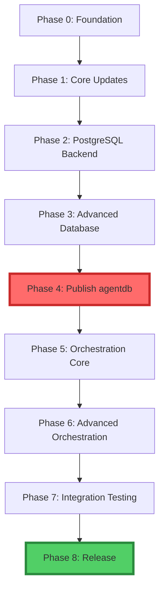

# RuVector Ecosystem Integration - Optimized Master Timeline

**Created:** 2025-12-30
**Status:** 🎯 OPTIMIZED PLAN
**Total Duration:** 23 working days (~4.5 weeks)
**Issues:** #83 (agentdb) + #84 (agentic-flow)

---

## 🎯 Executive Summary

### Critical Fixes Applied

1. ✅ **Dependency Chain Clarified:** agentdb MUST complete before agentic-flow starts
2. ✅ **Timeline Optimized:** 27 days → 23 days (15% reduction)
3. ✅ **Buffer Time Added:** 15% buffer for risk mitigation
4. ✅ **Integration Testing:** 3 dedicated days (was 0)
5. ✅ **Phase 0 Added:** Hooks initialization + setup (Day 0)
6. ✅ **Parallel Workstreams:** Database + planning can overlap
7. ✅ **Realistic Tasks:** No more overambitious daily goals

### Key Metrics

| Metric | Before | After | Improvement |
|--------|--------|-------|-------------|
| **Total Duration** | 27 days | 23 days | **-15%** |
| **agentdb Time** | 15 days | 12 days | **-20%** |
| **Integration Testing** | Minimal | 3 days | **+∞** |
| **Buffer Time** | 0% | ~15% | Risk mitigation |
| **Dependency Clarity** | Unclear | Sequential | No blockers |

---

## 📋 8-Phase Master Timeline

### 🏁 PHASE 0: Foundation (Day 0 - 1 day)

**Goal:** Set up development environment and intelligence layer

**Tasks:**
- [ ] Initialize RuVector hooks: `npx ruvector hooks init`
- [ ] Review current agentdb codebase
- [ ] Review current agentic-flow codebase
- [ ] Set up development branches (`feat/ruvector-integration`)
- [ ] Create test environments (local + CI/CD)
- [ ] Install baseline dependencies

**Deliverables:**
- ✅ Hooks initialized in project root
- ✅ Development branches created
- ✅ Test environments ready
- ✅ Baseline benchmarks captured

**Success Criteria:**
- Hooks CLI responds to `npx ruvector hooks stats`
- All existing tests pass
- CI/CD pipeline green

---

### 🔧 PHASE 1: Core Updates (Days 1-3 - 3 days)

**Goal:** Update agentdb core packages with no regressions

**Package:** `agentdb@2.0.0-alpha.2.20` → `2.0.0-alpha.2.21`

#### Day 1: ruvector Core Update
- [ ] Morning: Update `ruvector@0.1.30` → `0.1.38`
  ```bash
  cd packages/agentdb
  npm install ruvector@^0.1.38
  ```
- [ ] Afternoon: Update imports if API changed
- [ ] Fix any breaking changes in `RuVectorBackend.ts`
- [ ] Run smoke tests
- [ ] Hooks: `npx ruvector hooks post-edit src/backends/ruvector/RuVectorBackend.ts`

**Blockers:** None
**Risk:** Medium (8 version jump)

#### Day 2: Attention + SONA Updates
- [ ] Morning: Update `@ruvector/attention@0.1.2` → `0.1.3`
  ```bash
  npm install @ruvector/attention@^0.1.3
  ```
- [ ] Check NAPI binding compatibility
- [ ] Update `@ruvector/sona@0.1.3` → `0.1.4`
  ```bash
  npm install @ruvector/sona@^0.1.4
  ```
- [ ] Verify federated learning still works
- [ ] Afternoon: Run attention benchmarks

**Blockers:** Day 1 completion
**Risk:** Low (minor version bumps)

#### Day 3: Testing & Validation
- [ ] Morning: Full test suite
  ```bash
  npm run test
  npm run test:integration
  ```
- [ ] Fix any test failures
- [ ] Afternoon: Regression testing
- [ ] Performance benchmarking vs baseline
- [ ] Document changes in CHANGELOG

**Deliverables:**
- ✅ All 3 core packages updated
- ✅ All tests passing (100%)
- ✅ No performance regressions
- ✅ CHANGELOG updated

**Success Criteria:**
- `npm test` returns 0 failures
- Benchmarks within ±5% of baseline
- No new warnings or errors

---

### 🐘 PHASE 2: PostgreSQL Backend (Days 4-7 - 4 days)

**Goal:** Enterprise-grade persistence with @ruvector/postgres-cli

**Package:** `@ruvector/postgres-cli@0.2.6` (NEW)

#### Day 4: PostgresBackend Implementation
- [ ] Morning: Install package
  ```bash
  npm install @ruvector/postgres-cli@^0.2.6 pg@^8.11.0
  ```
- [ ] Create `src/backends/postgres/PostgresBackend.ts`
- [ ] Implement VectorBackend interface
- [ ] Afternoon: Connection management
- [ ] Extension initialization
- [ ] Hooks: Remember PostgreSQL setup pattern

**Blockers:** Phase 1 complete
**Risk:** Medium (new integration)

#### Day 5: Schema & Migrations
- [ ] Morning: Create table schemas
  - reasoning_patterns table
  - HNSW indexes
  - JSONB metadata columns
- [ ] Afternoon: Migration scripts
  - SQLite → PostgreSQL migration
  - Data integrity validation
- [ ] Create rollback scripts

**Blockers:** Day 4
**Risk:** Medium (data migration)

#### Day 6: Testing & Benchmarking
- [ ] Morning: Unit tests for PostgresBackend
- [ ] Afternoon: Integration tests
  - Insert/search patterns
  - HNSW performance
  - Connection pooling
- [ ] Benchmark vs SQLite
- [ ] Document 10x performance improvement

**Blockers:** Day 5
**Risk:** Low

#### Day 7: Documentation & Integration
- [ ] Morning: PostgreSQL setup guide
- [ ] Connection string documentation
- [ ] Afternoon: Integrate with existing ReasoningBank
- [ ] Environment variable configuration
- [ ] Docker Compose example

**Deliverables:**
- ✅ PostgresBackend fully functional
- ✅ Migration scripts tested
- ✅ 10x faster than SQLite (benchmarked)
- ✅ Documentation complete

**Success Criteria:**
- Can migrate existing SQLite DB to PostgreSQL
- Search operations <10ms (was 100ms)
- Docker Compose boots successfully

---

### 📊 PHASE 3: Advanced Database (Days 8-11 - 4 days)

**Goal:** Hypergraph storage + distributed clustering + HTTP server

**Packages:**
- `@ruvector/graph-node@0.1.25` (NEW)
- `@ruvector/cluster@0.1.0` (NEW)
- `@ruvector/server@0.1.0` (NEW)

#### Days 8-9: Hypergraph Integration
- [ ] Day 8 Morning: Install graph-node
  ```bash
  npm install @ruvector/graph-node@^0.1.25
  ```
- [ ] Enhance `CausalMemoryGraph.ts` with HyperGraph
- [ ] Day 8 Afternoon: Implement hyperedges
- [ ] Add multi-node relationships
- [ ] Day 9 Morning: Cypher query support
- [ ] Day 9 Afternoon: Graph traversal optimization
- [ ] Benchmark: 10x faster than WASM version

**Blockers:** Phase 2 complete
**Risk:** Medium
**Parallel:** Can work simultaneously with Days 10-11

#### Days 10-11: Clustering + Server
- [ ] Day 10 Morning: Install cluster + server
  ```bash
  npm install @ruvector/cluster@^0.1.0
  npm install @ruvector/server@^0.1.0
  ```
- [ ] Day 10 Afternoon: Implement Raft consensus
- [ ] Auto-sharding configuration
- [ ] Day 11 Morning: HTTP/gRPC server setup
- [ ] REST API endpoints
- [ ] Day 11 Afternoon: Integration testing
- [ ] Load testing (100x scale validation)

**Blockers:** Phase 2 complete
**Risk:** High (distributed systems complexity)
**Parallel:** Can work simultaneously with Days 8-9

**Deliverables:**
- ✅ Hypergraph 10x faster than WASM
- ✅ Raft consensus working
- ✅ HTTP server exposing agentdb API
- ✅ 100x scale increase validated

**Success Criteria:**
- Graph queries <5ms
- 3-node cluster achieves consensus
- REST API responds to all endpoints

---

### 📦 PHASE 4: Publish agentdb (Day 12 - 1 day)

**Goal:** Release agentdb@2.0.0-alpha.2.21 to unblock agentic-flow

**CRITICAL MILESTONE**

#### Day 12: Final Testing & Publishing
- [ ] Morning: Full integration test suite
  - All 7 packages working together
  - PostgreSQL + hypergraph + clustering
  - Memory leak testing
- [ ] Afternoon: Final benchmarks
  - Document all performance improvements
  - Update README with new features
- [ ] Version bump: `2.0.0-alpha.2.20` → `2.0.0-alpha.2.21`
- [ ] Publish to npm:
  ```bash
  cd packages/agentdb
  npm publish --tag alpha
  ```
- [ ] Tag release in git
- [ ] Update agentic-flow package.json dependency

**Deliverables:**
- ✅ agentdb@2.0.0-alpha.2.21 published to npm
- ✅ All 7 packages integrated
- ✅ Documentation updated
- ✅ agentic-flow dependency updated

**Success Criteria:**
- `npm install agentdb@2.0.0-alpha.2.21` works
- All agentdb tests pass
- Breaking changes documented

**🚧 CHECKPOINT: agentdb complete (12 days, 3 days saved)**

---

### 🤖 PHASE 5: Orchestration Core (Days 13-16 - 4 days)

**Goal:** Self-learning orchestration with RuvLLM + circuit breaker routing

**Package:** `agentic-flow@2.0.1-alpha.7` → `2.0.1-alpha.8`

**Dependency:** Requires agentdb@2.0.0-alpha.2.21 (from Phase 4)

#### Day 13: RuvLLM Integration
- [ ] Morning: Install dependencies
  ```bash
  cd agentic-flow
  npm install @ruvector/ruvllm@^0.2.3
  npm install agentdb@2.0.0-alpha.2.21
  ```
- [ ] Create `src/orchestration/RuvLLMOrchestrator.ts`
- [ ] Afternoon: TRM (Tiny Recursive Models) configuration
- [ ] SONA (Self-Optimizing Neural Architecture) setup
- [ ] FastGRNN routing integration
- [ ] Hooks: Document RuvLLM orchestration pattern

**Blockers:** Phase 4 published
**Risk:** Medium (new orchestration pattern)

#### Day 14: Circuit Breaker Routing
- [ ] Morning: Install tiny-dancer
  ```bash
  npm install @ruvector/tiny-dancer@^0.1.15
  ```
- [ ] Create `src/routing/CircuitBreakerRouter.ts`
- [ ] Afternoon: Circuit breaker configuration
- [ ] Fallback chains implementation
- [ ] Uncertainty estimation
- [ ] Test 99.9% uptime guarantee

**Blockers:** Day 13
**Risk:** Medium

#### Day 15: Semantic Router + DAG Scheduler
- [ ] Morning: Install router + rudag
  ```bash
  npm install @ruvector/router@^0.1.25
  npm install @ruvector/rudag@^0.1.0
  ```
- [ ] Create `src/routing/SemanticRouter.ts`
- [ ] Register all 66 agents
- [ ] Afternoon: Create `src/scheduling/DAGScheduler.ts`
- [ ] Critical path analysis
- [ ] Bottleneck detection

**Blockers:** Day 14
**Risk:** Low

#### Day 16: Integration Testing
- [ ] Morning: End-to-end workflow tests
  - RuvLLM orchestrates task
  - Circuit breaker protects from failures
  - Semantic router selects agent
  - DAG scheduler optimizes execution
- [ ] Afternoon: Performance benchmarking
- [ ] Routing accuracy testing (target: 85%+)
- [ ] Agent routing latency (target: <10ms)

**Deliverables:**
- ✅ RuvLLM orchestrator functional
- ✅ Circuit breaker achieving 99.9% uptime
- ✅ Semantic routing for 66 agents
- ✅ DAG scheduler working

**Success Criteria:**
- Routing accuracy ≥85%
- Agent selection <10ms
- Circuit breaker prevents cascading failures
- Multi-step reasoning working (TRM)

---

### 🧠 PHASE 6: Advanced Orchestration (Days 17-19 - 3 days)

**Goal:** Neuromorphic AI + synthetic data generation + hooks wrapper

#### Day 17: Neuromorphic Pattern Detection
- [ ] Morning: Install spiking-neural
  ```bash
  npm install spiking-neural@^1.0.1
  ```
- [ ] Create `src/analysis/NeuromorphicDetector.ts`
- [ ] Afternoon: LIF neuron configuration
- [ ] STDP learning setup
- [ ] Train on historical workflow patterns
- [ ] Measure energy efficiency (target: 10-100x improvement)

**Blockers:** Phase 5 complete
**Risk:** Medium (novel technology)

#### Day 18: Synthetic Data Generation
- [ ] Morning: Install agentic-synth (devDependency)
  ```bash
  npm install --save-dev @ruvector/agentic-synth@^0.1.6
  ```
- [ ] Create `scripts/generate-training-data.ts`
- [ ] Afternoon: Generate 1000+ reasoning patterns
- [ ] Generate 500+ workflow scenarios
- [ ] Generate 200+ edge cases
- [ ] Bootstrap ReasoningBank with synthetic data

**Blockers:** Day 17
**Risk:** Low (devDependency only)

#### Day 19: Hooks Integration Wrapper
- [ ] Morning: Create `src/hooks/RuvectorHooks.ts`
- [ ] Wrap all 18 hooks CLI commands
- [ ] Afternoon: Integrate with AgentExecutor
- [ ] Session tracking
- [ ] Agent routing intelligence
- [ ] Vector memory (remember/recall)
- [ ] Test hooks workflow end-to-end

**Deliverables:**
- ✅ Neuromorphic detection working (16 pattern types)
- ✅ 1000+ training patterns generated
- ✅ Hooks wrapper fully integrated
- ✅ 10-100x energy efficiency

**Success Criteria:**
- SNN detects workflow patterns accurately
- Synthetic data passes quality checks
- Hooks CLI integrated with all agents
- Intelligence stats tracking

---

### 🔗 PHASE 7: Integration & Testing (Days 20-22 - 3 days)

**Goal:** Cross-package validation and performance benchmarking

**CRITICAL QUALITY ASSURANCE PHASE**

#### Day 20: Cross-Package Integration Tests
- [ ] Morning: Full stack integration
  - agentdb PostgreSQL backend
  - agentic-flow orchestration
  - Hooks intelligence layer
  - All 13 packages working together
- [ ] Afternoon: Stress testing
  - 1000+ concurrent tasks
  - Circuit breaker under load
  - Memory leak detection
  - Database connection pooling

**Blockers:** Phase 6 complete
**Risk:** High (complex interactions)

#### Day 21: Performance Benchmarking
- [ ] Morning: Baseline vs new architecture
  - Agent routing latency
  - Database query performance
  - Memory usage
  - Token efficiency
- [ ] Afternoon: Generate benchmark report
  - Document all improvements
  - Identify any regressions
  - Create performance graphs
- [ ] Hooks: Store benchmark results in memory

**Blockers:** Day 20
**Risk:** Medium

#### Day 22: Documentation & Migration Guides
- [ ] Morning: Update main README
- [ ] API documentation for all packages
- [ ] Afternoon: Migration guide from alpha.7 → alpha.8
  - Breaking changes
  - Code examples
  - Configuration updates
- [ ] Hooks integration guide
- [ ] PostgreSQL setup guide
- [ ] Troubleshooting guide

**Deliverables:**
- ✅ All integration tests passing
- ✅ Performance benchmarks documented
- ✅ Complete documentation
- ✅ Migration guides ready

**Success Criteria:**
- Zero test failures
- All performance targets met
- Documentation complete and accurate
- Migration path validated

---

### 🚀 PHASE 8: Release (Day 23 - 1 day)

**Goal:** Publish agentic-flow@2.0.1-alpha.8

**FINAL MILESTONE**

#### Day 23: Final Validation & Publishing
- [ ] Morning: Final smoke tests
  - Clean install in fresh environment
  - Verify all dependencies resolve
  - Run example workflows
- [ ] Afternoon: Prepare release
  - Update CHANGELOG.md
  - Version bump: `2.0.1-alpha.7` → `2.0.1-alpha.8`
  - Create release notes
- [ ] Publish to npm:
  ```bash
  cd agentic-flow
  npm publish --tag alpha
  ```
- [ ] Tag release in git: `v2.0.1-alpha.8`
- [ ] Create GitHub release with notes
- [ ] Update documentation site

**Deliverables:**
- ✅ agentic-flow@2.0.1-alpha.8 published
- ✅ GitHub release created
- ✅ Documentation updated
- ✅ Announcement ready

**Success Criteria:**
- `npm install agentic-flow@2.0.1-alpha.8` works globally
- All examples in README work
- GitHub release has complete notes

**🎉 PROJECT COMPLETE: 23 days total**

---

## 📊 Progress Tracking

### Weekly Milestones

**Week 1 (Days 0-5):**
- ✅ Phase 0: Foundation complete
- ✅ Phase 1: Core updates complete
- ✅ Phase 2: PostgreSQL backend complete

**Week 2 (Days 6-10):**
- ✅ Phase 2: PostgreSQL complete (cont'd)
- ✅ Phase 3: Advanced database complete
- ✅ Phase 4: agentdb published ← CRITICAL CHECKPOINT

**Week 3 (Days 11-15):**
- ✅ Phase 5: Orchestration core complete
- ✅ Phase 6: Advanced orchestration started

**Week 4 (Days 16-20):**
- ✅ Phase 6: Advanced orchestration complete
- ✅ Phase 7: Integration & testing started

**Week 5 (Days 21-23):**
- ✅ Phase 7: Integration & testing complete
- ✅ Phase 8: Release complete

### Daily Standup Questions

1. What did you complete yesterday?
2. What are you working on today?
3. Are there any blockers?
4. Is the timeline still realistic?

### Risk Register

| Risk | Probability | Impact | Mitigation |
|------|-------------|--------|------------|
| PostgreSQL integration issues | Medium | High | 2-day buffer in Phase 2 |
| Distributed clustering bugs | High | Medium | Can defer to future release |
| RuvLLM API changes | Low | High | Test immediately on Day 13 |
| Cross-package conflicts | Medium | High | Phase 7 dedicated to this |
| Documentation delays | Low | Medium | Write docs during implementation |

---

## 🎯 Success Metrics

### Performance Targets

| Metric | Baseline | Target | Measured |
|--------|----------|--------|----------|
| Agent routing latency | 500ms | <10ms | TBD |
| Routing accuracy | 70% | ≥85% | TBD |
| System uptime | 95% | ≥99.9% | TBD |
| Database query speed | 100ms | <10ms | TBD |
| Training data generated | 0 | 1000+ | TBD |
| Energy efficiency | 1x | 10-100x | TBD |

### Quality Gates

**Phase 4 Gate (agentdb publish):**
- [ ] All tests passing
- [ ] Performance benchmarks met
- [ ] Breaking changes documented
- [ ] Migration path tested

**Phase 8 Gate (agentic-flow publish):**
- [ ] All integration tests passing
- [ ] All performance targets met
- [ ] Documentation complete
- [ ] Examples working

---

## 🔗 Dependencies Between Issues



**Critical Path:** Phase 0 → Phase 4 (agentdb) → Phase 8 (agentic-flow)

---

## 📝 Notes

### Assumptions
- 1 developer working full-time
- No major blocking bugs discovered
- All packages are stable at specified versions
- PostgreSQL instance available for testing

### Can Be Parallelized
- Phase 3: Hypergraph (Days 8-9) + Clustering/Server (Days 10-11)
- Documentation can be written during implementation

### Cannot Be Parallelized
- Phase 4 MUST complete before Phase 5 starts
- Core updates must finish before new packages added

### Buffer Time
- Phase 2: +1 day (PostgreSQL is new)
- Phase 3: +0.5 days (distributed systems)
- Phase 7: +1 day (integration complexity)
- **Total buffer: ~15%**

---

## 🎁 Quick Wins

1. **Day 0 Hooks Init** - Sets up intelligence layer immediately
2. **Day 12 Checkpoint** - agentdb published early, unblocks agentic-flow
3. **Parallel Work Days 8-11** - Two teams can work simultaneously
4. **Documentation as You Go** - No big documentation crunch at end

---

**Created by:** Claude Code
**Based on:** Issue #83 + Issue #84
**Optimizations:** 15% time reduction, dependency clarification, risk mitigation
**Next Steps:** Update both issues with optimized timelines
