# QUIC Architecture Diagrams for AgentDB

This document contains comprehensive architecture diagrams for the QUIC synchronization system using Mermaid notation.

---

## 1. System Overview (C4 Context)

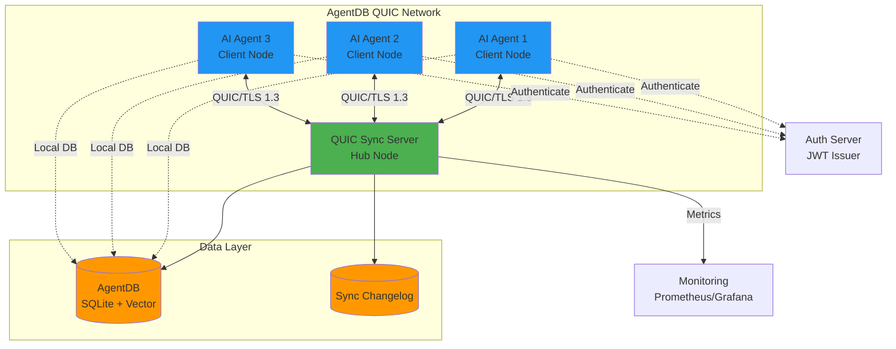

---

## 2. QUIC Connection Architecture

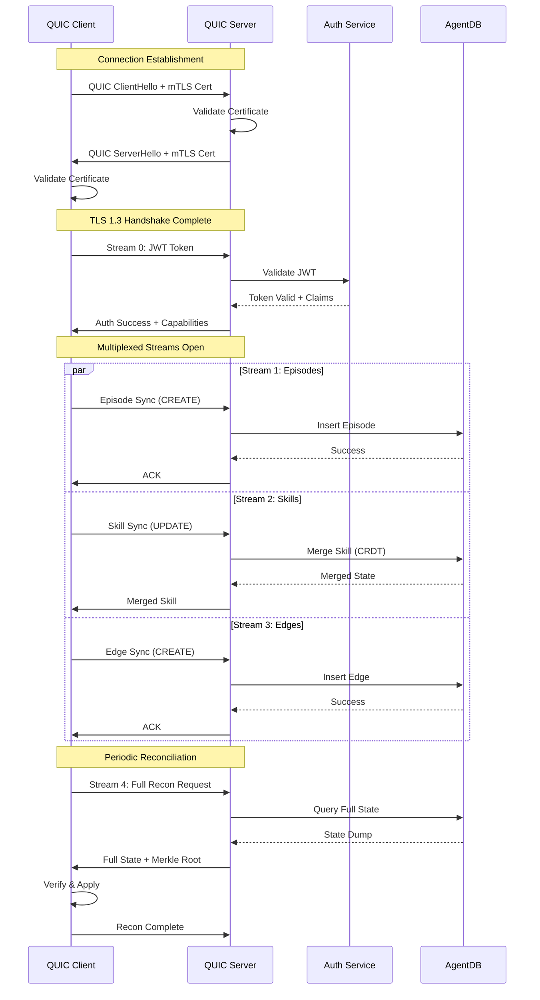

---

## 3. Data Flow Architecture

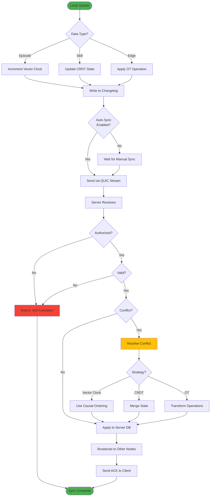

---

## 4. Conflict Resolution Decision Tree

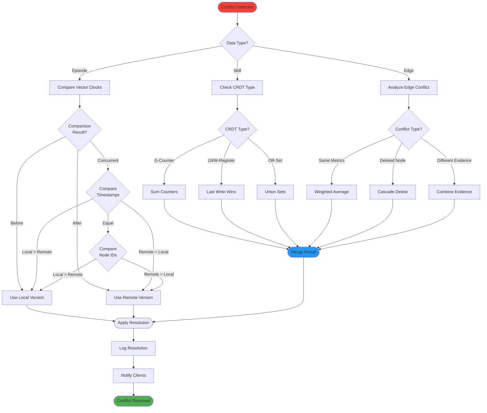

---

## 5. Hub-and-Spoke Topology

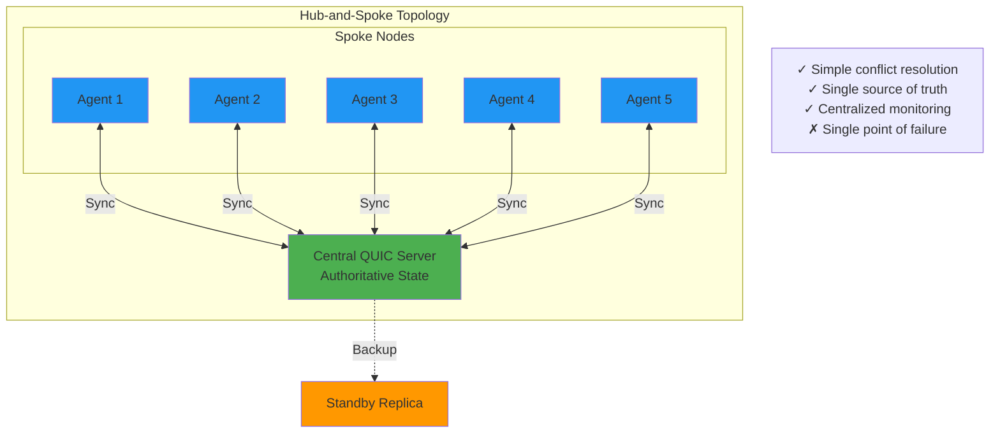

---

## 6. Mesh Topology

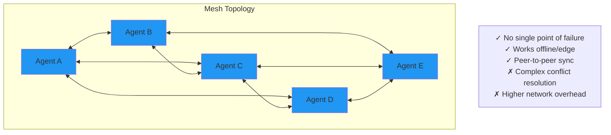

---

## 7. Hierarchical Topology

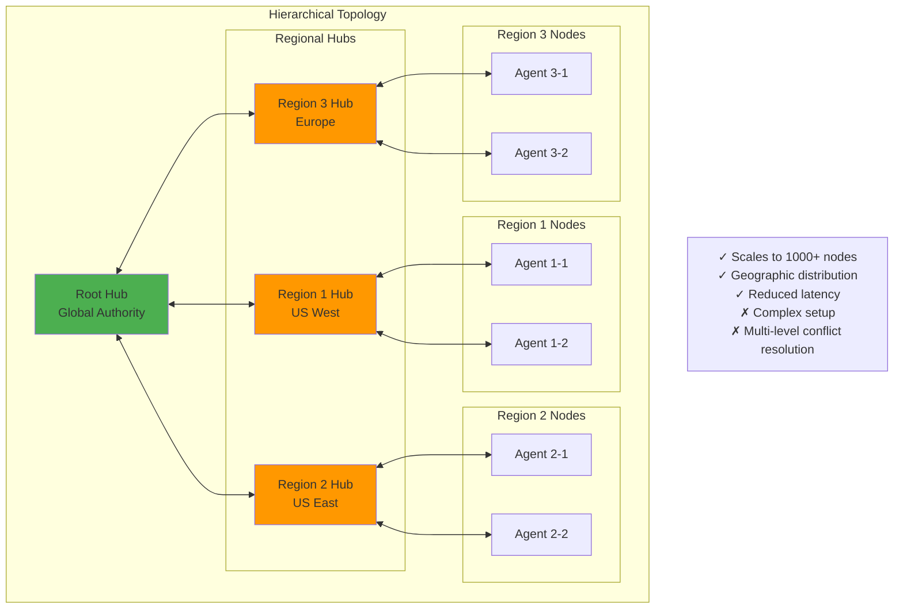

---

## 8. CRDT State Machine

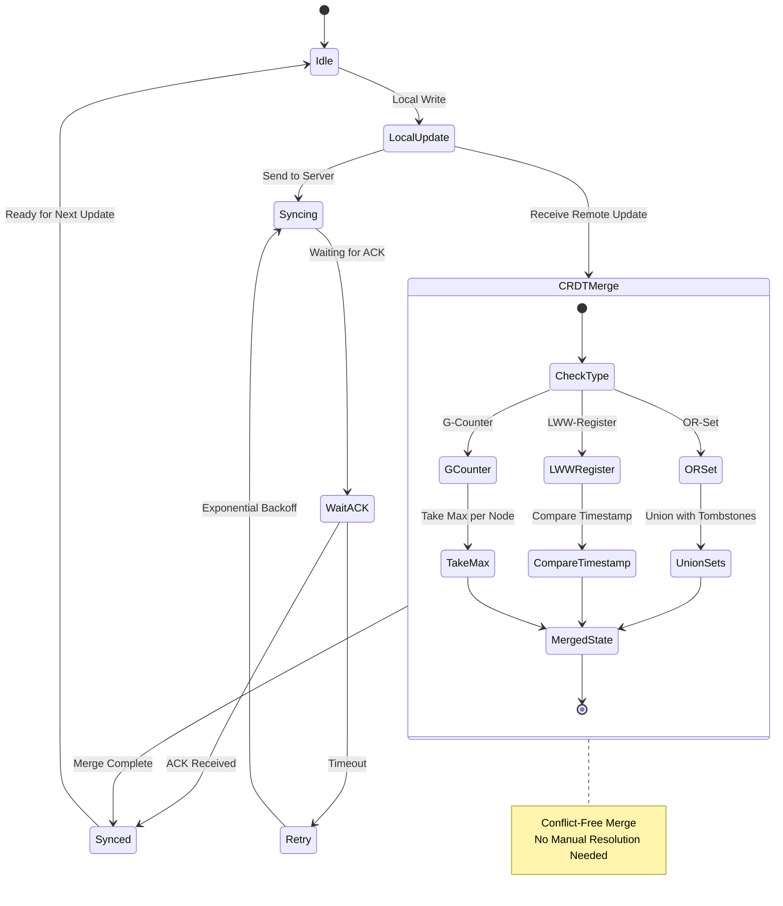

---

## 9. Vector Clock Comparison

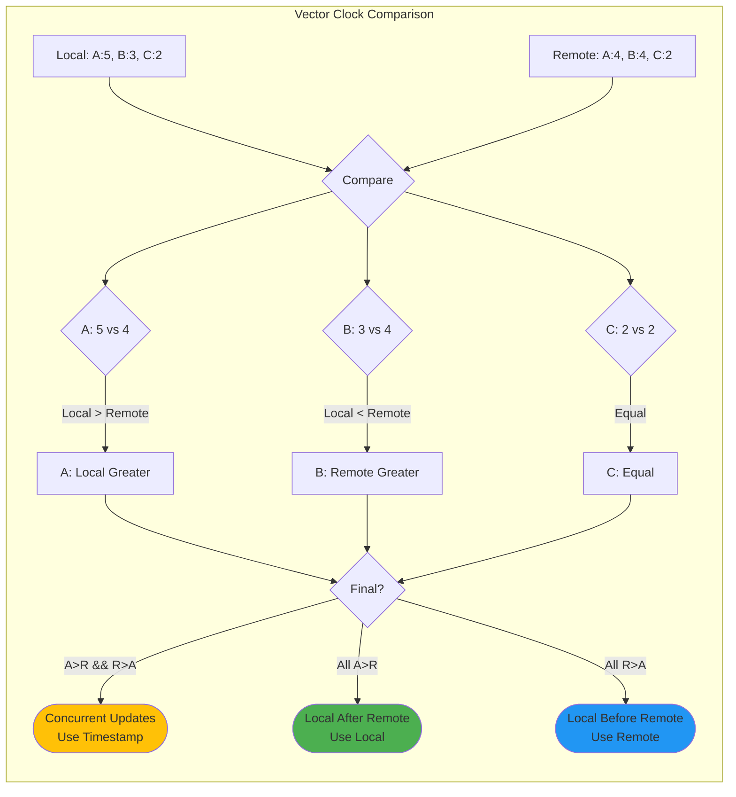

---

## 10. Incremental Sync Flow

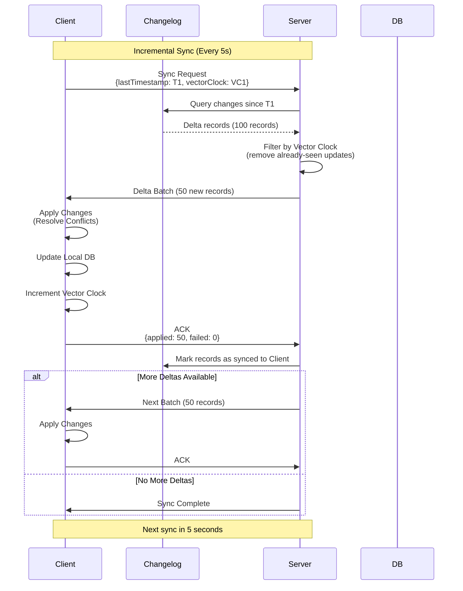

---

## 11. Full Reconciliation Flow

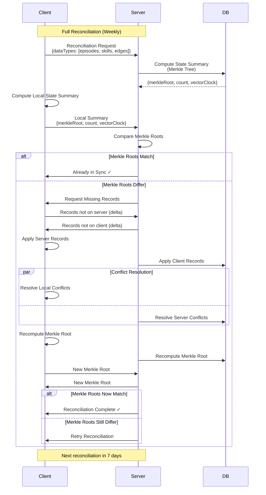

---

## 12. Authentication & Authorization Flow

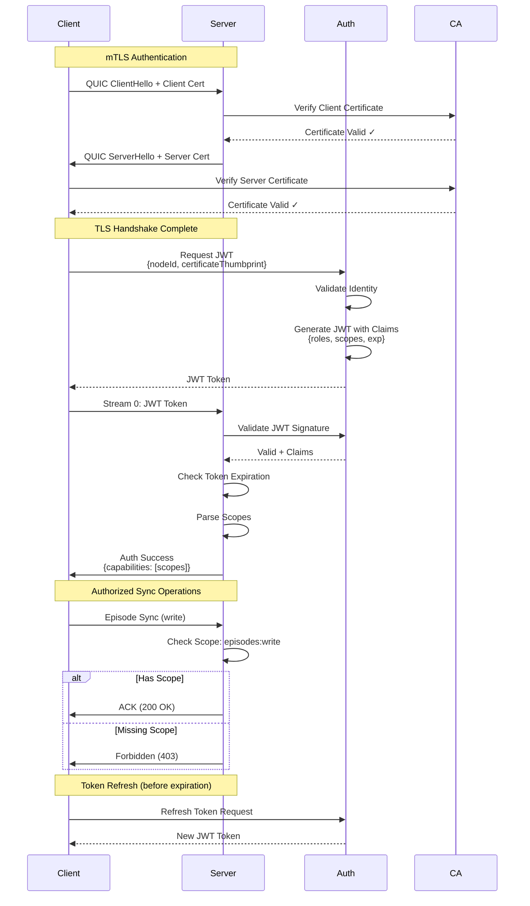

---

## 13. Monitoring & Observability

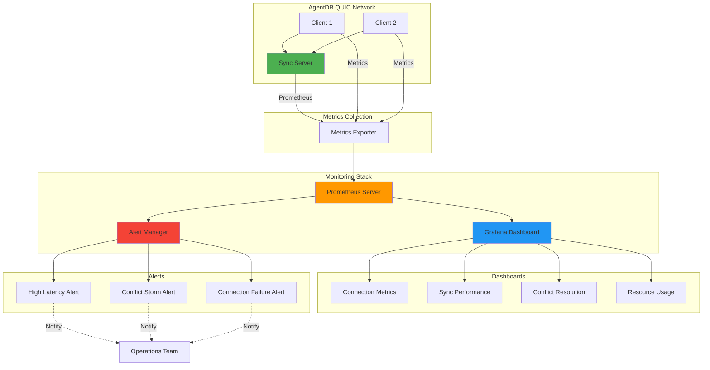

---

## 14. Deployment Architecture

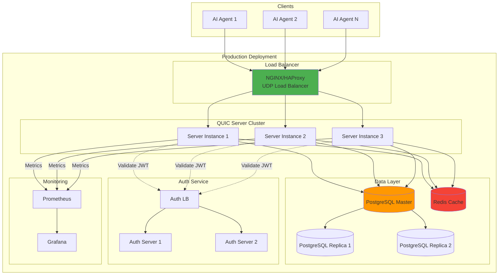

---

## 15. Security Layers

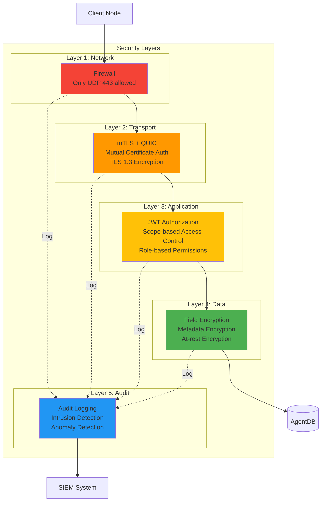

---

## 16. Performance Optimization Pipeline

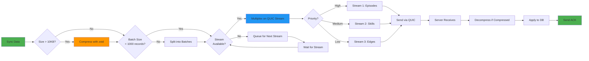

---

## Summary

These diagrams provide comprehensive visualization of:

1. **System Architecture**: Context, containers, and components (C4 model)
2. **Protocol Design**: QUIC connection flow and stream multiplexing
3. **Conflict Resolution**: Decision trees and CRDT state machines
4. **Topology Options**: Hub-and-spoke, mesh, and hierarchical
5. **Sync Strategies**: Incremental and full reconciliation flows
6. **Security**: Multi-layer authentication and authorization
7. **Operations**: Monitoring, deployment, and performance optimization

These diagrams complement the main QUIC Architecture document and provide visual reference for implementation teams.
