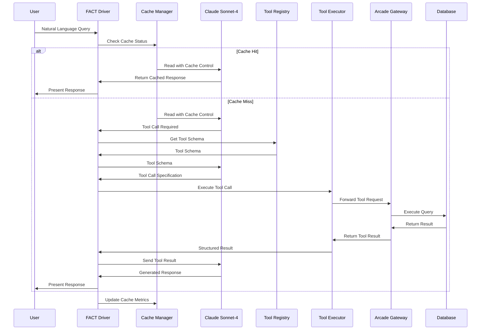
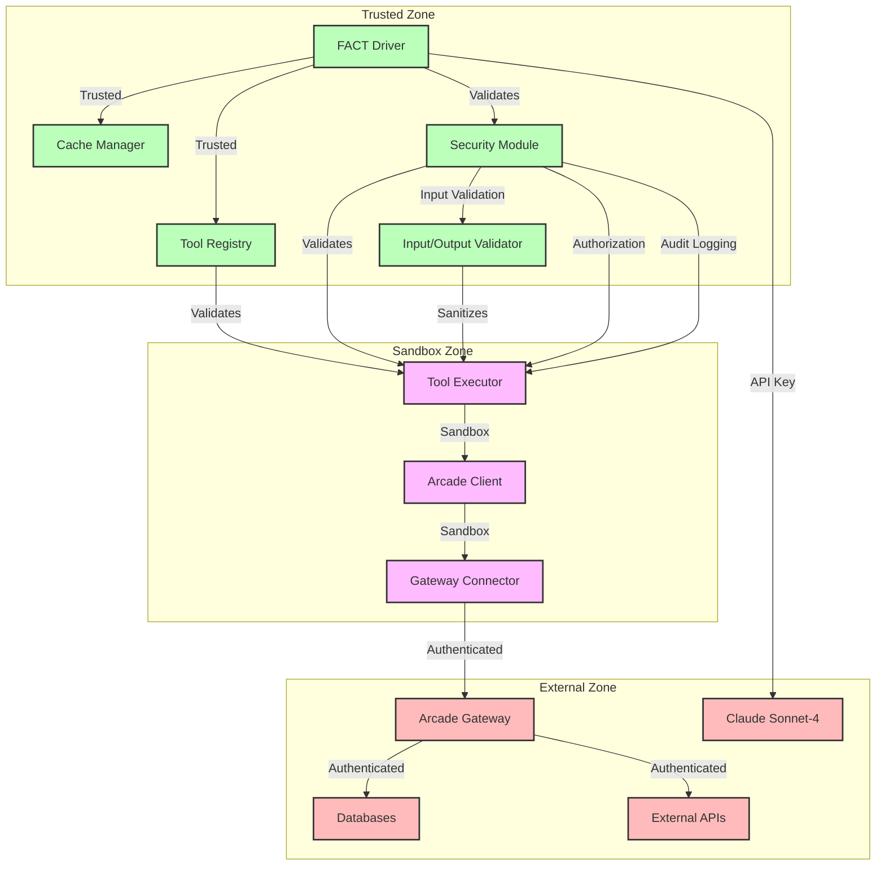
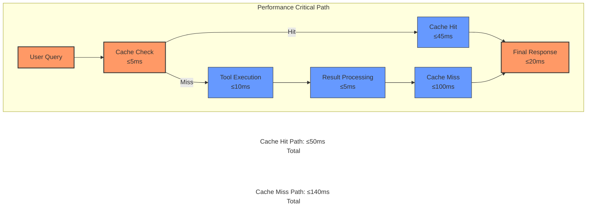
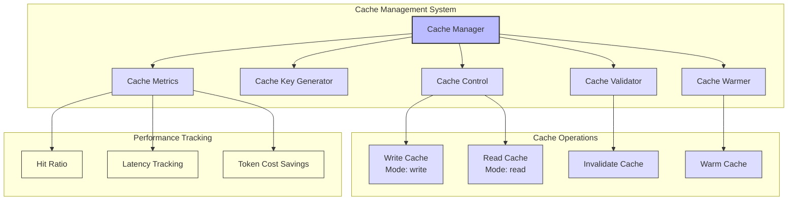
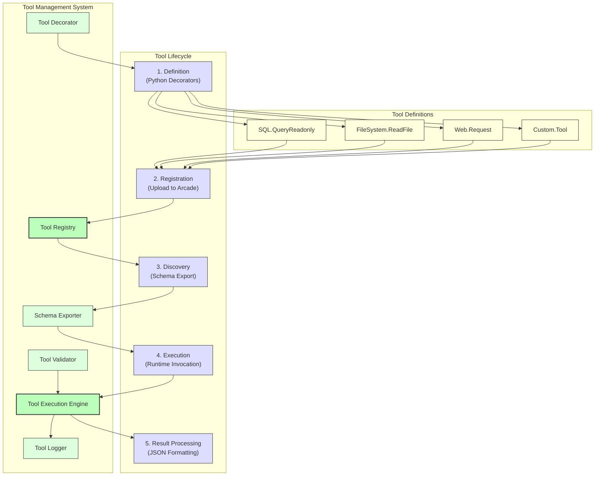

# FACT System Component Diagram

## High-Level Component Architecture

```mermaid
graph TD
    subgraph User["User Interface"]
        CLI["Command Line Interface"]
        API["API Interface (Future)"]
    end

    subgraph Core["Core System"]
        Driver["FACT Driver\n(Central Orchestrator)"]
        Config["Configuration Manager"]
        Logger["Structured Logger"]
    end

    subgraph CacheSystem["Cache Management System"]
        CacheManager["Cache Manager"]
        CacheMetrics["Cache Metrics"]
        CacheStrategy["Caching Strategies"]
        CacheWarming["Cache Warming"]
    end

    subgraph ToolSystem["Tool Management System"]
        ToolRegistry["Tool Registry"]
        ToolExecutor["Tool Execution Engine"]
        SchemaExporter["Schema Exporter"]
        ToolValidator["Tool Validator"]
    end

    subgraph ArcadeLayer["Arcade Integration Layer"]
        ArcadeClient["Arcade Client"]
        GatewayConnector["Gateway Connector"]
        Serializer["Request/Response Serializer"]
    end

    subgraph SecuritySystem["Security System"]
        Auth["Authentication"]
        OAuth["OAuth Provider"]
        InputValidator["Input Validator"]
        OutputSanitizer["Output Sanitizer"]
        AuditLogger["Audit Logger"]
    end

    subgraph DataLayer["Data Access Layer"]
        DBConnector["Database Connector"]
        ConnectionPool["Connection Pool"]
        QueryValidator["Query Validator"]
    end

    subgraph MonitoringSystem["Monitoring System"]
        Metrics["Performance Metrics"]
        HealthCheck["Health Checker"]
        Alerting["Alert Manager"]
    end

    subgraph ExternalSystems["External Systems"]
        Claude["Claude Sonnet-4"]
        ArcadeGateway["Arcade Gateway"]
        Database["SQLite/PostgreSQL"]
    end

    %% User Interface connections
    CLI --> Driver
    API --> Driver

    %% Core connections
    Driver --> Config
    Driver --> Logger
    Driver --> CacheManager
    Driver --> ToolRegistry
    Driver --> ArcadeClient

    %% Cache system connections
    CacheManager --> CacheMetrics
    CacheManager --> CacheStrategy
    CacheManager --> CacheWarming

    %% Tool system connections
    ToolRegistry --> SchemaExporter
    ToolRegistry --> ToolExecutor
    ToolExecutor --> ToolValidator
    ToolExecutor --> ArcadeClient

    %% Arcade layer connections
    ArcadeClient --> GatewayConnector
    ArcadeClient --> Serializer
    GatewayConnector --> ArcadeGateway

    %% Security system connections
    Driver --> Auth
    ToolExecutor --> InputValidator
    ToolExecutor --> OutputSanitizer
    ToolExecutor --> AuditLogger
    Auth --> OAuth

    %% Data layer connections
    ToolExecutor --> DBConnector
    DBConnector --> ConnectionPool
    DBConnector --> QueryValidator
    ConnectionPool --> Database

    %% Monitoring connections
    Driver --> Metrics
    CacheManager --> Metrics
    ToolExecutor --> Metrics
    DBConnector --> Metrics
    Metrics --> HealthCheck
    HealthCheck --> Alerting

    %% External system connections
    Driver --> Claude
    GatewayConnector --> ArcadeGateway
    ArcadeGateway --> Database

    %% Style
    classDef core fill:#f9f,stroke:#333,stroke-width:2px
    classDef cache fill:#bbf,stroke:#333,stroke-width:1px
    classDef tools fill:#bfb,stroke:#333,stroke-width:1px
    classDef arcade fill:#fbf,stroke:#333,stroke-width:1px
    classDef security fill:#fbb,stroke:#333,stroke-width:1px
    classDef data fill:#bff,stroke:#333,stroke-width:1px
    classDef monitoring fill:#ffb,stroke:#333,stroke-width:1px
    classDef external fill:#ddd,stroke:#333,stroke-width:1px
    classDef user fill:#ffd,stroke:#333,stroke-width:1px

    class Driver,Config,Logger core
    class CacheManager,CacheMetrics,CacheStrategy,CacheWarming cache
    class ToolRegistry,ToolExecutor,SchemaExporter,ToolValidator tools
    class ArcadeClient,GatewayConnector,Serializer arcade
    class Auth,OAuth,InputValidator,OutputSanitizer,AuditLogger security
    class DBConnector,ConnectionPool,QueryValidator data
    class Metrics,HealthCheck,Alerting monitoring
    class Claude,ArcadeGateway,Database external
    class CLI,API user
```



## Data Flow Architecture



## Security Boundaries



## Performance Critical Path



## Cache System Architecture



## Tool System Architecture



## Deployment Architecture

```mermaid
graph TD
    subgraph Production["Production Deployment"]
        LB["Load Balancer"]
        
        subgraph FACTCluster["FACT Driver Cluster"]
            Driver1["FACT Driver Instance 1"]
            Driver2["FACT Driver Instance 2"]
            DriverN["FACT Driver Instance N"]
        end
        
        subgraph ArcadeCluster["Arcade Gateway Cluster"]
            Gateway1["Gateway Instance 1"]
            Gateway2["Gateway Instance 2"]
            GatewayN["Gateway Instance N"]
        end
        
        subgraph DataLayer["Data Layer"]
            DB["Database Cluster"]
            Cache["Cache Layer"]
        end
        
        subgraph MonitoringLayer["Monitoring Layer"]
            Metrics["Metrics Collection"]
            Logging["Log Aggregation"]
            Alerting["Alert Management"]
            Dashboard["Monitoring Dashboard"]
        end
    end
    
    %% Connections
    LB --> Driver1
    LB --> Driver2
    LB --> DriverN
    
    Driver1 --> Gateway1
    Driver2 --> Gateway1
    Driver1 --> Gateway2
    Driver2 --> Gateway2
    DriverN --> GatewayN
    
    Gateway1 --> DB
    Gateway2 --> DB
    GatewayN --> DB
    
    Driver1 --> Cache
    Driver2 --> Cache
    DriverN --> Cache
    
    Driver1 --> Metrics
    Driver2 --> Metrics
    DriverN --> Metrics
    Gateway1 --> Metrics
    Gateway2 --> Metrics
    GatewayN --> Metrics
    DB --> Metrics
    
    Metrics --> Logging
    Metrics --> Alerting
    Metrics --> Dashboard
    Logging --> Dashboard
    Alerting --> Dashboard
    
    %% Style
    classDef lb fill:#f9f,stroke:#333,stroke-width:2px
    classDef driver fill:#bbf,stroke:#333,stroke-width:1px
    classDef gateway fill:#bfb,stroke:#333,stroke-width:1px
    classDef data fill:#fbf,stroke:#333,stroke-width:1px
    classDef monitoring fill:#ffd,stroke:#333,stroke-width:1px
    
    class LB lb
    class Driver1,Driver2,DriverN driver
    class Gateway1,Gateway2,GatewayN gateway
    class DB,Cache data
    class Metrics,Logging,Alerting,Dashboard monitoring