# FACT System Component Gap Analysis

This diagram visualizes the current state of the FACT system implementation, highlighting both implemented components and gaps identified in the architecture review.

## Component Implementation Status

```mermaid
graph TD
    %% Core System
    subgraph Core["Core System"]
        direction TB
        C_Driver["driver.py\n(Implemented)"]:::implemented
        C_Config["config.py\n(Implemented)"]:::implemented
        C_Cli["cli.py\n(Implemented)"]:::implemented
        C_Errors["errors.py\n(Implemented)"]:::implemented
        C_AgenticFlow["agentic_flow.py\n(Additional)"]:::additional
        C_Conversation["conversation.py\n(Additional)"]:::additional
        C_Logging["logging.py\n(Missing)"]:::missing
    end

    %% Cache System
    subgraph Cache["Cache System"]
        direction TB
        CA_Manager["manager.py\n(Implemented)"]:::implemented
        CA_Metrics["metrics.py\n(Implemented)"]:::implemented
        CA_Strategy["strategy.py\n(Implemented)"]:::implemented
        CA_Validation["validation.py\n(Implemented)"]:::implemented
        CA_Warming["warming.py\n(Implemented)"]:::implemented
        CA_Config["config.py\n(Additional)"]:::additional
        CA_Security["security.py\n(Additional)"]:::additional
    end

    %% Tool System
    subgraph Tools["Tool System"]
        direction TB
        T_Decorators["decorators.py\n(Implemented)"]:::implemented
        T_Executor["executor.py\n(Implemented)"]:::implemented
        T_Validation["validation.py\n(Implemented)"]:::implemented
        T_Registry["registry.py\n(Missing)"]:::missing
        T_Schema["schema.py\n(Missing)"]:::missing
        
        subgraph T_Connectors["Connectors"]
            direction TB
            TC_File["file.py\n(Implemented)"]:::implemented
            TC_Http["http.py\n(Implemented)"]:::implemented
            TC_Sql["sql.py\n(Implemented)"]:::implemented
            TC_Util["util.py\n(Missing)"]:::missing
        end
    end

    %% Arcade Integration
    subgraph Arcade["Arcade Integration"]
        direction TB
        A_Client["client.py\n(Implemented)"]:::implemented
        A_Gateway["gateway.py\n(Implemented)"]:::implemented
        A_Errors["errors.py\n(Implemented)"]:::implemented
        A_Serialization["serialization.py\n(Missing)"]:::missing
    end

    %% Security System
    subgraph Security["Security System"]
        direction TB
        S_Auth["auth.py\n(Implemented)"]:::implemented
        S_CacheEncryption["cache_encryption.py\n(Additional)"]:::additional
        S_Config["config.py\n(Additional)"]:::additional
        S_ErrorHandler["error_handler.py\n(Additional)"]:::additional
        S_InputSanitizer["input_sanitizer.py\n(Additional)"]:::additional
        S_TokenManager["token_manager.py\n(Additional)"]:::additional
        S_OAuth["oauth.py\n(Missing)"]:::missing
        S_Audit["audit.py\n(Missing)"]:::missing
        S_Sanitization["sanitization.py\n(Missing)"]:::missing
    end

    %% Database System
    subgraph Database["Database System"]
        direction TB
        D_Connection["connection.py\n(Implemented)"]:::implemented
        D_Models["models.py\n(Implemented)"]:::implemented
        D_Queries["queries.py\n(Missing)"]:::missing
    end

    %% Monitoring System
    subgraph Monitoring["Monitoring System"]
        direction TB
        M_Metrics["metrics.py\n(Implemented)"]:::implemented
        M_PerformanceOptimizer["performance_optimizer.py\n(Additional)"]:::additional
        M_Health["health.py\n(Missing)"]:::missing
        M_Alerting["alerting.py\n(Missing)"]:::missing
    end

    %% Component Relationships
    C_Driver --> C_Config
    C_Driver --> C_Cli
    C_Driver --> C_Errors
    C_Driver --> C_AgenticFlow
    C_Driver --> C_Conversation
    C_Driver -.-> C_Logging

    C_Driver --> CA_Manager
    CA_Manager --> CA_Metrics
    CA_Manager --> CA_Strategy
    CA_Manager --> CA_Validation
    CA_Manager --> CA_Warming
    CA_Manager --> CA_Config
    CA_Manager --> CA_Security

    C_Driver --> T_Executor
    T_Executor --> T_Decorators
    T_Executor --> T_Validation
    T_Executor -.-> T_Registry
    T_Executor -.-> T_Schema
    T_Executor --> TC_File
    T_Executor --> TC_Http
    T_Executor --> TC_Sql
    T_Executor -.-> TC_Util

    C_Driver --> A_Client
    A_Client --> A_Gateway
    A_Client --> A_Errors
    A_Client -.-> A_Serialization

    C_Driver --> S_Auth
    S_Auth --> S_TokenManager
    S_Auth -.-> S_OAuth
    S_Auth -.-> S_Audit
    S_Auth -.-> S_Sanitization
    S_Auth --> S_CacheEncryption
    S_Auth --> S_Config
    S_Auth --> S_ErrorHandler
    S_Auth --> S_InputSanitizer

    C_Driver --> D_Connection
    D_Connection --> D_Models
    D_Connection -.-> D_Queries

    C_Driver --> M_Metrics
    M_Metrics --> M_PerformanceOptimizer
    M_Metrics -.-> M_Health
    M_Metrics -.-> M_Alerting

    %% Legend
    classDef implemented fill:#90EE90,stroke:#333,stroke-width:1px
    classDef missing fill:#FFA07A,stroke:#333,stroke-width:1px
    classDef additional fill:#ADD8E6,stroke:#333,stroke-width:1px

    %% Legend nodes
    LegendImplemented["Implemented Component"]:::implemented
    LegendMissing["Missing Component"]:::missing
    LegendAdditional["Additional Component"]:::additional
```

## Relationship Legend

- Solid lines: Relationships between implemented components
- Dashed lines: Relationships involving missing components

## Component Legend

- Green: Implemented components that match the architecture specification
- Red: Missing components that were specified in the architecture
- Blue: Additional components present in implementation but not in the architecture specification

## Gap Analysis Summary

1. **Core System**:
   - Missing: logging.py
   - Additional: agentic_flow.py, conversation.py

2. **Cache System**:
   - All core components implemented
   - Additional: config.py, security.py

3. **Tool System**:
   - Missing: registry.py, schema.py
   - Missing in Connectors: util.py

4. **Arcade Integration**:
   - Missing: serialization.py

5. **Security System**:
   - Missing: oauth.py, audit.py, sanitization.py
   - Additional: cache_encryption.py, config.py, error_handler.py, input_sanitizer.py, token_manager.py

6. **Database System**:
   - Missing: queries.py

7. **Monitoring System**:
   - Missing: health.py, alerting.py
   - Additional: performance_optimizer.py

This visualization provides a clear picture of the current state of the FACT system implementation compared to its architectural specification, helping prioritize development efforts to address the identified gaps.