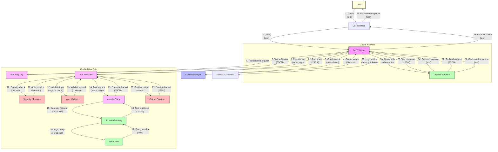
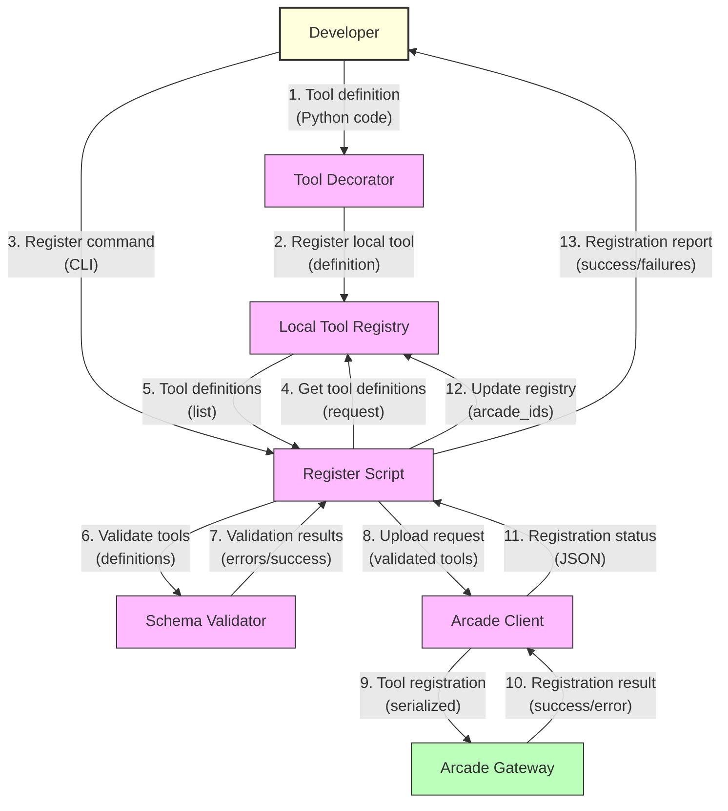
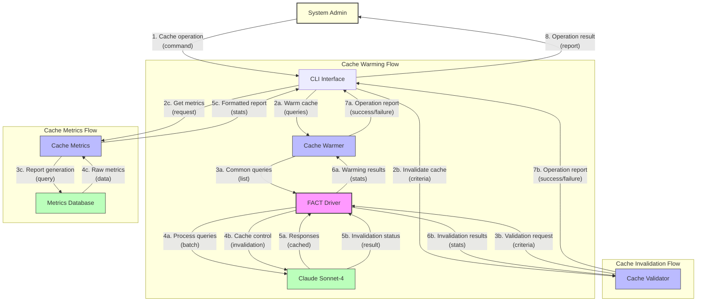
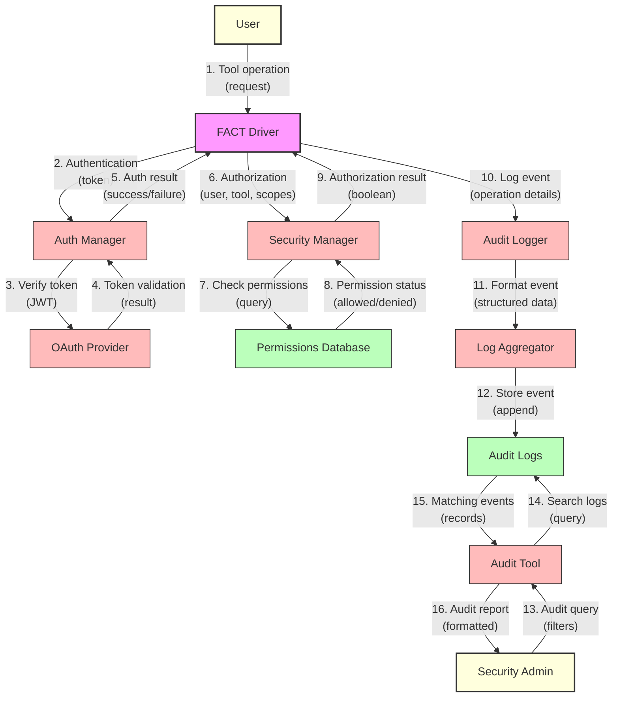
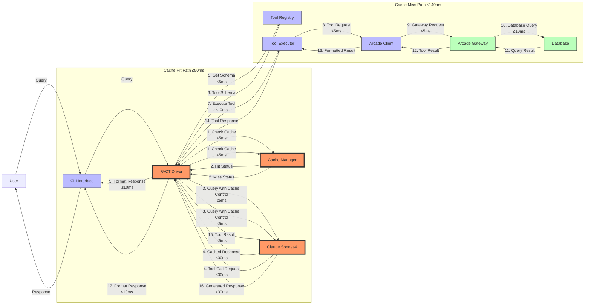

# FACT System Data Flow Architecture

This document details the flow of data through the FACT system, illustrating how information moves between components during key operations.

## 1. Query Processing Flow

The following diagram illustrates the data flow for processing a user query:

### Data Flow Description

1. **User Query**
   - The user submits a natural language query
   - Data: Text string with optional context

2. **Driver Processing**
   - The FACT Driver receives the query
   - Generates a cache key for the query
   - Checks cache status

3. **Cache Check**
   - The Cache Manager determines if the query exists in cache
   - Returns hit/miss status

4. **Cache Hit Path (Optimal Performance)**
   - Query is sent to Claude with cache control mode="read"
   - Claude returns the cached response directly
   - Response is returned to the user
   - Total latency: ≤50ms

5. **Cache Miss Path (Tool Execution)**
   - Query is sent to Claude with cache control mode="write"
   - Claude determines a tool is needed and returns a tool call request
   - Driver requests tool schemas from the Tool Registry
   - Driver forwards the tool execution request to Tool Executor
   - Tool Executor performs security checks and input validation
   - Request is forwarded to Arcade Client and then to Arcade Gateway
   - Tool is executed (e.g., SQL query against database)
   - Results flow back through the chain with validation and sanitization
   - Results are sent to Claude as a tool response
   - Claude generates the final response
   - Response is returned to the user
   - Total latency: ≤140ms

6. **Metrics Collection**
   - Performance metrics are logged throughout the process
   - Includes latency, token usage, cache status

## 2. Tool Registration Flow

The following diagram illustrates the data flow for registering a new tool:

### Data Flow Description

1. **Tool Definition**
   - Developer creates a tool using the provided decorators
   - Data: Python class or function with @tool decorator

2. **Local Registration**
   - Tool is registered in the local Tool Registry
   - Parameters, return types, and documentation are extracted

3. **Registration Command**
   - Developer triggers tool registration via CLI or script
   - Script gathers all registered tools from local registry

4. **Validation**
   - Tools are validated against schema requirements
   - Validation errors are reported if found

5. **Arcade Upload**
   - Valid tools are serialized and uploaded to Arcade Gateway
   - Arcade Gateway registers tools and returns IDs
   - Local registry is updated with Arcade tool IDs
   - Registration status is reported to the developer

## 3. Cache Management Flow

The following diagram illustrates the data flow for cache management operations:

### Data Flow Description

1. **Cache Warming Flow**
   - Admin initiates cache warming via CLI
   - Cache Warmer determines common queries to pre-cache
   - Driver processes queries in batch mode
   - Claude caches responses for future use
   - Operation statistics are reported back to admin
   - Data includes hit rates, token savings, latency improvements

2. **Cache Invalidation Flow**
   - Admin initiates cache invalidation via CLI
   - Cache Validator processes invalidation criteria
   - Driver sends invalidation request to Claude
   - Claude performs cache invalidation
   - Operation statistics are reported back to admin
   - Data includes invalidated entries, memory freed

3. **Cache Metrics Flow**
   - Admin requests cache performance metrics
   - Cache Metrics component generates a report
   - Data is pulled from metrics database
   - Formatted report is returned to admin
   - Data includes hit rates, latency stats, token savings

## 4. Security and Audit Flow

The following diagram illustrates the data flow for security operations:

### Data Flow Description

1. **Authentication Flow**
   - User request includes authentication token
   - Auth Manager verifies token with OAuth Provider
   - Token validation result is returned
   - Failed authentication generates security alert

2. **Authorization Flow**
   - Driver sends authorization request to Security Manager
   - Security Manager checks user permissions for tool/scope
   - Permission status is returned
   - Failed authorization generates security alert

3. **Audit Logging Flow**
   - All security-relevant events are logged
   - Audit Logger formats events with correlation IDs
   - Log Aggregator processes and stores events
   - Data includes timestamp, user, operation, status

4. **Audit Review Flow**
   - Security Admin queries audit logs
   - Audit Tool searches and filters log records
   - Matching events are returned
   - Formatted report is presented to admin

## 5. Performance Critical Paths

The following diagram highlights the performance-critical paths in the system:

### Performance Critical Paths Description

1. **Cache Hit Path (Target: ≤50ms)**
   - Most performance-critical path for typical operation
   - Key optimizations:
     - Efficient cache key generation
     - Minimal message size to Claude
     - Optimized cache prefix structure
     - Asynchronous processing

2. **Cache Miss Path (Target: ≤140ms)**
   - Performance-critical for new queries
   - Key optimizations:
     - Parallel tool schema loading
     - Optimized tool execution
     - Connection pooling for database
     - Efficient serialization/deserialization
     - Minimized network roundtrips

3. **Tool Execution Path (Target: ≤10ms)**
   - Critical for determinating total latency
   - Key optimizations:
     - Pre-validated queries
     - Connection pooling
     - Query optimization
     - Efficient data structures