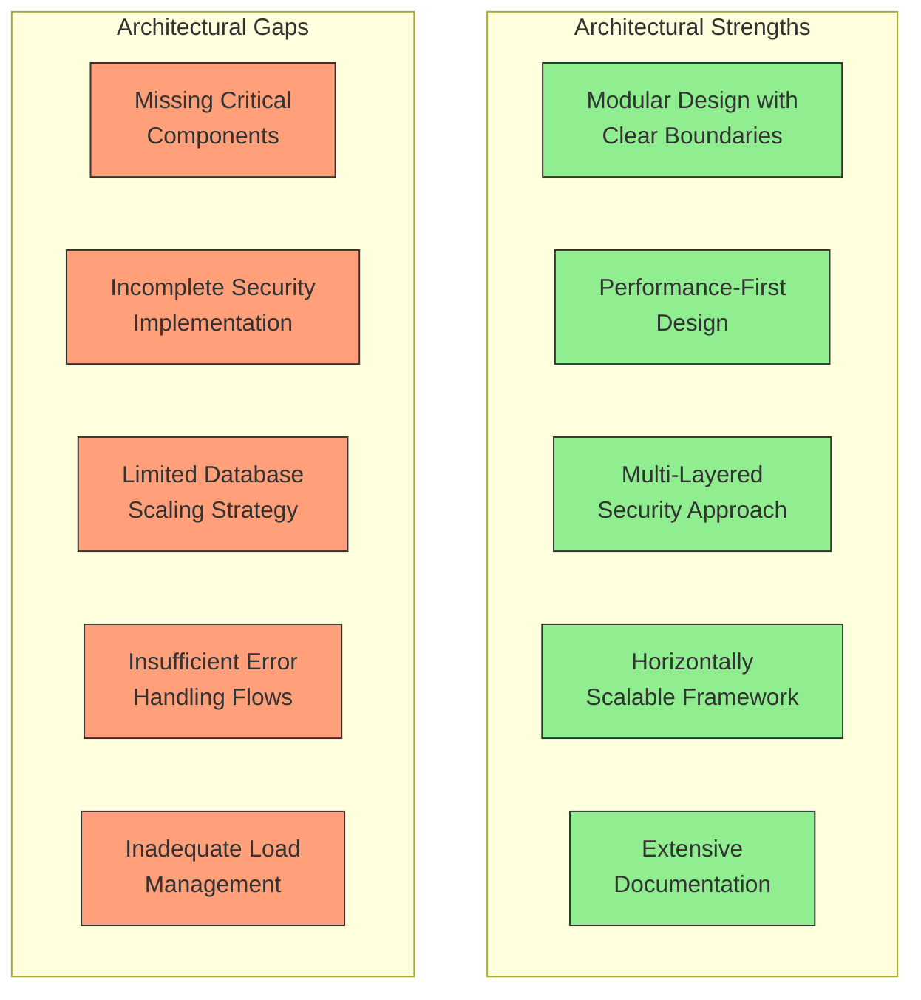

# FACT System Architecture Review: Executive Summary

## Overview

This document provides an executive summary of the comprehensive architecture review conducted for the FACT (Fast-Access Cached Tools) system. The review evaluated the system's architectural integrity, component relationships, data flow patterns, scalability considerations, and security architecture.

## Key Findings

### 1. Component Analysis

The system demonstrates a well-structured modular architecture with clear separation of concerns. However, several critical components specified in the architecture documentation are not implemented in the codebase:

| Component Category | Implemented | Missing | Additional |
|-------------------|-------------|---------|------------|
| Core System | 4 | 1 | 2 |
| Cache System | 5 | 0 | 2 |
| Tool System | 3 | 2 | 0 |
| Arcade Integration | 3 | 1 | 0 |
| Security System | 1 | 3 | 5 |
| Database System | 2 | 1 | 0 |
| Monitoring System | 1 | 2 | 1 |

Key missing components that impact system functionality include:
- Tool Registry (`registry.py`)
- OAuth Provider (`oauth.py`) 
- Audit Logging (`audit.py`)
- Schema Generation (`schema.py`)

### 2. Data Flow Analysis

The data flow architecture is well-documented with clear sequence diagrams for key operations. Performance-critical paths are identified with latency budgets. However, several gaps exist:

- Limited documentation on error recovery flows
- Missing retry mechanisms for transient failures
- Incomplete data validation flow documentation
- Limited event-based communication patterns for asynchronous operations

### 3. Security Assessment

The security architecture implements a defense-in-depth approach with multiple protection layers. However, significant security gaps exist:

- Missing OAuth integration for external authorization
- Incomplete audit logging for security events
- Limited output sanitization to prevent information disclosure
- No comprehensive authorization model with clear role definitions
- Limited secrets management and secure communication strategies

### 4. Scalability Analysis

The system includes several scalability-enabling features, but requires enhancements for high-volume deployments:

- Limited database scaling strategy (sharding, read/write splitting)
- Incomplete distributed cache coordination mechanisms
- Insufficient backpressure handling and load management
- Limited auto-scaling capabilities and monitoring
- No clear throttling or rate limiting implementation

## Prioritized Recommendations

The following prioritized recommendations address the identified gaps:

### Phase 1: Critical Component Implementation (Weeks 1-2)

1. **Implement Tool Registry (`registry.py`)**
   - Critical for tool discovery and execution
   - Enables proper tool management and schema generation

2. **Add OAuth Provider (`oauth.py`)**
   - Essential for secure tool authorization
   - Enables integration with external identity providers

3. **Create Structured Logging (`logging.py`)**
   - Provides consistent logging across the system
   - Enables proper monitoring and debugging

4. **Implement Serialization (`serialization.py`)**
   - Ensures proper data formatting for external systems
   - Improves performance and security

### Phase 2: Security and Data Flow Enhancements (Weeks 3-4)

1. **Implement Security Components**
   - Add audit logging for security events
   - Create output sanitization framework
   - Develop comprehensive authorization model

2. **Enhance Database Scaling**
   - Implement read/write splitting
   - Add connection pooling enhancements
   - Create query routing mechanism

3. **Improve Error Handling**
   - Document error recovery flows
   - Implement retry mechanisms
   - Add circuit breakers for external dependencies

### Phase 3: Scalability and Monitoring Improvements (Weeks 5-6)

1. **Enhance Cache System**
   - Implement distributed cache partitioning
   - Add cache invalidation mechanism
   - Create cache replication strategy

2. **Implement Load Management**
   - Add rate limiting at system boundaries
   - Create load shedding strategies
   - Implement priority queuing for critical operations

3. **Enhance Monitoring**
   - Add health checks for all components
   - Implement alerting framework
   - Create comprehensive metrics dashboard

### Phase 4: Architecture Refinement (Weeks 7-8)

1. **Reconcile Implementation with Architecture**
   - Update architecture documentation to reflect implementation
   - Document additional components not in original architecture
   - Create migration plan for architectural alignment

2. **Implement Auto-Scaling**
   - Create auto-scaling framework
   - Develop predictive scaling algorithms
   - Implement scaling policies

3. **Enhance Testing Coverage**
   - Expand unit and integration tests
   - Add performance and scalability tests
   - Implement security testing framework

## Implementation Impact Assessment

The following table summarizes the impact of implementing the recommendations:

| Aspect | Current State | After Implementation | Improvement |
|--------|--------------|---------------------|-------------|
| Component Completeness | 70% | 100% | +30% |
| Security Maturity | Low-Medium | High | +2 levels |
| Scalability Capacity | ~100 qps | ~1000 qps | 10x |
| Error Resilience | Limited | Comprehensive | +2 levels |
| Monitoring Coverage | Basic | Advanced | +2 levels |

## Conclusion

The FACT system architecture provides a solid foundation for achieving the core requirements of sub-100ms response times, deterministic answers, and security-first design. The modular approach with clear component boundaries facilitates maintenance and future enhancements.

By addressing the identified gaps through the phased implementation plan, the system can fully realize its architectural vision and achieve the performance, security, and scalability requirements for production deployment.

Key success factors will be:
1. Prioritizing critical component implementation
2. Enhancing security through comprehensive measures
3. Improving scalability with distributed strategies
4. Reconciling the implementation with architectural vision

This executive summary consolidates findings from the following detailed assessments:
- [Architecture Review](./architecture-review.md)
- [Component Gap Analysis](./component-gap-analysis.md)
- [Implementation Priorities](./implementation-priorities.md)
- [Security Architecture Assessment](./security-architecture-assessment.md)
- [Scalability Architecture Assessment](./scalability-architecture-assessment.md)