# FACT System Implementation Priorities

This document outlines a prioritized approach to addressing the gaps identified in the architecture review and component gap analysis. The priorities are based on component criticality, dependencies, and impact on system functionality and performance.

## Priority Levels

- **P0**: Critical components that significantly impact core functionality or security
- **P1**: High-priority components necessary for complete system operation
- **P2**: Medium-priority components that enhance system capabilities
- **P3**: Low-priority components that can be implemented later

## Implementation Plan

### Phase 1: Critical Core and Security Components (Weeks 1-2)

| Component | Location | Priority | Rationale |
|-----------|----------|----------|-----------|
| registry.py | src/tools/ | P0 | Tool Registry is critical for tool discovery and execution, a core functionality of the system |
| oauth.py | src/security/ | P0 | OAuth support is essential for secure tool authorization and access control |
| logging.py | src/core/ | P0 | Structured logging is critical for debugging, monitoring, and security audit trails |
| serialization.py | src/arcade/ | P0 | Required for properly formatting data between system and Arcade gateway |

**Key Tasks:**
1. Implement Tool Registry with proper registration and discovery mechanisms
2. Create OAuth provider with support for external authorization
3. Develop structured logging framework with proper log levels and formatting
4. Implement serialization utilities for Arcade gateway communication

**Success Criteria:**
- Tool registration and discovery working end-to-end
- OAuth authorization properly integrated with tool execution
- Comprehensive logging across all system components
- Proper data serialization for Arcade communication

### Phase 2: Data Flow and Validation Components (Weeks 3-4)

| Component | Location | Priority | Rationale |
|-----------|----------|----------|-----------|
| schema.py | src/tools/ | P1 | Required for tool schema generation for Claude integration |
| queries.py | src/db/ | P1 | Centralizes database queries for better maintenance |
| sanitization.py | src/security/ | P1 | Essential for preventing information disclosure in responses |
| audit.py | src/security/ | P1 | Required for comprehensive security event logging |

**Key Tasks:**
1. Implement schema generation for tools with proper Claude integration
2. Create centralized query management for database operations
3. Develop output sanitization framework for security
4. Implement security audit logging with correlation IDs

**Success Criteria:**
- Tool schemas correctly generated and working with Claude
- Database queries centralized and optimized
- Output properly sanitized to prevent information disclosure
- Security events comprehensively logged and traceable

### Phase 3: Monitoring and Resilience Components (Weeks 5-6)

| Component | Location | Priority | Rationale |
|-----------|----------|----------|-----------|
| health.py | src/monitoring/ | P2 | Enables system health monitoring and reporting |
| alerting.py | src/monitoring/ | P2 | Provides alerting for critical system issues |
| util.py | src/tools/connectors/ | P2 | Provides shared utilities for tool connectors |

**Key Tasks:**
1. Implement health check system with component status reporting
2. Create alerting framework with configurable thresholds
3. Develop utility functions for tool connectors

**Success Criteria:**
- Health checks working across all components
- Alerts properly triggered and delivered for system issues
- Tool connectors leveraging shared utilities for common operations

### Phase 4: Architecture Reconciliation (Weeks 7-8)

**Tasks:**
1. Review and document additional components not in the original architecture:
   - agentic_flow.py, conversation.py in core
   - config.py, security.py in cache
   - cache_encryption.py, config.py, error_handler.py, input_sanitizer.py, token_manager.py in security
   - performance_optimizer.py in monitoring

2. Update architecture documentation to reflect the actual implementation:
   - Revise component diagrams
   - Update data flow documentation
   - Align implementation guidelines with actual code

3. Create migration plan for any components that should be refactored:
   - Identify if additional components should replace or complement missing ones
   - Determine if any functionality overlap exists

**Success Criteria:**
- Architecture documentation accurately reflects implementation
- Clear rationale documented for all additional components
- Migration plan established for any necessary refactoring

## Dependency Map

```mermaid
graph TD
    %% Phase 1 Dependencies
    ToolRegistry["registry.py (P0)"] --> SchemaGen["schema.py (P1)"]
    ToolRegistry --> ToolExecutor["executor.py (Implemented)"]
    OAuthProvider["oauth.py (P0)"] --> SecurityAuth["auth.py (Implemented)"]
    OAuthProvider --> AuditLog["audit.py (P1)"]
    Logging["logging.py (P0)"] --> AuditLog
    Serialization["serialization.py (P0)"] --> ArcadeClient["client.py (Implemented)"]
    
    %% Phase 2 Dependencies
    SchemaGen --> Driver["driver.py (Implemented)"]
    DBQueries["queries.py (P1)"] --> DBConnection["connection.py (Implemented)"]
    OutputSanitization["sanitization.py (P1)"] --> ToolExecutor
    AuditLog --> SecurityAuth
    
    %% Phase 3 Dependencies
    HealthCheck["health.py (P2)"] --> Metrics["metrics.py (Implemented)"]
    Alerting["alerting.py (P2)"] --> HealthCheck
    ConnectorUtils["util.py (P2)"] --> FileConnector["file.py (Implemented)"]
    ConnectorUtils --> HttpConnector["http.py (Implemented)"]
    ConnectorUtils --> SqlConnector["sql.py (Implemented)"]
    
    %% Implementation Status
    classDef implemented fill:#90EE90,stroke:#333,stroke-width:1px
    classDef phase1 fill:#FF9999,stroke:#333,stroke-width:1px
    classDef phase2 fill:#FFD699,stroke:#333,stroke-width:1px
    classDef phase3 fill:#99CCFF,stroke:#333,stroke-width:1px
    
    class Driver,ToolExecutor,SecurityAuth,ArcadeClient,DBConnection,Metrics,FileConnector,HttpConnector,SqlConnector implemented
    class ToolRegistry,OAuthProvider,Logging,Serialization phase1
    class SchemaGen,DBQueries,OutputSanitization,AuditLog phase2
    class HealthCheck,Alerting,ConnectorUtils phase3
```

## Resource Allocation

### Engineering Resources

- **Core Components Team**: 2 engineers for Phase 1
- **Security Team**: 1 engineer for Phases 1-2
- **Data Team**: 1 engineer for Phase 2
- **DevOps Team**: 1 engineer for Phase 3
- **Documentation**: 1 technical writer for Phase 4

### Testing Resources

- **Test Engineer**: 1 dedicated to creating unit and integration tests for all new components
- **Performance Tester**: 1 focused on ensuring new components meet performance requirements
- **Security Tester**: 1 for validating security components

## Risk Assessment

| Risk | Impact | Mitigation |
|------|--------|------------|
| Dependencies between components delay implementation | High | Use mock implementations for dependencies to enable parallel development |
| Architectural reconciliation reveals deeper issues | Medium | Begin architectural review early in Phase 1 to identify potential issues |
| Performance impact of new components | Medium | Include performance testing in each phase and optimize early |
| Security vulnerabilities in new components | High | Include security review in each phase and conduct penetration testing |

## Conclusion

This prioritized implementation plan addresses the critical gaps in the FACT system architecture while recognizing dependencies between components. By focusing first on core functionality and security components, the system's fundamental capabilities and security posture will be established early. The phased approach allows for continuous integration and testing while making steady progress toward a complete implementation that aligns with the architectural vision.