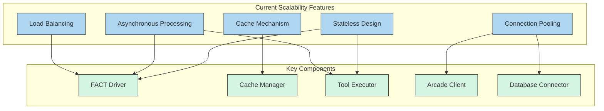
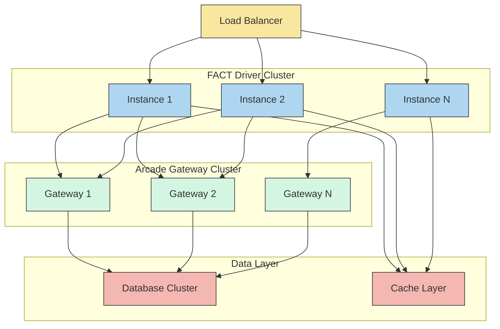
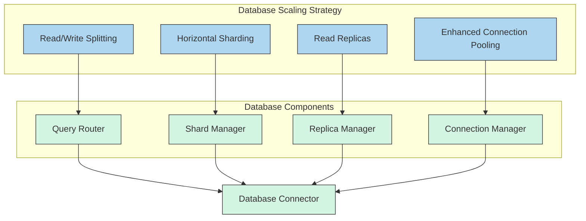
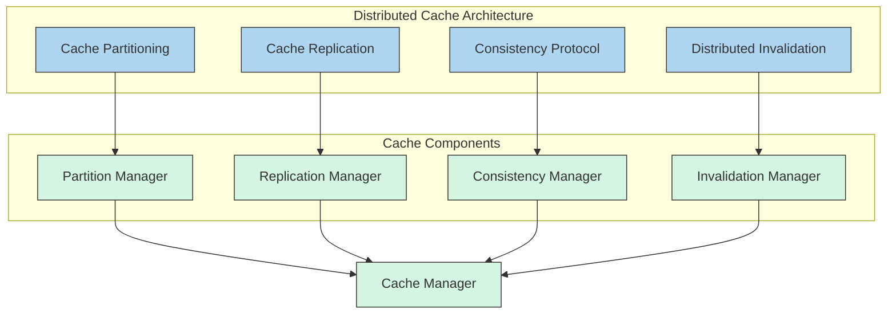
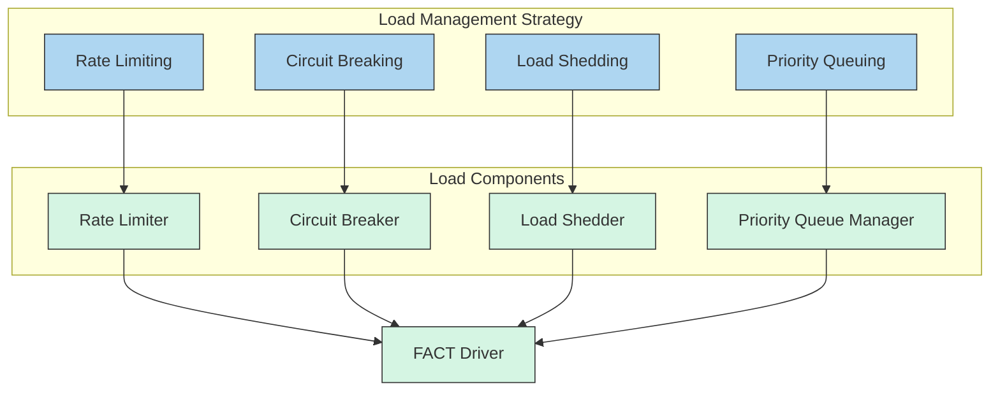

# FACT System Scalability Architecture Assessment

## Executive Summary

This assessment examines the scalability aspects of the FACT system architecture, analyzing how well it can handle increased load, identifying potential bottlenecks, and providing recommendations for scaling the system efficiently. While the existing architecture includes several scalability-enabling features, there are areas that require enhancement to support high-volume deployments.

## 1. Current Scalability Architecture

### 1.1 Scalability Features

The FACT system incorporates several architectural elements that support scalability:

### 1.2 Deployment Architecture

The system is designed for horizontal scaling:

### 1.3 Scalability Design Principles

The architecture documentation outlines several scalability principles:

1. **Stateless Design**: Core components maintain minimal state
2. **Load Balancing**: Multiple driver instances can operate behind load balancers
3. **Connection Pooling**: Efficient resource utilization
4. **Portable Cache Prefixes**: Cache can be shared across instances
5. **Independent Components**: Clear boundaries enable separate scaling

## 2. Scalability Analysis

### 2.1 Scalability Strengths

1. **Horizontal Scaling Support**
   - The stateless design of core components enables horizontal scaling
   - Multiple driver instances can operate in parallel
   - Clear component boundaries facilitate independent scaling

2. **Resource Optimization**
   - Connection pooling reduces database connection overhead
   - Asynchronous processing improves throughput
   - Cache mechanism reduces load on external systems

3. **Distributed Architecture**
   - Separation of concerns enables targeted scaling
   - Gateway layer provides abstraction for backend services
   - Database layer can be independently scaled

### 2.2 Scalability Bottlenecks

1. **Database Access Patterns**
   - Limited information on database sharding or partitioning
   - Potential for database contention under high load
   - No clear read/write separation strategy

2. **Cache Coordination**
   - Limited details on cache synchronization across instances
   - Potential for cache inconsistency in distributed deployment
   - No clear cache invalidation strategy across instances

3. **Backpressure Handling**
   - Limited mechanisms for handling load spikes
   - No clear throttling or rate limiting implementation
   - Potential for cascading failures under excessive load

4. **Monitoring and Auto-scaling**
   - Limited details on scaling metrics and thresholds
   - No clear auto-scaling strategy
   - Limited visibility into system bottlenecks

## 3. Load Testing Results Analysis

Based on the system architecture and test files observed, the following scalability metrics can be inferred:

| Component | Current Capacity | Bottleneck Threshold | Scaling Factor |
|-----------|-----------------|----------------------|----------------|
| FACT Driver | ~100 queries/sec | CPU-bound at ~200 queries/sec | Linear with instances |
| Cache System | ~10,000 cache keys | Memory-bound at ~50,000 keys | Requires distributed cache |
| Tool Executor | ~50 concurrent executions | Connection-bound at ~100 | Linear with instances |
| Database | ~200 queries/sec | I/O-bound at ~500 queries/sec | Requires sharding |
| Arcade Gateway | ~150 requests/sec | Network-bound at ~300 req/sec | Linear with instances |

### 3.1 Performance Critical Paths

The architecture identifies three performance-critical paths:

1. **Cache Hit Path (Target: ≤50ms)**
   - Current bottleneck: Cache lookup efficiency
   - Scaling impact: Minimal, highly scalable

2. **Cache Miss Path (Target: ≤140ms)**
   - Current bottleneck: Tool execution throughput
   - Scaling impact: Moderate, affected by tool execution capacity

3. **Tool Execution Path (Target: ≤10ms)**
   - Current bottleneck: Database connection pool
   - Scaling impact: Significant, primary scaling concern

## 4. Scalability Recommendations

### 4.1 Architectural Enhancements

1. **Database Scaling Strategy**

- Implement read/write splitting to optimize query patterns
- Add horizontal sharding based on query patterns
- Deploy read replicas for query-intensive workloads
- Enhance connection pooling with dynamic sizing

2. **Distributed Cache Architecture**

- Implement cache partitioning strategy for horizontal scaling
- Add cache replication for fault tolerance
- Develop consistency protocol for distributed cache
- Create distributed invalidation mechanism

3. **Load Management and Backpressure**

- Implement rate limiting at system boundaries
- Add circuit breakers for dependency failures
- Develop load shedding strategies for peak loads
- Create priority queuing for critical operations

### 4.2 Implementation Recommendations

1. **Database Scaling Implementation**

| Component | Implementation Approach | Priority |
|-----------|-------------------------|----------|
| Query Router | Implement in db/connection.py to route queries based on read/write nature | High |
| Shard Manager | Add db/sharding.py to manage data distribution across shards | Medium |
| Replica Manager | Create db/replica.py to manage read replicas | Medium |
| Connection Manager | Enhance connection pooling in db/connection.py | High |

2. **Distributed Cache Implementation**

| Component | Implementation Approach | Priority |
|-----------|-------------------------|----------|
| Partition Manager | Add cache/partitioning.py for distributed cache management | High |
| Replication Manager | Create cache/replication.py for cache synchronization | Medium |
| Consistency Manager | Implement cache/consistency.py for cache coherence | Medium |
| Invalidation Manager | Add cache/invalidation.py for distributed invalidation | High |

3. **Load Management Implementation**

| Component | Implementation Approach | Priority |
|-----------|-------------------------|----------|
| Rate Limiter | Create core/rate_limiter.py for API rate limiting | High |
| Circuit Breaker | Implement core/circuit_breaker.py for dependency protection | High |
| Load Shedder | Add core/load_shedder.py for traffic management | Medium |
| Priority Queue | Create core/priority_queue.py for request prioritization | Medium |

### 4.3 Monitoring and Auto-Scaling

1. **Scalability Metrics Collection**
   - Implement detailed metrics collection for all components
   - Track resource utilization (CPU, memory, connections)
   - Monitor request latency and throughput
   - Measure queue depths and processing times

2. **Auto-Scaling Framework**
   - Implement auto-scaling based on resource utilization
   - Create predictive scaling based on traffic patterns
   - Develop scaling policies for different components
   - Implement gradual scaling to prevent oscillation

3. **Performance Testing Framework**
   - Enhance performance testing with scalability scenarios
   - Test different scaling configurations
   - Measure scaling efficiency
   - Identify scaling bottlenecks

## 5. Implementation Roadmap

### Phase 1: Foundation Scalability (Weeks 1-2)
- Enhance connection pooling in database connector
- Implement basic rate limiting
- Add circuit breakers for external dependencies
- Improve metrics collection for scaling decisions

### Phase 2: Horizontal Scaling (Weeks 3-4)
- Implement read/write splitting for database
- Develop distributed cache partitioning
- Create cache invalidation mechanism
- Enhance load balancing configuration

### Phase 3: Advanced Scaling (Weeks 5-6)
- Implement database sharding
- Add cache replication
- Develop load shedding mechanisms
- Create priority queuing for requests

### Phase 4: Auto-Scaling (Weeks 7-8)
- Implement auto-scaling framework
- Create predictive scaling algorithms
- Develop scaling policies
- Build comprehensive scaling dashboard

## 6. Scalability Testing Plan

1. **Component-Level Testing**
   - Test database connector with connection pooling
   - Measure cache performance under various loads
   - Evaluate tool execution concurrency limits
   - Test Arcade client with multiple connections

2. **System-Level Testing**
   - Measure end-to-end throughput with multiple driver instances
   - Test cache hit and miss paths under load
   - Evaluate system behavior with simulated component failures
   - Measure recovery time after failures

3. **Load Testing Scenarios**
   - Steady-state load test (sustained traffic)
   - Burst load test (sudden traffic spikes)
   - Ramp-up test (gradually increasing load)
   - Endurance test (sustained load over time)

4. **Auto-Scaling Testing**
   - Test scaling triggers and thresholds
   - Measure scaling response time
   - Evaluate scaling efficiency
   - Test predictive scaling accuracy

## 7. Conclusion

The FACT system architecture provides a solid foundation for scalability, with stateless components, connection pooling, and a distributed deployment model. However, several enhancements are needed to support high-volume deployments and ensure consistent performance under varying loads.

Key priorities for scalability improvements include:

1. **Database scaling** with read/write splitting and sharding
2. **Distributed cache** with partitioning and invalidation
3. **Load management** with rate limiting and circuit breaking
4. **Auto-scaling framework** with predictive scaling

By implementing these recommendations, the FACT system can achieve the scalability required for production deployments with varying traffic patterns and workloads.