# FACT System Security Architecture Assessment

## Executive Summary

This assessment examines the security architecture of the FACT system, evaluating its current implementation against industry best practices and the specified security requirements. The system demonstrates a security-first approach with multiple defensive layers, but several key gaps need to be addressed to ensure comprehensive protection.

## 1. Current Security Architecture

### 1.1 Security Components

The FACT system implements security through several components:

```mermaid
graph TD
    subgraph SecurityLayers["Security Architecture Layers"]
        Authentication["Authentication Layer"]
        Authorization["Authorization Layer"]
        InputValidation["Input Validation"]
        OutputSanitization["Output Sanitization"]
        AuditLogging["Audit Logging"]
        Encryption["Data Encryption"]
    end
    
    subgraph SecurityComponents["Implementation Components"]
        Auth["auth.py"]
        TokenManager["token_manager.py"]
        InputSanitizer["input_sanitizer.py"]
        ErrorHandler["error_handler.py"]
        CacheEncryption["cache_encryption.py"]
        Config["config.py"]
    end
    
    subgraph MissingComponents["Missing Security Components"]
        OAuth["oauth.py"]
        Audit["audit.py"]
        Sanitization["sanitization.py"]
    end
    
    Authentication --> Auth
    Authentication --> TokenManager
    Authorization --> Auth
    Authorization -.-> OAuth
    InputValidation --> InputSanitizer
    OutputSanitization -.-> Sanitization
    AuditLogging -.-> Audit
    Encryption --> CacheEncryption
    
    classDef present fill:#90EE90,stroke:#333,stroke-width:1px
    classDef missing fill:#FFA07A,stroke:#333,stroke-width:1px
    classDef layer fill:#E0E0E0,stroke:#333,stroke-width:1px
    
    class Auth,TokenManager,InputSanitizer,ErrorHandler,CacheEncryption,Config present
    class OAuth,Audit,Sanitization missing
    class Authentication,Authorization,InputValidation,OutputSanitization,AuditLogging,Encryption layer
```



### 1.2 Security Boundaries

The system defines three security zones:

1. **Trusted Zone**: Core components with high privilege
   - FACT Driver
   - Cache Manager
   - Tool Registry
   - Security Module
   - Input/Output Validator

2. **Sandbox Zone**: Limited-privilege execution environment
   - Tool Executor
   - Arcade Client
   - Gateway Connector

3. **External Zone**: External systems with controlled access
   - Claude Sonnet-4
   - Arcade Gateway
   - Databases
   - External APIs

### 1.3 Security Controls

The system implements several security controls:

1. **Authentication**: API key management
2. **Input Validation**: Schema-based validation
3. **Data Protection**: Cache encryption 
4. **Error Handling**: Secure error processing
5. **Token Management**: Secure token handling

## 2. Security Architecture Gaps

### 2.1 Missing Components

Several critical security components specified in the architecture are not implemented:

1. **OAuth Integration (`oauth.py`)**
   - Impact: Limited support for external authorization
   - Risk: Reduced ability to leverage external identity providers and implement fine-grained access control

2. **Audit Logging (`audit.py`)**
   - Impact: Inadequate security event tracking
   - Risk: Limited ability to detect, investigate, and respond to security incidents

3. **Output Sanitization (`sanitization.py`)**
   - Impact: Potential information disclosure in responses
   - Risk: Sensitive data might be inadvertently exposed to unauthorized users

### 2.2 Architectural Gaps

Beyond missing components, several architectural security gaps exist:

1. **Authorization Model**
   - The system lacks a comprehensive authorization model with clear role definitions and permission boundaries
   - No evident implementation of scope-based access control for tools

2. **Secure Communication**
   - Limited details on securing communication between components
   - No explicit encryption for data in transit between system components

3. **Secrets Management**
   - No dedicated secrets management component
   - Unclear how API keys and credentials are securely stored and rotated

4. **Security Monitoring**
   - Limited real-time security monitoring capabilities
   - No intrusion detection or anomaly detection systems

## 3. Recommendations

### 3.1 Component Implementation Priorities

| Component | Priority | Implementation Recommendation |
|-----------|----------|-------------------------------|
| oauth.py | High | Implement OAuth 2.0 integration with support for standard flows (authorization code, client credentials) and JWT validation |
| audit.py | High | Create a comprehensive audit logging system with correlation IDs, structured event data, and secure storage |
| sanitization.py | High | Implement output filtering to prevent sensitive data leakage, with configurable rules for different data types |

### 3.2 Security Architecture Enhancements

1. **Comprehensive Authorization Model**
   ```mermaid
   graph TD
       subgraph AuthorizationModel["Authorization Model"]
           RoleDefinition["Role Definition"]
           PermissionSets["Permission Sets"]
           ResourceScopes["Resource Scopes"]
           AccessPolicies["Access Policies"]
       end
       
       User --> RoleAssignment
       RoleAssignment --> Role
       Role --> PermissionSets
       PermissionSets --> Permissions
       Permissions --> ResourceScopes
       ResourceScopes --> Resources
       AccessPolicies --> Role
       AccessPolicies --> ResourceScopes
       
       classDef entity fill:#AED6F1,stroke:#333,stroke-width:1px
       class RoleDefinition,PermissionSets,ResourceScopes,AccessPolicies entity
   ```

   - Implement RBAC (Role-Based Access Control) with granular permissions
   - Define clear resource scopes for tools and data
   - Create policy-based access control for complex authorization scenarios

2. **Secure Communication Layer**
   - Implement TLS for all component communications
   - Add message-level encryption for sensitive payloads
   - Implement mutual authentication between components

3. **Secrets Management System**
   - Create a dedicated secrets management component
   - Implement secure storage with encryption at rest
   - Add automatic credential rotation
   - Integrate with external vault systems (e.g., HashiCorp Vault, AWS Secrets Manager)

4. **Security Monitoring and Response**
   - Implement real-time security event monitoring
   - Add anomaly detection for unusual access patterns
   - Create automated response procedures for common security events
   - Implement regular security scanning and testing

### 3.3 Secure Development Practices

1. **Security Testing**
   - Implement automated security testing in CI/CD pipeline
   - Conduct regular penetration testing
   - Perform static code analysis for security vulnerabilities
   - Implement dependency scanning for known vulnerabilities

2. **Security Documentation**
   - Create comprehensive security documentation
   - Document threat models for each component
   - Provide security implementation guidelines for developers
   - Create incident response procedures

## 4. Implementation Roadmap

### Phase 1: Critical Security Components (Weeks 1-2)
- Implement oauth.py with basic OAuth 2.0 support
- Create audit.py with comprehensive logging
- Develop sanitization.py for output filtering

### Phase 2: Authorization Enhancement (Weeks 3-4)
- Implement role-based access control
- Define permission sets for tools
- Create resource scope definitions
- Implement policy enforcement points

### Phase 3: Communication Security (Weeks 5-6)
- Implement TLS for all component communications
- Add message-level encryption for sensitive data
- Create secure channel management

### Phase 4: Secrets and Monitoring (Weeks 7-8)
- Implement secrets management system
- Create security monitoring dashboard
- Develop anomaly detection capabilities
- Implement automated security responses

## 5. Security Architecture Maturity Assessment

| Security Domain | Current Maturity | Target Maturity | Gap |
|-----------------|-----------------|-----------------|-----|
| Authentication | Medium | High | OAuth integration |
| Authorization | Low | High | RBAC implementation |
| Input Validation | Medium | High | Enhanced schema validation |
| Output Sanitization | Low | High | Implementation of sanitization.py |
| Audit Logging | Low | High | Implementation of audit.py |
| Data Protection | Medium | High | Enhanced encryption |
| Secrets Management | Low | High | Dedicated secrets system |
| Security Monitoring | Low | Medium | Monitoring and alerting |

## 6. Conclusion

The FACT system's security architecture demonstrates a solid foundation with security-first principles, but several critical gaps need to be addressed. By implementing the missing components and enhancing the overall security architecture, the system can achieve a comprehensive security posture that protects against modern threats.

The recommended approach focuses on addressing the most critical gaps first, particularly the missing OAuth, audit logging, and output sanitization components. Following this, a phased implementation of broader security enhancements will systematically improve the system's security maturity.

Key success factors will include:
- Ensuring security is integrated into the development process
- Implementing comprehensive testing for security components
- Creating detailed security documentation
- Establishing regular security reviews and assessments

By addressing these recommendations, the FACT system can achieve a robust security architecture that meets industry standards and protects sensitive data and operations.