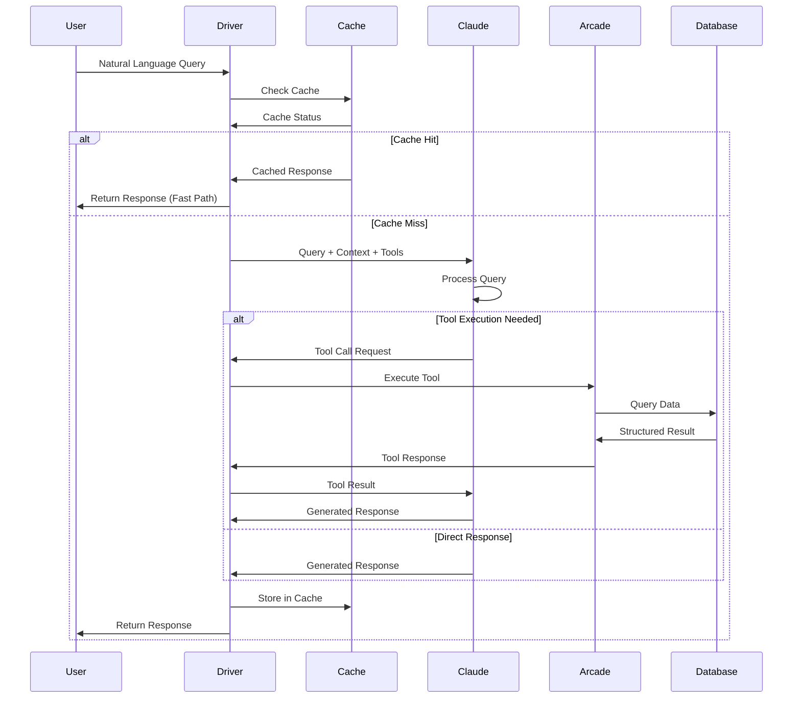
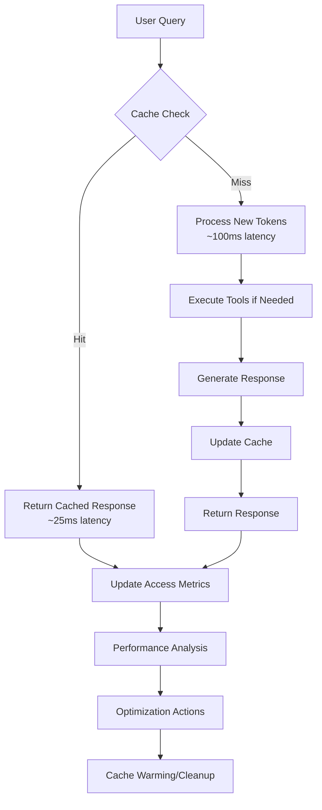
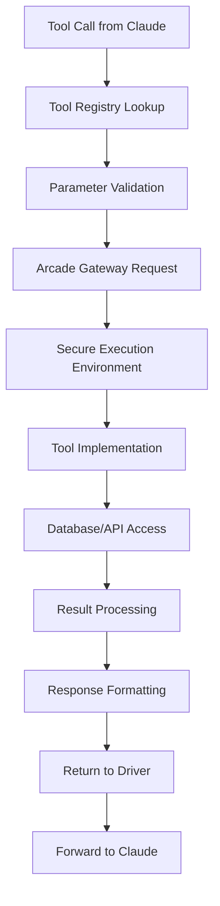

# FACT System - Architecture and Component Overview

## Overview

This guide provides a comprehensive overview of the FACT (Fast-Access Cached Tools) system architecture, components, and design principles. Use this to understand how the system works, how components interact, and how to extend or modify the system.

## Table of Contents

1. [System Architecture Overview](#system-architecture-overview)
2. [Core Components](#core-components)
3. [Data Flow and Processing](#data-flow-and-processing)
4. [Component Interactions](#component-interactions)
5. [Extension Points](#extension-points)
6. [Deployment Architectures](#deployment-architectures)

## System Architecture Overview

### High-Level Architecture

FACT implements a three-tier architecture optimized for low-latency, deterministic responses:

```
┌─────────────────────────────────────────────────────────────────┐
│                        User Interface Layer                     │
│  ┌─────────────────┐  ┌─────────────────┐  ┌─────────────────┐ │
│  │   CLI Client    │  │   Web Interface │  │   API Clients   │ │
│  └─────────────────┘  └─────────────────┘  └─────────────────┘ │
└─────────────────────────────────────────────────────────────────┘
                                │
                                ▼
┌─────────────────────────────────────────────────────────────────┐
│                     Core Processing Layer                       │
│  ┌─────────────────┐  ┌─────────────────┐  ┌─────────────────┐ │
│  │  FACT Driver    │  │ Cache Manager   │  │ Tool Registry   │ │
│  │  (Orchestrator) │  │ (Performance)   │  │ (Execution)     │ │
│  └─────────────────┘  └─────────────────┘  └─────────────────┘ │
└─────────────────────────────────────────────────────────────────┘
                                │
                                ▼
┌─────────────────────────────────────────────────────────────────┐
│                    External Services Layer                      │
│  ┌─────────────────┐  ┌─────────────────┐  ┌─────────────────┐ │
│  │ Claude Sonnet-4 │  │ Arcade Gateway  │  │ Data Sources    │ │
│  │ (AI Processing) │  │ (Tool Hosting)  │  │ (Information)   │ │
│  └─────────────────┘  └─────────────────┘  └─────────────────┘ │
└─────────────────────────────────────────────────────────────────┘
```

### Architecture Principles

**1. Cache-First Design**
- Leverage Claude Sonnet-4's native caching for static content
- Minimize token processing through intelligent caching strategies
- Target 60%+ cache hit rates for optimal performance

**2. Tool-Based Retrieval**
- Use authenticated tools for dynamic data access
- Secure execution environment through Arcade.dev
- Structured data queries over similarity search

**3. Deterministic Responses**
- Consistent, repeatable query results
- Structured data formatting for reliability
- Minimal variance in response patterns

**4. Minimal Infrastructure**
- No vector databases or complex indexing required
- Lightweight deployment with standard dependencies
- Simple scaling through stateless design

## Core Components

### 1. FACT Driver (`src/core/driver.py`)

**Purpose**: Central orchestrator managing all system operations

**Key Responsibilities**:
- User query processing and response generation
- Cache management and optimization decisions
- Tool execution coordination
- Error handling and recovery
- Performance monitoring and optimization

**Core Interfaces**:
```python
class FACTDriver:
    async def process_query(query: str) -> str
        """Process natural language query and return response"""
    
    async def execute_tools(tool_calls: List[ToolCall]) -> List[Message]
        """Execute tool calls and format results"""
    
    def get_tool_schema() -> List[Dict]
        """Get available tools for Claude"""
    
    def setup_cache(prefix: str) -> None
        """Configure caching strategy"""
    
    async def shutdown() -> None
        """Clean shutdown with resource cleanup"""
```

**Key Features**:
- Async/await pattern for high performance
- Automatic retry logic with exponential backoff
- Comprehensive error handling and logging
- Integration with monitoring and metrics systems

### 2. Cache Management System (`src/cache/`)

**Purpose**: Optimize token usage and response times through intelligent caching

#### Cache Manager (`src/cache/manager.py`)
```python
class CacheManager:
    def get_cached_response(query_hash: str) -> Optional[CachedResponse]
        """Retrieve cached response if available"""
    
    def store_response(query_hash: str, response: str, metadata: Dict) -> None
        """Store response in cache with metadata"""
    
    def cleanup_expired() -> int
        """Remove expired cache entries"""
    
    def evict_lru(keep_count: int) -> int
        """Evict least recently used entries"""
    
    def get_metrics() -> CacheMetrics
        """Get current cache performance metrics"""
```

**Caching Strategy**:
- **Cache Prefix**: Static system prompt and documentation (≥500 tokens)
- **Cache Control**: Dynamic read/write mode management
- **Cache Keys**: Deterministic prefix identification for consistency
- **Cache Validation**: Ensuring cache coherency and data freshness

#### Cache Warming (`src/cache/warming.py`)
```python
class CacheWarmer:
    async def warm_cache_intelligently(max_queries: int = 40) -> WarmingResult
        """Intelligent cache warming based on usage patterns"""
    
    async def warm_cache_with_queries(queries: List[str]) -> WarmingResult
        """Warm cache with specific query list"""
    
    def get_warming_recommendations() -> WarmingRecommendations
        """Get recommended queries for warming"""
```

**Warming Features**:
- Pattern-based query generation
- Category diversification for broad coverage
- Concurrent processing for faster warming
- Performance impact estimation

#### Cache Metrics (`src/cache/metrics.py`)
```python
class CacheMetrics:
    hit_rate: float              # Percentage of cache hits
    miss_rate: float             # Percentage of cache misses
    total_entries: int           # Number of cached entries
    memory_usage_mb: float       # Memory consumption
    avg_latency_ms: float        # Average cache access time
    utilization: float           # Cache utilization percentage
```

### 3. Tool Management System (`src/tools/`)

**Purpose**: Dynamic tool discovery, registration, and secure execution

#### Tool Registry (`src/tools/registry.py`)
```python
class ToolRegistry:
    def register_tool(tool: Tool) -> None
        """Register a new tool"""
    
    def get_tool(name: str) -> Optional[Tool]
        """Get tool by name"""
    
    def list_tools() -> List[str]
        """List all registered tool names"""
    
    def get_tool_schemas() -> List[Dict]
        """Get tool schemas for Claude"""
```

#### Tool Decorators (`src/tools/decorators.py`)
```python
@Tool(name="tool_name", description="Tool description")
def tool_function(param: type) -> Dict:
    """Tool implementation with automatic registration"""
    return {"result": "data"}
```

**Tool Lifecycle**:
1. **Definition**: Python functions with `@Tool` decorator
2. **Registration**: Automatic upload to Arcade platform
3. **Discovery**: Schema export for Claude integration
4. **Execution**: Runtime invocation with result formatting
5. **Monitoring**: Performance and usage tracking

#### Built-in Tools

**SQL Tool** (`src/tools/connectors/sql.py`):
```python
@Tool(name="query_readonly", description="Execute read-only SQL queries")
def query_readonly(query: str) -> Dict:
    """Execute SELECT queries against the database"""
```

**Analytics Tools** (Various modules):
- Financial analysis and calculations
- Company information retrieval
- Trend analysis and reporting
- Data aggregation and summarization

### 4. Arcade Integration Layer (`src/arcade/`)

**Purpose**: Interface with Arcade.dev for secure tool hosting and execution

#### Arcade Client (`src/arcade/client.py`)
```python
class ArcadeClient:
    async def list_tools() -> List[ToolInfo]
        """List available tools on Arcade platform"""
    
    async def execute_tool(name: str, parameters: Dict) -> ToolResult
        """Execute tool with parameters"""
    
    async def upload_tool(tool: Tool) -> UploadResult
        """Upload new tool to platform"""
```

**Arcade Services**:
- **Gateway**: Containerized tool execution environment
- **Authentication**: OAuth and API key management
- **Authorization**: Scope-based access control
- **Monitoring**: Usage tracking and audit logs
- **Scaling**: Automatic scaling based on demand

### 5. Database Layer (`src/db/`)

**Purpose**: Data storage and retrieval with optimization for query performance

#### Connection Management (`src/db/connection.py`)
```python
def get_connection() -> sqlite3.Connection:
    """Get database connection with optimized settings"""

def create_database(db_path: str) -> None:
    """Create database with schema and sample data"""

class ConnectionPool:
    def get_connection() -> Connection
    def return_connection(conn: Connection) -> None
    def close_all() -> None
```

**Database Schema**:
```sql
-- Companies table with business information
CREATE TABLE companies (
    id INTEGER PRIMARY KEY,
    name TEXT NOT NULL,
    symbol TEXT UNIQUE NOT NULL,
    sector TEXT NOT NULL,
    founded_year INTEGER,
    employees INTEGER,
    market_cap REAL
);

-- Financial records with quarterly data
CREATE TABLE financial_records (
    id INTEGER PRIMARY KEY,
    company_id INTEGER NOT NULL,
    quarter TEXT NOT NULL,
    year INTEGER NOT NULL,
    revenue REAL NOT NULL,
    profit REAL NOT NULL,
    expenses REAL NOT NULL,
    FOREIGN KEY (company_id) REFERENCES companies (id)
);

-- Performance indexes for common queries
CREATE INDEX idx_companies_sector ON companies(sector);
CREATE INDEX idx_financial_company_year ON financial_records(company_id, year);
```

### 6. Configuration System (`src/core/config.py`)

**Purpose**: Centralized configuration management with environment variable support

```python
class Config:
    # API Configuration
    anthropic_api_key: str
    arcade_api_key: str
    claude_model: str = "claude-3-5-sonnet-20241022"
    
    # Database Configuration
    database_path: str = "data/fact_demo.db"
    connection_pool_size: int = 10
    
    # Cache Configuration
    cache_prefix: str = "fact_v1"
    cache_ttl: int = 3600
    cache_max_size: int = 5000
    
    # Performance Configuration
    max_retries: int = 3
    request_timeout: int = 30
    max_concurrent_queries: int = 50
    
    # Logging Configuration
    log_level: str = "INFO"
    log_file: str = "logs/fact.log"
```

### 7. Monitoring and Metrics (`src/monitoring/`)

**Purpose**: Performance monitoring, optimization, and alerting

#### Performance Optimizer (`src/monitoring/performance_optimizer.py`)
```python
class PerformanceOptimizer:
    async def analyze_and_optimize() -> List[OptimizationAction]
        """Analyze performance and apply optimizations"""
    
    def get_optimization_status() -> OptimizationStatus
        """Get current optimization status"""
    
    async def start_continuous_optimization() -> None
        """Start background optimization process"""
```

#### Metrics Collection
- Response latency tracking (cache hit/miss)
- Token usage and cost analysis
- Tool execution performance
- Error rates and failure patterns
- Cache efficiency metrics

## Data Flow and Processing

### Request Processing Flow



### Cache Optimization Flow



### Tool Execution Flow



## Component Interactions

### Inter-Component Communication

**Driver ↔ Cache Manager**:
```python
# Driver requests cached response
cached = cache_manager.get_cached_response(query_hash)
if cached:
    return cached.content

# Driver stores new response
cache_manager.store_response(query_hash, response, metadata)
```

**Driver ↔ Tool Registry**:
```python
# Driver gets available tools for Claude
tool_schemas = tool_registry.get_tool_schemas()

# Driver executes specific tool
tool = tool_registry.get_tool(tool_name)
result = await tool.execute(parameters)
```

**Cache Manager ↔ Metrics System**:
```python
# Cache reports metrics
metrics = cache_manager.get_metrics()
metrics_collector.record_cache_performance(metrics)

# Metrics system triggers optimization
if metrics.hit_rate < threshold:
    optimizer.trigger_cache_warming()
```

### Event-Driven Architecture

**Performance Events**:
- Cache hit/miss events for performance tracking
- Tool execution events for usage analytics
- Error events for reliability monitoring
- Optimization events for system tuning

**Event Handlers**:
```python
class EventHandler:
    async def on_cache_miss(self, query: str) -> None:
        """Handle cache miss event"""
        # Trigger cache warming if hit rate low
        # Log performance metrics
        # Update optimization strategy
    
    async def on_tool_execution(self, tool_name: str, duration_ms: float) -> None:
        """Handle tool execution event"""
        # Track tool performance
        # Identify slow tools
        # Optimize tool parameters
```

## Extension Points

### Custom Tool Development

Create custom tools for specific use cases:

```python
from src.tools.decorators import Tool

@Tool(
    name="custom_analytics",
    description="Custom business analytics tool"
)
def custom_analytics(metric_type: str, time_period: str) -> Dict:
    """
    Custom analytics implementation
    
    Args:
        metric_type: Type of metric to calculate
        time_period: Time period for analysis
    
    Returns:
        Dict with analysis results
    """
    # Your custom logic here
    return {
        "metric_type": metric_type,
        "period": time_period,
        "results": calculate_custom_metrics(metric_type, time_period)
    }
```

### Database Extensions

Add support for additional databases:

```python
# src/db/connectors/postgresql.py
class PostgreSQLConnector:
    def __init__(self, connection_string: str):
        self.connection_string = connection_string
    
    async def execute_query(self, query: str) -> List[Dict]:
        """Execute query against PostgreSQL"""
        # Implementation for PostgreSQL
        pass

# src/db/connectors/mysql.py
class MySQLConnector:
    def __init__(self, connection_string: str):
        self.connection_string = connection_string
    
    async def execute_query(self, query: str) -> List[Dict]:
        """Execute query against MySQL"""
        # Implementation for MySQL
        pass
```

### Cache Backend Extensions

Implement alternative cache backends:

```python
# src/cache/backends/redis.py
class RedisCache:
    def __init__(self, redis_url: str):
        self.redis_url = redis_url
    
    async def get(self, key: str) -> Optional[str]:
        """Get value from Redis"""
        pass
    
    async def set(self, key: str, value: str, ttl: int) -> None:
        """Set value in Redis with TTL"""
        pass

# src/cache/backends/memcached.py
class MemcachedCache:
    def __init__(self, servers: List[str]):
        self.servers = servers
    
    async def get(self, key: str) -> Optional[str]:
        """Get value from Memcached"""
        pass
    
    async def set(self, key: str, value: str, ttl: int) -> None:
        """Set value in Memcached"""
        pass
```

### Monitoring Extensions

Add custom monitoring and alerting:

```python
# src/monitoring/custom_alerts.py
class CustomAlertManager:
    def __init__(self, webhook_url: str):
        self.webhook_url = webhook_url
    
    async def send_alert(self, alert: Alert) -> None:
        """Send alert to external system"""
        # Send to Slack, PagerDuty, etc.
        pass

# src/monitoring/custom_metrics.py
class CustomMetricsCollector:
    def __init__(self, metrics_endpoint: str):
        self.metrics_endpoint = metrics_endpoint
    
    async def export_metrics(self, metrics: Dict) -> None:
        """Export metrics to external system"""
        # Send to Prometheus, DataDog, etc.
        pass
```

## Deployment Architectures

### Local Development Environment

```
┌─────────────────────────────────────────────────────┐
│                Development Setup                    │
│                                                     │
│  ┌─────────────────┐  ┌─────────────────────────┐   │
│  │  FACT Driver    │  │     SQLite Database     │   │
│  │   (Python)      │  │   (data/fact_demo.db)   │   │
│  └─────────────────┘  └─────────────────────────┘   │
│                                                     │
│  ┌─────────────────┐  ┌─────────────────────────┐   │
│  │  Local Cache    │  │      File Logs          │   │
│  │   (Memory)      │  │   (logs/fact.log)       │   │
│  └─────────────────┘  └─────────────────────────┘   │
└─────────────────────────────────────────────────────┘
                         │
                External │ APIs
                         │
         ┌───────────────┼───────────────┐
         │               │               │
         ▼               ▼               ▼
┌─────────────┐ ┌─────────────┐ ┌─────────────┐
│   Claude    │ │   Arcade    │ │  External   │
│  Sonnet-4   │ │   Gateway   │ │ Data APIs   │
└─────────────┘ └─────────────┘ └─────────────┘
```

### Production Deployment

```
┌─────────────────────────────────────────────────────────────────┐
│                        Production Cluster                       │
│                                                                 │
│  ┌─────────────────────────────────────────────────────────────┐ │
│  │                  Load Balancer Layer                        │ │
│  │  ┌─────────────┐  ┌─────────────┐  ┌─────────────────────┐ │ │
│  │  │   HAProxy   │  │    Nginx    │  │    Application      │ │ │
│  │  │             │  │             │  │   Load Balancer     │ │ │
│  │  └─────────────┘  └─────────────┘  └─────────────────────┘ │ │
│  └─────────────────────────────────────────────────────────────┘ │
│                                │                                 │
│                                ▼                                 │
│  ┌─────────────────────────────────────────────────────────────┐ │
│  │                 Application Layer                           │ │
│  │  ┌─────────────┐  ┌─────────────┐  ┌─────────────────────┐ │ │
│  │  │FACT Driver 1│  │FACT Driver 2│  │   FACT Driver 3     │ │ │
│  │  │             │  │             │  │                     │ │ │
│  │  └─────────────┘  └─────────────┘  └─────────────────────┘ │ │
│  └─────────────────────────────────────────────────────────────┘ │
│                                │                                 │
│                                ▼                                 │
│  ┌─────────────────────────────────────────────────────────────┐ │
│  │                   Cache Layer                               │ │
│  │  ┌─────────────┐  ┌─────────────┐  ┌─────────────────────┐ │ │
│  │  │  Redis      │  │  Redis      │  │    Redis Sentinel   │ │ │
│  │  │  Master     │  │  Slave      │  │    (Monitoring)     │ │ │
│  │  └─────────────┘  └─────────────┘  └─────────────────────┘ │ │
│  └─────────────────────────────────────────────────────────────┘ │
│                                │                                 │
│                                ▼                                 │
│  ┌─────────────────────────────────────────────────────────────┐ │
│  │                  Database Layer                             │ │
│  │  ┌─────────────┐  ┌─────────────┐  ┌─────────────────────┐ │ │
│  │  │ PostgreSQL  │  │ PostgreSQL  │  │   Database Pool     │ │ │
│  │  │   Master    │  │   Replica   │  │    (pgbouncer)      │ │ │
│  │  └─────────────┘  └─────────────┘  └─────────────────────┘ │ │
│  └─────────────────────────────────────────────────────────────┘ │
│                                │                                 │
│                                ▼                                 │
│  ┌─────────────────────────────────────────────────────────────┐ │
│  │                Monitoring Layer                             │ │
│  │  ┌─────────────┐  ┌─────────────┐  ┌─────────────────────┐ │ │
│  │  │ Prometheus  │  │   Grafana   │  │      AlertManager   │ │ │
│  │  │             │  │             │  │                     │ │ │
│  │  └─────────────┘  └─────────────┘  └─────────────────────┘ │ │
│  └─────────────────────────────────────────────────────────────┘ │
└─────────────────────────────────────────────────────────────────┘
```

### Container Deployment

```yaml
# docker-compose.production.yml
version: '3.8'
services:
  fact-app:
    image: fact-system:latest
    replicas: 3
    environment:
      - REDIS_URL=redis://redis:6379
      - DATABASE_URL=postgresql://postgres:5432/fact
    depends_on:
      - redis
      - postgres
  
  redis:
    image: redis:7-alpine
    command: redis-server --appendonly yes
    volumes:
      - redis_data:/data
  
  postgres:
    image: postgres:14
    environment:
      - POSTGRES_DB=fact
      - POSTGRES_USER=fact_user
      - POSTGRES_PASSWORD=${DB_PASSWORD}
    volumes:
      - postgres_data:/var/lib/postgresql/data
  
  nginx:
    image: nginx:alpine
    ports:
      - "80:80"
      - "443:443"
    depends_on:
      - fact-app

volumes:
  redis_data:
  postgres_data:
```

### Kubernetes Deployment

```yaml
# k8s/deployment.yaml
apiVersion: apps/v1
kind: Deployment
metadata:
  name: fact-system
spec:
  replicas: 3
  selector:
    matchLabels:
      app: fact-system
  template:
    metadata:
      labels:
        app: fact-system
    spec:
      containers:
      - name: fact-app
        image: fact-system:latest
        env:
        - name: REDIS_URL
          value: "redis://redis-service:6379"
        - name: DATABASE_URL
          valueFrom:
            secretKeyRef:
              name: db-secret
              key: url
        resources:
          requests:
            memory: "512Mi"
            cpu: "250m"
          limits:
            memory: "1Gi"
            cpu: "500m"
```

## Security Architecture

### Security Boundaries

```
┌─────────────────────────────────────────────────────────────────┐
│                     Security Perimeter                          │
│                                                                 │
│  ┌─────────────────────────────────────────────────────────────┐ │
│  │                 Trusted Zone                                │ │
│  │  ┌─────────────┐  ┌─────────────┐  ┌─────────────────────┐ │ │
│  │  │FACT Driver  │  │Cache Manager│  │  Tool Registry      │ │ │
│  │  │(Validated   │  │(Encrypted   │  │  (Authenticated)    │ │ │
│  │  │ Inputs)     │  │ Storage)    │  │                     │ │ │
│  │  └─────────────┘  └─────────────┘  └─────────────────────┘ │ │
│  └─────────────────────────────────────────────────────────────┘ │
│                                │                                 │
│                                ▼                                 │
│  ┌─────────────────────────────────────────────────────────────┐ │
│  │                    DMZ Zone                                 │ │
│  │  ┌─────────────┐  ┌─────────────┐  ┌─────────────────────┐ │ │
│  │  │   Claude    │  │   Arcade    │  │    Tool Execution   │ │ │
│  │  │  (External  │  │  Gateway    │  │    Sandbox         │ │ │
│  │  │   API)      │  │(Sandboxed)  │  │   (Isolated)        │ │ │
│  │  └─────────────┘  └─────────────┘  └─────────────────────┘ │ │
│  └─────────────────────────────────────────────────────────────┘ │
└─────────────────────────────────────────────────────────────────┘
```

### Security Controls

**Authentication**:
- API key management with secure storage
- OAuth integration for user authorization
- Role-based access control (RBAC)

**Authorization**:
- Scope-based permissions for tools
- Query validation and sanitization
- Resource access controls

**Data Protection**:
- Encryption at rest for sensitive cache data
- TLS encryption for all external communications
- Input validation and output sanitization

**Audit and Monitoring**:
- Comprehensive activity logging
- Security event detection
- Performance and security metrics

This architecture overview provides the foundation for understanding, extending, and deploying the FACT system. Use this guide as a reference for development, troubleshooting, and optimization activities.

---

**Related Documentation**: See [Installation Guide](2_installation_setup.md) for setup instructions, [API Reference](5_api_reference.md) for development details, and [Performance Guide](10_benchmarking_performance_guide.md) for optimization.