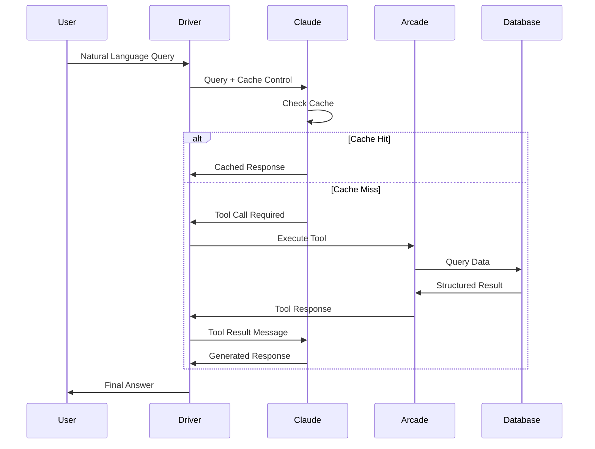
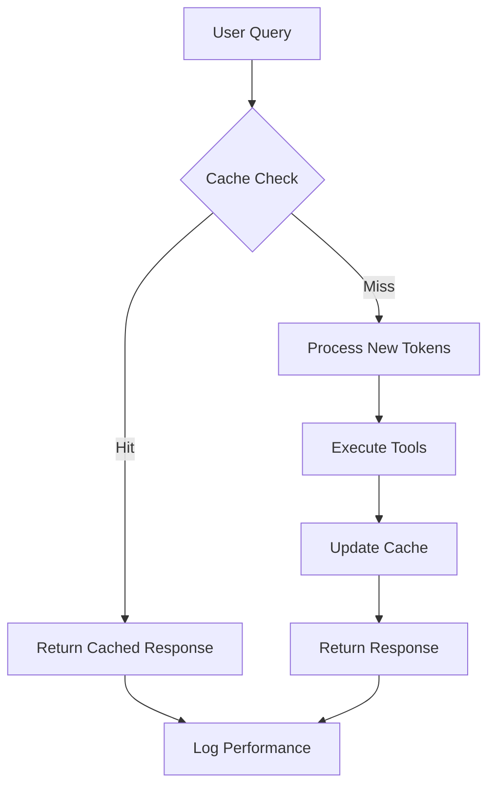

# FACT System Architecture Specification

## 1. System Overview

The FACT (Fast-Access Cached Tools) system implements a three-tier architecture optimized for low-latency, deterministic responses through intelligent caching and tool-based data retrieval.

### 1.1 Architecture Principles
- **Cache-First Design**: Leverage Claude Sonnet-4's native caching for static content
- **Tool-Based Retrieval**: Use authenticated tools for dynamic data access
- **Deterministic Responses**: Structured data over similarity search
- **Minimal Infrastructure**: No vector databases or complex indexing

## 2. High-Level Architecture

```
┌─────────────────┐    ┌─────────────────┐    ┌─────────────────┐
│   User Query    │───▶│  FACT Driver    │───▶│  Claude Sonnet  │
│                 │    │                 │    │      -4         │
└─────────────────┘    └─────────────────┘    └─────────────────┘
                                │                        │
                                │                        ▼
                        ┌─────────────────┐    ┌─────────────────┐
                        │ Arcade Gateway  │◀───│   Tool Calls    │
                        │                 │    │                 │
                        └─────────────────┘    └─────────────────┘
                                │
                                ▼
                        ┌─────────────────┐
                        │   Data Sources  │
                        │  (SQLite, APIs) │
                        └─────────────────┘
```

## 3. Core Components

### 3.1 FACT Driver (`driver.py`)
**Purpose**: Central orchestrator managing cache, queries, and tool execution

**Responsibilities**:
- User interface and query processing
- Cache management and optimization
- Message flow coordination
- Error handling and recovery

**Key Interfaces**:
- `AsyncAnthropic` client for Claude interactions
- `Arcade` client for tool execution
- Environment configuration management
- Message formatting and validation

### 3.2 Cache Management System
**Purpose**: Optimize token usage through intelligent caching

**Components**:
- **Cache Prefix**: Static system prompt and documentation (≥500 tokens)
- **Cache Control**: Read/write mode management
- **Cache Keys**: Deterministic prefix identification
- **Cache Validation**: Ensuring cache coherency

**Caching Strategy**:
```
CACHE_CONTROL = {
    "mode": "write",  # Initial setup
    "prefix": "fact_v1"  # Version identifier
}

CACHE_CONTROL = {
    "mode": "read",   # Subsequent queries
    "prefix": "fact_v1"
}
```

### 3.3 Tool Management System
**Purpose**: Dynamic tool discovery, registration, and execution

**Components**:
- **Tool Registry**: Central catalog of available tools
- **Schema Export**: Tool interface definitions for Claude
- **Execution Engine**: Secure tool invocation
- **Result Formatting**: Structured response handling

**Tool Lifecycle**:
1. Tool Definition (Python decorators)
2. Registration (Upload to Arcade)
3. Discovery (Schema export)
4. Execution (Runtime invocation)
5. Result Processing (JSON formatting)

### 3.4 Arcade Integration Layer
**Purpose**: Interface with Arcade.dev for secure tool hosting

**Services**:
- **Gateway**: Containerized tool execution environment
- **Authentication**: OAuth and API key management
- **Authorization**: Scope-based access control
- **Monitoring**: Usage tracking and audit logs

## 4. Data Flow Architecture

### 4.1 Request Processing Flow



### 4.2 Cache Optimization Flow



## 5. Component Interfaces

### 5.1 Driver Interface
```python
class FACTDriver:
    async def process_query(query: str) -> str
    async def execute_tools(tool_calls: List[ToolCall]) -> List[Message]
    def get_tool_schema() -> List[Dict]
    def setup_cache(prefix: str) -> None
```

### 5.2 Tool Interface
```python
@Tool(name="ToolName", desc="Description")
def tool_function(param: type) -> Dict:
    # Tool implementation
    return structured_result
```

### 5.3 Cache Interface
```python
class CacheManager:
    def read_cache(prefix: str) -> Optional[Response]
    def write_cache(prefix: str, content: str) -> None
    def invalidate_cache(prefix: str) -> None
    def get_cache_stats() -> CacheMetrics
```

## 6. Security Architecture

### 6.1 Authentication Layers
- **API Key Management**: Environment-based credential storage
- **OAuth Integration**: User authorization for protected tools
- **Scope-Based Access**: Granular permission control
- **Audit Logging**: Comprehensive activity tracking

### 6.2 Security Boundaries
```
┌─────────────────────────────────────────────────────────┐
│                    Security Perimeter                   │
│  ┌─────────────┐  ┌─────────────┐  ┌─────────────────┐  │
│  │   Driver    │  │   Claude    │  │  Arcade Gateway │  │
│  │  (Trusted)  │  │ (External)  │  │   (Sandboxed)   │  │
│  └─────────────┘  └─────────────┘  └─────────────────┘  │
│                                                         │
│  ┌─────────────────────────────────────────────────────┐  │
│  │             Tool Execution Sandbox               │  │
│  │  • Input Validation                               │  │
│  │  • Output Sanitization                           │  │
│  │  • Resource Limits                               │  │
│  │  • Audit Logging                                 │  │
│  └─────────────────────────────────────────────────────┘  │
└─────────────────────────────────────────────────────────┘
```

## 7. Performance Architecture

### 7.1 Latency Optimization
- **Cache-First Strategy**: Minimize token processing
- **LAN Tool Execution**: Sub-10ms tool calls
- **Async Processing**: Non-blocking I/O operations
- **Connection Pooling**: Reuse database connections

### 7.2 Scalability Patterns
- **Stateless Drivers**: Horizontal scaling capability
- **Portable Caches**: Cross-instance cache sharing
- **Load Balancing**: Request distribution
- **Circuit Breakers**: Fault tolerance

## 8. Deployment Architecture

### 8.1 Local Development
```
┌─────────────────┐
│   Development   │
│   Environment   │
│                 │
│ ┌─────────────┐ │
│ │   Driver    │ │
│ └─────────────┘ │
│ ┌─────────────┐ │
│ │   Gateway   │ │
│ │  (Docker)   │ │
│ └─────────────┘ │
│ ┌─────────────┐ │
│ │   SQLite    │ │
│ └─────────────┘ │
└─────────────────┘
```

### 8.2 Production Deployment
```
┌─────────────────────────────────────────────────────────┐
│                   Production Cluster                   │
│                                                         │
│ ┌─────────────┐  ┌─────────────┐  ┌─────────────────┐   │
│ │   Driver    │  │   Driver    │  │  Load Balancer  │   │
│ │  Instance 1 │  │  Instance 2 │  │                 │   │
│ └─────────────┘  └─────────────┘  └─────────────────┘   │
│                                                         │
│ ┌───────────────────────────────────────────────────────┐ │
│ │              Arcade Gateway Cluster               │ │
│ │  ┌─────────────┐  ┌─────────────┐                 │ │
│ │  │  Gateway 1  │  │  Gateway 2  │                 │ │
│ │  └─────────────┘  └─────────────┘                 │ │
│ └───────────────────────────────────────────────────────┘ │
│                                                         │
│ ┌───────────────────────────────────────────────────────┐ │
│ │                Data Layer                           │ │
│ │  ┌─────────────┐  ┌─────────────┐                   │ │
│ │  │  Database   │  │   Cache     │                   │ │
│ │  │  Cluster    │  │   Layer     │                   │ │
│ │  └─────────────┘  └─────────────┘                   │ │
│ └───────────────────────────────────────────────────────┘ │
└─────────────────────────────────────────────────────────┘
```

## 9. Technology Stack

### 9.1 Core Technologies
- **Language Model**: Claude Sonnet-4 (Anthropic)
- **Tool Platform**: Arcade.dev
- **Runtime**: Python 3.8+
- **Async Framework**: asyncio
- **Database**: SQLite (demo), extensible to PostgreSQL/MySQL

### 9.2 Dependencies
- **anthropic**: Claude API client
- **arcade-sdk**: Tool management and execution
- **aiohttp**: Async HTTP operations
- **python-dotenv**: Environment configuration
- **litellm**: LLM abstraction layer

### 9.3 Infrastructure
- **Containerization**: Docker
- **Orchestration**: Docker Compose
- **Monitoring**: Built-in logging and metrics
- **Configuration**: Environment variables

## 10. Extension Points

### 10.1 Tool Extensions
- Custom tool development via Python decorators
- Schema-driven tool registration
- Multi-language tool support (future)
- External API integrations

### 10.2 Data Source Extensions
- Additional database connectors
- REST API tools
- GraphQL integrations
- File system tools
- Cloud service connectors

### 10.3 Cache Extensions
- Redis cache backend
- Distributed caching
- Cache warming strategies
- Intelligent cache invalidation

## 11. Monitoring and Observability

### 11.1 Metrics Collection
- Response latency (cache hit/miss)
- Token usage and cost tracking
- Tool execution performance
- Error rates and types
- Cache hit ratios

### 11.2 Logging Strategy
- Structured logging (JSON format)
- Correlation IDs for request tracing
- Security event logging
- Performance metric logging
- Error detail capture

### 11.3 Health Checks
- System component health
- External dependency status
- Cache system integrity
- Tool availability monitoring