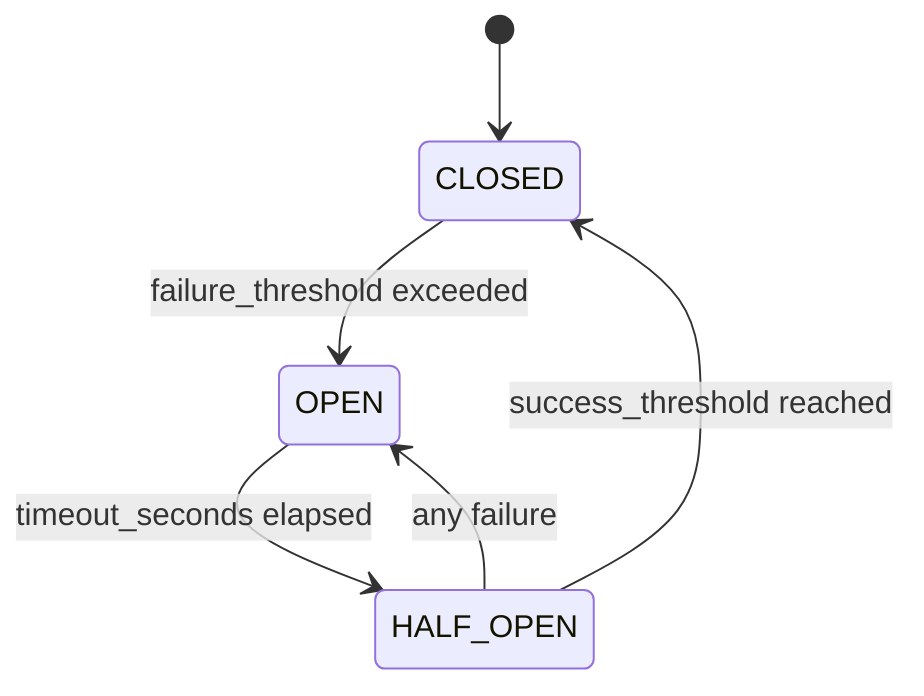

# Cache Resilience and Circuit Breaker Guide

This guide explains the cache resilience system implemented in the FACT project, including the circuit breaker pattern and graceful degradation strategies.

## Overview

The cache resilience system prevents cascading failures when cache operations fail, ensuring the FACT system continues to function even when the cache is unavailable. It implements the circuit breaker pattern with three states:

- **CLOSED**: Normal operation - cache is working
- **OPEN**: Cache is down - all operations fail fast
- **HALF_OPEN**: Testing recovery - limited operations allowed

## Architecture

### Components

1. **[`CacheCircuitBreaker`](src/cache/resilience.py:108)** - Core circuit breaker implementation
2. **[`ResilientCacheWrapper`](src/cache/resilience.py:448)** - Wrapper that adds resilience to cache operations
3. **[`CircuitBreakerConfig`](src/cache/resilience.py:26)** - Configuration for circuit breaker behavior
4. **Graceful degradation** in [`FACTDriver`](src/core/driver.py:48) - System-level resilience

### Circuit Breaker States



## Configuration

### Circuit Breaker Settings

```python
from src.cache.resilience import CircuitBreakerConfig

config = CircuitBreakerConfig(
    failure_threshold=5,          # Open after 5 consecutive failures
    success_threshold=3,          # Close after 3 consecutive successes
    timeout_seconds=60.0,         # Wait 60s before trying half-open
    rolling_window_seconds=300.0, # 5-minute window for failure rate
    gradual_recovery=True,        # Enable gradual recovery
    recovery_factor=0.5           # 50% of requests during recovery
)
```

### Configuration Parameters

| Parameter | Description | Default | Recommended Range |
|-----------|-------------|---------|-------------------|
| `failure_threshold` | Failures before opening circuit | 5 | 3-10 |
| `success_threshold` | Successes to close from half-open | 3 | 2-5 |
| `timeout_seconds` | Time before attempting recovery | 60.0 | 30-300 |
| `rolling_window_seconds` | Window for failure rate calculation | 300.0 | 120-600 |
| `gradual_recovery` | Enable gradual recovery mode | True | True recommended |
| `recovery_factor` | Fraction of requests during recovery | 0.5 | 0.1-0.8 |

## Usage Examples

### Basic Circuit Breaker Usage

```python
from src.cache.resilience import CacheCircuitBreaker, ResilientCacheWrapper
from src.cache.manager import CacheManager

# Create circuit breaker
circuit_breaker = CacheCircuitBreaker()

# Wrap existing cache manager
cache_manager = CacheManager(config)
resilient_cache = ResilientCacheWrapper(cache_manager, circuit_breaker)

# Use as normal - circuit breaker provides protection
try:
    entry = await resilient_cache.get("query_hash")
    if entry:
        return entry.content
except CacheError as e:
    if "CIRCUIT_BREAKER" in str(e.error_code):
        # Handle graceful degradation
        return None
```

### Integration with FACT Driver

The FACT driver automatically integrates cache resilience:

```python
from src.core.driver import FACTDriver

# Driver automatically creates resilient cache
driver = FACTDriver()
await driver.initialize()

# Process queries - cache failures are handled gracefully
response = await driver.process_query("Your query here")
```

### Manual Circuit Breaker Control

```python
# Force circuit breaker states (for testing/emergency)
circuit_breaker.force_open()    # Emergency stop
circuit_breaker.force_closed()  # Force recovery
circuit_breaker.reset()         # Reset to initial state

# Check circuit breaker state
state = circuit_breaker.get_state()
is_allowed = circuit_breaker.is_call_permitted()
```

## Monitoring and Metrics

### Circuit Breaker Metrics

```python
# Get circuit breaker metrics
metrics = circuit_breaker.get_metrics()

print(f"State: {metrics.state.value}")
print(f"Failure Rate: {metrics.failure_rate:.2%}")
print(f"State Changes: {metrics.state_changes}")
print(f"Recent Failures: {len(metrics.recent_failures)}")
```

### Combined Metrics

```python
# Get combined cache and circuit breaker metrics
resilient_metrics = resilient_cache.get_metrics()

cache_data = resilient_metrics["cache"]
circuit_data = resilient_metrics["circuit_breaker"]

print(f"Cache Hit Rate: {cache_data['hit_rate']:.1f}%")
print(f"Circuit State: {circuit_data['state']}")
```

### System Metrics

The FACT driver includes circuit breaker metrics in system metrics:

```python
driver_metrics = driver.get_metrics()

print(f"Circuit State: {driver_metrics['circuit_breaker_state']}")
print(f"Cache Degraded: {driver_metrics.get('cache_degraded', False)}")
print(f"Failure Rate: {driver_metrics['circuit_breaker_failure_rate']}")
```

## Graceful Degradation Strategies

### Cache Operation Fallbacks

When the circuit breaker is open, the system provides graceful fallbacks:

| Operation | Fallback Behavior | Impact |
|-----------|-------------------|---------|
| `store()` | Returns `True` (pretends success) | No caching, but system continues |
| `get()` | Returns `None` (cache miss) | Forces fresh computation |
| `invalidate()` | Returns `0` (no entries invalidated) | No impact on functionality |

### System-Level Degradation

The FACT driver implements several layers of graceful degradation:

1. **Circuit Breaker Protection**: Prevents cache from affecting core functionality
2. **Fallback Processing**: Continues without cache when unavailable
3. **Error Isolation**: Cache errors don't propagate to user responses
4. **Performance Monitoring**: Tracks degradation impact

## Performance Characteristics

### Latency Impact

- **Normal Operation**: < 1ms overhead
- **Circuit Open**: < 0.1ms (fast fail)
- **Recovery Testing**: Variable based on `recovery_factor`

### Memory Usage

- **Failure Tracking**: ~50 recent failures stored
- **Metrics**: Minimal overhead (~1KB per circuit breaker)
- **State Management**: Thread-safe with minimal locking

### Failure Detection

The circuit breaker monitors:

- **Consecutive Failures**: Count of sequential failures
- **Failure Rate**: Percentage over rolling window
- **Error Types**: Classification of cache errors
- **Recovery Success**: Success rate during half-open state

## Best Practices

### Configuration Tuning

1. **Start Conservative**: Use default settings initially
2. **Monitor Metrics**: Track state changes and failure rates
3. **Adjust Gradually**: Make small incremental changes
4. **Test Scenarios**: Validate with realistic failure patterns

### Error Handling

```python
async def safe_cache_operation():
    try:
        return await resilient_cache.get("key")
    except CacheError as e:
        if "CIRCUIT_BREAKER_OPEN" in str(e.error_code):
            logger.info("Cache circuit breaker open - using fallback")
            return None
        elif "CIRCUIT_BREAKER_THROTTLING" in str(e.error_code):
            logger.debug("Cache operation throttled during recovery")
            return None
        else:
            # Unexpected cache error
            logger.warning("Cache error", error=str(e))
            return None
```

### Health Monitoring

```python
# Monitor circuit breaker health
async def monitor_cache_health():
    while True:
        metrics = circuit_breaker.get_metrics()
        
        if metrics.state == CircuitState.OPEN:
            logger.warning("Cache circuit breaker is OPEN")
        elif metrics.failure_rate > 0.1:  # 10% failure rate
            logger.warning("High cache failure rate", 
                         rate=metrics.failure_rate)
        
        await asyncio.sleep(30)  # Check every 30 seconds
```

## Testing

### Running Tests

```bash
# Run cache resilience tests
python scripts/test_cache_resilience.py
```

### Test Scenarios

The test suite covers:

1. **State Transitions**: CLOSED → OPEN → HALF_OPEN → CLOSED
2. **Graceful Degradation**: Fallback behavior when circuit is open
3. **Performance**: Latency and throughput under various failure rates
4. **Recovery**: Various recovery scenarios and patterns
5. **Metrics**: Comprehensive metrics collection and reporting

### Custom Testing

```python
# Create failing cache for testing
from scripts.test_cache_resilience import FailingCacheManager

failing_cache = FailingCacheManager(failure_rate=0.3)  # 30% failures
resilient_cache = ResilientCacheWrapper(failing_cache, circuit_breaker)

# Test your scenarios
for i in range(100):
    try:
        await resilient_cache.store(f"test_{i}", "content")
    except CacheError:
        pass  # Handle gracefully
```

## Troubleshooting

### Common Issues

#### Circuit Breaker Stuck Open

**Symptoms**: Circuit breaker remains in OPEN state
**Causes**: Underlying cache issues not resolved
**Solutions**:
1. Check cache system health
2. Verify configuration parameters
3. Force reset if necessary: `circuit_breaker.force_closed()`

#### High Failure Rate

**Symptoms**: Frequent state transitions, high failure rate
**Causes**: Cache instability, network issues, configuration problems
**Solutions**:
1. Increase `failure_threshold`
2. Adjust `timeout_seconds`
3. Check cache system logs

#### Performance Degradation

**Symptoms**: Slow response times during recovery
**Causes**: Too aggressive recovery settings
**Solutions**:
1. Reduce `recovery_factor`
2. Increase `success_threshold`
3. Monitor metrics during recovery

### Debugging

```python
# Enable detailed logging
import structlog
structlog.configure(level="DEBUG")

# Get detailed state information
metrics = circuit_breaker.get_metrics()
print(f"Recent failures: {list(metrics.recent_failures)}")
print(f"Time in current state: {metrics.time_in_current_state}s")

# Check if calls are permitted
permitted = circuit_breaker.is_call_permitted()
print(f"Calls permitted: {permitted}")
```

## Integration Examples

### With Monitoring Systems

```python
# Prometheus metrics integration
from prometheus_client import Gauge, Counter

circuit_state_gauge = Gauge('cache_circuit_breaker_state', 'Circuit breaker state')
failure_rate_gauge = Gauge('cache_failure_rate', 'Cache failure rate')
state_changes_counter = Counter('cache_circuit_state_changes_total', 'State changes')

async def update_prometheus_metrics():
    metrics = circuit_breaker.get_metrics()
    
    # Map states to numbers for Prometheus
    state_values = {
        CircuitState.CLOSED: 0,
        CircuitState.HALF_OPEN: 1,
        CircuitState.OPEN: 2
    }
    
    circuit_state_gauge.set(state_values[metrics.state])
    failure_rate_gauge.set(metrics.failure_rate)
    state_changes_counter._value._value = metrics.state_changes
```

### With Alerting

```python
# Alert on circuit breaker state changes
async def alert_on_state_change():
    previous_state = None
    
    while True:
        current_state = circuit_breaker.get_state()
        
        if previous_state and current_state != previous_state:
            if current_state == CircuitState.OPEN:
                # Send critical alert
                send_alert("CRITICAL: Cache circuit breaker opened")
            elif current_state == CircuitState.CLOSED:
                # Send recovery notification
                send_alert("INFO: Cache circuit breaker recovered")
        
        previous_state = current_state
        await asyncio.sleep(10)
```

## Conclusion

The cache resilience system ensures the FACT system remains robust and available even when cache operations fail. By implementing the circuit breaker pattern with graceful degradation, the system can:

- **Prevent cascading failures** when cache is unavailable
- **Maintain functionality** without cache optimization
- **Recover automatically** when cache becomes available
- **Provide visibility** into cache health and performance

The system is designed to be transparent to end users while providing operators with the tools needed to monitor and maintain cache reliability.