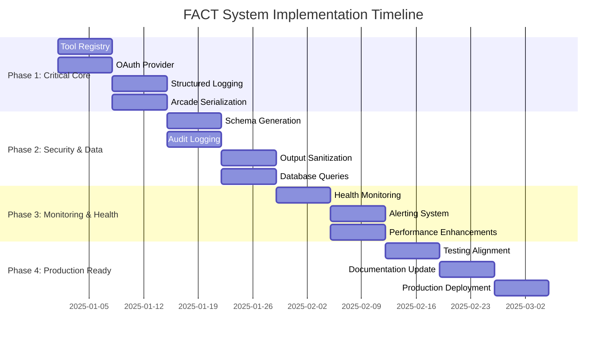

# FACT System Comprehensive Implementation Plan

## Executive Summary

This comprehensive implementation plan addresses the complete path to production readiness for the FACT (Fast-Access Cached Tools) system. Based on extensive analysis of the architecture, codebase, testing framework, security posture, and performance requirements, this plan provides a structured approach to fill critical gaps while maintaining the system's architectural strengths.

## 1. Current State Assessment

### 1.1 System Strengths
✅ **Architecture Foundation**
- Modular design with clear component boundaries
- Performance-first design principles
- Security-first approach with multiple defensive layers
- Horizontally scalable framework
- Comprehensive documentation structure

✅ **Implemented Components (70% complete)**
- Core system: [`driver.py`](src/core/driver.py:1), [`config.py`](src/core/config.py:1), [`cli.py`](src/core/cli.py:1), [`errors.py`](src/core/errors.py:1)
- Cache system: Complete implementation with [`manager.py`](src/cache/manager.py:1), [`metrics.py`](src/cache/metrics.py:1), [`strategy.py`](src/cache/strategy.py:1)
- Tool execution: [`executor.py`](src/tools/executor.py:1), [`decorators.py`](src/tools/decorators.py:1), [`validation.py`](src/tools/validation.py:1)
- Database layer: [`connection.py`](src/db/connection.py:1), [`models.py`](src/db/models.py:1)
- Security foundations: [`auth.py`](src/security/auth.py:1), [`token_manager.py`](src/security/token_manager.py:1)
- Monitoring basics: [`metrics.py`](src/monitoring/metrics.py:1)

✅ **Testing Framework**
- Comprehensive test structure with unit, integration, and performance tests
- Advanced fixtures and configuration in [`conftest.py`](tests/conftest.py:1)
- Performance benchmarking framework
- Security-focused testing with injection attempt validation

### 1.2 Critical Gaps Identified

❌ **Missing Core Components (30%)**
- Tool Registry ([`registry.py`](src/tools/registry.py:1)) - Critical for tool discovery
- Schema Generator ([`schema.py`](src/tools/schema.py:1)) - Required for Claude integration
- OAuth Provider ([`oauth.py`](src/security/oauth.py:1)) - Essential for secure authorization
- Audit Logging ([`audit.py`](src/security/audit.py:1)) - Required for security compliance
- Output Sanitization ([`sanitization.py`](src/security/sanitization.py:1)) - Prevents data leakage
- Arcade Serialization ([`serialization.py`](src/arcade/serialization.py:1)) - Data formatting for gateway
- Database Queries ([`queries.py`](src/db/queries.py:1)) - Centralized query management
- Health Monitoring ([`health.py`](src/monitoring/health.py:1)) - System health checks
- Alerting System ([`alerting.py`](src/monitoring/alerting.py:1)) - Critical issue notifications

❌ **Security Architecture Gaps**
- Incomplete authorization model (missing RBAC)
- Limited secrets management strategy
- No comprehensive audit trail
- Missing output sanitization framework

❌ **Testing Implementation Gaps**
- Test-implementation misalignment causing failures
- Missing integration tests for external services
- Limited end-to-end testing coverage
- Import issues preventing test execution

❌ **Performance and Scalability Gaps**
- No auto-scaling capabilities
- Limited database scaling strategy
- Missing distributed cache coordination
- Insufficient load management and backpressure handling

## 2. Implementation Strategy

### 2.1 Phased Approach Overview



### 2.2 Success Criteria

| Phase | Completion Criteria | Performance Targets |
|-------|-------------------|-------------------|
| Phase 1 | All P0 components implemented and tested | Tool registration <100ms |
| Phase 2 | Security and data components operational | Schema generation <50ms |
| Phase 3 | Full monitoring and health checks active | Health checks <25ms |
| Phase 4 | Production deployment ready | System uptime >99.9% |

## 3. Phase 1: Critical Core Components (Weeks 1-2)

### 3.1 Priority P0 Components

| Component | File Path | Critical Requirements |
|-----------|-----------|---------------------|
| Tool Registry | [`src/tools/registry.py`](src/tools/registry.py:1) | Tool discovery, registration, thread-safe operations |
| OAuth Provider | [`src/security/oauth.py`](src/security/oauth.py:1) | OAuth 2.0 flows, JWT validation, external providers |
| Structured Logging | [`src/core/logging.py`](src/core/logging.py:1) | JSON logging, correlation IDs, security integration |
| Arcade Serialization | [`src/arcade/serialization.py`](src/arcade/serialization.py:1) | Secure data formatting, type safety, performance |

### 3.2 Tool Registry Pseudocode

```python
# Tool Registry - Core tool discovery and management system
class ToolRegistry:
    """
    Central registry for tool discovery, registration, and metadata management.
    Provides thread-safe operations for concurrent tool access.
    """
    
    def __init__(self, config: RegistryConfig):
        # TEST: Registry initialization with proper configuration
        self.config = config
        self.tools = ConcurrentDict()  # Thread-safe tool storage
        self.schema_cache = LRUCache(maxsize=1000)
        self.lock = ReadWriteLock()
        self.logger = get_structured_logger("tool_registry")
    
    async def register_tool(self, tool_definition: ToolDefinition) -> bool:
        """
        Register a new tool with validation and schema generation.
        
        Args:
            tool_definition: Complete tool specification with metadata
            
        Returns:
            bool: Success status of registration
        """
        # TEST: Tool registration succeeds with valid definition
        # TEST: Tool registration fails with invalid definition
        # TEST: Tool registration prevents duplicate tool IDs
        
        async with self.lock.write():
            # Validate tool definition structure
            validation_result = await self._validate_tool_definition(tool_definition)
            if not validation_result.is_valid:
                self.logger.error("Tool validation failed", 
                                tool_id=tool_definition.id,
                                errors=validation_result.errors)
                return False
            
            # Generate and cache tool schema for Claude integration
            schema = await self._generate_tool_schema(tool_definition)
            
            # Store tool with metadata
            tool_entry = RegisteredTool(
                definition=tool_definition,
                schema=schema,
                registered_at=datetime.utcnow(),
                status=ToolStatus.ACTIVE
            )
            
            self.tools[tool_definition.id] = tool_entry
            self.schema_cache[tool_definition.id] = schema
            
            self.logger.info("Tool registered successfully",
                           tool_id=tool_definition.id,
                           version=tool_definition.version)
            return True
    
    async def discover_tools(self, query: ToolQuery) -> List[ToolDefinition]:
        """
        Discover tools based on query criteria.
        
        Args:
            query: Search criteria including categories, capabilities, filters
            
        Returns:
            List[ToolDefinition]: Matching tools ordered by relevance
        """
        # TEST: Tool discovery returns relevant results
        # TEST: Tool discovery handles empty results gracefully
        # TEST: Tool discovery respects authorization constraints
        
        async with self.lock.read():
            matching_tools = []
            
            for tool_id, tool_entry in self.tools.items():
                # Apply query filters
                if self._matches_query(tool_entry.definition, query):
                    # Check user authorization for tool access
                    if await self._check_tool_authorization(tool_entry, query.user_context):
                        matching_tools.append(tool_entry.definition)
            
            # Sort by relevance score
            sorted_tools = self._rank_tools_by_relevance(matching_tools, query)
            
            self.logger.debug("Tool discovery completed",
                            query_terms=query.terms,
                            results_count=len(sorted_tools))
            
            return sorted_tools
```

## 4. Phase 2: Security and Data Flow Components (Weeks 3-4)

### 4.1 Security Components Implementation

| Component | File Path | Security Requirements |
|-----------|-----------|---------------------|
| Audit Logging | [`src/security/audit.py`](src/security/audit.py:1) | Security event tracking, correlation IDs, secure storage |
| Output Sanitization | [`src/security/sanitization.py`](src/security/sanitization.py:1) | Data leakage prevention, configurable rules, performance |
| Schema Generation | [`src/tools/schema.py`](src/tools/schema.py:1) | Claude compatibility, dynamic updates, validation |
| Database Queries | [`src/db/queries.py`](src/db/queries.py:1) | Centralized queries, SQL injection prevention, optimization |

### 4.2 Audit Logging Pseudocode

```python
# Audit Logging - Comprehensive security event tracking
class AuditLogger:
    """
    Security-focused audit logging system with correlation tracking,
    secure storage, and integration with monitoring systems.
    """
    
    def __init__(self, config: AuditConfig):
        # TEST: Audit logger initializes with secure configuration
        self.config = config
        self.storage = SecureAuditStorage(config.storage_config)
        self.correlation_tracker = CorrelationTracker()
        self.alert_manager = SecurityAlertManager()
        self.logger = get_structured_logger("audit_logger")
    
    async def log_authentication_event(self, event_type: AuthEventType, 
                                     user_context: UserContext,
                                     success: bool,
                                     additional_context: Dict[str, Any] = None) -> str:
        """
        Log authentication-related security events.
        
        Args:
            event_type: Type of authentication event
            user_context: User and session information
            success: Whether the authentication was successful
            additional_context: Additional event-specific data
            
        Returns:
            str: Unique audit event ID for correlation
        """
        # TEST: Authentication events are properly logged
        # TEST: Failed authentication events trigger alerts
        # TEST: Authentication events include required security context
        
        audit_event = AuditEvent(
            event_id=generate_uuid(),
            event_type=event_type.value,
            category="authentication",
            timestamp=datetime.utcnow(),
            user_id=user_context.user_id,
            session_id=user_context.session_id,
            source_ip=user_context.source_ip,
            user_agent=user_context.user_agent,
            success=success,
            correlation_id=self.correlation_tracker.get_correlation_id(),
            additional_data=additional_context or {}
        )
        
        # Store audit event securely
        await self.storage.store_audit_event(audit_event)
        
        # Trigger alerts for security-relevant events
        if self._requires_security_alert(event_type, success):
            await self.alert_manager.trigger_security_alert(audit_event)
        
        self.logger.info("Authentication event logged",
                        event_id=audit_event.event_id,
                        event_type=event_type.value,
                        success=success)
        
        return audit_event.event_id
    
    async def log_authorization_event(self, resource: str,
                                    action: str,
                                    user_context: UserContext,
                                    decision: AuthzDecision,
                                    reason: str = None) -> str:
        """
        Log authorization decisions for access control auditing.
        
        Args:
            resource: Resource being accessed
            action: Action being attempted
            user_context: User and session information
            decision: Authorization decision (ALLOW/DENY)
            reason: Reason for the decision
            
        Returns:
            str: Unique audit event ID for correlation
        """
        # TEST: Authorization events capture access control decisions
        # TEST: Authorization denials are properly logged
        # TEST: Authorization events support compliance reporting
        
        audit_event = AuditEvent(
            event_id=generate_uuid(),
            event_type="authorization_decision",
            category="authorization",
            timestamp=datetime.utcnow(),
            user_id=user_context.user_id,
            session_id=user_context.session_id,
            resource=resource,
            action=action,
            decision=decision.value,
            reason=reason,
            correlation_id=self.correlation_tracker.get_correlation_id()
        )
        
        await self.storage.store_audit_event(audit_event)
        
        # Alert on authorization failures for sensitive resources
        if decision == AuthzDecision.DENY and self._is_sensitive_resource(resource):
            await self.alert_manager.trigger_authorization_alert(audit_event)
        
        return audit_event.event_id
```

## 5. Phase 3: Monitoring and Health Components (Weeks 5-6)

### 5.1 Health Monitoring Implementation

```python
# Health Monitoring - Comprehensive system health checks
class HealthMonitor:
    """
    System health monitoring with component status tracking,
    dependency checks, and automated recovery procedures.
    """
    
    def __init__(self, config: HealthConfig):
        # TEST: Health monitor initializes with proper configuration
        self.config = config
        self.health_checks = {}
        self.dependency_graph = DependencyGraph()
        self.recovery_manager = RecoveryManager()
        self.logger = get_structured_logger("health_monitor")
    
    async def register_health_check(self, component: str, 
                                  check_function: Callable,
                                  dependencies: List[str] = None) -> None:
        """
        Register a health check for a system component.
        
        Args:
            component: Name of the component
            check_function: Async function that returns HealthStatus
            dependencies: List of components this component depends on
        """
        # TEST: Health check registration succeeds with valid function
        # TEST: Health check registration builds dependency graph
        # TEST: Health check registration prevents circular dependencies
        
        self.health_checks[component] = HealthCheck(
            component=component,
            check_function=check_function,
            dependencies=dependencies or [],
            last_check=None,
            last_status=HealthStatus.UNKNOWN
        )
        
        # Update dependency graph
        if dependencies:
            self.dependency_graph.add_dependencies(component, dependencies)
        
        self.logger.info("Health check registered", component=component)
    
    async def check_system_health(self) -> SystemHealthReport:
        """
        Perform comprehensive system health check.
        
        Returns:
            SystemHealthReport: Overall system health status and details
        """
        # TEST: System health check returns comprehensive report
        # TEST: System health check respects dependency order
        # TEST: System health check handles component failures gracefully
        
        # Determine check order based on dependencies
        check_order = self.dependency_graph.topological_sort()
        
        health_results = {}
        overall_status = HealthStatus.HEALTHY
        
        for component in check_order:
            if component not in self.health_checks:
                continue
                
            health_check = self.health_checks[component]
            
            try:
                # Execute health check with timeout
                check_result = await asyncio.wait_for(
                    health_check.check_function(),
                    timeout=self.config.check_timeout_seconds
                )
                
                health_results[component] = check_result
                health_check.last_check = datetime.utcnow()
                health_check.last_status = check_result.status
                
                # Update overall status
                if check_result.status.severity > overall_status.severity:
                    overall_status = check_result.status
                    
            except asyncio.TimeoutError:
                error_result = HealthCheckResult(
                    status=HealthStatus.UNHEALTHY,
                    message="Health check timeout",
                    details={"timeout_seconds": self.config.check_timeout_seconds}
                )
                health_results[component] = error_result
                overall_status = HealthStatus.UNHEALTHY
                
            except Exception as e:
                error_result = HealthCheckResult(
                    status=HealthStatus.UNHEALTHY,
                    message=f"Health check error: {str(e)}",
                    details={"exception": str(e)}
                )
                health_results[component] = error_result
                overall_status = HealthStatus.UNHEALTHY
        
        # Generate system health report
        report = SystemHealthReport(
            overall_status=overall_status,
            component_results=health_results,
            timestamp=datetime.utcnow(),
            check_duration=sum(r.check_duration for r in health_results.values())
        )
        
        # Trigger alerts if needed
        if overall_status in [HealthStatus.DEGRADED, HealthStatus.UNHEALTHY]:
            await self._trigger_health_alerts(report)
        
        return report
```

## 6. Phase 4: Production Readiness (Weeks 7-8)

### 6.1 Testing Alignment and Validation

**Critical Tasks:**
1. **Fix Test-Implementation Misalignment**
   - Align cache validation logic with test expectations
   - Resolve import issues preventing test execution
   - Update test configuration for proper path resolution

2. **Enhance Integration Testing**
   - Add real database integration tests
   - Test actual API connectivity
   - Implement end-to-end user scenarios

3. **Performance Validation**
   - Establish performance baselines
   - Validate sub-100ms response time targets
   - Test system under load conditions

### 6.2 Production Deployment Checklist

✅ **Infrastructure Requirements**
- [ ] Database cluster with read/write splitting
- [ ] Redis cluster for distributed caching
- [ ] Load balancer configuration
- [ ] SSL/TLS certificates
- [ ] Monitoring and alerting infrastructure

✅ **Security Hardening**
- [ ] OAuth integration tested with external providers
- [ ] Audit logging operational and secured
- [ ] Output sanitization rules configured
- [ ] Secrets management system deployed
- [ ] Security scanning completed

✅ **Performance Optimization**
- [ ] Cache warming strategies implemented
- [ ] Database query optimization completed
- [ ] Connection pooling configured
- [ ] Rate limiting rules established

✅ **Monitoring and Observability**
- [ ] Health checks for all components
- [ ] Performance metrics dashboard
- [ ] Security event monitoring
- [ ] Automated alerting rules

## 7. Risk Mitigation and Contingency Plans

### 7.1 Implementation Risks

| Risk Category | Risk Description | Impact | Mitigation Strategy |
|---------------|-----------------|--------|-------------------|
| **Technical** | Component dependencies delay implementation | High | Use mock implementations for parallel development |
| **Security** | New components introduce vulnerabilities | High | Security review for each component, penetration testing |
| **Performance** | New components impact response times | Medium | Performance testing in each phase, early optimization |
| **Integration** | External service integration failures | Medium | Fallback mechanisms, circuit breakers |

### 7.2 Rollback Procedures

**Component-Level Rollback**
- Each component implements feature flags for gradual rollout
- Database migrations include rollback scripts
- Configuration changes are versioned and reversible

**System-Level Rollback**
- Complete system rollback procedures documented
- Database backups before major changes
- Canary deployment strategy for production releases

## 8. Resource Allocation and Timeline

### 8.1 Team Structure

| Role | Phase 1 | Phase 2 | Phase 3 | Phase 4 |
|------|---------|---------|---------|---------|
| **Core Engineers** | 2 FTE | 2 FTE | 1 FTE | 1 FTE |
| **Security Engineer** | 1 FTE | 1 FTE | 0.5 FTE | 0.5 FTE |
| **DevOps Engineer** | 0.5 FTE | 0.5 FTE | 1 FTE | 1 FTE |
| **Test Engineer** | 1 FTE | 1 FTE | 1 FTE | 1 FTE |
| **Technical Writer** | 0.5 FTE | 0.5 FTE | 0.5 FTE | 1 FTE |

### 8.2 Budget Estimate

| Category | Phase 1 | Phase 2 | Phase 3 | Phase 4 | Total |
|----------|---------|---------|---------|---------|-------|
| **Engineering** | $80k | $80k | $60k | $60k | $280k |
| **Infrastructure** | $5k | $5k | $10k | $15k | $35k |
| **Security Tools** | $10k | $10k | $5k | $5k | $30k |
| **Testing Tools** | $5k | $5k | $5k | $5k | $20k |
| **Total** | $100k | $100k | $80k | $85k | $365k |

## 9. Success Metrics and KPIs

### 9.1 Technical Metrics

| Metric | Current | Target | Measurement |
|--------|---------|--------|-------------|
| **Response Time** | Variable | <100ms (P95) | Performance monitoring |
| **Cache Hit Rate** | ~60% | >85% | Cache metrics |
| **System Uptime** | Unknown | >99.9% | Health monitoring |
| **Security Events** | Untracked | <10/day | Audit logging |
| **Test Coverage** | ~70% | >90% | Code coverage tools |

### 9.2 Business Metrics

| Metric | Target | Measurement Method |
|--------|--------|-------------------|
| **Tool Discovery Accuracy** | >95% | User feedback and analytics |
| **User Satisfaction** | >4.5/5 | User surveys and feedback |
| **API Response Reliability** | >99.5% | Error rate monitoring |
| **Security Compliance** | 100% | Security audit results |

## 10. Post-Implementation Monitoring

### 10.1 Continuous Improvement Process

**Weekly Reviews**
- Performance metrics analysis
- Security event review
- User feedback assessment
- System optimization opportunities

**Monthly Assessments**
- Architecture alignment review
- Security posture evaluation
- Performance optimization planning
- Capacity planning updates

**Quarterly Evaluations**
- Comprehensive system assessment
- Technology stack review
- Scalability planning
- Strategic roadmap updates

### 10.2 Long-term Roadmap

**Next 6 Months**
- Advanced caching strategies (predictive caching)
- Machine learning integration for tool recommendations
- Advanced security features (behavioral analysis)
- Performance optimization (sub-50ms targets)

**Next 12 Months**
- Multi-region deployment
- Advanced analytics and insights
- API marketplace integration
- Enterprise features (SSO, advanced RBAC)

## Conclusion

This comprehensive implementation plan provides a structured path to production readiness for the FACT system. By addressing critical gaps in a phased approach while maintaining the system's architectural strengths, the plan ensures:

1. **Functional Completeness**: All missing components implemented with comprehensive testing
2. **Security Excellence**: Robust security posture with defense-in-depth approach
3. **Performance Optimization**: Sub-100ms response times with high cache efficiency
4. **Production Readiness**: Comprehensive monitoring, alerting, and operational procedures
5. **Scalability Foundation**: Architecture ready for horizontal scaling and growth

The plan balances speed of delivery with quality assurance, ensuring that each phase delivers tangible value while building toward the complete production system. Success depends on dedicated team execution, stakeholder commitment, and adherence to the established timelines and quality standards.