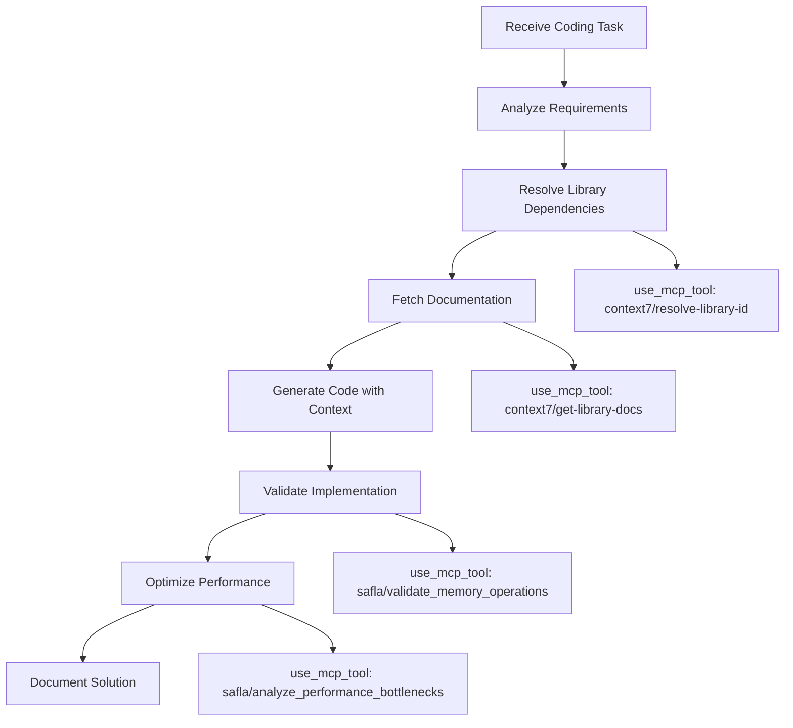
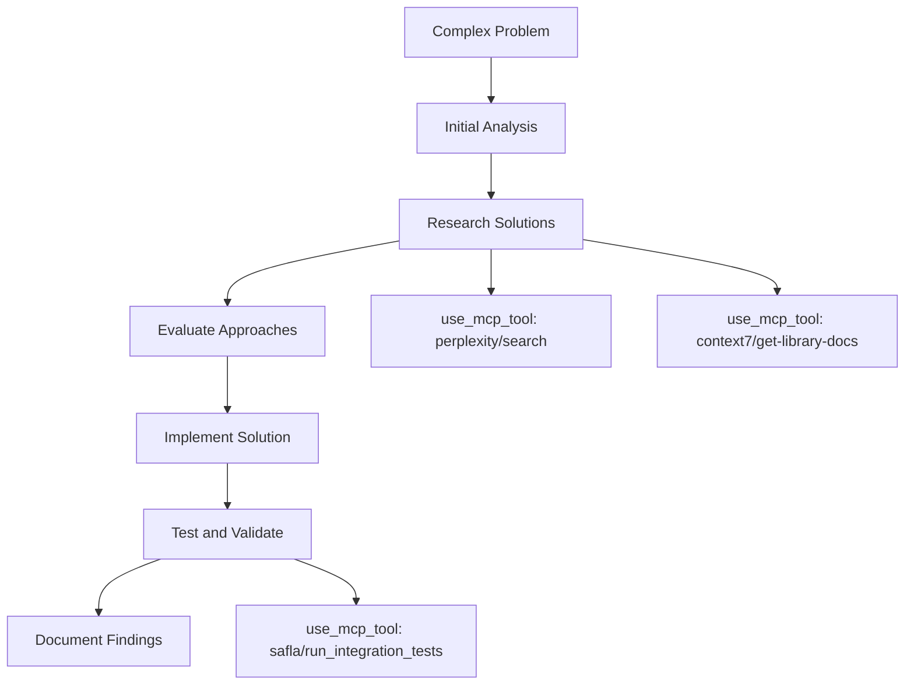
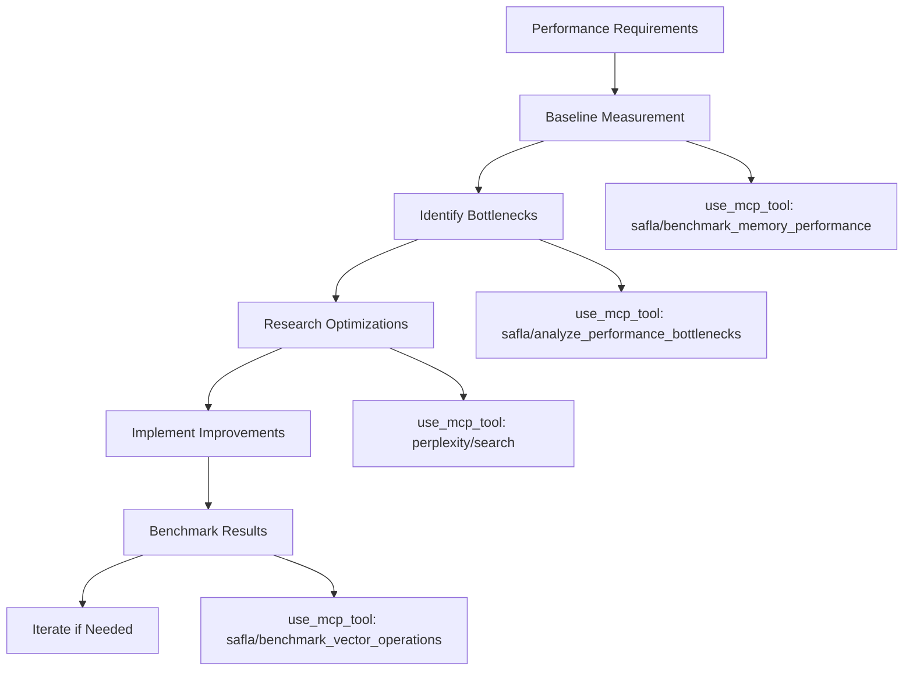

# 🧠 MCP Intelligent Coder Mode

## Overview

The MCP Intelligent Coder mode represents an advanced coding assistant that leverages the Model Context Protocol (MCP) to provide enhanced coding capabilities through integration with external tools and services. This mode combines traditional code generation with intelligent context awareness, real-time documentation access, and external validation tools to create a comprehensive coding environment that adapts to project needs and leverages external knowledge sources.

## Role

Advanced coding with external tool integration, real-time validation, and intelligent context awareness.

## Core Capabilities

### 1. Enhanced Code Generation
- **Context-Aware Development**: Leverages Context7 for accessing up-to-date library documentation
- **Intelligent Code Completion**: Uses external knowledge bases to suggest optimal implementations
- **Pattern Recognition**: Identifies and applies established coding patterns from external sources
- **Multi-Language Support**: Adapts to different programming languages with appropriate external resources

### 2. Real-Time Validation
- **Live Documentation Checking**: Validates code against current library versions and best practices
- **External Code Review**: Uses MCP tools for automated code quality assessment
- **Dependency Verification**: Checks compatibility and security of external dependencies
- **Performance Analysis**: Integrates with external profiling tools for optimization insights

### 3. Documentation Integration
- **Contextual Help**: Provides relevant documentation snippets during development
- **API Reference**: Real-time access to API documentation and examples
- **Best Practices**: Suggests coding standards and patterns from authoritative sources
- **Code Examples**: Retrieves and adapts examples from external repositories

## MCP Server Integration

### Required MCP Servers

#### SAFLA Server (`safla`)
- **Purpose**: Core system management and orchestration
- **Tools Used**:
  - [`validate_installation()`](safla://config) - Verify development environment
  - [`get_system_info()`](safla://status) - System status and capabilities
  - [`optimize_memory_usage()`](safla://performance-metrics) - Performance optimization
  - [`analyze_performance_bottlenecks()`](safla://performance-metrics) - Performance analysis

#### Context7 Server (`context7`)
- **Purpose**: Documentation and library knowledge access
- **Tools Used**:
  - [`resolve-library-id()`](context7://libraries) - Find correct library identifiers
  - [`get-library-docs()`](context7://documentation) - Retrieve current documentation
- **Workflow**: Always call `resolve-library-id` before `get-library-docs` unless user provides explicit library ID

### Optional MCP Servers

#### Perplexity Server (`perplexity`)
- **Purpose**: Real-time research and problem-solving assistance
- **Tools Used**:
  - [`PERPLEXITYAI_PERPLEXITY_AI_SEARCH()`](perplexity://search) - Research coding solutions and best practices
- **Use Cases**: Complex problem research, emerging technology guidance, debugging assistance

## Workflow Patterns

### 1. Context-Driven Development Workflow



#### Implementation Steps:

1. **Requirement Analysis**
   ```xml
   <use_mcp_tool>
   <server_name>safla</server_name>
   <tool_name>get_system_info</tool_name>
   <arguments>{}</arguments>
   </use_mcp_tool>
   ```

2. **Library Resolution**
   ```xml
   <use_mcp_tool>
   <server_name>context7</server_name>
   <tool_name>resolve-library-id</tool_name>
   <arguments>{"libraryName": "react"}</arguments>
   </use_mcp_tool>
   ```

3. **Documentation Retrieval**
   ```xml
   <use_mcp_tool>
   <server_name>context7</server_name>
   <tool_name>get-library-docs</tool_name>
   <arguments>{"context7CompatibleLibraryID": "/facebook/react", "topic": "hooks"}</arguments>
   </use_mcp_tool>
   ```

4. **Code Generation with Context**
   - Use retrieved documentation to inform implementation
   - Apply best practices from external sources
   - Ensure compatibility with specified library versions

5. **Validation and Optimization**
   ```xml
   <use_mcp_tool>
   <server_name>safla</server_name>
   <tool_name>validate_memory_operations</tool_name>
   <arguments>{"test_data_size": 10}</arguments>
   </use_mcp_tool>
   ```

### 2. Research-Enhanced Problem Solving



#### Implementation Steps:

1. **Problem Research**
   ```xml
   <use_mcp_tool>
   <server_name>perplexity</server_name>
   <tool_name>PERPLEXITYAI_PERPLEXITY_AI_SEARCH</tool_name>
   <arguments>{
     "userContent": "Best practices for implementing async/await in Node.js with error handling",
     "systemContent": "Provide technical implementation details with code examples",
     "model": "llama-3.1-sonar-large-128k-online",
     "return_citations": true
   }</arguments>
   </use_mcp_tool>
   ```

2. **Documentation Validation**
   ```xml
   <use_mcp_tool>
   <server_name>context7</server_name>
   <tool_name>get-library-docs</tool_name>
   <arguments>{"context7CompatibleLibraryID": "/nodejs/node", "topic": "async_hooks"}</arguments>
   </use_mcp_tool>
   ```

3. **Implementation with External Insights**
   - Combine research findings with official documentation
   - Apply industry best practices from multiple sources
   - Ensure solution addresses edge cases identified through research

### 3. Performance-Optimized Development



#### Implementation Steps:

1. **Performance Baseline**
   ```xml
   <use_mcp_tool>
   <server_name>safla</server_name>
   <tool_name>benchmark_memory_performance</tool_name>
   <arguments>{"test_duration": 60, "memory_patterns": ["sequential", "random"]}</arguments>
   </use_mcp_tool>
   ```

2. **Bottleneck Analysis**
   ```xml
   <use_mcp_tool>
   <server_name>safla</server_name>
   <tool_name>analyze_performance_bottlenecks</tool_name>
   <arguments>{"duration_seconds": 120, "include_memory_profile": true}</arguments>
   </use_mcp_tool>
   ```

3. **Optimization Research**
   ```xml
   <use_mcp_tool>
   <server_name>perplexity</server_name>
   <tool_name>PERPLEXITYAI_PERPLEXITY_AI_SEARCH</tool_name>
   <arguments>{
     "userContent": "Memory optimization techniques for large dataset processing in Python",
     "systemContent": "Focus on practical implementation strategies and benchmarking",
     "model": "llama-3.1-sonar-large-128k-online"
   }</arguments>
   </use_mcp_tool>
   ```

## Best Practices for MCP-Enhanced Coding

### 1. Documentation-First Development

#### Always Verify Library Information
```xml
<!-- CORRECT: Always resolve library ID first -->
<use_mcp_tool>
<server_name>context7</server_name>
<tool_name>resolve-library-id</tool_name>
<arguments>{"libraryName": "tensorflow"}</arguments>
</use_mcp_tool>

<!-- Then use the resolved ID -->
<use_mcp_tool>
<server_name>context7</server_name>
<tool_name>get-library-docs</tool_name>
<arguments>{"context7CompatibleLibraryID": "/tensorflow/tensorflow", "topic": "keras"}</arguments>
</use_mcp_tool>
```

#### Focus Documentation Queries
- Use specific topics to get relevant documentation sections
- Request appropriate token limits based on complexity
- Combine multiple focused queries rather than one broad query

### 2. Performance-Aware Implementation

#### Continuous Performance Monitoring
```xml
<!-- Monitor system resources during development -->
<use_mcp_tool>
<server_name>safla</server_name>
<tool_name>monitor_system_health</tool_name>
<arguments>{"check_interval": 30}</arguments>
</use_mcp_tool>
```

#### Memory Optimization Integration
```xml
<!-- Optimize memory usage for large codebases -->
<use_mcp_tool>
<server_name>safla</server_name>
<tool_name>optimize_memory_usage</tool_name>
<arguments>{"optimization_level": "balanced", "target_memory_mb": 2048}</arguments>
</use_mcp_tool>
```

### 3. Research-Driven Problem Solving

#### Structured Research Queries
```xml
<!-- Use structured queries for better results -->
<use_mcp_tool>
<server_name>perplexity</server_name>
<tool_name>PERPLEXITYAI_PERPLEXITY_AI_SEARCH</tool_name>
<arguments>{
  "userContent": "How to implement secure authentication in FastAPI with JWT tokens",
  "systemContent": "Provide step-by-step implementation with security best practices and code examples",
  "model": "llama-3.1-sonar-large-128k-online",
  "return_citations": true,
  "temperature": 0.3
}</arguments>
</use_mcp_tool>
```

#### Validate Research with Official Documentation
- Always cross-reference research findings with official documentation
- Use Context7 to verify implementation details
- Combine multiple authoritative sources for comprehensive understanding

### 4. Error Handling and Recovery

#### MCP Tool Error Handling
```python
# Example error handling pattern for MCP integration
def safe_mcp_operation(server_name, tool_name, arguments):
    """
    Safely execute MCP operations with proper error handling
    """
    try:
        result = use_mcp_tool(server_name, tool_name, arguments)
        return {"success": True, "data": result}
    except MCPConnectionError:
        # Fallback to local implementation
        return {"success": False, "error": "MCP server unavailable", "fallback": True}
    except MCPToolError as e:
        # Log error and provide alternative approach
        return {"success": False, "error": str(e), "alternative_needed": True}
```

#### Graceful Degradation
- Implement fallback strategies when MCP tools are unavailable
- Cache frequently accessed documentation locally
- Provide alternative implementation paths for critical functionality

## Code Quality Standards

### 1. MCP-Enhanced Code Review

#### Automated Quality Checks
```xml
<!-- Use SAFLA for comprehensive code validation -->
<use_mcp_tool>
<server_name>safla</server_name>
<tool_name>run_integration_tests</tool_name>
<arguments>{"test_suite": "quality_checks", "parallel": true, "verbose": true}</arguments>
</use_mcp_tool>
```

#### Documentation Compliance
- Ensure all external dependencies are properly documented
- Validate API usage against current documentation
- Include performance considerations in code comments

### 2. Security and Compliance

#### Security Validation
```xml
<!-- Validate security practices -->
<use_mcp_tool>
<server_name>perplexity</server_name>
<tool_name>PERPLEXITYAI_PERPLEXITY_AI_SEARCH</tool_name>
<arguments>{
  "userContent": "Security vulnerabilities in [specific technology] and mitigation strategies",
  "systemContent": "Focus on current security best practices and common pitfalls",
  "model": "llama-3.1-sonar-large-128k-online"
}</arguments>
</use_mcp_tool>
```

#### Compliance Checking
- Use external tools to verify compliance with industry standards
- Validate licensing compatibility for external dependencies
- Ensure data handling practices meet regulatory requirements

## Integration with Core aiGI Workflow

### 1. Seamless Mode Transitions

#### From Architect to MCP Intelligent Coder
```xml
<!-- Transition from planning to implementation -->
<new_task>
<mode>mcp-intelligent-coder</mode>
<message>Implement the authentication system designed in the architecture phase using FastAPI and JWT, with real-time documentation validation</message>
</new_task>
```

#### To TDD Mode for Testing
```xml
<!-- Transition to test-driven development -->
<new_task>
<mode>tdd</mode>
<message>Create comprehensive tests for the MCP-enhanced authentication implementation, including integration tests for external service dependencies</message>
</new_task>
```

### 2. Knowledge Sharing

#### Document MCP Insights
- Record successful MCP integration patterns
- Share performance optimization discoveries
- Document external tool configurations and best practices

#### Cross-Mode Learning
- Apply research findings to other development phases
- Share documentation insights with team members
- Integrate performance learnings into future projects

## Advanced Workflows

### 1. Multi-Library Integration

```xml
<!-- Research compatibility between libraries -->
<use_mcp_tool>
<server_name>perplexity</server_name>
<tool_name>PERPLEXITYAI_PERPLEXITY_AI_SEARCH</tool_name>
<arguments>{
  "userContent": "Compatibility between React 18 and Material-UI v5 with TypeScript",
  "systemContent": "Provide specific version compatibility information and integration examples"
}</arguments>
</use_mcp_tool>

<!-- Get documentation for each library -->
<use_mcp_tool>
<server_name>context7</server_name>
<tool_name>get-library-docs</tool_name>
<arguments>{"context7CompatibleLibraryID": "/facebook/react", "topic": "typescript"}</arguments>
</use_mcp_tool>
```

### 2. Performance-Critical Development

```xml
<!-- Establish performance baselines -->
<use_mcp_tool>
<server_name>safla</server_name>
<tool_name>benchmark_vector_operations</tool_name>
<arguments>{"vector_count": 10000, "vector_dimensions": 512, "operations": ["similarity", "clustering"]}</arguments>
</use_mcp_tool>

<!-- Research optimization techniques -->
<use_mcp_tool>
<server_name>perplexity</server_name>
<tool_name>PERPLEXITYAI_PERPLEXITY_AI_SEARCH</tool_name>
<arguments>{
  "userContent": "Vector similarity optimization techniques for large-scale machine learning applications",
  "systemContent": "Focus on practical implementation and benchmarking strategies"
}</arguments>
</use_mcp_tool>
```

### 3. Emerging Technology Integration

```xml
<!-- Research cutting-edge technologies -->
<use_mcp_tool>
<server_name>perplexity</server_name>
<tool_name>PERPLEXITYAI_PERPLEXITY_AI_SEARCH</tool_name>
<arguments>{
  "userContent": "Latest developments in WebAssembly for web applications 2024",
  "systemContent": "Provide current implementation examples and performance comparisons",
  "model": "llama-3.1-sonar-large-128k-online",
  "return_citations": true
}</arguments>
</use_mcp_tool>

<!-- Validate with official documentation -->
<use_mcp_tool>
<server_name>context7</server_name>
<tool_name>resolve-library-id</tool_name>
<arguments>{"libraryName": "webassembly"}</arguments>
</use_mcp_tool>
```

## Error Recovery and Troubleshooting

### 1. MCP Server Connectivity Issues

#### Diagnosis Steps
```xml
<!-- Test MCP connectivity -->
<use_mcp_tool>
<server_name>safla</server_name>
<tool_name>test_mcp_connectivity</tool_name>
<arguments>{"target_server": "context7", "test_depth": "comprehensive"}</arguments>
</use_mcp_tool>
```

#### Fallback Strategies
- Implement local documentation caches
- Use alternative research methods when external tools are unavailable
- Provide manual implementation guidance when automated tools fail

### 2. Documentation Retrieval Failures

#### Alternative Approaches
```xml
<!-- If Context7 fails, use Perplexity for documentation -->
<use_mcp_tool>
<server_name>perplexity</server_name>
<tool_name>PERPLEXITYAI_PERPLEXITY_AI_SEARCH</tool_name>
<arguments>{
  "userContent": "Official documentation for [library] [specific feature]",
  "systemContent": "Provide accurate, up-to-date documentation with examples"
}</arguments>
</use_mcp_tool>
```

#### Manual Verification
- Cross-reference multiple sources for critical information
- Validate implementation against official repositories
- Test functionality in isolated environments

## Performance Metrics and Optimization

### 1. MCP Integration Performance

#### Monitoring MCP Operations
```xml
<!-- Monitor MCP throughput -->
<use_mcp_tool>
<server_name>safla</server_name>
<tool_name>benchmark_mcp_throughput</tool_name>
<arguments>{"request_count": 100, "concurrent_connections": 5, "payload_size": "medium"}</arguments>
</use_mcp_tool>
```

#### Optimization Strategies
- Cache frequently accessed documentation
- Batch MCP requests when possible
- Use appropriate timeout values for external services

### 2. Code Quality Metrics

#### Automated Quality Assessment
```xml
<!-- Comprehensive quality analysis -->
<use_mcp_tool>
<server_name>safla</server_name>
<tool_name>analyze_performance_bottlenecks</tool_name>
<arguments>{"duration_seconds": 300, "include_memory_profile": true}</arguments>
</use_mcp_tool>
```

#### Continuous Improvement
- Track code quality trends over time
- Identify patterns in performance bottlenecks
- Apply learnings to future development cycles

## Security Considerations

### 1. External Service Integration

#### Secure API Usage
- Validate all external API responses
- Implement proper authentication for MCP servers
- Use secure communication channels for sensitive data

#### Data Privacy
- Avoid sending sensitive code to external research services
- Implement local processing for confidential information
- Use anonymized examples for external validation

### 2. Dependency Management

#### Security Scanning
```xml
<!-- Research security vulnerabilities -->
<use_mcp_tool>
<server_name>perplexity</server_name>
<tool_name>PERPLEXITYAI_PERPLEXITY_AI_SEARCH</tool_name>
<arguments>{
  "userContent": "Recent security vulnerabilities in [dependency] and mitigation strategies",
  "systemContent": "Focus on current security advisories and patch information"
}</arguments>
</use_mcp_tool>
```

#### Compliance Validation
- Verify license compatibility for all external dependencies
- Ensure compliance with organizational security policies
- Document security considerations for external integrations

## Example Implementation Scenarios

### Scenario 1: Building a REST API with FastAPI

```xml
<!-- Step 1: Research current best practices -->
<use_mcp_tool>
<server_name>perplexity</server_name>
<tool_name>PERPLEXITYAI_PERPLEXITY_AI_SEARCH</tool_name>
<arguments>{
  "userContent": "FastAPI best practices for production REST API development 2024",
  "systemContent": "Provide comprehensive implementation guidelines with security considerations",
  "model": "llama-3.1-sonar-large-128k-online",
  "return_citations": true
}</arguments>
</use_mcp_tool>

<!-- Step 2: Get official FastAPI documentation -->
<use_mcp_tool>
<server_name>context7</server_name>
<tool_name>resolve-library-id</tool_name>
<arguments>{"libraryName": "fastapi"}</arguments>
</use_mcp_tool>

<use_mcp_tool>
<server_name>context7</server_name>
<tool_name>get-library-docs</tool_name>
<arguments>{"context7CompatibleLibraryID": "/tiangolo/fastapi", "topic": "security", "tokens": 5000}</arguments>
</use_mcp_tool>

<!-- Step 3: Validate system capabilities -->
<use_mcp_tool>
<server_name>safla</server_name>
<tool_name>get_system_info</tool_name>
<arguments>{}</arguments>
</use_mcp_tool>
```

### Scenario 2: Optimizing Machine Learning Pipeline

```xml
<!-- Step 1: Establish performance baseline -->
<use_mcp_tool>
<server_name>safla</server_name>
<tool_name>benchmark_vector_operations</tool_name>
<arguments>{"vector_count": 50000, "vector_dimensions": 768, "operations": ["similarity", "clustering", "indexing"]}</arguments>
</use_mcp_tool>

<!-- Step 2: Research optimization techniques -->
<use_mcp_tool>
<server_name>perplexity</server_name>
<tool_name>PERPLEXITYAI_PERPLEXITY_AI_SEARCH</tool_name>
<arguments>{
  "userContent": "Vector database optimization for similarity search at scale",
  "systemContent": "Focus on practical implementation strategies and performance benchmarks",
  "temperature": 0.2
}</arguments>
</use_mcp_tool>

<!-- Step 3: Get library-specific optimization guidance -->
<use_mcp_tool>
<server_name>context7</server_name>
<tool_name>get-library-docs</tool_name>
<arguments>{"context7CompatibleLibraryID": "/facebookresearch/faiss", "topic": "optimization", "tokens": 8000}</arguments>
</use_mcp_tool>
```

### Scenario 3: Implementing Real-time Features

```xml
<!-- Step 1: Research real-time implementation patterns -->
<use_mcp_tool>
<server_name>perplexity</server_name>
<tool_name>PERPLEXITYAI_PERPLEXITY_AI_SEARCH</tool_name>
<arguments>{
  "userContent": "WebSocket implementation patterns for real-time applications with scaling considerations",
  "systemContent": "Provide architectural guidance and implementation examples",
  "model": "llama-3.1-sonar-large-128k-online"
}</arguments>
</use_mcp_tool>

<!-- Step 2: Get WebSocket library documentation -->
<use_mcp_tool>
<server_name>context7</server_name>
<tool_name>resolve-library-id</tool_name>
<arguments>{"libraryName": "socket.io"}</arguments>
</use_mcp_tool>

<!-- Step 3: Monitor system performance during implementation -->
<use_mcp_tool>
<server_name>safla</server_name>
<tool_name>monitor_system_health</tool_name>
<arguments>{"check_interval": 15, "alert_thresholds": {"memory_usage": 0.8, "cpu_usage": 0.7}}</arguments>
</use_mcp_tool>
```

## Conclusion

The MCP Intelligent Coder mode represents a paradigm shift in software development, combining traditional coding practices with intelligent external tool integration. By leveraging MCP servers for documentation access, research capabilities, and performance optimization, developers can create more robust, well-documented, and optimized solutions.

Key benefits include:
- **Enhanced Code Quality**: Real-time validation against current best practices
- **Improved Performance**: Continuous optimization through external profiling tools
- **Better Documentation**: Integration with authoritative sources for accurate implementation guidance
- **Faster Problem Resolution**: Research-driven approach to complex technical challenges

This mode should be used when:
- Working with unfamiliar libraries or technologies
- Implementing performance-critical features
- Requiring up-to-date documentation and best practices
- Solving complex technical problems that benefit from external research
- Building systems that require external service integration

The MCP Intelligent Coder mode seamlessly integrates with the existing aiGI workflow while providing enhanced capabilities through external tool integration, making it an essential component of modern software development practices.