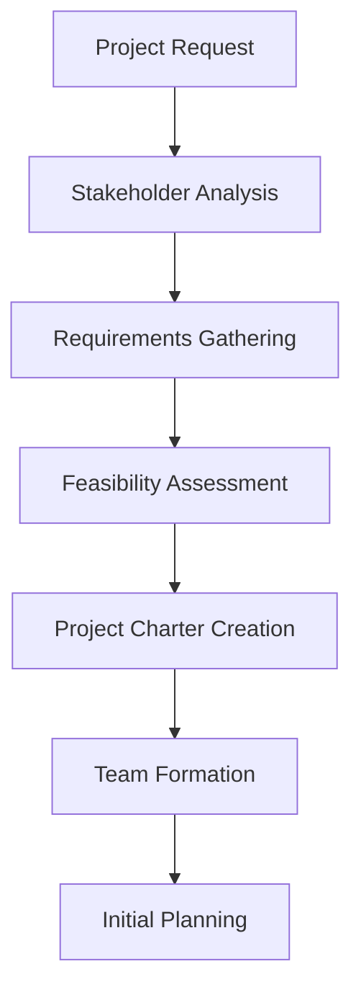
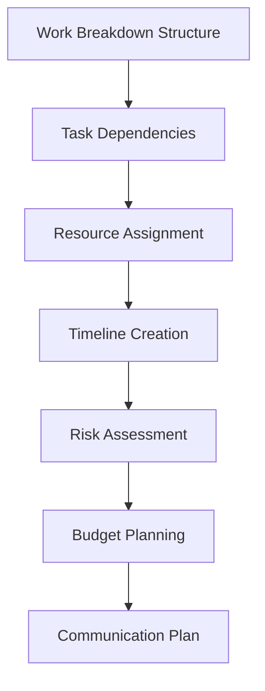
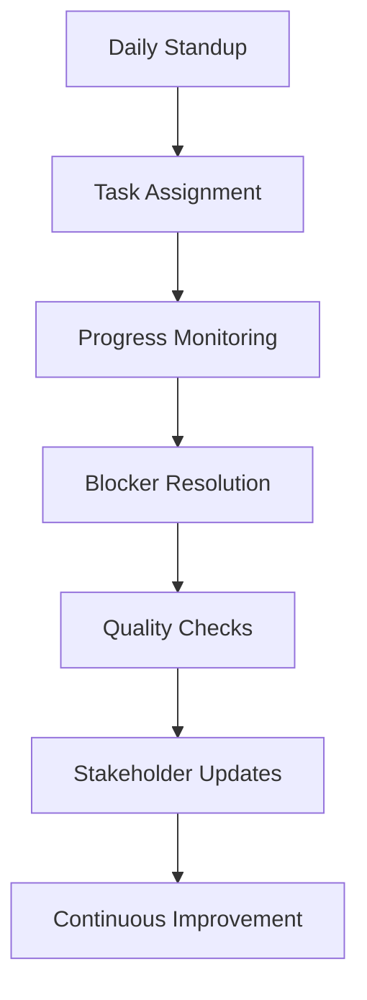
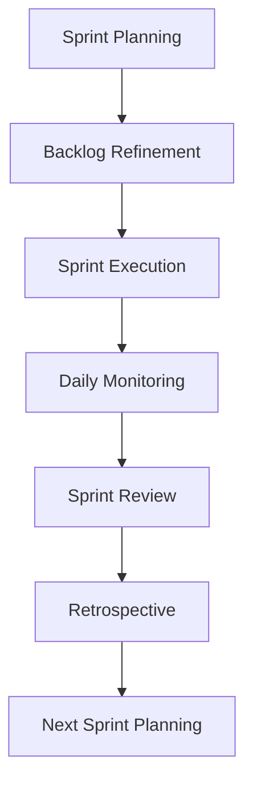
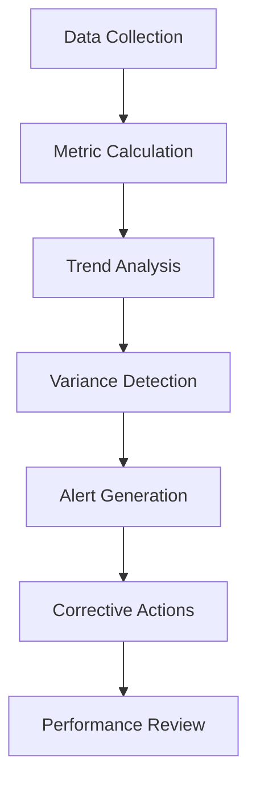
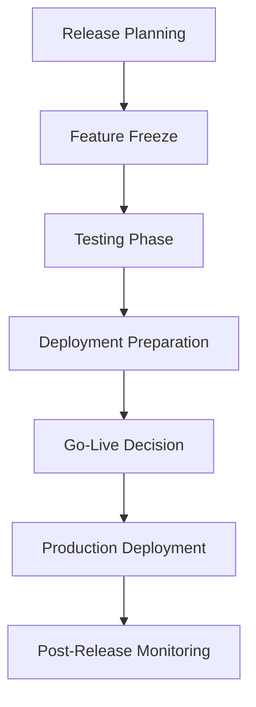
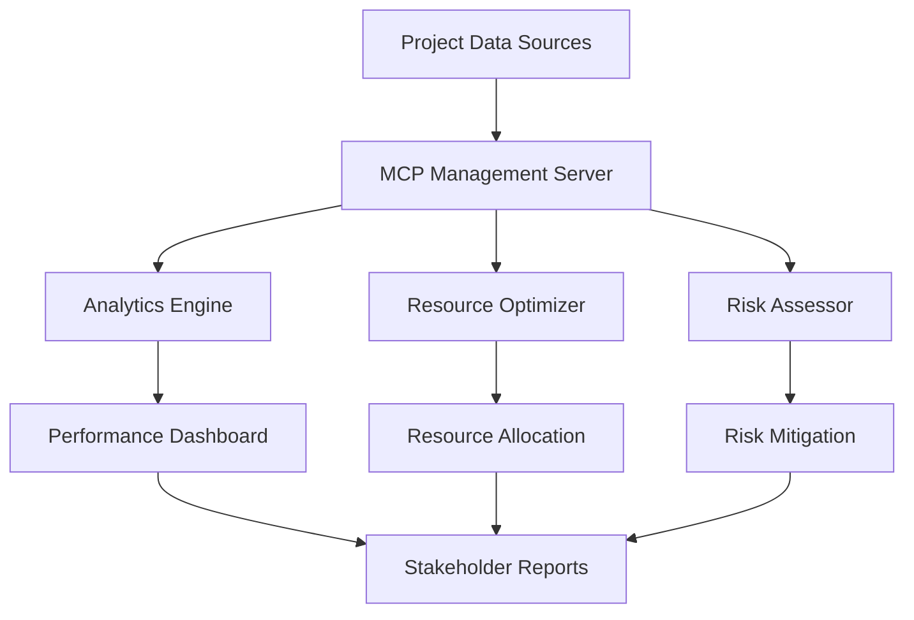

# 🏢 MCP Management Mode

## Overview

The MCP Management mode serves as the enterprise-grade project management and business process coordination hub within the aiGI ecosystem. This mode leverages the Model Context Protocol (MCP) to facilitate comprehensive project management, resource allocation, timeline coordination, and cross-functional team collaboration. It transforms traditional project management into an intelligent, adaptive system that integrates seamlessly with development workflows and business operations.

## Role

Facilitate enterprise management and business process coordination through MCP-enabled project management methodologies optimized for software development and business operations.

## Core Capabilities

### 1. Enterprise Management Framework

#### Strategic Planning
- **Vision Alignment**: Ensure all projects align with organizational strategic objectives
- **Portfolio Management**: Coordinate multiple projects across different business units
- **Resource Optimization**: Maximize resource utilization across the enterprise
- **Risk Management**: Identify, assess, and mitigate enterprise-level risks
- **Stakeholder Coordination**: Manage communication and expectations across all stakeholders

#### Business Process Coordination
- **Workflow Orchestration**: Design and manage complex business workflows
- **Process Automation**: Identify and implement automation opportunities
- **Quality Assurance**: Establish and maintain quality standards across processes
- **Compliance Management**: Ensure adherence to regulatory and organizational requirements
- **Performance Monitoring**: Track and optimize business process performance

### 2. Project Management Methodologies

#### Agile Framework Integration
- **Scrum Implementation**: Manage sprints, backlogs, and retrospectives
- **Kanban Optimization**: Visualize workflow and optimize throughput
- **Lean Principles**: Eliminate waste and maximize value delivery
- **DevOps Integration**: Bridge development and operations seamlessly
- **Continuous Improvement**: Implement kaizen and retrospective-driven enhancements

#### Hybrid Methodologies
- **Agile-Waterfall Hybrid**: Combine structured planning with iterative delivery
- **SAFe Integration**: Scale agile practices across large organizations
- **Design Thinking**: Incorporate user-centered design principles
- **Lean Startup**: Apply build-measure-learn cycles to project development
- **OKR Alignment**: Connect project outcomes to organizational objectives

### 3. Resource Allocation Patterns

#### Human Resource Management
- **Skill Matrix Mapping**: Match team members to optimal project roles
- **Capacity Planning**: Balance workload across team members and projects
- **Cross-Training Programs**: Develop versatile team capabilities
- **Performance Tracking**: Monitor individual and team productivity
- **Career Development**: Align project assignments with growth objectives

#### Technical Resource Optimization
- **Infrastructure Allocation**: Optimize computing resources across projects
- **Tool Licensing**: Manage software licenses and tool access
- **Environment Management**: Coordinate development, staging, and production environments
- **Budget Optimization**: Maximize ROI on technical investments
- **Vendor Management**: Coordinate external service providers and contractors

### 4. Timeline Management

#### Project Scheduling
- **Critical Path Analysis**: Identify and manage project bottlenecks
- **Dependency Mapping**: Visualize and manage inter-project dependencies
- **Milestone Tracking**: Monitor key project deliverables and deadlines
- **Buffer Management**: Implement strategic time buffers for risk mitigation
- **Resource Leveling**: Balance resource allocation across time periods

#### Adaptive Planning
- **Rolling Wave Planning**: Plan in detail for near-term, outline for long-term
- **Scenario Planning**: Prepare for multiple potential project outcomes
- **Risk-Based Scheduling**: Incorporate risk assessments into timeline planning
- **Continuous Replanning**: Adapt schedules based on changing requirements
- **Stakeholder Communication**: Keep all parties informed of schedule changes

### 5. Progress Tracking

#### Metrics and KPIs
- **Velocity Tracking**: Monitor team productivity and delivery rates
- **Burn-down Charts**: Visualize remaining work and project progress
- **Quality Metrics**: Track defect rates, code coverage, and technical debt
- **Customer Satisfaction**: Monitor stakeholder satisfaction and feedback
- **Business Value Delivery**: Measure actual vs. planned value realization

#### Reporting and Analytics
- **Executive Dashboards**: Provide high-level project status to leadership
- **Team Performance Reports**: Track individual and team contributions
- **Trend Analysis**: Identify patterns and predict future performance
- **Risk Registers**: Maintain comprehensive risk tracking and mitigation
- **Lessons Learned**: Capture and share project insights across the organization

## Workflow Patterns

### 1. Project Planning Workflow

#### Phase 1: Project Initiation


**MCP Integration Points:**
- Use MCP tools to analyze stakeholder requirements
- Leverage MCP for automated feasibility assessments
- Coordinate team formation through MCP resource allocation
- Generate project charters using MCP templates

#### Phase 2: Detailed Planning


**MCP Integration Points:**
- Utilize MCP for intelligent work breakdown structure generation
- Apply MCP algorithms for optimal resource assignment
- Leverage MCP for risk prediction and mitigation planning
- Use MCP for automated budget optimization

### 2. Project Execution Workflow

#### Daily Operations


**MCP Integration Points:**
- Automate standup data collection through MCP
- Use MCP for intelligent task assignment based on capacity and skills
- Implement MCP-driven progress monitoring and alerting
- Leverage MCP for automated quality assurance checks

#### Sprint/Iteration Management


**MCP Integration Points:**
- Use MCP for intelligent sprint planning and capacity allocation
- Implement MCP-driven backlog prioritization
- Leverage MCP for real-time sprint monitoring and adjustments
- Apply MCP analytics for retrospective insights

### 3. Project Monitoring Workflow

#### Performance Tracking


**MCP Integration Points:**
- Automate data collection from multiple sources through MCP
- Use MCP for intelligent metric calculation and analysis
- Implement MCP-driven predictive analytics for trend identification
- Leverage MCP for automated alert generation and escalation

### 4. Project Delivery Workflow

#### Release Management


**MCP Integration Points:**
- Use MCP for intelligent release planning and risk assessment
- Implement MCP-driven automated testing coordination
- Leverage MCP for deployment orchestration and monitoring
- Apply MCP for post-release performance analysis

## Integration Patterns with Other MCP Modes

### 1. MCP Orchestrator Integration

#### Workflow Coordination
- **Project Initiation**: MCP Management triggers MCP Orchestrator for project setup
- **Resource Allocation**: Coordinate with MCP Orchestrator for optimal resource distribution
- **Timeline Synchronization**: Align project timelines with overall system orchestration
- **Milestone Coordination**: Synchronize project milestones with system-wide objectives

#### Communication Patterns
```typescript
// Example MCP integration for project coordination
interface ProjectCoordinationRequest {
  projectId: string;
  phase: 'initiation' | 'planning' | 'execution' | 'monitoring' | 'closure';
  resources: ResourceRequirement[];
  timeline: ProjectTimeline;
  dependencies: ProjectDependency[];
}

interface ResourceRequirement {
  type: 'human' | 'technical' | 'financial';
  specification: string;
  quantity: number;
  duration: string;
  priority: 'low' | 'medium' | 'high' | 'critical';
}
```

### 2. MCP Intelligent Coder Integration

#### Development Coordination
- **Sprint Planning**: Coordinate development tasks with MCP Intelligent Coder
- **Code Review Management**: Integrate code quality metrics into project tracking
- **Technical Debt Monitoring**: Track and manage technical debt as part of project health
- **Deployment Coordination**: Synchronize development deliverables with project milestones

#### Quality Assurance
```typescript
// Example integration for development quality tracking
interface DevelopmentQualityMetrics {
  codeQuality: {
    coverage: number;
    complexity: number;
    maintainability: number;
    technicalDebt: number;
  };
  deliveryMetrics: {
    velocity: number;
    burndownRate: number;
    defectRate: number;
    customerSatisfaction: number;
  };
}
```

### 3. MCP Researcher Integration

#### Market Analysis
- **Competitive Intelligence**: Leverage MCP Researcher for market analysis
- **Technology Trends**: Incorporate technology trend analysis into project planning
- **Best Practices Research**: Apply industry best practices to project methodologies
- **Risk Intelligence**: Use research insights for enhanced risk management

#### Knowledge Management
```typescript
// Example integration for research-driven project insights
interface ProjectResearchInsights {
  marketTrends: TrendAnalysis[];
  competitorAnalysis: CompetitorInsight[];
  technologyRecommendations: TechRecommendation[];
  riskFactors: RiskFactor[];
  bestPractices: BestPractice[];
}
```

### 4. MCP Optimizer Integration

#### Performance Optimization
- **Resource Optimization**: Use MCP Optimizer for resource allocation optimization
- **Process Improvement**: Apply optimization algorithms to project processes
- **Cost Optimization**: Optimize project costs through intelligent analysis
- **Timeline Optimization**: Optimize project schedules for maximum efficiency

#### Continuous Improvement
```typescript
// Example integration for project optimization
interface ProjectOptimizationRequest {
  currentMetrics: ProjectMetrics;
  constraints: OptimizationConstraint[];
  objectives: OptimizationObjective[];
  timeframe: string;
}

interface OptimizationResult {
  recommendedChanges: Change[];
  expectedImpact: ImpactAnalysis;
  implementationPlan: ImplementationStep[];
  riskAssessment: RiskAssessment;
}
```

## End-to-End Project Management Scenarios

### Scenario 1: Enterprise Software Development Project

#### Project Context
- **Objective**: Develop a customer relationship management (CRM) system
- **Timeline**: 12 months
- **Team Size**: 25 people across multiple disciplines
- **Budget**: $2.5M
- **Stakeholders**: Sales, Marketing, IT, Executive Leadership

#### MCP Management Workflow

##### Phase 1: Project Initiation (Weeks 1-2)
```yaml
activities:
  - stakeholder_analysis:
      mcp_tool: "stakeholder-mapper"
      inputs: ["sales_requirements", "marketing_needs", "it_constraints"]
      outputs: ["stakeholder_matrix", "influence_map", "communication_plan"]
  
  - requirements_gathering:
      mcp_tool: "requirements-analyzer"
      inputs: ["user_stories", "business_processes", "technical_constraints"]
      outputs: ["functional_requirements", "non_functional_requirements", "acceptance_criteria"]
  
  - feasibility_assessment:
      mcp_tool: "feasibility-analyzer"
      inputs: ["requirements", "budget", "timeline", "resources"]
      outputs: ["feasibility_report", "risk_assessment", "recommendation"]
```

##### Phase 2: Project Planning (Weeks 3-6)
```yaml
activities:
  - work_breakdown:
      mcp_tool: "wbs-generator"
      inputs: ["requirements", "methodology", "team_structure"]
      outputs: ["work_packages", "task_hierarchy", "effort_estimates"]
  
  - resource_planning:
      mcp_tool: "resource-optimizer"
      inputs: ["work_packages", "team_skills", "availability"]
      outputs: ["resource_allocation", "skill_gaps", "training_plan"]
  
  - timeline_creation:
      mcp_tool: "schedule-optimizer"
      inputs: ["work_packages", "dependencies", "resources", "constraints"]
      outputs: ["project_schedule", "critical_path", "milestone_plan"]
```

##### Phase 3: Project Execution (Weeks 7-48)
```yaml
sprint_management:
  - sprint_planning:
      frequency: "bi_weekly"
      mcp_tool: "sprint-planner"
      inputs: ["backlog", "team_capacity", "priorities"]
      outputs: ["sprint_backlog", "capacity_allocation", "sprint_goals"]
  
  - daily_monitoring:
      frequency: "daily"
      mcp_tool: "progress-tracker"
      inputs: ["task_updates", "blockers", "metrics"]
      outputs: ["progress_report", "risk_alerts", "recommendations"]
  
  - quality_assurance:
      frequency: "continuous"
      mcp_tool: "quality-monitor"
      inputs: ["code_metrics", "test_results", "user_feedback"]
      outputs: ["quality_dashboard", "improvement_suggestions", "risk_indicators"]
```

##### Phase 4: Project Monitoring (Continuous)
```yaml
performance_tracking:
  - metrics_collection:
      mcp_tool: "metrics-aggregator"
      inputs: ["development_metrics", "business_metrics", "quality_metrics"]
      outputs: ["unified_dashboard", "trend_analysis", "predictive_insights"]
  
  - stakeholder_reporting:
      frequency: "weekly"
      mcp_tool: "report-generator"
      inputs: ["project_metrics", "stakeholder_preferences", "communication_plan"]
      outputs: ["executive_summary", "detailed_reports", "action_items"]
```

##### Phase 5: Project Delivery (Weeks 49-52)
```yaml
release_management:
  - deployment_planning:
      mcp_tool: "deployment-planner"
      inputs: ["release_scope", "infrastructure", "rollback_plan"]
      outputs: ["deployment_strategy", "risk_mitigation", "success_criteria"]
  
  - go_live_coordination:
      mcp_tool: "launch-coordinator"
      inputs: ["deployment_plan", "team_readiness", "stakeholder_approval"]
      outputs: ["launch_sequence", "monitoring_plan", "support_structure"]
  
  - post_launch_monitoring:
      mcp_tool: "post-launch-monitor"
      inputs: ["system_metrics", "user_feedback", "business_impact"]
      outputs: ["performance_report", "optimization_recommendations", "lessons_learned"]
```

### Scenario 2: Multi-Project Portfolio Management

#### Portfolio Context
- **Objective**: Manage 8 concurrent projects across different business units
- **Total Budget**: $15M
- **Timeline**: 18 months
- **Shared Resources**: 150 people across projects
- **Dependencies**: High inter-project dependencies

#### MCP Management Workflow

##### Portfolio Initialization
```yaml
portfolio_setup:
  - project_prioritization:
      mcp_tool: "portfolio-optimizer"
      inputs: ["project_proposals", "strategic_objectives", "resource_constraints"]
      outputs: ["priority_matrix", "resource_allocation", "timeline_coordination"]
  
  - dependency_mapping:
      mcp_tool: "dependency-analyzer"
      inputs: ["project_plans", "resource_requirements", "deliverable_schedules"]
      outputs: ["dependency_graph", "critical_dependencies", "risk_scenarios"]
```

##### Resource Coordination
```yaml
resource_management:
  - capacity_planning:
      mcp_tool: "capacity-planner"
      inputs: ["project_demands", "resource_availability", "skill_requirements"]
      outputs: ["capacity_forecast", "bottleneck_identification", "hiring_plan"]
  
  - cross_project_optimization:
      mcp_tool: "portfolio-resource-optimizer"
      inputs: ["project_priorities", "resource_constraints", "timeline_flexibility"]
      outputs: ["optimal_allocation", "trade_off_analysis", "contingency_plans"]
```

##### Portfolio Monitoring
```yaml
portfolio_tracking:
  - integrated_dashboard:
      mcp_tool: "portfolio-dashboard"
      inputs: ["project_metrics", "resource_utilization", "financial_performance"]
      outputs: ["executive_view", "project_comparisons", "trend_analysis"]
  
  - risk_management:
      mcp_tool: "portfolio-risk-manager"
      inputs: ["project_risks", "dependencies", "external_factors"]
      outputs: ["risk_register", "mitigation_strategies", "contingency_plans"]
```

### Scenario 3: Agile Transformation Initiative

#### Transformation Context
- **Objective**: Transform traditional waterfall organization to agile methodology
- **Scope**: 5 departments, 200+ employees
- **Timeline**: 24 months
- **Challenges**: Cultural change, process redesign, tool implementation

#### MCP Management Workflow

##### Transformation Planning
```yaml
transformation_design:
  - current_state_analysis:
      mcp_tool: "maturity-assessor"
      inputs: ["current_processes", "team_surveys", "performance_metrics"]
      outputs: ["maturity_baseline", "gap_analysis", "readiness_assessment"]
  
  - target_state_design:
      mcp_tool: "transformation-planner"
      inputs: ["organizational_goals", "industry_best_practices", "constraints"]
      outputs: ["target_operating_model", "transformation_roadmap", "success_metrics"]
```

##### Change Management
```yaml
change_execution:
  - training_coordination:
      mcp_tool: "training-manager"
      inputs: ["skill_gaps", "learning_preferences", "schedule_constraints"]
      outputs: ["training_plan", "resource_allocation", "progress_tracking"]
  
  - cultural_transformation:
      mcp_tool: "culture-tracker"
      inputs: ["behavior_metrics", "feedback_surveys", "adoption_rates"]
      outputs: ["culture_dashboard", "intervention_recommendations", "success_indicators"]
```

##### Transformation Monitoring
```yaml
transformation_tracking:
  - adoption_metrics:
      mcp_tool: "adoption-tracker"
      inputs: ["process_usage", "tool_adoption", "team_feedback"]
      outputs: ["adoption_dashboard", "bottleneck_identification", "acceleration_strategies"]
  
  - value_realization:
      mcp_tool: "value-tracker"
      inputs: ["performance_improvements", "cost_savings", "quality_metrics"]
      outputs: ["roi_analysis", "value_dashboard", "optimization_opportunities"]
```

## Implementation Guidelines

### 1. MCP Tool Development

#### Core Management Tools
```typescript
// Project Planning Tools
interface ProjectPlannerTool {
  name: "project-planner";
  description: "Intelligent project planning and scheduling";
  inputSchema: {
    requirements: ProjectRequirement[];
    constraints: ProjectConstraint[];
    resources: ResourcePool;
    methodology: ProjectMethodology;
  };
  outputSchema: {
    projectPlan: ProjectPlan;
    schedule: ProjectSchedule;
    riskAssessment: RiskAssessment;
    resourceAllocation: ResourceAllocation;
  };
}

// Resource Management Tools
interface ResourceOptimizerTool {
  name: "resource-optimizer";
  description: "Optimize resource allocation across projects";
  inputSchema: {
    projects: Project[];
    resources: Resource[];
    constraints: ResourceConstraint[];
    objectives: OptimizationObjective[];
  };
  outputSchema: {
    allocation: ResourceAllocation;
    utilization: UtilizationMetrics;
    recommendations: OptimizationRecommendation[];
    scenarios: AllocationScenario[];
  };
}
```

#### Monitoring and Analytics Tools
```typescript
// Performance Tracking Tools
interface PerformanceTrackerTool {
  name: "performance-tracker";
  description: "Track and analyze project performance";
  inputSchema: {
    projectId: string;
    metrics: PerformanceMetric[];
    timeframe: TimeRange;
    benchmarks: Benchmark[];
  };
  outputSchema: {
    dashboard: PerformanceDashboard;
    trends: TrendAnalysis[];
    alerts: PerformanceAlert[];
    recommendations: ImprovementRecommendation[];
  };
}

// Risk Management Tools
interface RiskManagerTool {
  name: "risk-manager";
  description: "Comprehensive risk assessment and management";
  inputSchema: {
    projectContext: ProjectContext;
    riskFactors: RiskFactor[];
    mitigationStrategies: MitigationStrategy[];
    tolerance: RiskTolerance;
  };
  outputSchema: {
    riskRegister: RiskRegister;
    mitigationPlan: MitigationPlan;
    monitoring: RiskMonitoring;
    escalation: EscalationProcedure;
  };
}
```

### 2. Integration Architecture

#### MCP Server Configuration
```json
{
  "mcpServers": {
    "management": {
      "command": "node",
      "args": ["mcp-management-server.js"],
      "env": {
        "PROJECT_DB_URL": "postgresql://localhost/projects",
        "ANALYTICS_API_KEY": "${ANALYTICS_API_KEY}",
        "NOTIFICATION_SERVICE_URL": "https://notifications.company.com"
      }
    }
  },
  "tools": [
    "project-planner",
    "resource-optimizer",
    "performance-tracker",
    "risk-manager",
    "stakeholder-coordinator",
    "quality-monitor",
    "budget-tracker",
    "timeline-optimizer"
  ],
  "resources": [
    "project://current-projects",
    "portfolio://active-portfolio",
    "metrics://performance-dashboard",
    "risks://risk-register"
  ]
}
```

#### Data Flow Architecture


### 3. Quality Assurance

#### Testing Strategy
- **Unit Testing**: Test individual MCP tools and functions
- **Integration Testing**: Verify MCP server interactions
- **Performance Testing**: Ensure scalability under load
- **User Acceptance Testing**: Validate business process alignment
- **Security Testing**: Verify data protection and access controls

#### Monitoring and Alerting
```yaml
monitoring_configuration:
  performance_metrics:
    - response_time: "< 2 seconds"
    - throughput: "> 100 requests/minute"
    - error_rate: "< 1%"
    - availability: "> 99.9%"
  
  business_metrics:
    - project_success_rate: "> 85%"
    - resource_utilization: "75-90%"
    - stakeholder_satisfaction: "> 4.0/5.0"
    - budget_variance: "< 10%"
  
  alerts:
    - critical_path_delay: "immediate"
    - budget_overrun: "daily"
    - resource_conflicts: "real-time"
    - quality_degradation: "hourly"
```

## Best Practices

### 1. Project Management Excellence

#### Agile Best Practices
- **Iterative Planning**: Plan in short cycles with regular adjustments
- **Continuous Feedback**: Maintain open communication channels with stakeholders
- **Value-Driven Delivery**: Prioritize features based on business value
- **Team Empowerment**: Enable teams to make decisions within defined boundaries
- **Retrospective Learning**: Regularly reflect and improve processes

#### Risk Management
- **Proactive Identification**: Use MCP tools for early risk detection
- **Quantitative Assessment**: Apply statistical models for risk analysis
- **Mitigation Planning**: Develop comprehensive response strategies
- **Continuous Monitoring**: Track risk indicators throughout project lifecycle
- **Stakeholder Communication**: Keep all parties informed of risk status

### 2. Resource Optimization

#### Human Resource Management
- **Skill-Based Assignment**: Match tasks to individual strengths and expertise
- **Cross-Training**: Develop versatile team capabilities
- **Workload Balancing**: Prevent burnout through intelligent allocation
- **Career Development**: Align project assignments with growth objectives
- **Performance Recognition**: Acknowledge and reward exceptional contributions

#### Technical Resource Management
- **Infrastructure Optimization**: Right-size computing resources
- **Tool Standardization**: Minimize complexity through consistent tooling
- **License Management**: Optimize software licensing costs
- **Environment Coordination**: Manage development, testing, and production environments
- **Vendor Relationships**: Maintain strategic partnerships with key suppliers

### 3. Stakeholder Engagement

#### Communication Strategy
- **Audience Segmentation**: Tailor messages to specific stakeholder groups
- **Regular Updates**: Provide consistent, timely project communications
- **Transparent Reporting**: Share both successes and challenges openly
- **Feedback Loops**: Create mechanisms for stakeholder input
- **Escalation Procedures**: Define clear paths for issue resolution

#### Expectation Management
- **Clear Objectives**: Establish measurable, achievable project goals
- **Scope Definition**: Maintain clear boundaries on project deliverables
- **Change Control**: Implement structured processes for scope changes
- **Timeline Communication**: Provide realistic, buffer-inclusive schedules
- **Quality Standards**: Define and communicate acceptance criteria

## Success Metrics

### 1. Project Success Indicators

#### Delivery Metrics
- **On-Time Delivery**: Percentage of projects delivered on schedule
- **Budget Adherence**: Variance between planned and actual costs
- **Scope Completion**: Percentage of planned features delivered
- **Quality Achievement**: Defect rates and customer satisfaction scores
- **Stakeholder Satisfaction**: Regular feedback and approval ratings

#### Process Metrics
- **Velocity Trends**: Team productivity over time
- **Cycle Time**: Time from requirement to delivery
- **Lead Time**: Time from request to implementation start
- **Throughput**: Number of features delivered per time period
- **Predictability**: Variance in delivery estimates vs. actuals

### 2. Business Impact Metrics

#### Value Realization
- **ROI Achievement**: Return on investment compared to projections
- **Business Value Delivery**: Quantified benefits to the organization
- **Market Impact**: Competitive advantage gained through project outcomes
- **Customer Impact**: Improvements in customer experience and satisfaction
- **Operational Efficiency**: Process improvements and cost reductions

#### Strategic Alignment
- **Objective Achievement**: Progress toward organizational goals
- **Portfolio Balance**: Distribution of projects across strategic priorities
- **Innovation Index**: Number of innovative solutions implemented
- **Capability Development**: New organizational capabilities gained
- **Market Position**: Improvements in competitive positioning

## Continuous Improvement

### 1. Learning and Adaptation

#### Retrospective Analysis
- **Regular Reviews**: Conduct project retrospectives at key milestones
- **Pattern Recognition**: Identify recurring issues and successful practices
- **Root Cause Analysis**: Investigate underlying causes of problems
- **Best Practice Capture**: Document and share successful approaches
- **Process Evolution**: Continuously refine management methodologies

#### Knowledge Management
- **Lessons Learned Database**: Maintain searchable repository of insights
- **Best Practice Library**: Curate proven approaches and templates
- **Expert Networks**: Connect practitioners across the organization
- **Training Programs**: Develop capabilities based on identified needs
- **Mentoring Systems**: Pair experienced managers with developing talent

### 2. Technology Evolution

#### Tool Enhancement
- **MCP Tool Development**: Continuously improve management tools
- **Integration Expansion**: Connect with additional systems and data sources
- **Automation Opportunities**: Identify and implement process automation
- **Analytics Advancement**: Enhance predictive and prescriptive capabilities
- **User Experience**: Improve tool usability and adoption

#### Innovation Adoption
- **Emerging Technologies**: Evaluate and adopt relevant new technologies
- **Industry Trends**: Stay current with project management innovations
- **Research Collaboration**: Partner with academic and industry research
- **Pilot Programs**: Test new approaches in controlled environments
- **Change Management**: Effectively introduce new tools and processes

## Conclusion

The MCP Management mode represents a comprehensive approach to enterprise project management that leverages the power of the Model Context Protocol to create intelligent, adaptive, and highly effective management systems. By integrating traditional project management methodologies with advanced MCP capabilities, organizations can achieve unprecedented levels of project success, resource optimization, and business value delivery.

The mode's emphasis on integration with other MCP modes creates a cohesive ecosystem where project management becomes a seamless part of the overall business and development workflow. Through continuous learning, adaptation, and improvement, the MCP Management mode evolves to meet the changing needs of modern organizations while maintaining the highest standards of project delivery excellence.

Success with the MCP Management mode requires commitment to best practices, investment in tool development and integration, and a culture of continuous improvement. Organizations that embrace this comprehensive approach will find themselves better positioned to deliver complex projects successfully, optimize resource utilization, and achieve their strategic objectives in an increasingly competitive business environment.