# System Architecture

SAFLA's architecture is designed around the principles of modularity, safety, and autonomous operation. This document provides a comprehensive overview of the system's design, component interactions, and architectural patterns.

## 🏗️ Architectural Overview

SAFLA implements a layered architecture with clear separation of concerns, enabling scalable, maintainable, and safe autonomous AI operations.

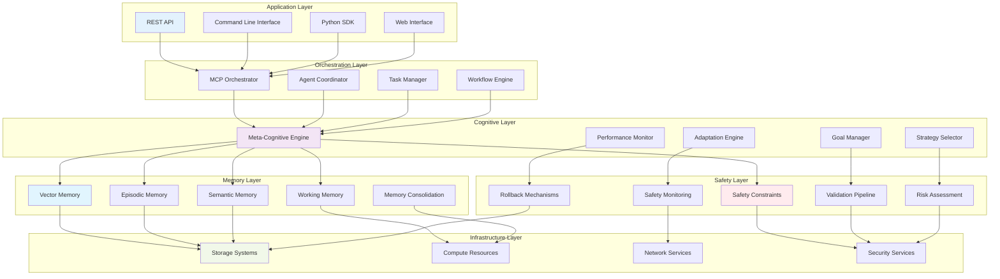

## 🧠 Core Components

### 1. Memory Layer

The memory layer forms the foundation of SAFLA's cognitive capabilities, implementing a hybrid architecture that mirrors human memory systems.

#### Vector Memory System
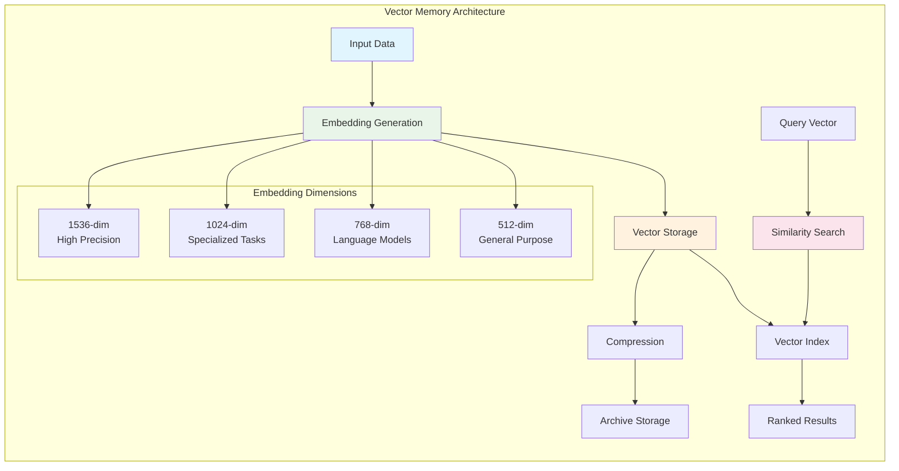

**Key Features:**
- Multi-dimensional embedding support (512, 768, 1024, 1536 dimensions)
- Multiple similarity metrics (cosine, euclidean, dot product, manhattan)
- Efficient indexing with approximate nearest neighbor search
- Automatic compression and archival for long-term storage
- Metadata-based filtering and categorization

#### Episodic Memory System
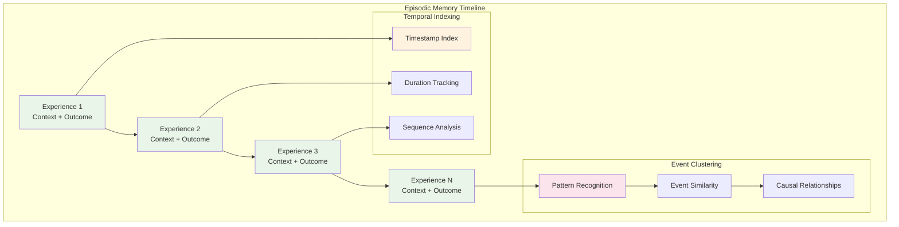

**Key Features:**
- Sequential experience storage with temporal ordering
- Context-outcome relationship tracking
- Event clustering and pattern recognition
- Causal relationship inference
- Experience replay for learning enhancement

#### Semantic Memory System
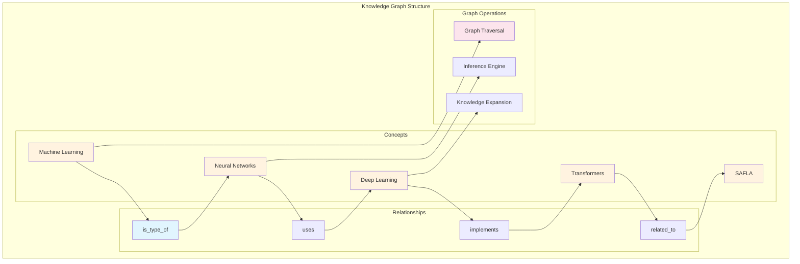

**Key Features:**
- Graph-based knowledge representation
- Weighted relationship modeling
- Multi-hop inference capabilities
- Dynamic knowledge expansion
- Concept hierarchy management

#### Working Memory System
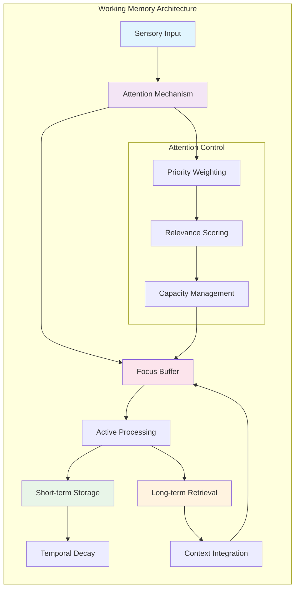

**Key Features:**
- Limited capacity with intelligent prioritization
- Attention-based focus management
- Temporal decay for automatic cleanup
- Integration with long-term memory systems
- Real-time context maintenance

### 2. Meta-Cognitive Engine

The meta-cognitive engine provides self-awareness and adaptive capabilities, enabling SAFLA to monitor and improve its own performance.

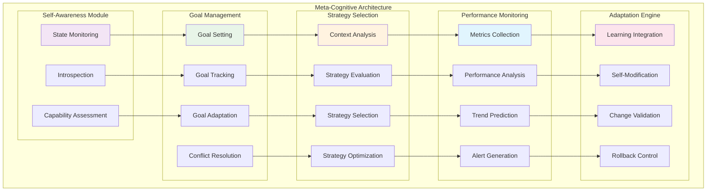

**Key Capabilities:**
- Real-time self-monitoring and introspection
- Dynamic goal management with conflict resolution
- Context-aware strategy selection and optimization
- Continuous performance tracking and improvement
- Safe self-modification with validation controls

### 3. Safety & Validation Framework

The safety framework ensures secure and reliable operation through comprehensive validation and monitoring mechanisms.

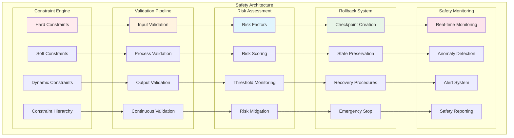

**Safety Features:**
- Multi-level constraint enforcement (hard, soft, dynamic)
- Comprehensive validation pipeline with timeout handling
- Quantitative risk assessment with weighted factors
- Automated checkpoint creation and rollback capabilities
- Real-time monitoring with anomaly detection

### 4. MCP Orchestration

The MCP (Model Context Protocol) orchestration layer enables distributed agent coordination and external service integration.

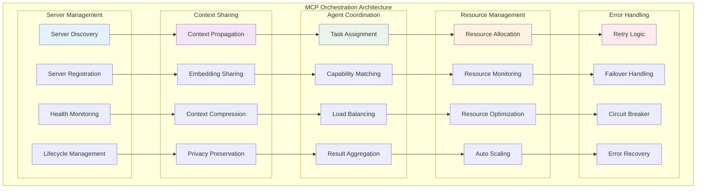

**Orchestration Features:**
- Dynamic MCP server discovery and management
- Efficient context sharing with privacy preservation
- Intelligent task assignment based on capabilities
- Resource optimization and auto-scaling
- Robust error handling with circuit breaker patterns

## 🔄 Data Flow Architecture

### Information Processing Pipeline

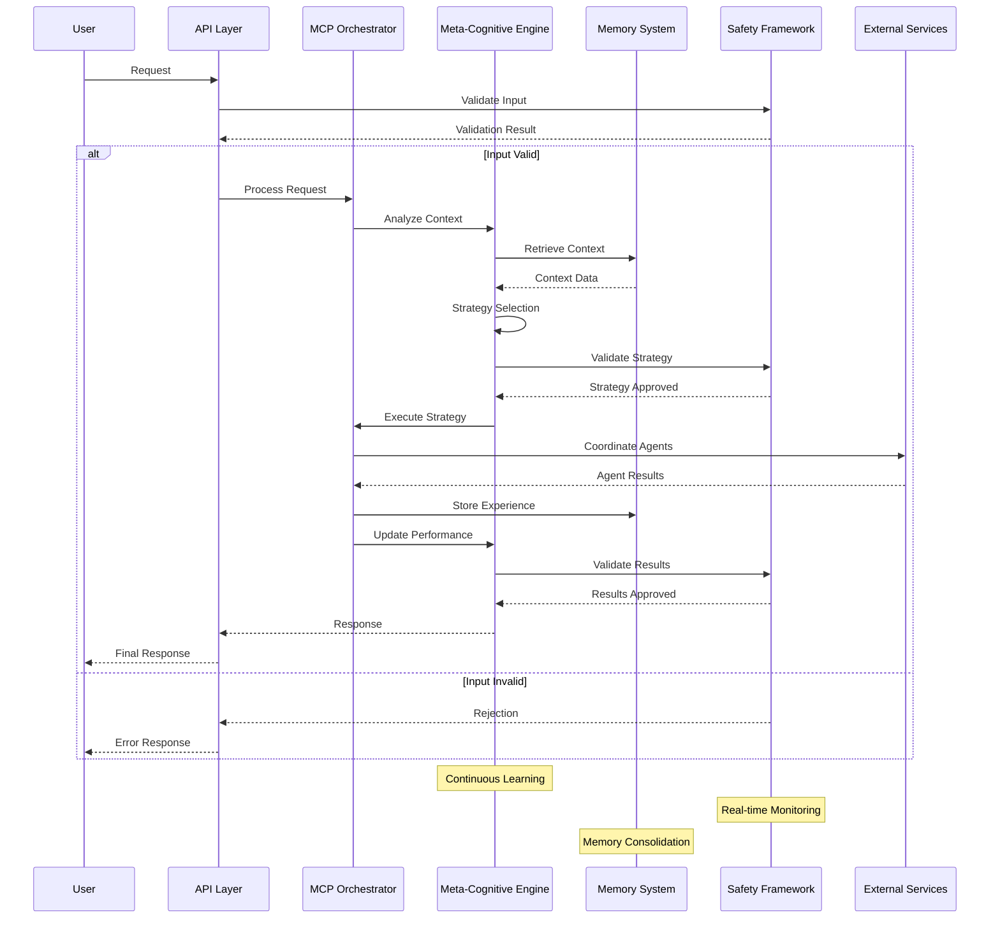

### Memory Consolidation Flow

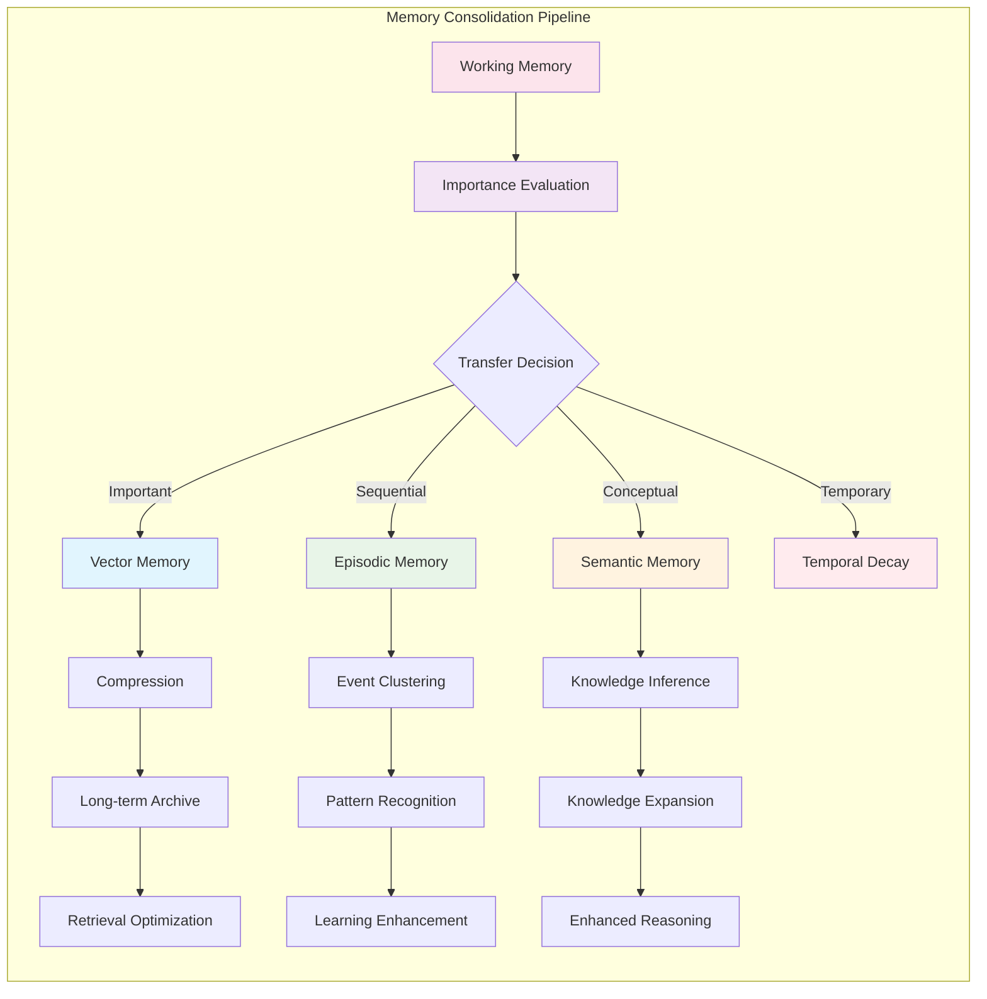

## 🏛️ Architectural Patterns

### 1. Layered Architecture
- **Separation of Concerns**: Each layer has distinct responsibilities
- **Abstraction**: Higher layers use lower layers through well-defined interfaces
- **Modularity**: Components can be developed and tested independently
- **Scalability**: Layers can be scaled independently based on load

### 2. Event-Driven Architecture
- **Asynchronous Processing**: Non-blocking operations for better performance
- **Loose Coupling**: Components communicate through events
- **Scalability**: Easy to add new event handlers
- **Resilience**: System continues operating even if some components fail

### 3. Microservices Pattern
- **Service Independence**: Each component can be deployed independently
- **Technology Diversity**: Different components can use different technologies
- **Fault Isolation**: Failures in one service don't affect others
- **Scalability**: Services can be scaled based on individual needs

### 4. Circuit Breaker Pattern
- **Fault Tolerance**: Prevents cascading failures
- **Quick Recovery**: Automatic recovery when services become available
- **Monitoring**: Provides insights into service health
- **Graceful Degradation**: System continues with reduced functionality

## 🔧 Configuration Architecture

### Hierarchical Configuration

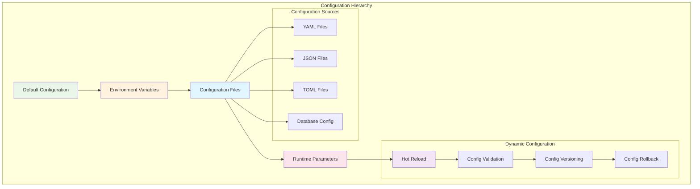

### Configuration Management Features
- **Hierarchical Override**: Higher priority configurations override lower ones
- **Environment-Specific**: Different configurations for different environments
- **Hot Reload**: Configuration changes without system restart
- **Validation**: Automatic validation of configuration changes
- **Versioning**: Track configuration changes over time
- **Rollback**: Revert to previous configurations if needed

## 📊 Performance Architecture

### Optimization Strategies

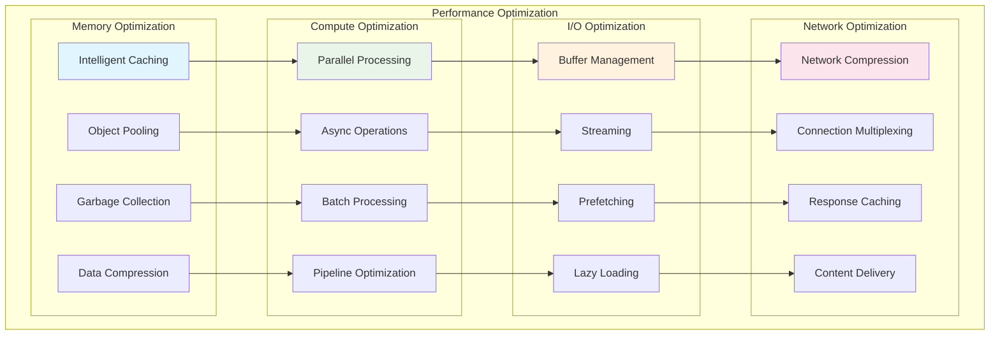

## 🔒 Security Architecture

### Multi-Layer Security

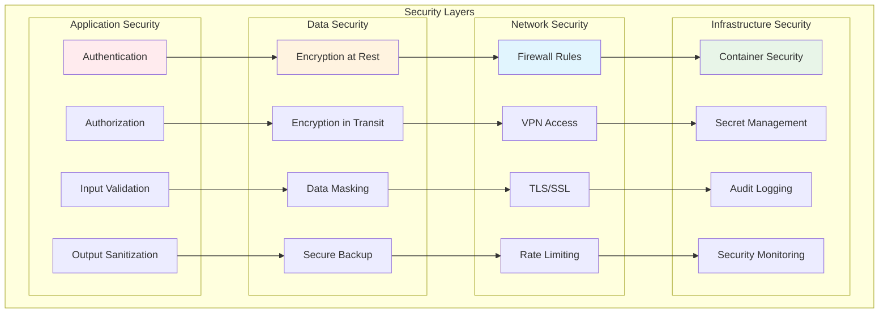

## 🚀 Deployment Architecture

### Multi-Environment Deployment

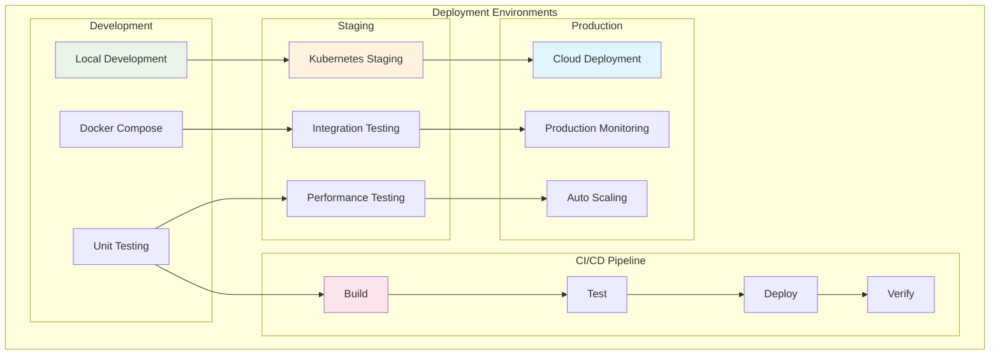

## 📈 Scalability Architecture

### Horizontal and Vertical Scaling

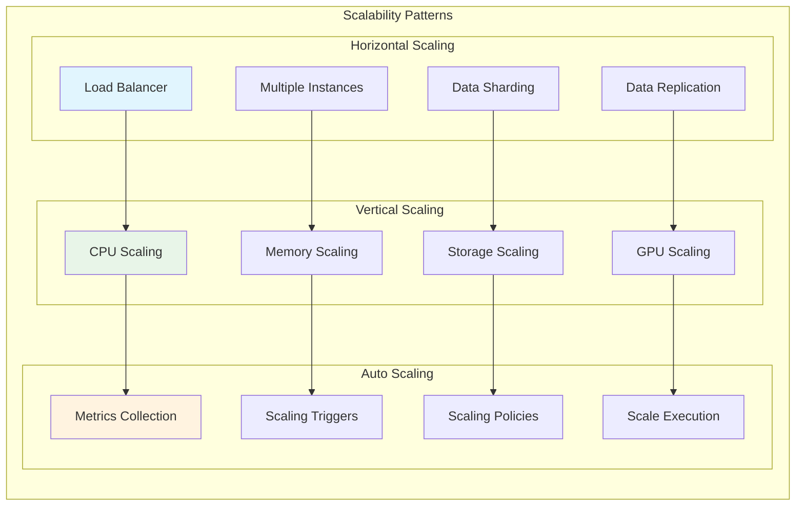

## 🔍 Monitoring Architecture

### Comprehensive Observability

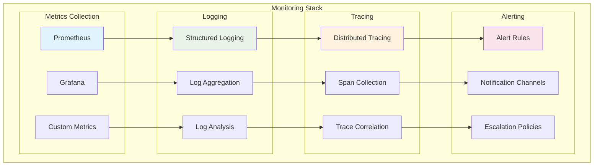

## 🎯 Design Principles

### 1. **Safety First**
- All operations are validated before execution
- Multiple safety layers prevent dangerous operations
- Automatic rollback capabilities for error recovery
- Comprehensive monitoring and alerting

### 2. **Modularity**
- Clear separation of concerns between components
- Well-defined interfaces and contracts
- Independent development and testing
- Easy component replacement and upgrades

### 3. **Scalability**
- Horizontal and vertical scaling capabilities
- Efficient resource utilization
- Load balancing and auto-scaling
- Performance optimization at all levels

### 4. **Reliability**
- Fault tolerance and error recovery
- Redundancy and failover mechanisms
- Comprehensive testing and validation
- Graceful degradation under stress

### 5. **Maintainability**
- Clean, well-documented code
- Comprehensive logging and debugging
- Configuration-driven behavior
- Automated testing and deployment

### 6. **Security**
- Multi-layer security architecture
- Encryption at rest and in transit
- Access control and authentication
- Audit logging and compliance

## 🔮 Future Architecture Evolution

### Planned Enhancements

1. **Enhanced Meta-Cognition**
   - Advanced self-reflection capabilities
   - Improved strategy learning and adaptation
   - Better goal conflict resolution

2. **Advanced Memory Systems**
   - Quantum-inspired memory architectures
   - Neuromorphic computing integration
   - Enhanced memory consolidation algorithms

3. **Distributed Intelligence**
   - Multi-agent swarm intelligence
   - Federated learning capabilities
   - Edge computing integration

4. **Advanced Safety Mechanisms**
   - Formal verification methods
   - AI safety research integration
   - Advanced anomaly detection

---

**Next**: [Hybrid Memory System](05-memory-system.md) - Deep dive into SAFLA's memory architecture  
**Previous**: [Installation Guide](03-installation.md) - Setting up SAFLA