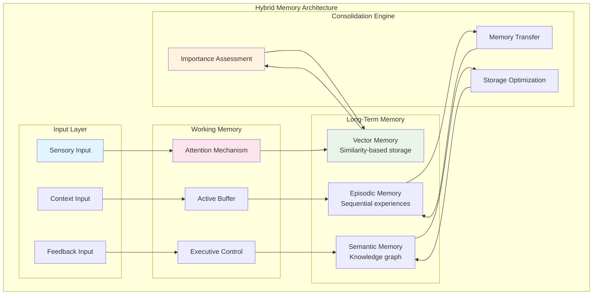
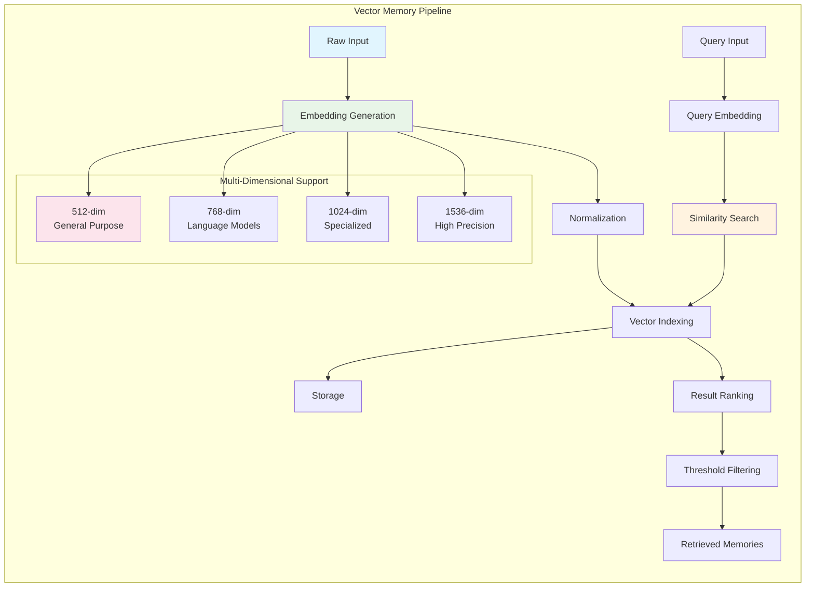
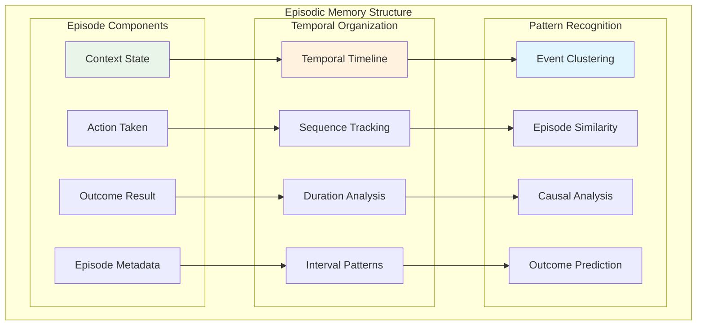
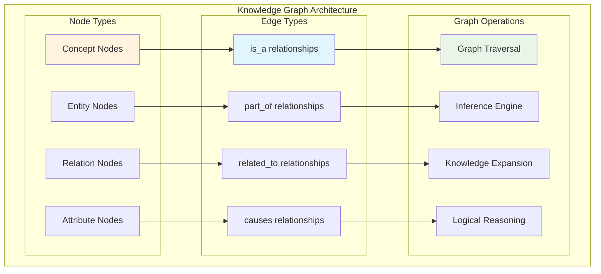
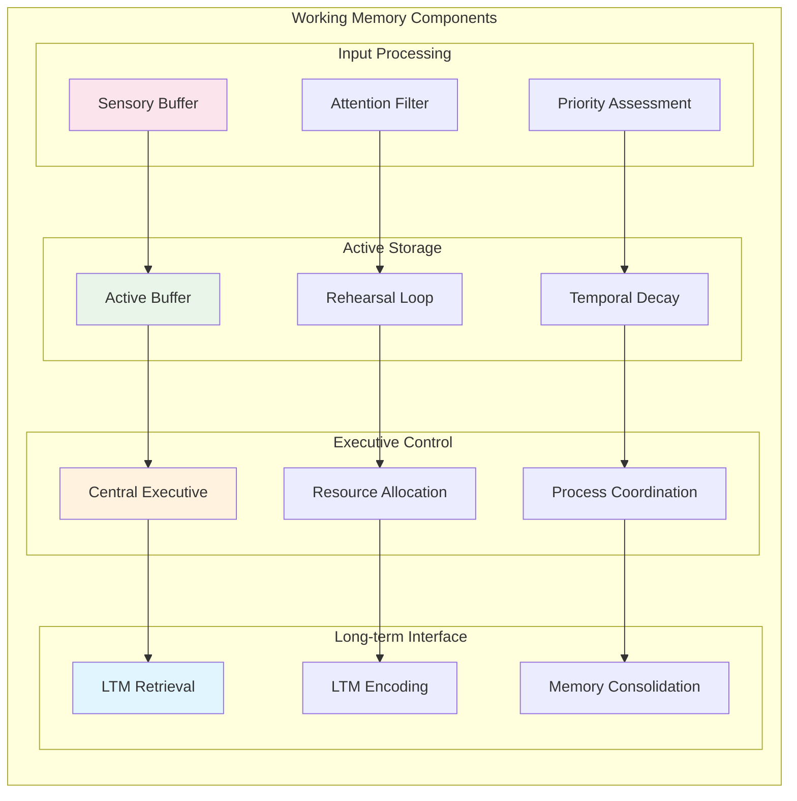
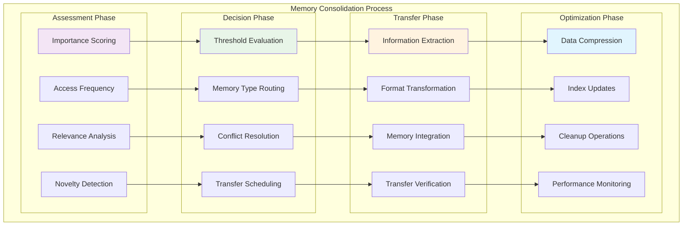

# Hybrid Memory System

SAFLA's hybrid memory architecture is inspired by human cognitive memory systems, implementing four specialized memory types that work together to provide comprehensive information storage, retrieval, and processing capabilities.

## 🧠 Memory Architecture Overview



## 📊 Vector Memory System

Vector memory stores high-dimensional representations of information, enabling similarity-based retrieval and semantic understanding.

### Architecture



### Key Features

#### Multi-Dimensional Embeddings
- **512-dimensional**: General-purpose embeddings for basic similarity
- **768-dimensional**: Optimized for transformer-based language models
- **1024-dimensional**: Specialized tasks requiring higher precision
- **1536-dimensional**: Maximum precision for complex semantic relationships

#### Similarity Metrics
```python
from safla.core.hybrid_memory import SimilarityMetric

# Supported similarity metrics
metrics = [
    SimilarityMetric.COSINE,      # Cosine similarity (default)
    SimilarityMetric.EUCLIDEAN,   # Euclidean distance
    SimilarityMetric.DOT_PRODUCT, # Dot product similarity
    SimilarityMetric.MANHATTAN    # Manhattan distance
]
```

#### Storage and Retrieval
```python
# Store vector memory
memory_id = await memory.store_vector_memory(
    content="Machine learning is a subset of artificial intelligence",
    embedding=embedding_vector,  # 512, 768, 1024, or 1536 dimensions
    metadata={
        "type": "definition",
        "domain": "AI",
        "confidence": 0.95,
        "source": "educational_content"
    }
)

# Search similar memories
similar_memories = await memory.search_similar_memories(
    query_embedding=query_vector,
    similarity_metric=SimilarityMetric.COSINE,
    top_k=10,
    similarity_threshold=0.8,
    metadata_filter={"domain": "AI"}
)
```

### Performance Optimization

#### Indexing Strategies
- **HNSW (Hierarchical Navigable Small World)**: Fast approximate nearest neighbor search
- **IVF (Inverted File)**: Efficient for large-scale datasets
- **LSH (Locality Sensitive Hashing)**: Memory-efficient similarity search
- **Flat Index**: Exact search for smaller datasets

#### Compression Techniques
- **Product Quantization**: Reduces memory footprint
- **Scalar Quantization**: Faster similarity computation
- **Binary Quantization**: Extreme compression for large datasets

## 📚 Episodic Memory System

Episodic memory stores sequential experiences with temporal context, enabling learning from past interactions and pattern recognition.

### Architecture



### Episode Storage

```python
# Store episodic memory
episode_id = await memory.store_episodic_memory(
    content="User requested explanation of neural networks",
    context={
        "user_id": "user_123",
        "session_id": "session_456",
        "previous_topics": ["machine_learning", "algorithms"],
        "user_expertise": "beginner"
    },
    outcome="provided_comprehensive_explanation",
    metadata={
        "duration": 180,  # seconds
        "satisfaction_score": 0.9,
        "follow_up_questions": 2,
        "complexity_level": "intermediate"
    }
)
```

### Temporal Queries

```python
# Retrieve episodes by time range
recent_episodes = await memory.get_episodes_by_timerange(
    start_time=datetime.now() - timedelta(hours=24),
    end_time=datetime.now(),
    context_filter={"user_id": "user_123"}
)

# Find similar episodes
similar_episodes = await memory.find_similar_episodes(
    reference_episode_id=episode_id,
    similarity_threshold=0.7,
    max_results=5
)

# Analyze episode patterns
patterns = await memory.analyze_episode_patterns(
    time_window=timedelta(days=7),
    pattern_types=["success_patterns", "failure_patterns", "user_preferences"]
)
```

## 🕸️ Semantic Memory System

Semantic memory implements a knowledge graph for storing structured information and relationships between concepts.

### Knowledge Graph Structure



### Knowledge Management

```python
# Add concept nodes
ai_node = await memory.add_semantic_node(
    content="Artificial Intelligence",
    node_type="concept",
    properties={
        "definition": "Intelligence demonstrated by machines",
        "field": "computer_science",
        "complexity": "high"
    }
)

ml_node = await memory.add_semantic_node(
    content="Machine Learning",
    node_type="concept",
    properties={
        "definition": "Subset of AI focused on learning from data",
        "field": "computer_science",
        "complexity": "medium"
    }
)

# Create relationships
await memory.add_semantic_edge(
    source_id=ml_node,
    target_id=ai_node,
    relationship="is_subset_of",
    weight=0.9,
    properties={
        "confidence": 0.95,
        "source": "academic_consensus"
    }
)

# Query knowledge graph
related_concepts = await memory.get_related_nodes(
    node_id=ai_node,
    relationship_types=["is_subset_of", "related_to"],
    max_depth=3,
    min_weight=0.5
)

# Perform inference
inferred_relationships = await memory.infer_relationships(
    source_concept="deep_learning",
    target_concept="neural_networks",
    inference_types=["transitive", "symmetric", "causal"]
)
```

### Graph Algorithms

#### Traversal Algorithms
- **Breadth-First Search (BFS)**: Explore immediate neighbors first
- **Depth-First Search (DFS)**: Deep exploration of concept hierarchies
- **Dijkstra's Algorithm**: Shortest path between concepts
- **PageRank**: Concept importance ranking

#### Inference Engines
- **Rule-Based Inference**: Apply logical rules to derive new knowledge
- **Probabilistic Inference**: Handle uncertainty in relationships
- **Analogical Reasoning**: Find similar patterns across domains
- **Causal Inference**: Identify cause-and-effect relationships

## 🎯 Working Memory System

Working memory manages active context and immediate processing, implementing attention mechanisms and capacity limitations.

### Architecture



### Attention Mechanisms

```python
# Configure attention parameters
attention_config = {
    "capacity_limit": 7,  # Miller's magic number ±2
    "decay_rate": 0.1,    # Information decay per second
    "rehearsal_strength": 0.8,  # Rehearsal effectiveness
    "priority_weights": {
        "relevance": 0.4,
        "recency": 0.3,
        "importance": 0.3
    }
}

# Add information to working memory
await memory.working_memory.add_item(
    content="Current user query about neural networks",
    priority=0.9,
    attention_weight=0.8,
    decay_resistance=0.7
)

# Retrieve active context
active_context = await memory.working_memory.get_active_context(
    max_items=5,
    relevance_threshold=0.6
)

# Update attention focus
await memory.working_memory.update_attention_focus(
    focus_items=["neural_networks", "deep_learning"],
    attention_strength=0.9
)
```

### Capacity Management

#### Capacity Limitations
- **Item Limit**: Maximum 7±2 active items (configurable)
- **Temporal Limit**: Items decay over time without rehearsal
- **Interference**: New items can displace older ones
- **Priority-Based**: High-priority items resist displacement

#### Rehearsal Strategies
- **Maintenance Rehearsal**: Keep items active through repetition
- **Elaborative Rehearsal**: Strengthen items through association
- **Selective Rehearsal**: Focus on most important items
- **Distributed Rehearsal**: Spread rehearsal over time

## 🔄 Memory Consolidation

The consolidation engine manages the transfer of information between memory systems based on importance, frequency, and relevance.

### Consolidation Pipeline



### Consolidation Strategies

```python
# Configure consolidation parameters
consolidation_config = {
    "importance_threshold": 0.7,
    "frequency_threshold": 5,
    "relevance_threshold": 0.6,
    "consolidation_interval": 3600,  # seconds
    "batch_size": 100,
    "max_transfer_rate": 0.1  # 10% of working memory per cycle
}

# Manual consolidation trigger
await memory.consolidation_engine.consolidate_memories(
    source_memory="working",
    target_memories=["vector", "episodic", "semantic"],
    criteria={
        "min_importance": 0.8,
        "min_access_count": 3,
        "max_age": timedelta(hours=1)
    }
)

# Automatic consolidation scheduling
await memory.consolidation_engine.schedule_consolidation(
    interval=timedelta(hours=1),
    conditions={
        "working_memory_utilization": 0.8,
        "system_load": 0.6,
        "available_resources": 0.4
    }
)
```

## 📊 Memory Analytics

### Performance Metrics

```python
# Get memory system statistics
stats = await memory.get_memory_statistics()
print(f"Vector memories: {stats['vector_count']}")
print(f"Episodic memories: {stats['episodic_count']}")
print(f"Semantic nodes: {stats['semantic_nodes']}")
print(f"Working memory utilization: {stats['working_utilization']:.2%}")

# Analyze memory performance
performance = await memory.analyze_memory_performance(
    time_window=timedelta(days=7),
    metrics=["retrieval_speed", "accuracy", "consolidation_efficiency"]
)

# Memory health check
health_report = await memory.check_memory_health()
if health_report['status'] == 'healthy':
    print("✅ Memory system is healthy")
else:
    print(f"⚠️ Memory issues detected: {health_report['issues']}")
```

### Optimization Recommendations

```python
# Get optimization suggestions
recommendations = await memory.get_optimization_recommendations()
for rec in recommendations:
    print(f"📈 {rec['type']}: {rec['description']}")
    print(f"   Expected improvement: {rec['expected_improvement']}")
    print(f"   Implementation effort: {rec['effort_level']}")
```

## 🔧 Configuration

### Memory System Configuration

```python
# Configure memory system
memory_config = {
    "vector_memory": {
        "dimensions": [512, 768, 1024, 1536],
        "max_memories": 10000,
        "similarity_threshold": 0.8,
        "index_type": "hnsw",
        "compression_enabled": True
    },
    "episodic_memory": {
        "max_episodes": 5000,
        "retention_period": timedelta(days=365),
        "clustering_enabled": True,
        "pattern_analysis": True
    },
    "semantic_memory": {
        "max_nodes": 50000,
        "max_edges": 200000,
        "inference_enabled": True,
        "reasoning_depth": 3
    },
    "working_memory": {
        "capacity": 7,
        "decay_rate": 0.1,
        "rehearsal_enabled": True,
        "attention_mechanism": "priority_based"
    },
    "consolidation": {
        "interval": timedelta(hours=1),
        "importance_threshold": 0.7,
        "batch_size": 100,
        "parallel_processing": True
    }
}

# Initialize memory system with configuration
memory = HybridMemoryArchitecture(config=memory_config)
```

## 🧪 Testing and Validation

### Memory System Tests

```python
# Test vector memory operations
async def test_vector_memory():
    # Store test memories
    test_embeddings = [np.random.rand(512) for _ in range(100)]
    memory_ids = []
    
    for i, embedding in enumerate(test_embeddings):
        memory_id = await memory.store_vector_memory(
            content=f"Test memory {i}",
            embedding=embedding,
            metadata={"test_id": i}
        )
        memory_ids.append(memory_id)
    
    # Test similarity search
    query_embedding = test_embeddings[0] + np.random.normal(0, 0.1, 512)
    results = await memory.search_similar_memories(
        query_embedding=query_embedding,
        top_k=5,
        similarity_threshold=0.5
    )
    
    assert len(results) > 0, "Should find similar memories"
    assert results[0].similarity > 0.5, "Top result should meet threshold"

# Test episodic memory operations
async def test_episodic_memory():
    # Store test episodes
    for i in range(10):
        await memory.store_episodic_memory(
            content=f"Test episode {i}",
            context={"test_session": True, "episode_num": i},
            outcome="success" if i % 2 == 0 else "failure",
            metadata={"duration": i * 10}
        )
    
    # Test temporal queries
    recent_episodes = await memory.get_episodes_by_timerange(
        start_time=datetime.now() - timedelta(minutes=5),
        end_time=datetime.now()
    )
    
    assert len(recent_episodes) == 10, "Should retrieve all recent episodes"

# Test semantic memory operations
async def test_semantic_memory():
    # Create test knowledge graph
    ai_node = await memory.add_semantic_node(
        content="Artificial Intelligence",
        node_type="concept"
    )
    
    ml_node = await memory.add_semantic_node(
        content="Machine Learning",
        node_type="concept"
    )
    
    await memory.add_semantic_edge(
        source_id=ml_node,
        target_id=ai_node,
        relationship="is_subset_of",
        weight=0.9
    )
    
    # Test graph traversal
    related_nodes = await memory.get_related_nodes(
        node_id=ai_node,
        max_depth=2
    )
    
    assert len(related_nodes) > 0, "Should find related nodes"
```

---

**Next**: [Meta-Cognitive Engine](06-meta-cognitive.md) - Self-awareness and adaptive capabilities  
**Previous**: [System Architecture](04-architecture.md) - Overall system design