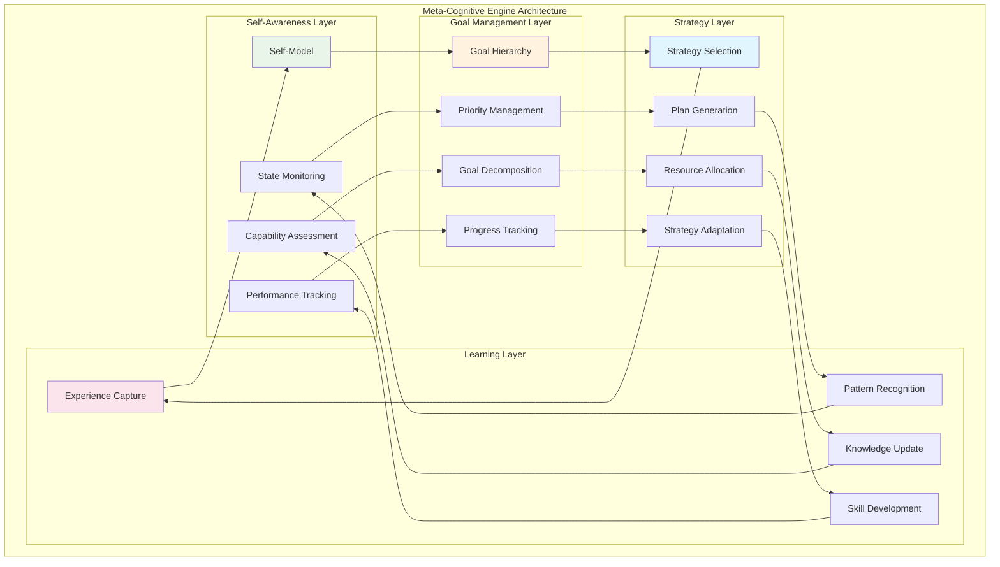
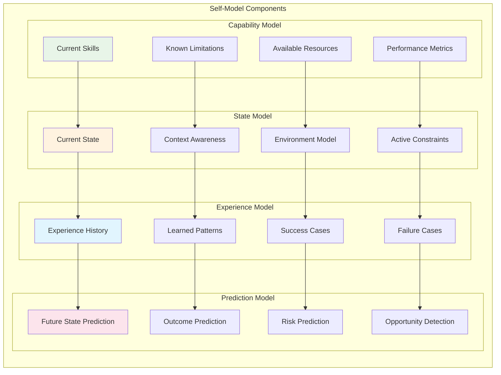
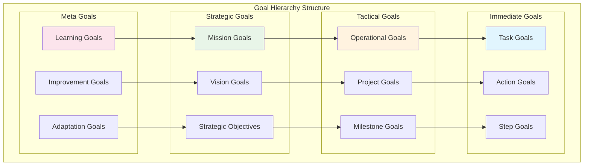
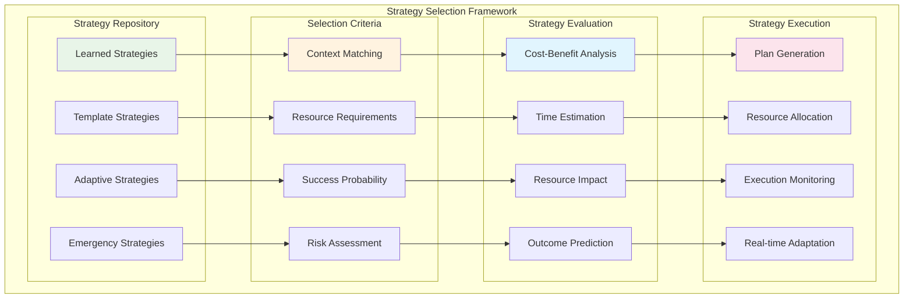
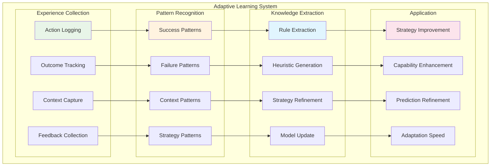

# Meta-Cognitive Engine

The Meta-Cognitive Engine is SAFLA's self-awareness and strategic reasoning system. It provides the higher-order cognitive capabilities that enable autonomous learning, goal management, strategy selection, and adaptive behavior. This engine represents the "thinking about thinking" layer that makes SAFLA truly self-aware.

## 🧠 Meta-Cognitive Architecture



## 🎯 Self-Awareness System

The self-awareness system maintains a dynamic model of SAFLA's current state, capabilities, and performance characteristics.

### Self-Model Implementation



### Self-Awareness Implementation

```python
from safla.core.meta_cognitive import (
    SelfAwarenessEngine,
    CapabilityModel,
    StateModel,
    ExperienceModel,
    PredictionModel
)

# Initialize self-awareness engine
self_awareness = SelfAwarenessEngine()

# Define capability model
capability_model = CapabilityModel(
    skills={
        "memory_operations": {
            "proficiency": 0.95,
            "confidence": 0.9,
            "last_updated": "2024-01-15T10:30:00Z"
        },
        "pattern_recognition": {
            "proficiency": 0.88,
            "confidence": 0.85,
            "last_updated": "2024-01-15T09:15:00Z"
        },
        "natural_language_processing": {
            "proficiency": 0.92,
            "confidence": 0.88,
            "last_updated": "2024-01-15T11:00:00Z"
        }
    },
    limitations={
        "real_time_processing": {
            "severity": "moderate",
            "description": "Limited real-time processing for large datasets",
            "workarounds": ["batch processing", "streaming optimization"]
        },
        "external_api_dependency": {
            "severity": "low",
            "description": "Dependent on external APIs for some operations",
            "workarounds": ["local fallbacks", "caching strategies"]
        }
    },
    resources={
        "memory": {
            "total": 1000000000,  # 1GB
            "available": 750000000,  # 750MB
            "utilization": 0.25
        },
        "cpu": {
            "cores": 4,
            "utilization": 0.45,
            "available_capacity": 0.55
        },
        "storage": {
            "total": 100000000000,  # 100GB
            "available": 85000000000,  # 85GB
            "utilization": 0.15
        }
    }
)

# Initialize state model
state_model = StateModel(
    current_state="active_learning",
    context={
        "current_task": "memory_optimization",
        "user_interaction": True,
        "system_load": "moderate",
        "time_of_day": "morning"
    },
    environment={
        "system_type": "development",
        "network_connectivity": "stable",
        "external_services": ["available", "responsive"],
        "data_sources": ["local_db", "vector_store", "knowledge_base"]
    }
)

# Set up self-awareness monitoring
await self_awareness.initialize(
    capability_model=capability_model,
    state_model=state_model,
    update_interval=5.0  # Update every 5 seconds
)

# Get current self-assessment
self_assessment = await self_awareness.get_self_assessment()
print(f"🧠 Self-Assessment:")
print(f"  Overall Capability: {self_assessment.overall_capability:.2%}")
print(f"  Confidence Level: {self_assessment.confidence_level:.2%}")
print(f"  Current State: {self_assessment.current_state}")
print(f"  Resource Utilization: {self_assessment.resource_utilization:.2%}")
print(f"  Performance Score: {self_assessment.performance_score:.3f}")
```

### Capability Assessment

```python
# Assess specific capabilities
async def assess_memory_capability():
    """Assess current memory operation capabilities."""
    # Test memory operations
    test_results = []
    
    # Test vector memory
    vector_test = await memory_system.test_vector_operations(
        test_size=1000,
        complexity="medium"
    )
    test_results.append(("vector_memory", vector_test.performance_score))
    
    # Test episodic memory
    episodic_test = await memory_system.test_episodic_operations(
        test_size=500,
        complexity="medium"
    )
    test_results.append(("episodic_memory", episodic_test.performance_score))
    
    # Calculate overall capability
    overall_score = sum(score for _, score in test_results) / len(test_results)
    
    # Update capability model
    await self_awareness.update_capability(
        skill_name="memory_operations",
        proficiency=overall_score,
        confidence=min(overall_score + 0.1, 1.0),
        evidence=test_results
    )
    
    return overall_score

# Continuous capability monitoring
async def monitor_capabilities():
    """Continuously monitor and update capability assessments."""
    while True:
        try:
            # Assess memory capabilities
            memory_score = await assess_memory_capability()
            
            # Assess reasoning capabilities
            reasoning_score = await assess_reasoning_capability()
            
            # Assess learning capabilities
            learning_score = await assess_learning_capability()
            
            # Update overall self-model
            await self_awareness.update_overall_assessment({
                "memory": memory_score,
                "reasoning": reasoning_score,
                "learning": learning_score
            })
            
            await asyncio.sleep(300)  # Check every 5 minutes
            
        except Exception as e:
            logger.error(f"Capability monitoring error: {e}")
            await asyncio.sleep(60)  # Retry in 1 minute

# Start capability monitoring
asyncio.create_task(monitor_capabilities())
```

## 🎯 Goal Management System

The goal management system handles hierarchical goal structures, priority management, and progress tracking.

### Goal Hierarchy



### Goal Management Implementation

```python
from safla.core.meta_cognitive import (
    GoalManager,
    Goal,
    GoalType,
    Priority,
    GoalStatus
)

# Initialize goal manager
goal_manager = GoalManager()

# Define strategic goals
mission_goal = Goal(
    id="mission_001",
    name="Autonomous Learning Excellence",
    description="Achieve autonomous learning capabilities that exceed human-level performance",
    goal_type=GoalType.MISSION,
    priority=Priority.CRITICAL,
    target_completion="2024-12-31",
    success_criteria=[
        "Learning efficiency > 95%",
        "Adaptation time < 1 hour",
        "Error rate < 1%"
    ]
)

# Define operational goals
memory_optimization_goal = Goal(
    id="op_001",
    name="Memory System Optimization",
    description="Optimize memory system for improved performance and efficiency",
    goal_type=GoalType.OPERATIONAL,
    priority=Priority.HIGH,
    parent_goal_id="mission_001",
    target_completion="2024-02-15",
    success_criteria=[
        "Memory access time < 100ms",
        "Storage efficiency > 80%",
        "Retrieval accuracy > 95%"
    ]
)

# Define immediate goals
vector_tuning_goal = Goal(
    id="task_001",
    name="Vector Memory Tuning",
    description="Fine-tune vector memory parameters for optimal performance",
    goal_type=GoalType.TASK,
    priority=Priority.MEDIUM,
    parent_goal_id="op_001",
    target_completion="2024-01-20",
    success_criteria=[
        "Vector similarity accuracy > 90%",
        "Search time < 50ms",
        "Memory usage < 500MB"
    ]
)

# Add goals to manager
await goal_manager.add_goal(mission_goal)
await goal_manager.add_goal(memory_optimization_goal)
await goal_manager.add_goal(vector_tuning_goal)

# Get goal hierarchy
hierarchy = await goal_manager.get_goal_hierarchy()
print("🎯 Goal Hierarchy:")
for level, goals in hierarchy.items():
    print(f"  {level.upper()}:")
    for goal in goals:
        print(f"    - {goal.name} ({goal.priority.value})")
        print(f"      Progress: {goal.progress:.1%}")
        print(f"      Status: {goal.status.value}")
```

### Goal Decomposition

```python
async def decompose_goal(goal_id: str):
    """Automatically decompose a goal into sub-goals."""
    goal = await goal_manager.get_goal(goal_id)
    
    if goal.goal_type == GoalType.OPERATIONAL:
        # Decompose operational goal into tasks
        sub_goals = []
        
        if "memory" in goal.name.lower():
            # Memory-related goal decomposition
            sub_goals.extend([
                Goal(
                    name="Analyze Current Performance",
                    description="Analyze current memory system performance metrics",
                    goal_type=GoalType.TASK,
                    priority=Priority.HIGH,
                    parent_goal_id=goal_id
                ),
                Goal(
                    name="Identify Bottlenecks",
                    description="Identify performance bottlenecks in memory operations",
                    goal_type=GoalType.TASK,
                    priority=Priority.HIGH,
                    parent_goal_id=goal_id
                ),
                Goal(
                    name="Implement Optimizations",
                    description="Implement identified optimization strategies",
                    goal_type=GoalType.TASK,
                    priority=Priority.MEDIUM,
                    parent_goal_id=goal_id
                ),
                Goal(
                    name="Validate Improvements",
                    description="Validate that optimizations achieve target metrics",
                    goal_type=GoalType.TASK,
                    priority=Priority.HIGH,
                    parent_goal_id=goal_id
                )
            ])
        
        # Add sub-goals to manager
        for sub_goal in sub_goals:
            await goal_manager.add_goal(sub_goal)
        
        return sub_goals
    
    return []

# Decompose memory optimization goal
sub_goals = await decompose_goal("op_001")
print(f"📋 Decomposed into {len(sub_goals)} sub-goals")
```

### Progress Tracking

```python
# Update goal progress
async def update_goal_progress(goal_id: str, progress_data: dict):
    """Update goal progress based on performance data."""
    goal = await goal_manager.get_goal(goal_id)
    
    # Calculate progress based on success criteria
    criteria_met = 0
    total_criteria = len(goal.success_criteria)
    
    for criterion in goal.success_criteria:
        if evaluate_criterion(criterion, progress_data):
            criteria_met += 1
    
    progress = criteria_met / total_criteria
    
    # Update goal
    await goal_manager.update_goal_progress(
        goal_id=goal_id,
        progress=progress,
        evidence=progress_data,
        timestamp=datetime.utcnow()
    )
    
    # Check if goal is completed
    if progress >= 1.0:
        await goal_manager.complete_goal(goal_id)
        
        # Trigger celebration and learning
        await celebrate_goal_completion(goal)
        await extract_goal_lessons(goal)

# Automatic progress monitoring
async def monitor_goal_progress():
    """Monitor progress on active goals."""
    active_goals = await goal_manager.get_active_goals()
    
    for goal in active_goals:
        try:
            # Collect relevant performance data
            progress_data = await collect_progress_data(goal)
            
            # Update progress
            await update_goal_progress(goal.id, progress_data)
            
            # Check for goal conflicts or dependencies
            await check_goal_dependencies(goal)
            
        except Exception as e:
            logger.error(f"Progress monitoring error for goal {goal.id}: {e}")

# Schedule progress monitoring
asyncio.create_task(monitor_goal_progress())
```

## 🧭 Strategy Selection Engine

The strategy selection engine chooses optimal approaches based on current context, goals, and available resources.

### Strategy Framework



### Strategy Implementation

```python
from safla.core.meta_cognitive import (
    StrategyEngine,
    Strategy,
    StrategyType,
    ExecutionPlan
)

# Initialize strategy engine
strategy_engine = StrategyEngine()

# Define strategy templates
memory_optimization_strategy = Strategy(
    name="Incremental Memory Optimization",
    strategy_type=StrategyType.OPTIMIZATION,
    description="Gradually optimize memory system performance",
    context_requirements={
        "system_load": "low_to_medium",
        "available_memory": "> 500MB",
        "user_interaction": "minimal"
    },
    steps=[
        "Analyze current memory usage patterns",
        "Identify optimization opportunities",
        "Implement low-risk optimizations first",
        "Monitor performance improvements",
        "Gradually implement higher-risk optimizations",
        "Validate overall improvement"
    ],
    expected_duration=timedelta(hours=2),
    resource_requirements={
        "cpu": 0.3,
        "memory": 200000000,  # 200MB
        "storage": 1000000000  # 1GB
    },
    success_probability=0.85,
    risk_level=0.2
)

# Add strategy to repository
await strategy_engine.add_strategy(memory_optimization_strategy)

# Select strategy for current goal
current_context = {
    "goal": "memory_optimization",
    "system_load": "medium",
    "available_resources": {
        "cpu": 0.6,
        "memory": 600000000,
        "storage": 50000000000
    },
    "time_constraint": timedelta(hours=4),
    "risk_tolerance": 0.3
}

selected_strategy = await strategy_engine.select_strategy(
    goal_id="op_001",
    context=current_context,
    preferences={
        "prefer_incremental": True,
        "minimize_risk": True,
        "maximize_learning": False
    }
)

print(f"🧭 Selected Strategy: {selected_strategy.name}")
print(f"   Success Probability: {selected_strategy.success_probability:.1%}")
print(f"   Risk Level: {selected_strategy.risk_level:.1%}")
print(f"   Expected Duration: {selected_strategy.expected_duration}")
```

### Plan Generation

```python
# Generate execution plan
execution_plan = await strategy_engine.generate_execution_plan(
    strategy=selected_strategy,
    goal=memory_optimization_goal,
    context=current_context
)

print(f"📋 Execution Plan:")
print(f"   Total Steps: {len(execution_plan.steps)}")
print(f"   Estimated Duration: {execution_plan.estimated_duration}")
print(f"   Resource Allocation:")
for resource, allocation in execution_plan.resource_allocation.items():
    print(f"     {resource}: {allocation}")

print(f"   Execution Steps:")
for i, step in enumerate(execution_plan.steps, 1):
    print(f"     {i}. {step.name}")
    print(f"        Duration: {step.estimated_duration}")
    print(f"        Dependencies: {step.dependencies}")
    print(f"        Success Criteria: {step.success_criteria}")

# Execute plan with monitoring
async def execute_plan_with_monitoring(plan: ExecutionPlan):
    """Execute plan with real-time monitoring and adaptation."""
    execution_context = {
        "start_time": datetime.utcnow(),
        "current_step": 0,
        "completed_steps": [],
        "performance_metrics": {}
    }
    
    for step in plan.steps:
        try:
            print(f"🔄 Executing step: {step.name}")
            
            # Check dependencies
            if not await check_step_dependencies(step, execution_context):
                print(f"⚠️ Dependencies not met for step: {step.name}")
                continue
            
            # Execute step
            step_result = await execute_step(step, execution_context)
            
            # Evaluate success
            if step_result.success:
                execution_context["completed_steps"].append(step)
                print(f"✅ Step completed: {step.name}")
            else:
                print(f"❌ Step failed: {step.name}")
                
                # Attempt recovery or adaptation
                recovery_action = await strategy_engine.get_recovery_action(
                    step=step,
                    failure_reason=step_result.error,
                    context=execution_context
                )
                
                if recovery_action:
                    print(f"🔧 Attempting recovery: {recovery_action.description}")
                    await execute_recovery_action(recovery_action)
                else:
                    print(f"🚨 No recovery action available")
                    break
            
            # Update performance metrics
            execution_context["performance_metrics"].update(step_result.metrics)
            
        except Exception as e:
            logger.error(f"Step execution error: {e}")
            break
    
    return execution_context

# Start plan execution
execution_result = await execute_plan_with_monitoring(execution_plan)
```

## 🌱 Adaptive Learning System

The adaptive learning system enables SAFLA to learn from experience and continuously improve its capabilities.

### Learning Architecture



### Learning Implementation

```python
from safla.core.meta_cognitive import (
    AdaptiveLearningEngine,
    Experience,
    LearningPattern,
    KnowledgeUpdate
)

# Initialize adaptive learning engine
learning_engine = AdaptiveLearningEngine()

# Capture experience
async def capture_experience(action, context, outcome):
    """Capture an experience for learning."""
    experience = Experience(
        timestamp=datetime.utcnow(),
        action=action,
        context=context,
        outcome=outcome,
        success=outcome.get("success", False),
        performance_metrics=outcome.get("metrics", {}),
        feedback=outcome.get("feedback", {})
    )
    
    await learning_engine.add_experience(experience)
    
    # Trigger pattern recognition if enough experiences
    experience_count = await learning_engine.get_experience_count()
    if experience_count % 100 == 0:  # Every 100 experiences
        await learning_engine.analyze_patterns()

# Pattern recognition
async def analyze_success_patterns():
    """Analyze patterns in successful experiences."""
    successful_experiences = await learning_engine.get_experiences(
        filter_criteria={"success": True},
        limit=1000
    )
    
    patterns = []
    
    # Analyze context patterns
    context_clusters = await learning_engine.cluster_contexts(successful_experiences)
    for cluster in context_clusters:
        pattern = LearningPattern(
            type="context_success",
            description=f"Success pattern in {cluster.context_type}",
            conditions=cluster.common_conditions,
            confidence=cluster.confidence,
            evidence_count=len(cluster.experiences)
        )
        patterns.append(pattern)
    
    # Analyze action patterns
    action_sequences = await learning_engine.extract_action_sequences(successful_experiences)
    for sequence in action_sequences:
        pattern = LearningPattern(
            type="action_sequence",
            description=f"Successful action sequence: {sequence.name}",
            conditions=sequence.preconditions,
            actions=sequence.actions,
            confidence=sequence.success_rate,
            evidence_count=sequence.occurrence_count
        )
        patterns.append(pattern)
    
    return patterns

# Knowledge update
async def update_knowledge_base(patterns):
    """Update knowledge base with learned patterns."""
    for pattern in patterns:
        if pattern.confidence > 0.8:  # High confidence patterns
            # Update strategy repository
            if pattern.type == "action_sequence":
                new_strategy = await learning_engine.create_strategy_from_pattern(pattern)
                await strategy_engine.add_strategy(new_strategy)
            
            # Update capability model
            elif pattern.type == "context_success":
                capability_update = await learning_engine.extract_capability_insight(pattern)
                await self_awareness.update_capability_model(capability_update)
            
            # Update prediction models
            prediction_update = await learning_engine.create_prediction_rule(pattern)
            await self_awareness.update_prediction_model(prediction_update)

# Continuous learning loop
async def continuous_learning():
    """Continuous learning and adaptation loop."""
    while True:
        try:
            # Analyze recent patterns
            patterns = await analyze_success_patterns()
            failure_patterns = await analyze_failure_patterns()
            
            # Update knowledge base
            await update_knowledge_base(patterns + failure_patterns)
            
            # Refine existing strategies
            await refine_strategies_based_on_learning()
            
            # Update self-model
            await update_self_model_from_learning()
            
            await asyncio.sleep(3600)  # Learn every hour
            
        except Exception as e:
            logger.error(f"Continuous learning error: {e}")
            await asyncio.sleep(300)  # Retry in 5 minutes

# Start continuous learning
asyncio.create_task(continuous_learning())
```

### Meta-Learning

```python
# Meta-learning: Learning how to learn better
async def meta_learning_analysis():
    """Analyze and improve the learning process itself."""
    
    # Analyze learning effectiveness
    learning_metrics = await learning_engine.get_learning_metrics()
    
    print(f"📊 Learning Effectiveness Analysis:")
    print(f"   Pattern Recognition Accuracy: {learning_metrics.pattern_accuracy:.2%}")
    print(f"   Knowledge Application Success: {learning_metrics.application_success:.2%}")
    print(f"   Learning Speed: {learning_metrics.learning_speed:.2f} patterns/hour")
    print(f"   Adaptation Time: {learning_metrics.adaptation_time:.1f} minutes")
    
    # Identify learning bottlenecks
    bottlenecks = await learning_engine.identify_learning_bottlenecks()
    if bottlenecks:
        print(f"⚠️ Learning Bottlenecks:")
        for bottleneck in bottlenecks:
            print(f"   - {bottleneck.component}: {bottleneck.description}")
            print(f"     Impact: {bottleneck.impact:.1%}")
            print(f"     Suggested Fix: {bottleneck.suggested_fix}")
    
    # Optimize learning parameters
    optimization_suggestions = await learning_engine.optimize_learning_parameters()
    for suggestion in optimization_suggestions:
        print(f"🔧 Learning Optimization: {suggestion.parameter}")
        print(f"   Current Value: {suggestion.current_value}")
        print(f"   Suggested Value: {suggestion.suggested_value}")
        print(f"   Expected Improvement: {suggestion.expected_improvement:.1%}")
        
        # Apply optimization if beneficial
        if suggestion.expected_improvement > 0.1:  # 10% improvement threshold
            await learning_engine.update_parameter(
                suggestion.parameter,
                suggestion.suggested_value
            )

# Schedule meta-learning analysis
asyncio.create_task(meta_learning_analysis())
```

## 🔄 Integration with Other Systems

The meta-cognitive engine integrates seamlessly with other SAFLA components.

### System Integration

```python
# Integration with memory system
async def integrate_with_memory():
    """Integrate meta-cognitive insights with memory system."""
    
    # Use self-awareness to optimize memory operations
    memory_performance = await self_awareness.assess_component_performance("memory_system")
    
    if memory_performance.efficiency < 0.8:
        # Generate memory optimization strategy
        optimization_strategy = await strategy_engine.generate_optimization_strategy(
            component="memory_system",
            current_performance=memory_performance,
            target_performance=0.9
        )
        
        # Execute optimization
        await execute_strategy(optimization_strategy)

# Integration with safety system
async def integrate_with_safety():
    """Integrate meta-cognitive insights with safety system."""
    
    # Use goal management to inform safety constraints
    active_goals = await goal_manager.get_active_goals()
    critical_goals = [g for g in active_goals if g.priority == Priority.CRITICAL]
    
    # Adjust safety constraints based on critical goals
    for goal in critical_goals:
        safety_adjustments = await strategy_engine.generate_safety_adjustments(goal)
        await safety_framework.apply_adjustments(safety_adjustments)

# Integration with learning system
async def integrate_with_learning():
    """Integrate meta-cognitive insights with learning system."""
    
    # Use strategy success patterns to improve learning
    strategy_patterns = await learning_engine.get_strategy_patterns()
    
    for pattern in strategy_patterns:
        if pattern.success_rate > 0.9:
            # Promote successful strategy patterns
            await strategy_engine.promote_strategy_pattern(pattern)
        elif pattern.success_rate < 0.3:
            # Deprecate unsuccessful strategy patterns
            await strategy_engine.deprecate_strategy_pattern(pattern)

# Orchestrate system integration
async def orchestrate_system_integration():
    """Orchestrate integration across all systems."""
    integration_tasks = [
        integrate_with_memory(),
        integrate_with_safety(),
        integrate_with_learning()
    ]
    
    await asyncio.gather(*integration_tasks)

# Schedule regular integration
asyncio.create_task(orchestrate_system_integration())
```

---

**Next**: [Safety & Validation](07-safety-validation.md) - Comprehensive safety framework  
**Previous**: [Memory System](05-memory-system.md) - Hybrid memory architecture