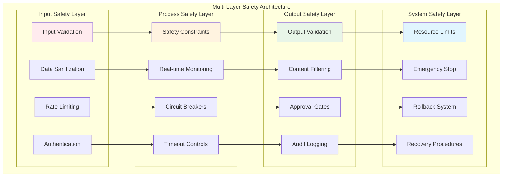
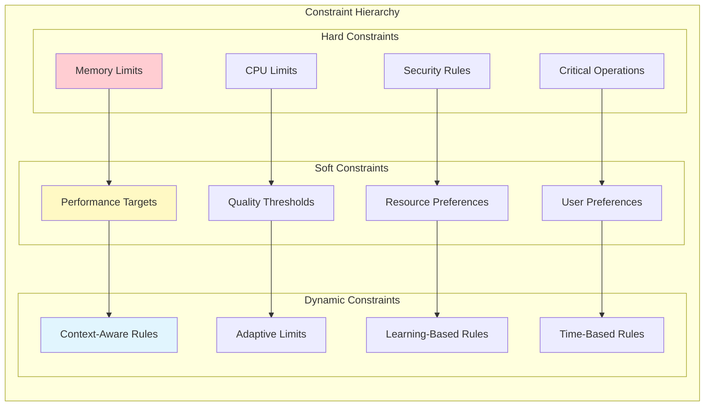
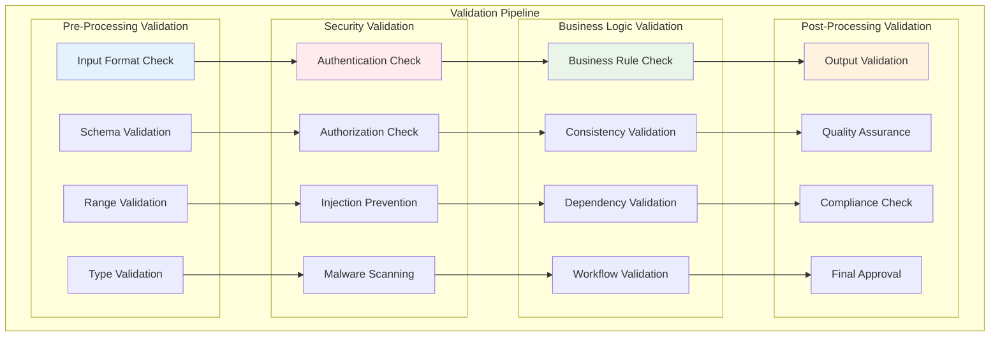
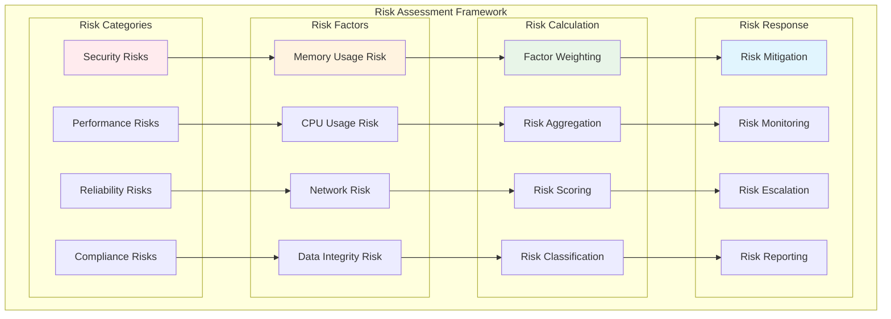
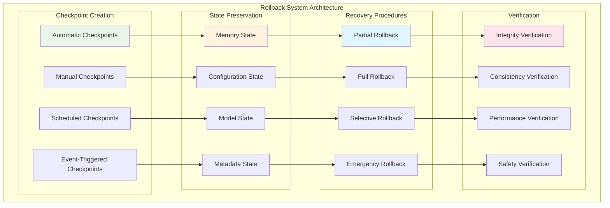

# Safety & Validation Framework

SAFLA's safety framework implements comprehensive validation mechanisms, risk assessment, and rollback capabilities to ensure secure and reliable autonomous operation. Safety is not an afterthought but a core architectural principle woven throughout every component.

## 🛡️ Safety Architecture Overview



## 🔒 Safety Constraints Engine

The constraints engine enforces safety rules through a hierarchical system of hard and soft constraints.

### Constraint Types



### Implementing Safety Constraints

```python
from safla.core.safety_validation import (
    SafetyConstraint, 
    ConstraintType, 
    ViolationAction,
    SafetyValidationFramework
)

# Define hard constraints (cannot be violated)
memory_constraint = SafetyConstraint(
    name="memory_limit",
    constraint_type=ConstraintType.HARD,
    description="Maximum memory usage limit",
    rule="memory_usage <= 1000000000",  # 1GB
    threshold=1000000000,
    violation_action=ViolationAction.EMERGENCY_STOP,
    priority=1  # Highest priority
)

cpu_constraint = SafetyConstraint(
    name="cpu_limit",
    constraint_type=ConstraintType.HARD,
    description="Maximum CPU usage limit",
    rule="cpu_usage <= 0.9",  # 90%
    threshold=0.9,
    violation_action=ViolationAction.THROTTLE,
    priority=1
)

# Define soft constraints (warnings and adjustments)
performance_constraint = SafetyConstraint(
    name="response_time",
    constraint_type=ConstraintType.SOFT,
    description="Target response time",
    rule="response_time <= 5.0",  # 5 seconds
    threshold=5.0,
    violation_action=ViolationAction.WARNING,
    priority=3
)

# Define dynamic constraints (context-aware)
adaptive_constraint = SafetyConstraint(
    name="adaptive_load",
    constraint_type=ConstraintType.DYNAMIC,
    description="Adaptive load management",
    rule="current_load <= adaptive_threshold",
    threshold_function=lambda context: min(0.8, context.get('available_resources', 0.5)),
    violation_action=ViolationAction.ADJUST,
    priority=2
)

# Initialize safety framework
safety_framework = SafetyValidationFramework()
await safety_framework.start()

# Add constraints
safety_framework.constraint_engine.add_constraint(memory_constraint)
safety_framework.constraint_engine.add_constraint(cpu_constraint)
safety_framework.constraint_engine.add_constraint(performance_constraint)
safety_framework.constraint_engine.add_constraint(adaptive_constraint)
```

### Constraint Evaluation

```python
# Evaluate constraints against current system state
system_state = {
    "memory_usage": 800000000,  # 800MB
    "cpu_usage": 0.75,          # 75%
    "response_time": 3.2,       # 3.2 seconds
    "current_load": 0.6,        # 60%
    "available_resources": 0.7   # 70%
}

evaluation_result = await safety_framework.constraint_engine.evaluate_constraints(
    system_state=system_state,
    context={"operation": "memory_search", "priority": "normal"}
)

if evaluation_result.has_violations:
    print("⚠️ Constraint violations detected:")
    for violation in evaluation_result.violations:
        print(f"  - {violation.constraint_name}: {violation.message}")
        print(f"    Action: {violation.action}")
        print(f"    Severity: {violation.severity}")
else:
    print("✅ All constraints satisfied")
```

## 🔍 Validation Pipeline

The validation pipeline implements multi-stage validation with comprehensive error handling and timeout controls.

### Pipeline Architecture



### Validation Implementation

```python
from safla.core.safety_validation import ValidationPipeline, ValidationStage

# Create validation pipeline
pipeline = ValidationPipeline(
    timeout=30.0,  # 30 seconds total timeout
    fail_fast=False,  # Continue validation even if some stages fail
    parallel_execution=True  # Run independent stages in parallel
)

# Define validation stages
input_validation = ValidationStage(
    name="input_validation",
    validator=validate_input_format,
    timeout=5.0,
    required=True,
    retry_count=0
)

security_validation = ValidationStage(
    name="security_validation",
    validator=validate_security,
    timeout=10.0,
    required=True,
    retry_count=1
)

business_validation = ValidationStage(
    name="business_validation",
    validator=validate_business_rules,
    timeout=15.0,
    required=True,
    retry_count=2
)

output_validation = ValidationStage(
    name="output_validation",
    validator=validate_output,
    timeout=5.0,
    required=True,
    retry_count=0
)

# Add stages to pipeline
pipeline.add_stage(input_validation)
pipeline.add_stage(security_validation)
pipeline.add_stage(business_validation)
pipeline.add_stage(output_validation)

# Execute validation pipeline
validation_result = await pipeline.execute(
    data=request_data,
    context=validation_context
)

if validation_result.is_valid:
    print("✅ Validation passed")
    proceed_with_operation(validation_result.validated_data)
else:
    print("❌ Validation failed")
    for error in validation_result.errors:
        print(f"  - Stage: {error.stage_name}")
        print(f"    Error: {error.message}")
        print(f"    Code: {error.error_code}")
```

### Custom Validators

```python
async def validate_input_format(data, context):
    """Validate input data format and structure."""
    errors = []
    
    # Check required fields
    required_fields = ["content", "metadata", "operation_type"]
    for field in required_fields:
        if field not in data:
            errors.append(f"Missing required field: {field}")
    
    # Validate data types
    if "content" in data and not isinstance(data["content"], str):
        errors.append("Content must be a string")
    
    # Validate content length
    if "content" in data and len(data["content"]) > 10000:
        errors.append("Content exceeds maximum length (10000 characters)")
    
    return ValidationResult(
        is_valid=len(errors) == 0,
        errors=errors,
        validated_data=data if len(errors) == 0 else None
    )

async def validate_security(data, context):
    """Validate security aspects of the request."""
    errors = []
    
    # Check for potential injection attacks
    dangerous_patterns = ["<script>", "javascript:", "eval(", "exec("]
    content = data.get("content", "")
    
    for pattern in dangerous_patterns:
        if pattern.lower() in content.lower():
            errors.append(f"Potentially dangerous pattern detected: {pattern}")
    
    # Validate user permissions
    user_id = context.get("user_id")
    operation = data.get("operation_type")
    
    if not await check_user_permission(user_id, operation):
        errors.append("Insufficient permissions for requested operation")
    
    return ValidationResult(
        is_valid=len(errors) == 0,
        errors=errors,
        validated_data=data if len(errors) == 0 else None
    )
```

## ⚠️ Risk Assessment Engine

The risk assessment engine quantifies potential risks using weighted factors and provides risk mitigation recommendations.

### Risk Factor Framework



### Risk Factor Implementation

```python
from safla.core.safety_validation import RiskFactor, RiskAssessment

# Define risk factors
def calculate_memory_risk(data):
    """Calculate risk based on memory usage."""
    memory_usage = data.get('memory_usage', 0)
    memory_limit = data.get('memory_limit', 1000000000)  # 1GB
    
    usage_ratio = memory_usage / memory_limit
    
    if usage_ratio < 0.5:
        return 0.1  # Low risk
    elif usage_ratio < 0.7:
        return 0.3  # Medium risk
    elif usage_ratio < 0.9:
        return 0.7  # High risk
    else:
        return 0.95  # Critical risk

def calculate_cpu_risk(data):
    """Calculate risk based on CPU usage."""
    cpu_usage = data.get('cpu_usage', 0)
    
    if cpu_usage < 0.5:
        return 0.1
    elif cpu_usage < 0.7:
        return 0.3
    elif cpu_usage < 0.9:
        return 0.6
    else:
        return 0.9

def calculate_operation_risk(data):
    """Calculate risk based on operation type."""
    operation_type = data.get('operation_type', 'read')
    risk_levels = {
        'read': 0.1,
        'write': 0.3,
        'delete': 0.7,
        'admin': 0.9,
        'system_modify': 0.95
    }
    return risk_levels.get(operation_type, 0.5)

# Create risk factors
memory_risk = RiskFactor(
    name="memory_risk",
    description="Risk based on memory usage",
    weight=0.3,
    calculator=calculate_memory_risk
)

cpu_risk = RiskFactor(
    name="cpu_risk",
    description="Risk based on CPU usage",
    weight=0.2,
    calculator=calculate_cpu_risk
)

operation_risk = RiskFactor(
    name="operation_risk",
    description="Risk based on operation type",
    weight=0.5,
    calculator=calculate_operation_risk
)

# Initialize risk assessment
risk_assessment = RiskAssessment()
risk_assessment.add_risk_factor(memory_risk)
risk_assessment.add_risk_factor(cpu_risk)
risk_assessment.add_risk_factor(operation_risk)

# Assess risk for a specific operation
operation_data = {
    'memory_usage': 750000000,  # 750MB
    'memory_limit': 1000000000,  # 1GB
    'cpu_usage': 0.8,           # 80%
    'operation_type': 'write'
}

risk_result = await risk_assessment.assess_risk(operation_data)

print(f"Overall Risk Score: {risk_result.overall_score:.3f}")
print(f"Risk Level: {risk_result.risk_level}")
print(f"Risk Factors:")
for factor_name, factor_score in risk_result.factor_scores.items():
    print(f"  - {factor_name}: {factor_score:.3f}")

# Get risk mitigation recommendations
if risk_result.overall_score > 0.7:
    recommendations = await risk_assessment.get_mitigation_recommendations(risk_result)
    print("🚨 High risk detected. Recommendations:")
    for rec in recommendations:
        print(f"  - {rec.action}: {rec.description}")
        print(f"    Expected risk reduction: {rec.risk_reduction:.2%}")
```

## 🔄 Rollback System

The rollback system provides safe reversion capabilities through automated checkpoint creation and recovery procedures.

### Checkpoint Architecture



### Checkpoint Management

```python
from safla.core.safety_validation import CheckpointManager, CheckpointType

# Initialize checkpoint manager
checkpoint_manager = CheckpointManager(
    storage_path="./checkpoints",
    max_checkpoints=50,
    compression_enabled=True,
    encryption_enabled=True
)

# Create manual checkpoint
checkpoint_id = await checkpoint_manager.create_checkpoint(
    name="before_major_update",
    description="Checkpoint before implementing new memory algorithm",
    checkpoint_type=CheckpointType.MANUAL,
    include_components=[
        "memory_system",
        "meta_cognitive_engine",
        "safety_framework"
    ]
)

print(f"✅ Checkpoint created: {checkpoint_id}")

# Configure automatic checkpoints
await checkpoint_manager.configure_auto_checkpoints(
    interval=timedelta(hours=6),  # Every 6 hours
    triggers=[
        "before_system_modification",
        "before_model_update",
        "on_error_threshold"
    ],
    retention_policy={
        "daily_checkpoints": 7,    # Keep 7 daily checkpoints
        "weekly_checkpoints": 4,   # Keep 4 weekly checkpoints
        "monthly_checkpoints": 12  # Keep 12 monthly checkpoints
    }
)

# List available checkpoints
checkpoints = await checkpoint_manager.list_checkpoints(
    limit=10,
    sort_by="creation_time",
    filter_by={"checkpoint_type": CheckpointType.AUTOMATIC}
)

for checkpoint in checkpoints:
    print(f"📁 {checkpoint.name} ({checkpoint.creation_time})")
    print(f"   Size: {checkpoint.size_mb:.1f} MB")
    print(f"   Components: {', '.join(checkpoint.components)}")
```

### Rollback Operations

```python
# Perform rollback to specific checkpoint
rollback_result = await checkpoint_manager.rollback_to_checkpoint(
    checkpoint_id=checkpoint_id,
    components=["memory_system"],  # Selective rollback
    verify_integrity=True,
    create_pre_rollback_checkpoint=True
)

if rollback_result.success:
    print("✅ Rollback completed successfully")
    print(f"Rollback duration: {rollback_result.duration:.2f} seconds")
    print(f"Components restored: {', '.join(rollback_result.restored_components)}")
else:
    print("❌ Rollback failed")
    print(f"Error: {rollback_result.error_message}")
    print(f"Failed components: {', '.join(rollback_result.failed_components)}")

# Emergency rollback (fastest possible recovery)
emergency_result = await checkpoint_manager.emergency_rollback(
    target_state="last_known_good",
    timeout=30.0  # Maximum 30 seconds
)

# Verify system state after rollback
verification_result = await safety_framework.verify_system_integrity()
if verification_result.is_healthy:
    print("✅ System integrity verified after rollback")
else:
    print("⚠️ System integrity issues detected:")
    for issue in verification_result.issues:
        print(f"  - {issue.component}: {issue.description}")
```

## 🚨 Emergency Stop System

The emergency stop system provides immediate system shutdown capabilities for critical safety situations.

### Emergency Stop Implementation

```python
from safla.core.safety_validation import EmergencyStopSystem, StopReason

# Initialize emergency stop system
emergency_stop = EmergencyStopSystem(
    response_time_ms=100,  # 100ms maximum response time
    graceful_shutdown_timeout=30.0,  # 30 seconds for graceful shutdown
    force_shutdown_timeout=5.0  # 5 seconds for forced shutdown
)

# Register emergency stop triggers
emergency_stop.register_trigger(
    name="memory_overflow",
    condition=lambda state: state.get('memory_usage', 0) > 0.95,
    priority=1  # Highest priority
)

emergency_stop.register_trigger(
    name="security_breach",
    condition=lambda state: state.get('security_alert', False),
    priority=1
)

emergency_stop.register_trigger(
    name="constraint_violation",
    condition=lambda state: state.get('hard_constraint_violated', False),
    priority=2
)

# Manual emergency stop
await emergency_stop.trigger_emergency_stop(
    reason=StopReason.MANUAL,
    message="Manual emergency stop triggered by administrator",
    immediate=True
)

# Check emergency stop status
status = await emergency_stop.get_status()
if status.is_stopped:
    print("🚨 System in emergency stop state")
    print(f"Reason: {status.stop_reason}")
    print(f"Stopped at: {status.stop_time}")
    print(f"Can resume: {status.can_resume}")

# Resume from emergency stop (if safe)
if status.can_resume:
    resume_result = await emergency_stop.resume_system(
        verify_safety=True,
        run_diagnostics=True
    )
    
    if resume_result.success:
        print("✅ System resumed successfully")
    else:
        print(f"❌ Resume failed: {resume_result.error_message}")
```

## 📊 Safety Monitoring

Real-time safety monitoring provides continuous oversight of system health and safety metrics.

### Monitoring Dashboard

```python
from safla.core.safety_validation import SafetyMonitor

# Initialize safety monitor
safety_monitor = SafetyMonitor(
    monitoring_interval=1.0,  # Check every second
    alert_thresholds={
        "memory_usage": 0.8,
        "cpu_usage": 0.8,
        "error_rate": 0.05,
        "response_time": 5.0
    }
)

# Start monitoring
await safety_monitor.start_monitoring()

# Get real-time safety metrics
metrics = await safety_monitor.get_current_metrics()
print(f"🔍 Safety Metrics:")
print(f"  Memory Usage: {metrics['memory_usage']:.1%}")
print(f"  CPU Usage: {metrics['cpu_usage']:.1%}")
print(f"  Error Rate: {metrics['error_rate']:.2%}")
print(f"  Response Time: {metrics['response_time']:.2f}s")
print(f"  Safety Score: {metrics['safety_score']:.3f}")

# Get safety alerts
alerts = await safety_monitor.get_active_alerts()
if alerts:
    print("⚠️ Active Safety Alerts:")
    for alert in alerts:
        print(f"  - {alert.severity}: {alert.message}")
        print(f"    Component: {alert.component}")
        print(f"    Time: {alert.timestamp}")
else:
    print("✅ No active safety alerts")

# Configure alert handlers
async def handle_memory_alert(alert):
    """Handle memory usage alerts."""
    if alert.severity == "CRITICAL":
        await emergency_stop.trigger_emergency_stop(
            reason=StopReason.MEMORY_OVERFLOW,
            message=f"Critical memory usage: {alert.value:.1%}"
        )
    elif alert.severity == "WARNING":
        await memory_system.trigger_cleanup()

safety_monitor.register_alert_handler("memory_usage", handle_memory_alert)
```

## 🧪 Safety Testing

Comprehensive safety testing ensures the reliability of safety mechanisms.

### Safety Test Suite

```python
import pytest
from safla.core.safety_validation import SafetyTestSuite

class TestSafetyFramework:
    """Comprehensive safety framework tests."""
    
    @pytest.mark.asyncio
    async def test_constraint_enforcement(self):
        """Test that safety constraints are properly enforced."""
        # Test hard constraint violation
        violation_data = {"memory_usage": 1200000000}  # Exceeds 1GB limit
        
        result = await safety_framework.validate_system_modification(violation_data)
        assert not result.is_approved, "Hard constraint violation should be rejected"
        assert "memory_limit" in result.violated_constraints
    
    @pytest.mark.asyncio
    async def test_emergency_stop_response_time(self):
        """Test emergency stop response time."""
        start_time = time.time()
        
        await emergency_stop.trigger_emergency_stop(
            reason=StopReason.MANUAL,
            immediate=True
        )
        
        stop_time = time.time()
        response_time = (stop_time - start_time) * 1000  # Convert to milliseconds
        
        assert response_time < 100, f"Emergency stop took {response_time:.1f}ms (should be < 100ms)"
    
    @pytest.mark.asyncio
    async def test_rollback_integrity(self):
        """Test rollback system integrity."""
        # Create checkpoint
        checkpoint_id = await checkpoint_manager.create_checkpoint(
            name="test_checkpoint",
            checkpoint_type=CheckpointType.MANUAL
        )
        
        # Modify system state
        await memory_system.store_vector_memory(
            content="Test modification",
            embedding=[0.1] * 512
        )
        
        # Rollback to checkpoint
        rollback_result = await checkpoint_manager.rollback_to_checkpoint(
            checkpoint_id=checkpoint_id,
            verify_integrity=True
        )
        
        assert rollback_result.success, "Rollback should succeed"
        assert rollback_result.integrity_verified, "Integrity should be verified"
    
    @pytest.mark.asyncio
    async def test_risk_assessment_accuracy(self):
        """Test risk assessment accuracy."""
        # Test low-risk scenario
        low_risk_data = {
            "memory_usage": 100000000,  # 100MB
            "cpu_usage": 0.3,
            "operation_type": "read"
        }
        
        low_risk_result = await risk_assessment.assess_risk(low_risk_data)
        assert low_risk_result.overall_score < 0.3, "Low-risk scenario should have low score"
        
        # Test high-risk scenario
        high_risk_data = {
            "memory_usage": 950000000,  # 950MB
            "cpu_usage": 0.95,
            "operation_type": "system_modify"
        }
        
        high_risk_result = await risk_assessment.assess_risk(high_risk_data)
        assert high_risk_result.overall_score > 0.7, "High-risk scenario should have high score"

# Run safety tests
if __name__ == "__main__":
    pytest.main([__file__, "-v"])
```

## 📋 Safety Configuration

### Configuration Templates

```yaml
# safety_config.yaml
safety_framework:
  constraints:
    hard_constraints:
      - name: "memory_limit"
        threshold: 1000000000  # 1GB
        action: "emergency_stop"
      - name: "cpu_limit"
        threshold: 0.9  # 90%
        action: "throttle"
    
    soft_constraints:
      - name: "response_time"
        threshold: 5.0  # 5 seconds
        action: "warning"
      - name: "error_rate"
        threshold: 0.05  # 5%
        action: "alert"
  
  validation:
    timeout: 30.0
    retry_count: 3
    parallel_execution: true
    fail_fast: false
  
  risk_assessment:
    factors:
      - name: "memory_risk"
        weight: 0.3
      - name: "cpu_risk"
        weight: 0.2
      - name: "operation_risk"
        weight: 0.5
    
    thresholds:
      low: 0.3
      medium: 0.6
      high: 0.8
      critical: 0.9
  
  monitoring:
    interval: 1.0  # seconds
    alert_thresholds:
      memory_usage: 0.8
      cpu_usage: 0.8
      error_rate: 0.05
      response_time: 5.0
  
  emergency_stop:
    response_time_ms: 100
    graceful_timeout: 30.0
    force_timeout: 5.0
  
  checkpoints:
    auto_interval: 21600  # 6 hours
    max_checkpoints: 50
    compression: true
    encryption: true
    retention:
      daily: 7
      weekly: 4
      monthly: 12
```

---

**Next**: [Delta Evaluation](08-delta-evaluation.md) - System improvement quantification  
**Previous**: [Meta-Cognitive Engine](06-meta-cognitive.md) - Self-awareness capabilities