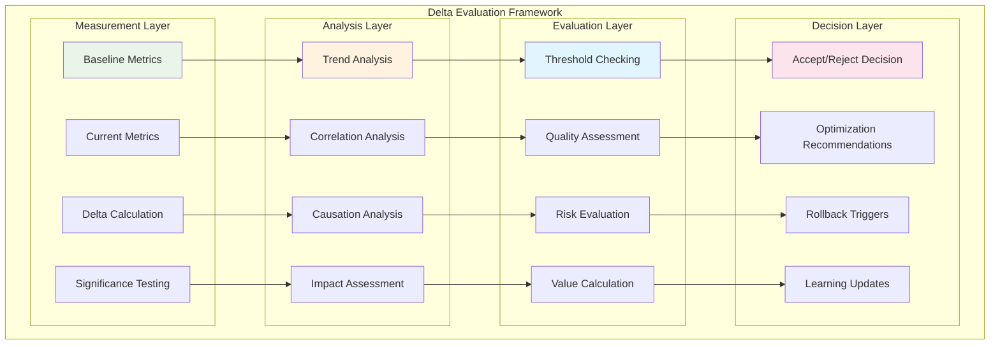
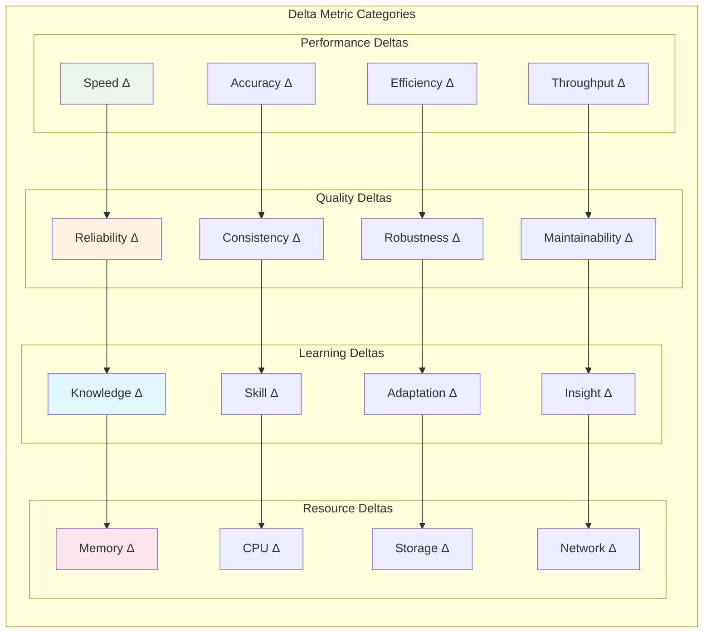
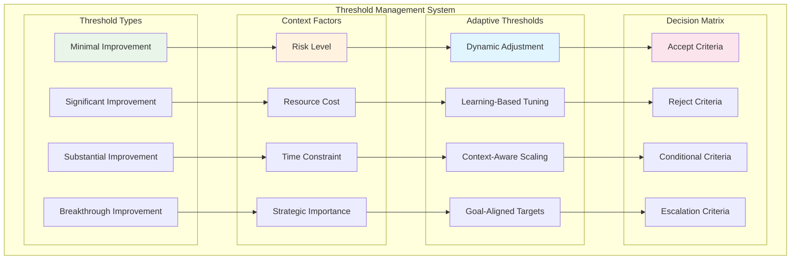

# Delta Evaluation System

The Delta Evaluation System is SAFLA's formal framework for quantifying system improvements and measuring progress toward goals. It provides mathematical rigor to the assessment of changes, ensuring that all modifications contribute positively to system performance and learning objectives.

## 📊 Delta Evaluation Overview



## 🔢 Mathematical Foundation

The delta evaluation system uses formal mathematical models to ensure objective and consistent assessment of system changes.

### Core Delta Metrics



### Delta Calculation Framework

```python
from safla.core.delta_evaluation import (
    DeltaEvaluator,
    MetricType,
    DeltaThreshold,
    EvaluationResult
)
import numpy as np
from scipy import stats
from typing import Dict, List, Optional

class DeltaCalculator:
    """Core delta calculation engine."""
    
    def __init__(self):
        self.baseline_metrics = {}
        self.current_metrics = {}
        self.thresholds = {}
    
    def calculate_performance_delta(
        self, 
        baseline: Dict[str, float], 
        current: Dict[str, float]
    ) -> Dict[str, float]:
        """Calculate performance delta metrics."""
        deltas = {}
        
        for metric_name in baseline.keys():
            if metric_name in current:
                baseline_val = baseline[metric_name]
                current_val = current[metric_name]
                
                # Calculate relative delta
                if baseline_val != 0:
                    relative_delta = (current_val - baseline_val) / baseline_val
                else:
                    relative_delta = float('inf') if current_val > 0 else 0
                
                # Calculate absolute delta
                absolute_delta = current_val - baseline_val
                
                deltas[metric_name] = {
                    'relative': relative_delta,
                    'absolute': absolute_delta,
                    'baseline': baseline_val,
                    'current': current_val,
                    'improvement': relative_delta > 0
                }
        
        return deltas
    
    def calculate_weighted_delta(
        self, 
        deltas: Dict[str, Dict], 
        weights: Dict[str, float]
    ) -> float:
        """Calculate weighted overall delta score."""
        weighted_sum = 0.0
        total_weight = 0.0
        
        for metric_name, delta_info in deltas.items():
            if metric_name in weights:
                weight = weights[metric_name]
                relative_delta = delta_info['relative']
                
                # Handle infinite deltas
                if relative_delta == float('inf'):
                    relative_delta = 1.0
                elif relative_delta == float('-inf'):
                    relative_delta = -1.0
                
                weighted_sum += weight * relative_delta
                total_weight += weight
        
        return weighted_sum / total_weight if total_weight > 0 else 0.0
    
    def calculate_statistical_significance(
        self, 
        baseline_samples: List[float], 
        current_samples: List[float],
        alpha: float = 0.05
    ) -> Dict[str, float]:
        """Calculate statistical significance of delta."""
        # Perform t-test
        t_stat, p_value = stats.ttest_ind(current_samples, baseline_samples)
        
        # Calculate effect size (Cohen's d)
        pooled_std = np.sqrt(
            ((len(baseline_samples) - 1) * np.var(baseline_samples, ddof=1) +
             (len(current_samples) - 1) * np.var(current_samples, ddof=1)) /
            (len(baseline_samples) + len(current_samples) - 2)
        )
        
        cohens_d = (np.mean(current_samples) - np.mean(baseline_samples)) / pooled_std
        
        return {
            't_statistic': t_stat,
            'p_value': p_value,
            'significant': p_value < alpha,
            'effect_size': cohens_d,
            'confidence_level': 1 - alpha
        }

# Initialize delta calculator
delta_calculator = DeltaCalculator()

# Example: Calculate memory system performance delta
baseline_memory_metrics = {
    'search_time_ms': 150.0,
    'accuracy': 0.85,
    'memory_usage_mb': 512.0,
    'throughput_ops_sec': 1000.0
}

current_memory_metrics = {
    'search_time_ms': 120.0,  # Improved
    'accuracy': 0.92,         # Improved
    'memory_usage_mb': 480.0, # Improved
    'throughput_ops_sec': 1200.0  # Improved
}

# Calculate deltas
memory_deltas = delta_calculator.calculate_performance_delta(
    baseline_memory_metrics,
    current_memory_metrics
)

print("🔢 Memory System Performance Deltas:")
for metric, delta_info in memory_deltas.items():
    improvement = "↗️" if delta_info['improvement'] else "↘️"
    print(f"  {improvement} {metric}:")
    print(f"    Baseline: {delta_info['baseline']}")
    print(f"    Current: {delta_info['current']}")
    print(f"    Relative Δ: {delta_info['relative']:.2%}")
    print(f"    Absolute Δ: {delta_info['absolute']:.2f}")

# Calculate weighted overall delta
memory_weights = {
    'search_time_ms': 0.3,    # 30% weight (lower is better)
    'accuracy': 0.4,          # 40% weight (higher is better)
    'memory_usage_mb': 0.2,   # 20% weight (lower is better)
    'throughput_ops_sec': 0.1 # 10% weight (higher is better)
}

# Adjust deltas for "lower is better" metrics
adjusted_deltas = memory_deltas.copy()
for metric in ['search_time_ms', 'memory_usage_mb']:
    if metric in adjusted_deltas:
        adjusted_deltas[metric]['relative'] *= -1  # Invert for "lower is better"

overall_delta = delta_calculator.calculate_weighted_delta(
    adjusted_deltas,
    memory_weights
)

print(f"\n📊 Overall Memory System Delta: {overall_delta:.2%}")
```

## 🎯 Threshold Management

The threshold management system defines acceptance criteria for different types of changes and improvements.

### Threshold Framework



### Threshold Implementation

```python
from safla.core.delta_evaluation import ThresholdManager, ThresholdType, Context

class AdaptiveThresholdManager:
    """Manages adaptive thresholds for delta evaluation."""
    
    def __init__(self):
        self.base_thresholds = {
            ThresholdType.MINIMAL: 0.01,      # 1% improvement
            ThresholdType.SIGNIFICANT: 0.05,   # 5% improvement
            ThresholdType.SUBSTANTIAL: 0.15,   # 15% improvement
            ThresholdType.BREAKTHROUGH: 0.30   # 30% improvement
        }
        self.context_modifiers = {}
        self.learning_history = []
    
    def calculate_adaptive_threshold(
        self, 
        base_threshold: float, 
        context: Context
    ) -> float:
        """Calculate context-aware adaptive threshold."""
        adaptive_threshold = base_threshold
        
        # Risk-based adjustment
        risk_modifier = self._calculate_risk_modifier(context.risk_level)
        adaptive_threshold *= risk_modifier
        
        # Resource-based adjustment
        resource_modifier = self._calculate_resource_modifier(context.resource_availability)
        adaptive_threshold *= resource_modifier
        
        # Time-based adjustment
        time_modifier = self._calculate_time_modifier(context.time_pressure)
        adaptive_threshold *= time_modifier
        
        # Strategic importance adjustment
        strategic_modifier = self._calculate_strategic_modifier(context.strategic_importance)
        adaptive_threshold *= strategic_modifier
        
        # Learning-based adjustment
        learning_modifier = self._calculate_learning_modifier(context.component)
        adaptive_threshold *= learning_modifier
        
        return max(0.001, adaptive_threshold)  # Minimum 0.1% threshold
    
    def _calculate_risk_modifier(self, risk_level: float) -> float:
        """Calculate risk-based threshold modifier."""
        # Higher risk requires higher improvement threshold
        return 1.0 + (risk_level * 0.5)
    
    def _calculate_resource_modifier(self, resource_availability: float) -> float:
        """Calculate resource-based threshold modifier."""
        # Lower resource availability requires higher improvement threshold
        return 1.0 + ((1.0 - resource_availability) * 0.3)
    
    def _calculate_time_modifier(self, time_pressure: float) -> float:
        """Calculate time-based threshold modifier."""
        # Higher time pressure allows lower improvement threshold
        return 1.0 - (time_pressure * 0.2)
    
    def _calculate_strategic_modifier(self, strategic_importance: float) -> float:
        """Calculate strategic importance modifier."""
        # Higher strategic importance allows lower improvement threshold
        return 1.0 - (strategic_importance * 0.3)
    
    def _calculate_learning_modifier(self, component: str) -> float:
        """Calculate learning-based modifier from historical performance."""
        # Analyze historical improvement patterns for this component
        component_history = [
            h for h in self.learning_history 
            if h.get('component') == component
        ]
        
        if len(component_history) < 5:
            return 1.0  # Not enough history
        
        # Calculate average improvement rate
        avg_improvement = np.mean([h['delta'] for h in component_history[-10:]])
        
        # Adjust threshold based on component's improvement capability
        if avg_improvement > 0.1:  # High-performing component
            return 0.8  # Lower threshold
        elif avg_improvement < 0.02:  # Low-performing component
            return 1.2  # Higher threshold
        else:
            return 1.0  # Standard threshold

# Initialize threshold manager
threshold_manager = AdaptiveThresholdManager()

# Define evaluation context
evaluation_context = Context(
    risk_level=0.3,              # Medium risk
    resource_availability=0.7,   # Good resource availability
    time_pressure=0.4,           # Moderate time pressure
    strategic_importance=0.8,    # High strategic importance
    component="memory_system"
)

# Calculate adaptive thresholds
adaptive_thresholds = {}
for threshold_type, base_value in threshold_manager.base_thresholds.items():
    adaptive_threshold = threshold_manager.calculate_adaptive_threshold(
        base_value, 
        evaluation_context
    )
    adaptive_thresholds[threshold_type] = adaptive_threshold

print("🎯 Adaptive Thresholds for Memory System:")
for threshold_type, value in adaptive_thresholds.items():
    print(f"  {threshold_type.name}: {value:.2%}")

# Evaluate delta against thresholds
def evaluate_delta_significance(delta_value: float, thresholds: Dict) -> str:
    """Evaluate the significance level of a delta."""
    if delta_value >= thresholds[ThresholdType.BREAKTHROUGH]:
        return "BREAKTHROUGH"
    elif delta_value >= thresholds[ThresholdType.SUBSTANTIAL]:
        return "SUBSTANTIAL"
    elif delta_value >= thresholds[ThresholdType.SIGNIFICANT]:
        return "SIGNIFICANT"
    elif delta_value >= thresholds[ThresholdType.MINIMAL]:
        return "MINIMAL"
    else:
        return "INSUFFICIENT"

# Evaluate our memory system delta
significance_level = evaluate_delta_significance(overall_delta, adaptive_thresholds)
print(f"\n📈 Delta Significance Level: {significance_level}")
```

## 🔍 Multi-Dimensional Analysis

The delta evaluation system performs comprehensive multi-dimensional analysis to understand the full impact of changes.

### Analysis Framework

```python
from safla.core.delta_evaluation import MultiDimensionalAnalyzer
import pandas as pd
import matplotlib.pyplot as plt
from sklearn.decomposition import PCA
from sklearn.cluster import KMeans

class ComprehensiveDeltaAnalyzer:
    """Comprehensive multi-dimensional delta analysis."""
    
    def __init__(self):
        self.analysis_dimensions = [
            'performance',
            'quality',
            'efficiency',
            'reliability',
            'maintainability',
            'scalability',
            'security',
            'usability'
        ]
    
    def perform_dimensional_analysis(
        self, 
        baseline_metrics: Dict, 
        current_metrics: Dict
    ) -> Dict[str, Dict]:
        """Perform analysis across multiple dimensions."""
        dimensional_analysis = {}
        
        for dimension in self.analysis_dimensions:
            dimension_metrics = self._extract_dimension_metrics(
                dimension, 
                baseline_metrics, 
                current_metrics
            )
            
            if dimension_metrics:
                dimensional_analysis[dimension] = self._analyze_dimension(
                    dimension_metrics
                )
        
        return dimensional_analysis
    
    def _extract_dimension_metrics(
        self, 
        dimension: str, 
        baseline: Dict, 
        current: Dict
    ) -> Dict:
        """Extract metrics relevant to a specific dimension."""
        dimension_mapping = {
            'performance': ['speed', 'throughput', 'latency', 'response_time'],
            'quality': ['accuracy', 'precision', 'recall', 'f1_score'],
            'efficiency': ['cpu_usage', 'memory_usage', 'energy_consumption'],
            'reliability': ['uptime', 'error_rate', 'failure_rate', 'mtbf'],
            'maintainability': ['code_complexity', 'test_coverage', 'documentation'],
            'scalability': ['concurrent_users', 'data_volume', 'load_capacity'],
            'security': ['vulnerability_count', 'security_score', 'compliance'],
            'usability': ['user_satisfaction', 'task_completion_rate', 'ease_of_use']
        }
        
        relevant_keywords = dimension_mapping.get(dimension, [])
        dimension_metrics = {}
        
        for metric_name in baseline.keys():
            if any(keyword in metric_name.lower() for keyword in relevant_keywords):
                if metric_name in current:
                    dimension_metrics[metric_name] = {
                        'baseline': baseline[metric_name],
                        'current': current[metric_name]
                    }
        
        return dimension_metrics
    
    def _analyze_dimension(self, dimension_metrics: Dict) -> Dict:
        """Analyze a specific dimension."""
        deltas = []
        improvements = 0
        degradations = 0
        
        for metric_name, values in dimension_metrics.items():
            baseline = values['baseline']
            current = values['current']
            
            if baseline != 0:
                delta = (current - baseline) / baseline
            else:
                delta = 1.0 if current > 0 else 0.0
            
            deltas.append(delta)
            
            if delta > 0:
                improvements += 1
            elif delta < 0:
                degradations += 1
        
        return {
            'metric_count': len(dimension_metrics),
            'improvements': improvements,
            'degradations': degradations,
            'average_delta': np.mean(deltas) if deltas else 0.0,
            'delta_std': np.std(deltas) if deltas else 0.0,
            'overall_trend': 'positive' if np.mean(deltas) > 0 else 'negative'
        }
    
    def generate_delta_report(
        self, 
        dimensional_analysis: Dict[str, Dict]
    ) -> str:
        """Generate comprehensive delta analysis report."""
        report = "📊 Multi-Dimensional Delta Analysis Report\n"
        report += "=" * 50 + "\n\n"
        
        overall_score = 0.0
        total_dimensions = len(dimensional_analysis)
        
        for dimension, analysis in dimensional_analysis.items():
            report += f"🔍 {dimension.upper()} DIMENSION:\n"
            report += f"   Metrics Analyzed: {analysis['metric_count']}\n"
            report += f"   Improvements: {analysis['improvements']}\n"
            report += f"   Degradations: {analysis['degradations']}\n"
            report += f"   Average Delta: {analysis['average_delta']:.2%}\n"
            report += f"   Trend: {analysis['overall_trend']}\n"
            
            # Calculate dimension score
            dimension_score = analysis['average_delta']
            overall_score += dimension_score
            
            if analysis['overall_trend'] == 'positive':
                report += "   ✅ Overall improvement detected\n"
            else:
                report += "   ⚠️ Overall degradation detected\n"
            
            report += "\n"
        
        # Calculate overall assessment
        overall_score /= total_dimensions
        report += f"🎯 OVERALL ASSESSMENT:\n"
        report += f"   Overall Delta Score: {overall_score:.2%}\n"
        
        if overall_score > 0.05:
            report += "   🚀 Significant overall improvement\n"
        elif overall_score > 0.01:
            report += "   📈 Moderate overall improvement\n"
        elif overall_score > -0.01:
            report += "   ➡️ Neutral overall impact\n"
        else:
            report += "   📉 Overall degradation detected\n"
        
        return report

# Perform comprehensive analysis
analyzer = ComprehensiveDeltaAnalyzer()

# Extended metrics for comprehensive analysis
comprehensive_baseline = {
    'search_speed_ms': 150.0,
    'accuracy_score': 0.85,
    'memory_usage_mb': 512.0,
    'cpu_usage_percent': 45.0,
    'error_rate_percent': 2.5,
    'uptime_percent': 99.2,
    'throughput_ops_sec': 1000.0,
    'response_time_ms': 200.0,
    'user_satisfaction_score': 7.2,
    'security_score': 8.5
}

comprehensive_current = {
    'search_speed_ms': 120.0,
    'accuracy_score': 0.92,
    'memory_usage_mb': 480.0,
    'cpu_usage_percent': 42.0,
    'error_rate_percent': 1.8,
    'uptime_percent': 99.7,
    'throughput_ops_sec': 1200.0,
    'response_time_ms': 180.0,
    'user_satisfaction_score': 8.1,
    'security_score': 8.8
}

# Perform dimensional analysis
dimensional_results = analyzer.perform_dimensional_analysis(
    comprehensive_baseline,
    comprehensive_current
)

# Generate report
delta_report = analyzer.generate_delta_report(dimensional_results)
print(delta_report)
```

## 📈 Trend Analysis

The trend analysis component identifies patterns and trajectories in system improvements over time.

### Trend Detection

```python
from safla.core.delta_evaluation import TrendAnalyzer
from scipy.signal import savgol_filter
import numpy as np

class DeltaTrendAnalyzer:
    """Analyzes trends in delta measurements over time."""
    
    def __init__(self, window_size: int = 10):
        self.window_size = window_size
        self.historical_deltas = []
    
    def add_delta_measurement(
        self, 
        timestamp: datetime, 
        delta_value: float, 
        context: Dict
    ):
        """Add a new delta measurement to the trend analysis."""
        measurement = {
            'timestamp': timestamp,
            'delta': delta_value,
            'context': context
        }
        self.historical_deltas.append(measurement)
        
        # Keep only recent measurements for trend analysis
        if len(self.historical_deltas) > 1000:
            self.historical_deltas = self.historical_deltas[-1000:]
    
    def detect_trends(self) -> Dict[str, any]:
        """Detect trends in delta measurements."""
        if len(self.historical_deltas) < self.window_size:
            return {'trend': 'insufficient_data'}
        
        # Extract delta values and timestamps
        deltas = [m['delta'] for m in self.historical_deltas]
        timestamps = [m['timestamp'] for m in self.historical_deltas]
        
        # Convert timestamps to numeric values for analysis
        time_numeric = [(t - timestamps[0]).total_seconds() for t in timestamps]
        
        # Smooth the data using Savitzky-Golay filter
        if len(deltas) >= 5:
            smoothed_deltas = savgol_filter(deltas, min(len(deltas), 5), 2)
        else:
            smoothed_deltas = deltas
        
        # Calculate trend metrics
        trend_analysis = {
            'trend_direction': self._calculate_trend_direction(smoothed_deltas),
            'trend_strength': self._calculate_trend_strength(smoothed_deltas),
            'volatility': self._calculate_volatility(deltas),
            'acceleration': self._calculate_acceleration(smoothed_deltas),
            'recent_performance': self._analyze_recent_performance(deltas),
            'prediction': self._predict_next_delta(time_numeric, smoothed_deltas)
        }
        
        return trend_analysis
    
    def _calculate_trend_direction(self, values: List[float]) -> str:
        """Calculate overall trend direction."""
        if len(values) < 2:
            return 'stable'
        
        # Linear regression to find trend
        x = np.arange(len(values))
        slope = np.polyfit(x, values, 1)[0]
        
        if slope > 0.001:
            return 'improving'
        elif slope < -0.001:
            return 'declining'
        else:
            return 'stable'
    
    def _calculate_trend_strength(self, values: List[float]) -> float:
        """Calculate strength of the trend (0-1)."""
        if len(values) < 2:
            return 0.0
        
        x = np.arange(len(values))
        correlation = np.corrcoef(x, values)[0, 1]
        return abs(correlation) if not np.isnan(correlation) else 0.0
    
    def _calculate_volatility(self, values: List[float]) -> float:
        """Calculate volatility in delta measurements."""
        if len(values) < 2:
            return 0.0
        
        return np.std(values)
    
    def _calculate_acceleration(self, values: List[float]) -> float:
        """Calculate acceleration in trend (second derivative)."""
        if len(values) < 3:
            return 0.0
        
        # Calculate second differences
        first_diff = np.diff(values)
        second_diff = np.diff(first_diff)
        
        return np.mean(second_diff)
    
    def _analyze_recent_performance(self, values: List[float]) -> Dict:
        """Analyze recent performance compared to historical average."""
        if len(values) < self.window_size:
            return {'status': 'insufficient_data'}
        
        recent_values = values[-self.window_size//2:]
        historical_values = values[:-self.window_size//2]
        
        recent_avg = np.mean(recent_values)
        historical_avg = np.mean(historical_values)
        
        improvement = (recent_avg - historical_avg) / abs(historical_avg) if historical_avg != 0 else 0
        
        return {
            'recent_average': recent_avg,
            'historical_average': historical_avg,
            'improvement': improvement,
            'status': 'improving' if improvement > 0.05 else 'stable' if improvement > -0.05 else 'declining'
        }
    
    def _predict_next_delta(self, time_values: List[float], delta_values: List[float]) -> Dict:
        """Predict next delta value based on trend."""
        if len(delta_values) < 3:
            return {'prediction': None, 'confidence': 0.0}
        
        # Simple linear extrapolation
        x = np.array(time_values[-5:])  # Use last 5 points
        y = np.array(delta_values[-5:])
        
        # Fit linear model
        coeffs = np.polyfit(x, y, 1)
        
        # Predict next value
        next_time = time_values[-1] + (time_values[-1] - time_values[-2])
        predicted_delta = np.polyval(coeffs, next_time)
        
        # Calculate confidence based on recent trend consistency
        recent_errors = []
        for i in range(len(x)-1):
            predicted = np.polyval(coeffs, x[i])
            actual = y[i]
            recent_errors.append(abs(predicted - actual))
        
        confidence = max(0.0, 1.0 - np.mean(recent_errors)) if recent_errors else 0.5
        
        return {
            'prediction': predicted_delta,
            'confidence': confidence,
            'trend_slope': coeffs[0]
        }

# Initialize trend analyzer
trend_analyzer = DeltaTrendAnalyzer()

# Simulate historical delta measurements
import random
from datetime import datetime, timedelta

base_time = datetime.utcnow() - timedelta(days=30)
for i in range(100):
    # Simulate improving trend with some noise
    trend_component = 0.001 * i  # Gradual improvement
    noise_component = random.gauss(0, 0.01)  # Random noise
    delta_value = 0.02 + trend_component + noise_component
    
    measurement_time = base_time + timedelta(hours=i*6)
    context = {'component': 'memory_system', 'load': random.uniform(0.3, 0.8)}
    
    trend_analyzer.add_delta_measurement(measurement_time, delta_value, context)

# Analyze trends
trend_results = trend_analyzer.detect_trends()

print("📈 Delta Trend Analysis:")
print(f"   Trend Direction: {trend_results['trend_direction']}")
print(f"   Trend Strength: {trend_results['trend_strength']:.3f}")
print(f"   Volatility: {trend_results['volatility']:.3f}")
print(f"   Acceleration: {trend_results['acceleration']:.6f}")
print(f"   Recent Performance: {trend_results['recent_performance']['status']}")
print(f"   Next Delta Prediction: {trend_results['prediction']['prediction']:.3f}")
print(f"   Prediction Confidence: {trend_results['prediction']['confidence']:.2%}")
```

## 🎯 Decision Framework

The decision framework uses delta evaluation results to make informed decisions about system changes.

### Decision Matrix

```python
from safla.core.delta_evaluation import DecisionFramework, Decision, DecisionType

class DeltaDecisionFramework:
    """Framework for making decisions based on delta evaluation."""
    
    def __init__(self):
        self.decision_rules = self._initialize_decision_rules()
        self.decision_history = []
    
    def _initialize_decision_rules(self) -> Dict:
        """Initialize decision rules for different scenarios."""
        return {
            'accept_improvement': {
                'conditions': [
                    lambda delta, context: delta >= context.get('min_threshold', 0.01),
                    lambda delta, context: context.get('risk_level', 0.5) <= 0.7,
                    lambda delta, context: context.get('resource_cost', 0.5) <= 0.8
                ],
                'action': DecisionType.ACCEPT,
                'confidence_weight': 1.0
            },
            'conditional_accept': {
                'conditions': [
                    lambda delta, context: delta >= context.get('min_threshold', 0.01) * 0.5,
                    lambda delta, context: context.get('strategic_importance', 0.5) >= 0.7,
                    lambda delta, context: context.get('risk_level', 0.5) <= 0.5
                ],
                'action': DecisionType.CONDITIONAL_ACCEPT,
                'confidence_weight': 0.7
            },
            'reject_insufficient': {
                'conditions': [
                    lambda delta, context: delta < context.get('min_threshold', 0.01) * 0.5,
                    lambda delta, context: context.get('risk_level', 0.5) > 0.8
                ],
                'action': DecisionType.REJECT,
                'confidence_weight': 0.9
            },
            'escalate_decision': {
                'conditions': [
                    lambda delta, context: context.get('strategic_importance', 0.5) >= 0.9,
                    lambda delta, context: context.get('resource_cost', 0.5) >= 0.9
                ],
                'action': DecisionType.ESCALATE,
                'confidence_weight': 0.8
            }
        }
    
    def make_decision(
        self, 
        delta_value: float, 
        context: Dict, 
        trend_analysis: Dict
    ) -> Decision:
        """Make a decision based on delta evaluation."""
        
        # Evaluate all decision rules
        rule_matches = []
        
        for rule_name, rule_config in self.decision_rules.items():
            conditions = rule_config['conditions']
            
            # Check if all conditions are met
            conditions_met = all(
                condition(delta_value, context) 
                for condition in conditions
            )
            
            if conditions_met:
                rule_matches.append({
                    'rule': rule_name,
                    'action': rule_config['action'],
                    'confidence': rule_config['confidence_weight']
                })
        
        # Select best matching rule
        if rule_matches:
            # Sort by confidence and select highest
            best_match = max(rule_matches, key=lambda x: x['confidence'])
            decision_action = best_match['action']
            decision_confidence = best_match['confidence']
            decision_reasoning = f"Rule: {best_match['rule']}"
        else:
            # Default decision
            decision_action = DecisionType.REVIEW
            decision_confidence = 0.5
            decision_reasoning = "No matching rules, requires manual review"
        
        # Adjust confidence based on trend analysis
        trend_adjustment = self._calculate_trend_adjustment(trend_analysis)
        adjusted_confidence = min(1.0, decision_confidence * trend_adjustment)
        
        # Create decision object
        decision = Decision(
            action=decision_action,
            confidence=adjusted_confidence,
            reasoning=decision_reasoning,
            delta_value=delta_value,
            context=context,
            trend_analysis=trend_analysis,
            timestamp=datetime.utcnow()
        )
        
        # Record decision
        self.decision_history.append(decision)
        
        return decision
    
    def _calculate_trend_adjustment(self, trend_analysis: Dict) -> float:
        """Calculate confidence adjustment based on trend analysis."""
        adjustment = 1.0
        
        # Positive trend increases confidence
        if trend_analysis.get('trend_direction') == 'improving':
            adjustment *= 1.1
        elif trend_analysis.get('trend_direction') == 'declining':
            adjustment *= 0.9
        
        # Strong trend increases confidence
        trend_strength = trend_analysis.get('trend_strength', 0.5)
        adjustment *= (0.8 + 0.4 * trend_strength)
        
        # Low volatility increases confidence
        volatility = trend_analysis.get('volatility', 0.1)
        adjustment *= (1.2 - volatility)
        
        return max(0.1, min(1.5, adjustment))
    
    def get_decision_summary(self) -> Dict:
        """Get summary of recent decisions."""
        if not self.decision_history:
            return {'status': 'no_decisions'}
        
        recent_decisions = self.decision_history[-20:]  # Last 20 decisions
        
        action_counts = {}
        total_confidence = 0.0
        
        for decision in recent_decisions:
            action = decision.action.value
            action_counts[action] = action_counts.get(action, 0) + 1
            total_confidence += decision.confidence
        
        return {
            'total_decisions': len(recent_decisions),
            'action_distribution': action_counts,
            'average_confidence': total_confidence / len(recent_decisions),
            'most_common_action': max(action_counts.items(), key=lambda x: x[1])[0],
            'decision_quality': self._assess_decision_quality(recent_decisions)
        }
    
    def _assess_decision_quality(self, decisions: List[Decision]) -> str:
        """Assess the quality of recent decisions."""
        avg_confidence = np.mean([d.confidence for d in decisions])
        
        if avg_confidence >= 0.8:
            return 'high_quality'
        elif avg_confidence >= 0.6:
            return 'good_quality'
        elif avg_confidence >= 0.4:
            return 'moderate_quality'
        else:
            return 'low_quality'

# Initialize decision framework
decision_framework = DeltaDecisionFramework()

# Make decision based on our analysis
decision_context = {
    'min_threshold': adaptive_thresholds[ThresholdType.MINIMAL],
    'risk_level': 0.3,
    'resource_cost': 0.4,
    'strategic_importance': 0.8,
    'component': 'memory_system'
}

final_decision = decision_framework.make_decision(
    delta_value=overall_delta,
    context=decision_context,
    trend_analysis=trend_results
)

print(f"\n🎯 Final Decision: {final_decision.action.value}")
print(f"   Confidence: {final_decision.confidence:.2%}")
print(f"   Reasoning: {final_decision.reasoning}")
print(f"   Delta Value: {final_decision.delta_value:.2%}")

# Get decision summary
decision_summary = decision_framework.get_decision_summary()
print(f"\n📊 Decision Summary:")
print(f"   Total Decisions: {decision_summary.get('total_decisions', 0)}")
print(f"   Average Confidence: {decision_summary.get('average_confidence', 0):.2%}")
print(f"   Decision Quality: {decision_summary.get('decision_quality', 'unknown')}")
```

---

**Next**: [MCP Integration](09-mcp-integration.md) - Model Context Protocol integration  
**Previous**: [Safety & Validation](07-safety-validation.md) - Comprehensive safety framework