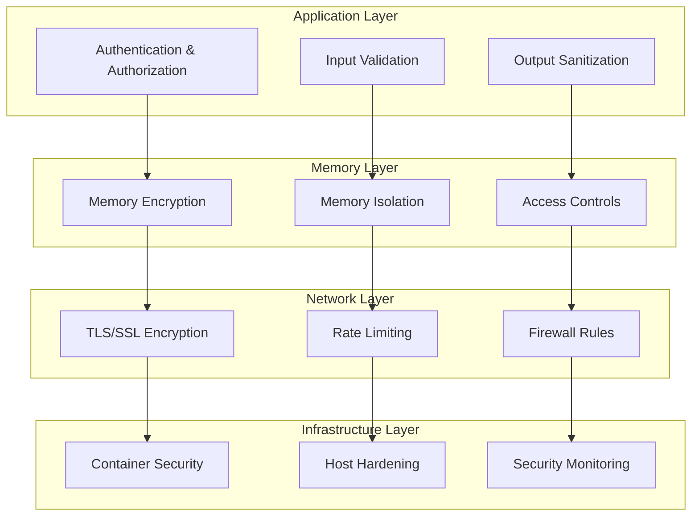

# Security Considerations

## Overview

SAFLA implements comprehensive security measures to protect sensitive data, ensure secure memory operations, and maintain system integrity. This guide covers security best practices, threat modeling, authentication mechanisms, and mitigation strategies for common security vulnerabilities.

## Table of Contents

- [Security Architecture](#security-architecture)
- [Authentication and Authorization](#authentication-and-authorization)
- [Data Protection](#data-protection)
- [Memory Security](#memory-security)
- [Network Security](#network-security)
- [MCP Security](#mcp-security)
- [Threat Modeling](#threat-modeling)
- [Security Best Practices](#security-best-practices)
- [Compliance and Auditing](#compliance-and-auditing)
- [Incident Response](#incident-response)

## Security Architecture

### Defense in Depth

SAFLA implements a multi-layered security approach:



### Security Zones

SAFLA operates with distinct security zones:

1. **Public Zone**: External interfaces and APIs
2. **DMZ Zone**: MCP orchestration and agent coordination
3. **Internal Zone**: Core memory systems and meta-cognitive engine
4. **Secure Zone**: Sensitive data and cryptographic operations

## Authentication and Authorization

### Multi-Factor Authentication

```typescript
// auth/mfa-provider.ts
import speakeasy from 'speakeasy';
import QRCode from 'qrcode';

export class MFAProvider {
  generateSecret(user: string, service: string = 'SAFLA') {
    return speakeasy.generateSecret({
      name: `${service}:${user}`,
      issuer: service,
      length: 32,
    });
  }

  async generateQRCode(secret: speakeasy.GeneratedSecret): Promise<string> {
    return await QRCode.toDataURL(secret.otpauth_url!);
  }

  verifyToken(token: string, secret: string): boolean {
    return speakeasy.totp.verify({
      secret,
      token,
      window: 2, // Allow 2 time steps of variance
    });
  }

  generateBackupCodes(): string[] {
    const codes: string[] = [];
    for (let i = 0; i < 10; i++) {
      codes.push(this.generateSecureCode(8));
    }
    return codes;
  }

  private generateSecureCode(length: number): string {
    const chars = 'ABCDEFGHIJKLMNOPQRSTUVWXYZ0123456789';
    let result = '';
    for (let i = 0; i < length; i++) {
      result += chars.charAt(Math.floor(Math.random() * chars.length));
    }
    return result;
  }
}
```

### Role-Based Access Control (RBAC)

```typescript
// auth/rbac-system.ts
export enum Permission {
  READ_MEMORY = 'memory:read',
  WRITE_MEMORY = 'memory:write',
  DELETE_MEMORY = 'memory:delete',
  MANAGE_AGENTS = 'agents:manage',
  VIEW_METRICS = 'metrics:view',
  ADMIN_SYSTEM = 'system:admin',
}

export enum Role {
  VIEWER = 'viewer',
  OPERATOR = 'operator',
  ADMIN = 'admin',
  SUPER_ADMIN = 'super_admin',
}

export class RBACSystem {
  private rolePermissions: Map<Role, Permission[]> = new Map([
    [Role.VIEWER, [Permission.READ_MEMORY, Permission.VIEW_METRICS]],
    [Role.OPERATOR, [
      Permission.READ_MEMORY,
      Permission.WRITE_MEMORY,
      Permission.VIEW_METRICS,
      Permission.MANAGE_AGENTS,
    ]],
    [Role.ADMIN, [
      Permission.READ_MEMORY,
      Permission.WRITE_MEMORY,
      Permission.DELETE_MEMORY,
      Permission.MANAGE_AGENTS,
      Permission.VIEW_METRICS,
    ]],
    [Role.SUPER_ADMIN, Object.values(Permission)],
  ]);

  private userRoles: Map<string, Role[]> = new Map();

  assignRole(userId: string, role: Role): void {
    const roles = this.userRoles.get(userId) || [];
    if (!roles.includes(role)) {
      roles.push(role);
      this.userRoles.set(userId, roles);
    }
  }

  revokeRole(userId: string, role: Role): void {
    const roles = this.userRoles.get(userId) || [];
    const index = roles.indexOf(role);
    if (index > -1) {
      roles.splice(index, 1);
      this.userRoles.set(userId, roles);
    }
  }

  hasPermission(userId: string, permission: Permission): boolean {
    const userRoles = this.userRoles.get(userId) || [];
    
    for (const role of userRoles) {
      const permissions = this.rolePermissions.get(role) || [];
      if (permissions.includes(permission)) {
        return true;
      }
    }
    
    return false;
  }

  getUserPermissions(userId: string): Permission[] {
    const userRoles = this.userRoles.get(userId) || [];
    const permissions = new Set<Permission>();
    
    for (const role of userRoles) {
      const rolePermissions = this.rolePermissions.get(role) || [];
      rolePermissions.forEach(p => permissions.add(p));
    }
    
    return Array.from(permissions);
  }
}
```

### JWT Token Management

```typescript
// auth/jwt-manager.ts
import jwt from 'jsonwebtoken';
import crypto from 'crypto';

export interface TokenPayload {
  userId: string;
  roles: Role[];
  permissions: Permission[];
  sessionId: string;
  iat: number;
  exp: number;
}

export class JWTManager {
  private accessTokenSecret: string;
  private refreshTokenSecret: string;
  private accessTokenExpiry = '15m';
  private refreshTokenExpiry = '7d';

  constructor(accessSecret: string, refreshSecret: string) {
    this.accessTokenSecret = accessSecret;
    this.refreshTokenSecret = refreshSecret;
  }

  generateTokenPair(payload: Omit<TokenPayload, 'iat' | 'exp'>): {
    accessToken: string;
    refreshToken: string;
  } {
    const accessToken = jwt.sign(payload, this.accessTokenSecret, {
      expiresIn: this.accessTokenExpiry,
    });

    const refreshToken = jwt.sign(
      { userId: payload.userId, sessionId: payload.sessionId },
      this.refreshTokenSecret,
      { expiresIn: this.refreshTokenExpiry }
    );

    return { accessToken, refreshToken };
  }

  verifyAccessToken(token: string): TokenPayload {
    return jwt.verify(token, this.accessTokenSecret) as TokenPayload;
  }

  verifyRefreshToken(token: string): { userId: string; sessionId: string } {
    return jwt.verify(token, this.refreshTokenSecret) as {
      userId: string;
      sessionId: string;
    };
  }

  generateSessionId(): string {
    return crypto.randomBytes(32).toString('hex');
  }

  revokeSession(sessionId: string): void {
    // Implementation would typically involve a blacklist or database update
    // For now, we'll use an in-memory store
    this.revokedSessions.add(sessionId);
  }

  private revokedSessions = new Set<string>();

  isSessionRevoked(sessionId: string): boolean {
    return this.revokedSessions.has(sessionId);
  }
}
```

## Data Protection

### Encryption at Rest

```typescript
// security/encryption.ts
import crypto from 'crypto';
import { promisify } from 'util';

export class EncryptionService {
  private algorithm = 'aes-256-gcm';
  private keyDerivationIterations = 100000;

  async encryptData(data: string, password: string): Promise<{
    encrypted: string;
    salt: string;
    iv: string;
    tag: string;
  }> {
    const salt = crypto.randomBytes(32);
    const iv = crypto.randomBytes(16);
    
    const key = await this.deriveKey(password, salt);
    const cipher = crypto.createCipherGCM(this.algorithm, key, iv);
    
    let encrypted = cipher.update(data, 'utf8', 'hex');
    encrypted += cipher.final('hex');
    
    const tag = cipher.getAuthTag();
    
    return {
      encrypted,
      salt: salt.toString('hex'),
      iv: iv.toString('hex'),
      tag: tag.toString('hex'),
    };
  }

  async decryptData(
    encrypted: string,
    password: string,
    salt: string,
    iv: string,
    tag: string
  ): Promise<string> {
    const key = await this.deriveKey(password, Buffer.from(salt, 'hex'));
    const decipher = crypto.createDecipherGCM(
      this.algorithm,
      key,
      Buffer.from(iv, 'hex')
    );
    
    decipher.setAuthTag(Buffer.from(tag, 'hex'));
    
    let decrypted = decipher.update(encrypted, 'hex', 'utf8');
    decrypted += decipher.final('utf8');
    
    return decrypted;
  }

  private async deriveKey(password: string, salt: Buffer): Promise<Buffer> {
    const pbkdf2 = promisify(crypto.pbkdf2);
    return await pbkdf2(password, salt, this.keyDerivationIterations, 32, 'sha256');
  }

  generateSecurePassword(length: number = 32): string {
    const charset = 'ABCDEFGHIJKLMNOPQRSTUVWXYZabcdefghijklmnopqrstuvwxyz0123456789!@#$%^&*';
    let password = '';
    
    for (let i = 0; i < length; i++) {
      password += charset.charAt(crypto.randomInt(0, charset.length));
    }
    
    return password;
  }

  hashPassword(password: string): Promise<string> {
    return new Promise((resolve, reject) => {
      const salt = crypto.randomBytes(16);
      crypto.pbkdf2(password, salt, this.keyDerivationIterations, 64, 'sha256', (err, derivedKey) => {
        if (err) reject(err);
        else resolve(salt.toString('hex') + ':' + derivedKey.toString('hex'));
      });
    });
  }

  verifyPassword(password: string, hash: string): Promise<boolean> {
    return new Promise((resolve, reject) => {
      const [salt, key] = hash.split(':');
      crypto.pbkdf2(password, Buffer.from(salt, 'hex'), this.keyDerivationIterations, 64, 'sha256', (err, derivedKey) => {
        if (err) reject(err);
        else resolve(key === derivedKey.toString('hex'));
      });
    });
  }
}
```

### Data Sanitization

```typescript
// security/sanitization.ts
import DOMPurify from 'isomorphic-dompurify';
import validator from 'validator';

export class DataSanitizer {
  sanitizeHTML(input: string): string {
    return DOMPurify.sanitize(input, {
      ALLOWED_TAGS: ['b', 'i', 'em', 'strong', 'p', 'br'],
      ALLOWED_ATTR: [],
    });
  }

  sanitizeSQL(input: string): string {
    // Remove SQL injection patterns
    return input
      .replace(/['";\\]/g, '') // Remove quotes and backslashes
      .replace(/\b(SELECT|INSERT|UPDATE|DELETE|DROP|CREATE|ALTER|EXEC|UNION|SCRIPT)\b/gi, '') // Remove SQL keywords
      .trim();
  }

  validateEmail(email: string): boolean {
    return validator.isEmail(email);
  }

  validateURL(url: string): boolean {
    return validator.isURL(url, {
      protocols: ['http', 'https'],
      require_protocol: true,
    });
  }

  sanitizeFilename(filename: string): string {
    return filename
      .replace(/[^a-zA-Z0-9.-]/g, '_') // Replace special chars with underscore
      .replace(/\.{2,}/g, '.') // Replace multiple dots with single dot
      .substring(0, 255); // Limit length
  }

  validateInput(input: any, schema: any): { isValid: boolean; errors: string[] } {
    const errors: string[] = [];
    
    // Basic validation logic
    if (schema.required && !input) {
      errors.push('Field is required');
    }
    
    if (schema.type === 'string' && typeof input !== 'string') {
      errors.push('Field must be a string');
    }
    
    if (schema.type === 'number' && typeof input !== 'number') {
      errors.push('Field must be a number');
    }
    
    if (schema.minLength && input.length < schema.minLength) {
      errors.push(`Field must be at least ${schema.minLength} characters`);
    }
    
    if (schema.maxLength && input.length > schema.maxLength) {
      errors.push(`Field must be no more than ${schema.maxLength} characters`);
    }
    
    return {
      isValid: errors.length === 0,
      errors,
    };
  }
}
```

## Memory Security

### Memory Isolation

```typescript
// security/memory-isolation.ts
export class MemoryIsolationManager {
  private memoryZones: Map<string, MemoryZone> = new Map();
  private accessPolicies: Map<string, AccessPolicy> = new Map();

  createMemoryZone(zoneId: string, config: MemoryZoneConfig): void {
    const zone = new MemoryZone(zoneId, config);
    this.memoryZones.set(zoneId, zone);
    
    // Set default access policy
    this.accessPolicies.set(zoneId, {
      allowedUsers: config.allowedUsers || [],
      allowedRoles: config.allowedRoles || [],
      encryptionRequired: config.encryptionRequired || false,
      auditRequired: config.auditRequired || true,
    });
  }

  accessMemory(
    zoneId: string,
    userId: string,
    operation: 'read' | 'write' | 'delete',
    data?: any
  ): Promise<any> {
    const zone = this.memoryZones.get(zoneId);
    const policy = this.accessPolicies.get(zoneId);
    
    if (!zone || !policy) {
      throw new Error(`Memory zone ${zoneId} not found`);
    }
    
    // Check access permissions
    if (!this.hasAccess(userId, policy)) {
      throw new Error('Access denied');
    }
    
    // Audit the access
    if (policy.auditRequired) {
      this.auditAccess(zoneId, userId, operation);
    }
    
    // Perform the operation
    return zone.performOperation(operation, data);
  }

  private hasAccess(userId: string, policy: AccessPolicy): boolean {
    // Check if user is explicitly allowed
    if (policy.allowedUsers.includes(userId)) {
      return true;
    }
    
    // Check if user has required role
    const userRoles = this.getUserRoles(userId);
    return policy.allowedRoles.some(role => userRoles.includes(role));
  }

  private getUserRoles(userId: string): string[] {
    // Implementation would fetch user roles from RBAC system
    return [];
  }

  private auditAccess(zoneId: string, userId: string, operation: string): void {
    const auditEntry = {
      timestamp: new Date().toISOString(),
      zoneId,
      userId,
      operation,
      success: true,
    };
    
    // Log to audit system
    console.log('Memory access audit:', auditEntry);
  }
}

interface MemoryZoneConfig {
  allowedUsers?: string[];
  allowedRoles?: string[];
  encryptionRequired?: boolean;
  auditRequired?: boolean;
}

interface AccessPolicy {
  allowedUsers: string[];
  allowedRoles: string[];
  encryptionRequired: boolean;
  auditRequired: boolean;
}

class MemoryZone {
  constructor(
    private id: string,
    private config: MemoryZoneConfig
  ) {}

  async performOperation(operation: string, data?: any): Promise<any> {
    switch (operation) {
      case 'read':
        return this.readData();
      case 'write':
        return this.writeData(data);
      case 'delete':
        return this.deleteData();
      default:
        throw new Error(`Unsupported operation: ${operation}`);
    }
  }

  private async readData(): Promise<any> {
    // Implementation for reading data
    return {};
  }

  private async writeData(data: any): Promise<void> {
    // Implementation for writing data
  }

  private async deleteData(): Promise<void> {
    // Implementation for deleting data
  }
}
```

## Network Security

### TLS Configuration

```typescript
// security/tls-config.ts
import https from 'https';
import fs from 'fs';

export class TLSManager {
  createSecureServer(options: {
    certPath: string;
    keyPath: string;
    caPath?: string;
    ciphers?: string;
    minVersion?: string;
  }) {
    const tlsOptions: https.ServerOptions = {
      cert: fs.readFileSync(options.certPath),
      key: fs.readFileSync(options.keyPath),
      
      // Strong cipher suites
      ciphers: options.ciphers || [
        'ECDHE-RSA-AES128-GCM-SHA256',
        'ECDHE-RSA-AES256-GCM-SHA384',
        'ECDHE-RSA-AES128-SHA256',
        'ECDHE-RSA-AES256-SHA384',
      ].join(':'),
      
      // Minimum TLS version
      secureProtocol: 'TLSv1_2_method',
      minVersion: options.minVersion || 'TLSv1.2',
      
      // Security headers
      honorCipherOrder: true,
      
      // Client certificate verification (if CA provided)
      ...(options.caPath && {
        ca: fs.readFileSync(options.caPath),
        requestCert: true,
        rejectUnauthorized: true,
      }),
    };

    return https.createServer(tlsOptions);
  }

  validateCertificate(cert: string): {
    isValid: boolean;
    expiresAt: Date;
    issuer: string;
    subject: string;
  } {
    // Certificate validation logic
    const now = new Date();
    const expiresAt = new Date(now.getTime() + 365 * 24 * 60 * 60 * 1000); // 1 year from now
    
    return {
      isValid: true,
      expiresAt,
      issuer: 'SAFLA CA',
      subject: 'SAFLA Server',
    };
  }
}
```

### Rate Limiting

```typescript
// security/rate-limiter.ts
import { RateLimiterRedis } from 'rate-limiter-flexible';
import Redis from 'ioredis';

export class RateLimitManager {
  private limiters: Map<string, RateLimiterRedis> = new Map();
  private redis: Redis;

  constructor(redisUrl: string) {
    this.redis = new Redis(redisUrl);
    this.setupDefaultLimiters();
  }

  private setupDefaultLimiters(): void {
    // API rate limiter
    this.limiters.set('api', new RateLimiterRedis({
      storeClient: this.redis,
      keyPrefix: 'rl_api',
      points: 100, // Number of requests
      duration: 3600, // Per hour
    }));

    // Authentication rate limiter
    this.limiters.set('auth', new RateLimiterRedis({
      storeClient: this.redis,
      keyPrefix: 'rl_auth',
      points: 5, // Number of attempts
      duration: 900, // Per 15 minutes
      blockDuration: 900, // Block for 15 minutes
    }));

    // Memory operations rate limiter
    this.limiters.set('memory', new RateLimiterRedis({
      storeClient: this.redis,
      keyPrefix: 'rl_memory',
      points: 1000, // Number of operations
      duration: 3600, // Per hour
    }));
  }

  async checkLimit(
    limiterType: string,
    identifier: string
  ): Promise<{ allowed: boolean; remainingPoints?: number; msBeforeNext?: number }> {
    const limiter = this.limiters.get(limiterType);
    if (!limiter) {
      throw new Error(`Rate limiter ${limiterType} not found`);
    }

    try {
      const result = await limiter.consume(identifier);
      return {
        allowed: true,
        remainingPoints: result.remainingPoints,
        msBeforeNext: result.msBeforeNext,
      };
    } catch (rejRes: any) {
      return {
        allowed: false,
        remainingPoints: rejRes.remainingPoints,
        msBeforeNext: rejRes.msBeforeNext,
      };
    }
  }

  async resetLimit(limiterType: string, identifier: string): Promise<void> {
    const limiter = this.limiters.get(limiterType);
    if (limiter) {
      await limiter.delete(identifier);
    }
  }
}
```

## MCP Security

### Secure MCP Communication

```typescript
// security/mcp-security.ts
import crypto from 'crypto';

export class MCPSecurityManager {
  private serverKeys: Map<string, string> = new Map();
  private allowedServers: Set<string> = new Set();

  registerServer(serverId: string, publicKey: string): void {
    this.serverKeys.set(serverId, publicKey);
    this.allowedServers.add(serverId);
  }

  revokeServer(serverId: string): void {
    this.serverKeys.delete(serverId);
    this.allowedServers.delete(serverId);
  }

  validateServerMessage(
    serverId: string,
    message: any,
    signature: string
  ): boolean {
    if (!this.allowedServers.has(serverId)) {
      return false;
    }

    const publicKey = this.serverKeys.get(serverId);
    if (!publicKey) {
      return false;
    }

    const messageHash = crypto
      .createHash('sha256')
      .update(JSON.stringify(message))
      .digest();

    const verify = crypto.createVerify('SHA256');
    verify.update(messageHash);
    
    return verify.verify(publicKey, signature, 'base64');
  }

  signMessage(message: any, privateKey: string): string {
    const messageHash = crypto
      .createHash('sha256')
      .update(JSON.stringify(message))
      .digest();

    const sign = crypto.createSign('SHA256');
    sign.update(messageHash);
    
    return sign.sign(privateKey, 'base64');
  }

  encryptMessage(message: any, recipientPublicKey: string): {
    encrypted: string;
    key: string;
    iv: string;
  } {
    // Generate symmetric key for message encryption
    const symmetricKey = crypto.randomBytes(32);
    const iv = crypto.randomBytes(16);
    
    // Encrypt message with symmetric key
    const cipher = crypto.createCipher('aes-256-cbc', symmetricKey);
    let encrypted = cipher.update(JSON.stringify(message), 'utf8', 'hex');
    encrypted += cipher.final('hex');
    
    // Encrypt symmetric key with recipient's public key
    const encryptedKey = crypto.publicEncrypt(recipientPublicKey, symmetricKey);
    
    return {
      encrypted,
      key: encryptedKey.toString('base64'),
      iv: iv.toString('hex'),
    };
  }

  decryptMessage(
    encryptedData: { encrypted: string; key: string; iv: string },
    privateKey: string
  ): any {
    // Decrypt symmetric key
    const symmetricKey = crypto.privateDecrypt(
      privateKey,
      Buffer.from(encryptedData.key, 'base64')
    );
    
    // Decrypt message
    const decipher = crypto.createDecipher('aes-256-cbc', symmetricKey);
    let decrypted = decipher.update(encryptedData.encrypted, 'hex', 'utf8');
    decrypted += decipher.final('utf8');
    
    return JSON.parse(decrypted);
  }
}
```

## Threat Modeling

### Common Threats and Mitigations

| Threat | Impact | Likelihood | Mitigation |
|--------|--------|------------|------------|
| **Data Breach** | High | Medium | Encryption at rest/transit, access controls, audit logging |
| **Injection Attacks** | High | Medium | Input validation, parameterized queries, sanitization |
| **Authentication Bypass** | High | Low | MFA, strong password policies, session management |
| **Memory Corruption** | Medium | Low | Memory isolation, bounds checking, safe languages |
| **DoS/DDoS** | Medium | High | Rate limiting, load balancing, traffic filtering |
| **Privilege Escalation** | High | Low | RBAC, principle of least privilege, regular audits |
| **Man-in-the-Middle** | High | Medium | TLS encryption, certificate pinning, HSTS |
| **Insider Threats** | High | Low | Background checks, access monitoring, data classification |

### Security Assessment Framework

```typescript
// security/threat-assessment.ts
export class ThreatAssessmentFramework {
  private threats: Map<string, ThreatProfile> = new Map();
  private mitigations: Map<string, Mitigation> = new Map();

  assessThreat(threatId: string): ThreatAssessment {
    const threat = this.threats.get(threatId);
    if (!threat) {
      throw new Error(`Threat ${threatId} not found`);
    }

    const applicableMitigations = this.getApplicableMitigations(threatId);
    const residualRisk = this.calculateResidualRisk(threat, applicableMitigations);

    return {
      threatId,
      threat,
      mitigations: applicableMitigations,
      residualRisk,
      recommendations: this.generateRecommendations(residualRisk),
    };
  }

  private getApplicableMitigations(threatId: string): Mitigation[] {
    return Array.from(this.mitigations.values())
      .filter(mitigation => mitigation.applicableThreats.includes(threatId));
  }

  private calculateResidualRisk(
    threat: ThreatProfile,
    mitigations: Mitigation[]
  ): number {
    let riskReduction = 0;
    for (const mitigation of mitigations) {
      riskReduction += mitigation.effectiveness;
    }
    
    const baseRisk = threat.impact * threat.likelihood;
    return Math.max(0, baseRisk - riskReduction);
  }

  private generateRecommendations(residualRisk: number): string[] {
    const recommendations: string[] = [];
    
    if (residualRisk > 7) {
      recommendations.push('Immediate action required - implement additional controls');
    } else if (residualRisk > 4) {
      recommendations.push('Monitor closely and consider additional mitigations');
    } else {
      recommendations.push('Risk is within acceptable limits');
    }
    
    return recommendations;
  }
}

interface ThreatProfile {
  id: string;
  name: string;
  description: string;
  impact: number; // 1-10 scale
  likelihood: number; // 1-10 scale
  category: string;
}

interface Mitigation {
  id: string;
  name: string;
  description: string;
  effectiveness: number; // Risk reduction value
  cost: number; // Implementation cost
  applicableThreats: string[];
}

interface ThreatAssessment {
  threatId: string;
  threat: ThreatProfile;
  mitigations: Mitigation[];
  residualRisk: number;
  recommendations: string[];
}
```

## Security Best Practices

### Secure Development Guidelines

1. **Input Validation**
   - Validate all input at the application boundary
   - Use allowlists rather than blocklists
   - Implement proper error handling without information disclosure

2. **Authentication**
   - Implement multi-factor authentication
   - Use strong password policies
   - Implement account lockout mechanisms

3. **Authorization**
   - Follow the principle of least privilege
   - Implement role-based access control
   - Regularly review and audit permissions

4. **Data Protection**
   - Encrypt sensitive data at rest and in transit
   - Implement proper key management
   - Use secure random number generation

5. **Logging and Monitoring**
   - Log security-relevant events
   - Implement real-time monitoring
   - Set up alerting for suspicious activities

### Security Configuration

```yaml
# security-config.yaml
security:
  authentication:
    mfa_required: true
    password_policy:
      min_length: 12
      require_uppercase: true
      require_lowercase: true
      require_numbers: true
      require_symbols: true
      max_age_days: 90
    
  authorization:
    rbac_enabled: true
    default_role: "viewer"
    session_timeout: 3600
    
  encryption:
    algorithm: "aes-256-gcm"
    key_rotation_days: 30
    tls_min_version: "1.2"
    
  monitoring:
    audit_logging: true
    security_events: true
    failed_login_threshold: 5
    
  rate_limiting:
    api_requests_per_hour: 1000
    auth_attempts_per_15min: 5
    memory_operations_per_hour: 10000
```

## Compliance and Auditing

### Audit Logging

```typescript
// security/audit-logger.ts
export class AuditLogger {
  private logStream: any; // Your logging implementation

  logSecurityEvent(event: SecurityEvent): void {
    const auditEntry = {
      timestamp: new Date().toISOString(),
      eventType: event.type,
      userId: event.userId,
      resource: event.resource,
      action: event.action,
      result: event.result,
      ipAddress: event.ipAddress,
      userAgent: event.userAgent,
      sessionId: event.sessionId,
      details: event.details,
    };

    this.logStream.write(JSON.stringify(auditEntry) + '\n');
  }

  logDataAccess(access: DataAccessEvent): void {
    const auditEntry = {
      timestamp: new Date().toISOString(),
      eventType: 'DATA_ACCESS',
      userId: access.userId,
      dataType: access.dataType,
      operation: access.operation,
      recordCount: access.recordCount,
      success: access.success,
      duration: access.duration,
    };

    this.logStream.write(JSON.stringify(auditEntry) + '\n');
  }

  generateComplianceReport(startDate: Date, endDate: Date): ComplianceReport {
    // Implementation would query audit logs and generate report
    return {
      period: { start: startDate, end: endDate },
      totalEvents: 0,
      securityEvents: 0,
      dataAccessEvents: 0,
      failedAuthentications: 0,
      privilegeEscalations: 0,
      dataBreaches: 0,
      complianceViolations: [],
    };
  }
}

interface SecurityEvent {
  type: string;
  userId: string;
  resource: string;
  action: string;
  result: 'success' | 'failure';
  ipAddress: string;
  userAgent: string;
  sessionId: string;
  details?: any;
}

interface DataAccessEvent {
  userId: string;
  dataType: string;
  operation: 'read' | 'write' | 'delete';
  recordCount: number;
  success: boolean;
  duration: number;
}

interface ComplianceReport {
  period: { start: Date; end: Date };
  totalEvents: number;
  securityEvents: number;
  dataAccessEvents: number;
  failedAuthentications: number;
  privilegeEscalations: number;
  dataBreaches: number;
  complianceViolations: string[];
}
```

## Incident Response

### Security Incident Response Plan

```typescript
// security/incident-response.ts
export class IncidentResponseManager {
  private incidents: Map<string, SecurityIncident> = new Map();
  private responseTeam: string[] = [];

  reportIncident(incident: Partial<SecurityIncident>): string {
    const incidentId = this.generateIncidentId();
    const fullIncident: SecurityIncident = {
      id: incidentId,
      type: incident.type || 'UNKNOWN',
      severity: incident.severity || 'MEDIUM',
      status: 'OPEN',
      reportedAt: new Date(),
      reportedBy: incident.reportedBy || 'SYSTEM',
      description: incident.description || '',
      affectedSystems: incident.affectedSystems || [],
      timeline: [],
      mitigationSteps: [],
    };

    this.incidents.set(incidentId, fullIncident);
    this.initiateResponse(fullIncident);
    
    return incidentId;
  }

  private initiateResponse(incident: SecurityIncident): void {
    // Immediate containment for high severity incidents
    if (incident.severity === 'HIGH' || incident.severity === 'CRITICAL') {
      this.containThreat(incident);
    }

    // Notify response team
    this.notifyResponseTeam(incident);

    // Start investigation
    this.startInvestigation(incident);
  }

  private containThreat(incident: SecurityIncident): void {
    // Implementation would depend on incident type
    switch (incident.type) {
      case 'DATA_BREACH':
        this.isolateAffectedSystems(incident.affectedSystems);
        break;
      case 'UNAUTHORIZED_ACCESS':
        this.revokeCompromisedSessions();
        break;
      case 'MALWARE':
        this.quarantineAffectedSystems(incident.affectedSystems);
        break;
    }
  }

  private isolateAffectedSystems(systems: string[]): void {
    // Isolate systems from network
    console.log(`Isolating systems: ${systems.join(', ')}`);
  }

  private revokeCompromisedSessions(): void {
    // Revoke all active sessions
    console.log('Revoking all active sessions');
  }

  private quarantineAffectedSystems(systems: string[]): void {
    // Quarantine systems
    console.log(`Quarantining systems: ${systems.join(', ')}`);
  }

  private notifyResponseTeam(incident: SecurityIncident): void {
    // Send notifications to response team
    console.log(`Notifying response team about incident ${incident.id}`);
  }

  private startInvestigation(incident: SecurityIncident): void {
    // Begin forensic investigation
    console.log(`Starting investigation for incident ${incident.id}`);
  }

  private generateIncidentId(): string {
    return `INC-${Date.now()}-${Math.random().toString(36).substr(2, 9)}`;
  }
}

interface SecurityIncident {
  id: string;
  type: string;
  severity: 'LOW' | 'MEDIUM' | 'HIGH' | 'CRITICAL';
  status: 'OPEN' | 'INVESTIGATING' | 'CONTAINED' | 'RESOLVED' | 'CLOSED';
  reportedAt: Date;
  reportedBy: string;
  description: string;
  affectedSystems: string[];
  timeline: IncidentTimelineEntry[];
  mitigationSteps: string[];
}

interface IncidentTimelineEntry {
  timestamp: Date;
  action: string;
  performedBy: string;
  details: string;
}
```

---

This comprehensive security guide provides the foundation for implementing robust security measures in SAFLA, covering all aspects from authentication and data protection to incident response and compliance. Regular security assessments and updates to these practices are essential for maintaining a strong security posture.