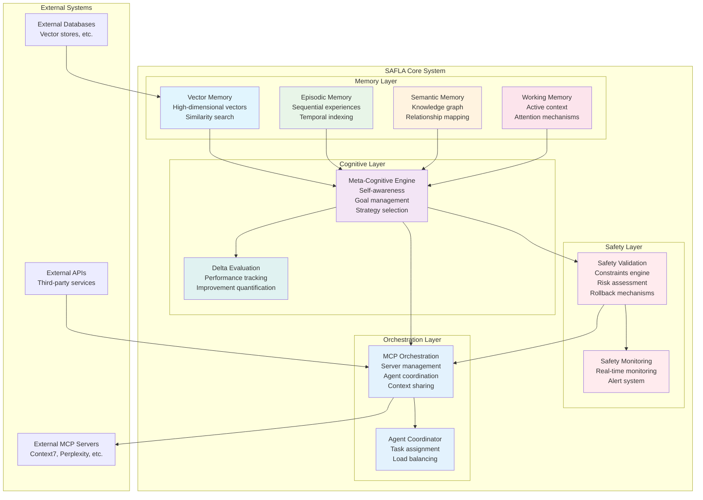
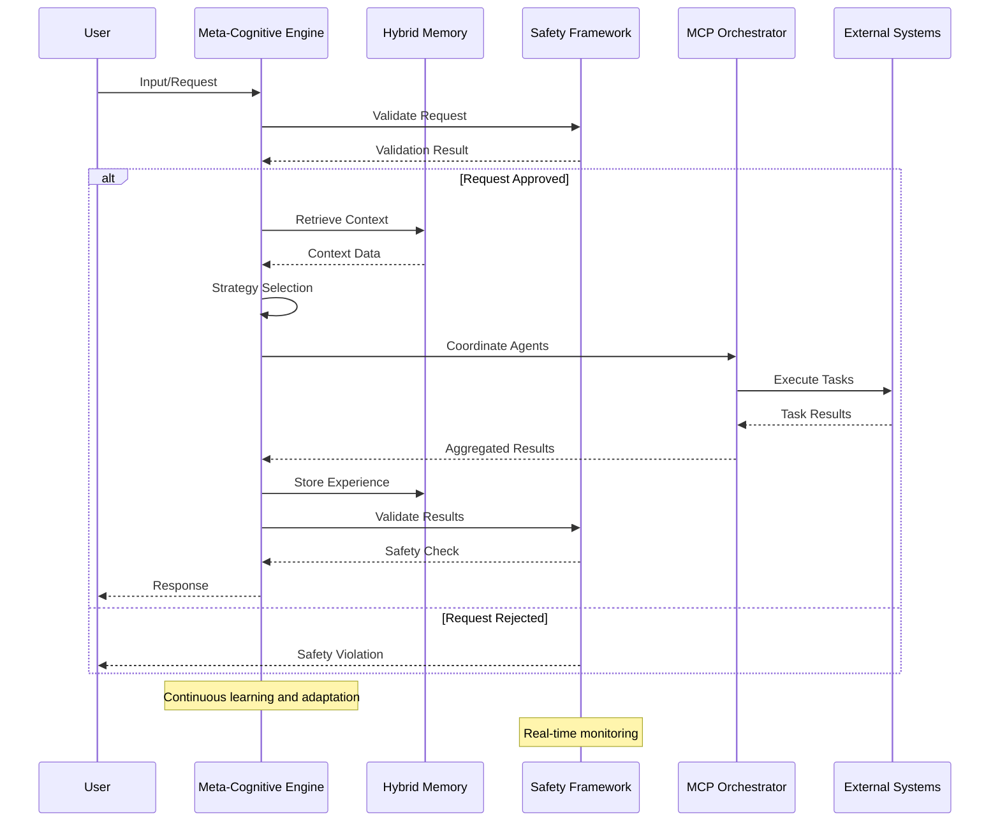
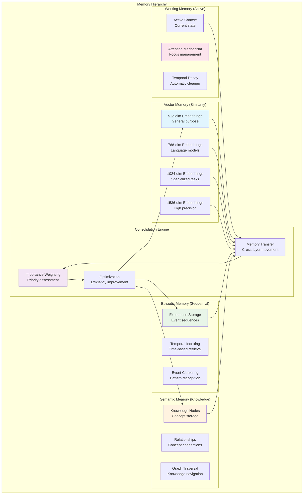

# SAFLA Documentation Guide

Welcome to the comprehensive documentation for SAFLA (Self-Aware Feedback Loop Algorithm) - a sophisticated AI/ML system implementing autonomous learning and adaptation with comprehensive safety mechanisms, hybrid memory architecture, and meta-cognitive capabilities.

## 📚 Table of Contents

### Getting Started
- [**01. Introduction**](01-introduction.md) - Overview of SAFLA, its purpose, and key concepts
- [**02. Quick Start**](02-quickstart.md) - Quick installation and basic usage guide  
- [**03. Installation**](03-installation.md) - Detailed installation instructions for different environments

### Core Architecture
- [**04. System Architecture**](04-architecture.md) - Comprehensive system architecture overview
- [**05. Hybrid Memory System**](05-memory-system.md) - Vector, episodic, semantic, and working memory
- [**06. Meta-Cognitive Engine**](06-meta-cognitive.md) - Self-awareness, goal management, and adaptation
- [**07. Safety & Validation**](07-safety-validation.md) - Safety constraints, risk assessment, and rollback mechanisms
- [**08. Delta Evaluation**](08-delta-evaluation.md) - Formal quantification of system improvements

### Integration & Orchestration
- [**09. MCP Orchestration**](09-mcp-orchestration.md) - Distributed agent coordination via Model Context Protocol
- [**10. Agent Coordination**](10-agent-coordination.md) - Multi-agent orchestration and task assignment
- [**11. Context Sharing**](11-context-sharing.md) - Vector embedding-based context propagation

### Advanced Features
### Advanced Features
- [**12. Memory Consolidation**](12-memory-consolidation.md) - Automated transfer between memory types
- [**13. Performance Monitoring**](13-performance-monitoring.md) - Real-time performance tracking and optimization
- [**14. Adaptive Learning**](14-adaptive-learning.md) - Continuous learning and self-modification
- [**15. Performance Optimization**](15-performance.md) - Comprehensive benchmarking framework and performance optimization
### Configuration & Deployment
- [**16. Configuration Guide**](16-configuration.md) - Environment variables and system configuration
- [**17. Deployment Strategies**](17-deployment.md) - Production deployment patterns and best practices
- [**18. Scaling & Performance**](18-scaling-performance.md) - Horizontal scaling and performance optimization
- [**19. Monitoring & Observability**](19-monitoring-observability.md) - System monitoring and observability

### Development & Testing
- [**20. Development Guide**](20-development.md) - Development environment setup and workflows
- [**21. Testing Framework**](21-testing.md) - Comprehensive testing strategies and test suites
- [**22. API Reference**](22-api-reference.md) - Complete API documentation
- [**23. Extension Development**](23-extensions.md) - Creating custom extensions and plugins

### Use Cases & Examples
- [**24. Use Cases**](24-use-cases.md) - Real-world applications and implementation patterns
- [**25. Code Examples**](25-examples.md) - Practical code examples and tutorials
- [**26. Integration Patterns**](26-integration-patterns.md) - Common integration patterns and best practices
- [**27. Troubleshooting**](27-troubleshooting.md) - Common issues and solutions

### Advanced Topics
- [**28. Security Considerations**](28-security.md) - Security best practices and threat mitigation
- [**29. Performance Tuning**](29-performance-tuning.md) - Advanced performance optimization techniques
- [**30. Custom Memory Types**](30-custom-memory.md) - Implementing custom memory architectures
- [**31. Advanced Safety Patterns**](31-advanced-safety.md) - Advanced safety constraint patterns

### Reference
- [**32. Glossary**](32-glossary.md) - Definitions of key terms and concepts
- [**33. FAQ**](33-faq.md) - Frequently asked questions
- [**34. Migration Guide**](34-migration.md) - Version migration and upgrade guides
- [**35. Contributing**](35-contributing.md) - Contributing guidelines and development standards
- [**36. Changelog**](36-changelog.md) - Version history and release notes
## 🎯 Documentation Levels

This documentation is designed to serve users at different levels:

### 🟢 **Beginner Level**
- Introduction and Quick Start guides
- Basic configuration and deployment
- Simple use cases and examples
- Troubleshooting common issues

### 🟡 **Intermediate Level**
- Architecture deep dives
- Advanced configuration options
- Integration patterns and best practices
- Performance optimization basics

### 🔴 **Advanced Level**
- Custom extension development
- Advanced safety patterns
- Performance tuning and scaling
- Contributing to the codebase

## 🗺️ System Architecture Overview

## 🔄 Component Interaction Flow

## 🧠 Memory System Hierarchy

## 🚀 Quick Navigation

### For New Users
Start with [Introduction](01-introduction.md) → [Quick Start](02-quickstart.md) → [Installation](03-installation.md)

### For Developers
Jump to [System Architecture](04-architecture.md) → [API Reference](22-api-reference.md) → [Development Guide](20-development.md)

### For System Administrators
Begin with [Configuration Guide](16-configuration.md) → [Deployment Strategies](17-deployment.md) → [Monitoring](19-monitoring-observability.md)

### For Researchers
Explore [Memory System](05-memory-system.md) → [Meta-Cognitive Engine](06-meta-cognitive.md) → [Advanced Topics](28-security.md)

## 📖 Documentation Standards

This documentation follows these principles:

- **Comprehensive**: Covers all aspects from basic usage to advanced customization
- **Progressive**: Information is layered from beginner to expert level
- **Practical**: Includes working code examples and real-world scenarios
- **Visual**: Uses diagrams and flowcharts to explain complex concepts
- **Searchable**: Well-structured with clear headings and cross-references
- **Maintainable**: Regularly updated to reflect the latest system capabilities

## 🤝 Contributing to Documentation

Found an error or want to improve the documentation? See our [Contributing Guide](35-contributing.md) for guidelines on:

- Reporting documentation issues
- Suggesting improvements
- Contributing new content
- Documentation style guidelines

---

**Last Updated**: January 2025  
**Version**: 1.0.0  
**Maintained by**: SAFLA Development Team